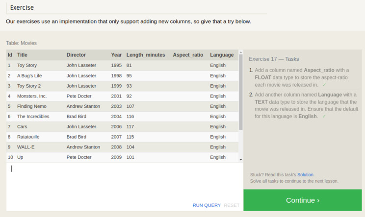

# Reference of SQL Statements

Use this as a resource to guide writing and executing safe and valid SQL statements.  

SQL Statements Turn Me Upside Down!  

  

## Queries

Select information from one or more or all columns, in one or more or all tables.  
Constraints can be put on queries to only display certain data, within certain ranges, etc.  
Queries can be 'joined' to display interrelated data.  

```sh
SELECT * FROM table_name; # returns all cols from table_name
SELECT col1,col2 FROM table_name; # return just the named column data
```

Completed Exercise 1:  

  

### Constraints

Limit or specify the query results you want using Constraints.  
Constraints can be applied to other SQL commands in addition to Queries.  
Use constraints to limit results to improve performance.  
Return only what the client really, really needs, rather than everything.  

```sh
SELECT col1, col2 
FROM table_name 
WHERE cond1 
AND cond2 
OR cond3;
# multiple constrains on 2 columns here
# single-col and/or single-constraint are also legal
```

Constaint Definitions

Number Operators: `=, !=, <, <=, >, >=`  
Between Operators: `BETWEEN first AND second` where first and second are values.  
Not Between: Same as between, prefixed with `NOT`  
Exists in a list: `IN(...)` e.g. `col_name IN(1, 3, 5)`  
Not Exists: Counter of IN e.g. `col_name NOT IN(2, 4, 6)`  
Case insensitive string comparisons: `LIKE "likeish"` and `NO LIKE "unlikeish"`  
Wildcard: Use `%` as a placeholder for zero-or-more-characters-in-place within LIKE/NOT LIKE constraints.  
Single placeholder: Use `_` to represent a single-character replacement i.e. `col1 IN ("_r.")` matches "Mr."  

Completed Exercise 2:

  

Completed Exercise 3:

  

## Filtering And Sorting

Data within a table might not be in the order you want it to be in.  
Queries return data as they find it within the database.  
Sometimes Queries return too much similar data so results must be limited or forced to be unique.  

### Distinct

```sh
SELEcT DISTINCT col1, col2,
FROM table_name
WHERE condx;
# selects only unique record value col1, col2 from table
```

### Order By

AKA Sort.  
Perform ascending (default) with `ASC`  
Perform descending with: `DESC`  

```sh
SELEcT col1, col2
FROM table_name
WHERE condx
ORDER BY col1 DESC
LIMIT limit_n OFFSET offset_n;
# descending order sort depending on condition condx from table showing only col1 and col2 data
# also limit the number of results to limit_n starting at offset_n (from zeroth result)
```

Completed Exercise 4:

  

Completed Exercise 5:

  

### JOINs

You can choose to to chained queries, or you can do better by using JOIN statements.  
JOIN queries allows finding data across many tables, based on shared info, perhaps a Key column.  
Database Normalization is used to allow tables to grow independantly of each other.  
JOINs are necessary to query data across these Normalized databases.  

INNER JOIN:  

```sh
SELECT col1, col2
FROM first_table
INNER JOIN second_table
ON first_table.col_name = second_table.col_name
WHERE condx
ORDER BY col1,col2 ASC/DESC
LIMIT limit_n OFFSET offset_n;
```

Other JOIN types:  

```sh
SELECT col1, col2
FROM first_table
INNER|LEFT|RIGHT|FULL JOIN second_table
ON first_table.col1 = second_table.col1
WHERE condx
ORDER BY col1, col2 ASC
LIMIT limit_n OFFSET offset_n
```

A note about *OUTER* JOIN: It is retained for compatibility but is usually not necessary.  

Completed Exercise 6:

  

### Additional Conditions and Nulls

NULLs can be good or bad.  
Data should be *something* rather than nothing in most cases so that nulls don't have to be specially process by calling code logic.  
However, NULLs can be used where they can be removed from the resulting Query data so that they don't pollute a chart or result summary data.  
For example, using a '-1' might be a good NULL-alternative, until your chart tries to render it when the data is expected to be all positive integers.  

Anyway, check out the use of AND and OR conditionals, next.

```sh
SELECT vol1, col2
FROM table_name
WHERE col1 IS NULL # or IS NOT NULL
AND condx_1
OR condx_2
```

## Insert Update Delete

Back to the program (skipping aggregates and order-of-execution details).  

INSERTing and UPDATEing data into tables is cumbersome for two reasons:  

1. You have to be 100% certain your `WHERE condx` is correct else you might get unexpected results  
1. It takes extra typing to identify the columns (keys) and data (values) for what you want to insert (or update)  

### INSERT Statement

```sh
INSERT INTO table_name
(col1_name, col2_name, ...)
values(val1, vol2, ...)
WHERE condx; # required and critical to get it right
```

To avoid making a bad INSERT or UPDATE:  

1. Test your conditionals in a standard QUERY statement
1. Use the *exact same conditional(s)* in the INSERT or UPDATE statement(s)

An 'expression' can be used to define values to insert per the condition.  

```sh
INSERT INTO table_name
(col1_name, col2_name, ...)
VALUES (1, 60 * 60 * 24);
```

*Note*: If auto-increment is enabled on a column, don't bother adding that column to your INSERT statement.  

Completed Exercise 13:

  

### UPDATE Statement

```sh
UPDATE table_name
SET col1 = value_or_expression col2 = value2_or_expr2, ...
WHERE condx;
```

Completed Exercise 14:

  

### DELETE Statement

Use extra caution this is a non-reversable (like UPDATE) and destructive statement.  
Always test your conditions using a SELECT Query statement prior to attempting a delete.  
Of course, having a recent backup of the data is also handy.  

```sh
DELETE FROM table_name
WHERE condx
```

Completed Exercise 15:

  

## Makin Tables

A schema must be defined when a new Table is added to a database.  
If a database already exists the system will throw an exception.  
To avoid 'already exists' exception use `if not exists` in the create table statement.  

```sh
CREATE TABE IF NOT EXISTS table_name (
  column DataType TableConstraint DEFAULT default_value,
  nother_col DataType TableConstraint DEFAULT default_value,
  ...
);
```

Completed Exercise 16:

  

### Data Types

Many data types exist (MySql, Postgres, SQLite, MS SQL Server are just a few that have intersecting types):

Integer and Boolean - Recall that 0 is false and 1 is true.  
Float, Double, Real - These are all FP or decimal type primatives and are therefore 'precision values'.  
Character/Char, VARCHAR, TEXT - String values with limited memory allocations w/ overflow truncation.  
Date, DateTime - Depending on the system these might have somewhat different schemas.  
Blob - Data stored directly in the database. Not always the best option if performance (memory and query processing) are of any concern.  

### Table Constraints

Primary Key
AutoIncrement
Unique
Not Null
Check (expression)
Foreign Key

### Example Schema

```sh
CREATE TABLE my_table (
  id INTEGER PRIMARY KEY,
  title TEXT,
  owner TEXT,
  birthday INTEGER,
  active BOOLEAN,
  created DATETIME,
  Updated DATETIME
);
```

## Alter Tables

Add, remove, or modify columns and table constraints.  

Completed Exercise 17:

  

### Add Columns

```sh
ALTER TABLE table_name
ADD col_name DataType OptionalTableConstraint
DEFAULT def_value;
```

### Remove Columns

```sh
ALTER TABLE table_name 
DROP col_to_delete;
```

### Rename Table

```sh
ALTER TABLE table_name 
RENAME TO new_table_name;
```

### Other Alter Capabilities

Consult the documentation for the DB platform to get details on other ALTER operations.  

## Drop Table

Use with caution:  

- An FK relationthip will break if a table partner is missing and could have detrimental results to your application.  
- Data in the table can only be restored from a backup *prior* to the table drop command execution.  
- Always use `IF EXIST` clause to avoid an exception being thrown if the table does not exist.  

```sh
DROP TABLE IF EXISTS table_name;
```

Completed Exercise 18:

  

## Resources

A great deal of the information on this page was gleened from exercises provided by [SQLBolt lessons](https://www.sqlbolt.com)  

## Footer

Return to [Parent Readme.md](../README.html)  
