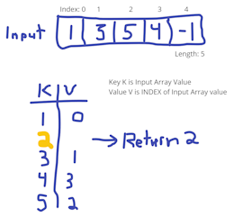

# Nojronablog 2024

A space for collecting thoughts and technical walk-thrus and takeaways during my coding journey through CY 2024.

## Weeks 39 through 40

Multiple events the last few weeks have caused some disruption in my development cycles, note taking, learning cycles, etc. Also, jury duty calls, which might suddenly interrupt and cause uneven productivity here.

### Markdown ToC VS Code Extension

Next version is nearly ready to publish, after working through and implementing the logic to support Closed ATX and Alternate Style headings, performing some refactorings, updating unit tests, and validating readiness through manual tests!

Some key takeaways and things I said to myself (and out loud) while working through this project:

- After changing some code and re-running the unit tests: "Wow, I managed to change core code and _not_ break any tests?" This is an indicator that unit tests are not fully covering use cases.
- When lots of unit tests exist, and they all pass, this can cause a false sense of comfort with code quality. The _appearance_ of bug-free code is a little too real. Manual testing is _still necessary_ to verify unit test coverage is sufficient, and to find corner cases that are not covered by unit tests.
- Another argument for manual testing: Catching unexpected "Warning" messages on-screen. While it is true that testing frameworks like Playwright can handle these "toast" and other messages, it is not guaranteed that the will be ready to catch unexpected on-screen messages.
- Refactoring JS Modules was required because I didn't take the time to fully design the solution nor its hierarchy to begin with. Usually I do take these steps but in this case when I started this project I followed a "get ramped up and running as quickly as possible" plan. Doing so built-in some technical debt.
- Using a dry-erase board to suss-out implementation details while coding and debugging speeds things up and has improved my code readability, effectiveness, and made it easier to understand the logic behind a buggy scenario.

I completed publishing a Release version of Create-ToC set at version 0.4.2. Pretty much right after publishing I discovered a few bugs. I need to update my development processes to be certain the following steps are completed:

- For each existing bug (found previously), ensure there is a unittest and in some cases a manual test to ensure the case is covered.
- Whenever a new bug is discovered, a new branch should be created from the most recent version, and a unit test created to validate the code against the buggy case.

Doing these things will help keep my workflow organized, even when I have to step away from the project for some time between bugfixes and version releases.

After a bit more debugging, some code refinements, added documentation, unittest fixes, and adding manual-testing files, version 0.4.3 is now available as a Pre-Release version. In a few days, after some regular usage, I'll Publish a 0.4.4 Release version. :tada:

### Markdown ToC Extension Internal Operation as of Sept 26th

While publishing the pre-release at 0.4.3, I wanted to document some of the operation of the code for personal purposes.

1. VS Code API registers `markdown-toc.createTOC` and loads an anonymous async function as the second parameter, setting both as `disposable` objects.
2. A copy of the Editor object is acquired from the VSCode API and it is validated as a 'markdown' type document. If not an MD file a WarningMessage is displayed and execution returns null.
3. The Editor object is scanned to get a count of text lines. If there are too few, a WarningMessage is displayed and execution returns null.
4. Function `findTopHeading()` is executed, and the results are stored in an object to identify the Heading style (Open ATX, Closed ATX, or Next Line) as well as the Line Number the top (Level 1) heading is found.
5. If the Top Heading is not found, a WarningMessage is displayed and execution returns null.
6. A RegExp `match()` function is called to check for an existing Table of Contents. If there is at least one match, a Warning Message is displayed and execution returns.
7. If there are too few lines of text remaining after the Top Heading line number, a WarningMessage is displayed and execution returns null.
8. Function `getLevelHeading()` is called within a `for` code block and positive results are stored in a local array. Inner-functions `getTitleOnly()`, which replaces illegal Heading title characters, and either `getHash2LH()` or `getDash2LH()` are executed (depending on the style) to acquire the correct Level 2 Headings, ignoring any other text or headings levels.
9. After the `For` loop exits, if there are no items in the array, a WarningMessage is displayed and execution returns null.
10. Function `createTOC()` is called, which in turn calls `getTitleOnly()` which replaces illegal Heading title characters, and then `getLoweredKebabCase()` which (as its name states) forces lower-cased characters and replaces any whitespace characters with a dash `-` (except for newline and carriage return, which are ignored). Lastly, function `getLinkFragment()` is called which properly formats the Title and Lowered Kebab Case outputs into an appropriate (lint-able) Link Fragment.
11. The result variable from `getTitleOnly()` is fed into a VS Code API `edit.insert()` function, which adds the formatted string data to the active document.
12. The VS Code API `workspace.applyEdit()` function is called to 'write' the formatted string data (the new Table of Contents) to the working document so the user can see it and save it.
13. A WarningMessage is displayed indicating the table of contents has been created, and the anonymous function exits, returning null.
14. Function `push()` is called on API `ExtensionContext` to add the `disposable` veriable to the `ExtensionContexts.subscriptions` Array.

The 0.4.4 release is now Published to the VS Code Extension Marketplace! :tada:

### RegEx and the Multiline Setting

- `^`: Start of string. In Multiline mode, this matches _immediately following_ a `\n` (newline) character.
- `$`: End of string. In Multipline mode, this matches _immediately prior to_ a `\n` (newline) character.
- When using `//m` regex matching, it might be important to include `^` and `$` anchors _but it is crucial_ to include the context of where `\n` characters are in the intended match!
- In JavaScript, `string.match(/regex/opt)` built-in returns either `null` (no match) or an array of one or more match items. It is _not a boolean return_!
- In some file encodings, newline characters could be `\n` or `\r\n`. JavaScript `string.match(/regex/opt)` can search for those characters and it is up to the implementor to decide how to leverage the RegExp. Examples below show two ways to execute the same query

```javascript
const regexpPattern1 = ...; // some pattern
const regexpPattern2 = ...; // some other pattern

// might be easier to read
const pairedOrLogic = inputText.match(/^regexpPattern1$/gm) !== null 
                   || inputText.match(/^regexpPattern2$/gm) !== null;

// might be more succinct
const groupedMatches = inputText.match(/^(?:regexpPattern1|regexpPattern2)$/gm) !== null;

// 1) using `^` and `$` along with `/gm` could cause the regexp to consume more resources than desired
// 2) optionally use a quick-exit technique with `/m` so string.match(regexp) returns after first match
return inputText.match(/^(?:regexPattern1|regexPattern2)$/m) !== null;
```

But working with RegEx is very tricky and there are many ways to approach pattern matchine. Here are some questions to ask while figuring out RegEx patterns:

- Is the goal to find items that cause an _exclusion_?
- Is the goal to find specific substrings and capture them or replace them?
- In replacement, should just the first instance be replaced, or _all instances_?
- After replacement, is it safe to `string.trim()` away leading and trailining whitespaces?
- Can a match be made more effeciently by throwing an entire document at the matcher, or should a smaller input be fed to the matcher _to save time and cpu cycles_?
- If there are lots of characters that _are allowed_ in the match right now but aren't allowed later, does it make more sense to filter them out _now_, or capture more now and filter out the rest _later_? (see previous entry)
- Consider using character classes to match the bulk of what you want, then identify specific individual (or pairs) of characters that are needed next. This should reduce the RegEx Matcher string size and complexity by quite a bit, although it might cause additional actual CPU cycles (so balance readability, testability, and performance requirements).

### Portfolio Website Updates

I took time to update [My Portfolio Web Site](https://portfolio-jon-rumsey.netlify.app/):

- Many dependencies were out of date and several had vulnerabilities or were otherwise a risk to the hosting platform or the Web Site itself.
- Several projects have been completed or put into the development pipeline since July 2023 (the last time it was updated).

The original project used bootstrap tooling CRA (Create React App) which is known to have some limitations and is also fairly stagnant, so I decided to challenge myself and move to Vite tooling instead.

- `package.json` changes the scripts section (of course, to call Vite to drive dev, debug, and build operations).
- It appears that Vite requires the `type` property be set properly. In this case the type should be 'module'.
- Also, there is noneed for a 'homepage' property in `package.json` so that was removed.
- I also chose to stick with using ESLint to help support code best practices and avoid some simple bugs. This required updating dev dependencies to support babel and other Linting related rule sets and packages.
- The file system layout is slightly different: The entry-point to a React App is usually `index.html` and is in the `src` folder by convention. For Vite, the instructions requested it be moved to the root of the project. My belief is that Vite's _build_ function looks for this file in this location in order to create the deployable assets to launch a live web site.
- All of the JS Modules had to be converted with a `jsx` filename extension.
- For this particular project, both CSS and SCSS are compiled via `SASS` (actually "Dart SASS" according to the developers), so the SCSS files were compatible and needed only minor edits to ensure they used up-to-date syntax such as `@use` instead of `@import`.

Getting the Web Site to deploy to [Netlify using Vite](https://docs.netlify.com/frameworks/vite/) was only slightly challenging:

- Error message during deploy indicated build files were not found.
- _But_ the build succeeded, so what was the problem?
- In the Netlify Site Configuration, Build Settings the `Publish Directory` had to be changed to be the default `vite build` output directory :arrow-right: `{root_dir}/dist`.
- Also in Netlify Site Config, the Node.js dependency was 16.x (which is out of support) so I changed it to 20.x (the most recent Netlify supports).

_Note_: Ubuntu released 24.x (Desktop, Server, etc) as an LTS version, but Netlify's JamStack is pinned to `Ubuntu Focal 20.04` which appears to be an LTS release with general support until May 2025, and ESM (Extended Security Support) until 2030. _So_ there is a good chance Netlify will make (hopefully) `Ubuntu Noble 24.x`  LTS sometime in the coming months.

Many more updates are in the works, providing opportunity for me to learn and grow my website building skill sets.

I completed the tasks for a Pull Request with major updates and deployed the site without issue. There is still plenty to do (especially in terms of accessibility) and my plan is to take on these issues over time and incrementally improve the site UX for site visitors, and to keep myself plugged-in and working with React and webapp building and maintenance.

## Weeks 35 through 38

So many events, so little time!

As I have had time, I've attended some online informational sessions about AI and DotNET, worked on updates to my Create-ToC VS Code Extension, and make some connections with other developers and a couple of organizations that might utilize my technical skills. There is a lot going on right now between learning, volunteering, networking, coding, and life in general.

### To Redesign Or Massively Refactor

That is the question. While working through updating my Markdown ToC extension, it became clear that my design suffers from difficulty in testing and extending. The latest push has been to enable Create-ToC to recognize both Open ATX and Closed ATX headings styles, and follow-suite when generating the Table of Contents.

Some refactoring of implementations into modules, and removing extraneous module functions results in a more testable, and simplified implementation. Unit tests were also refactored to test the updated JS Modules and their functions.

But there's more work to do! Unit tests are still failing, so those issues need to be worked out, and once that's done the README documentation must be updated, and the version incremented for publication. This time, I want to publish the next version as a full release, rather than a pre-release (as I did earlier this year). I'm looking forward to having an updated functional utility in a public marketplace!

## Week 29 through 34

For much of week 29, I was out of pocket not feeling well so not many updates were made during this time.

During weeks 30 through 34, I had several events and many meetings to attend to. There is not as much to report, but some summaries are included below.

### Updating and Releasing BF Bib Report Form v2

During the massive merging party, preparing for the latest 2.x release of the form, a few functions were not well tested enough to know they were incorrectly implemented. I'm pretty sure this was a result of interrupted development that was not followed-up and validated properly. This required pushing some quick-fix commits.

Key takeaways here:

- Lack of documenting each issue I was working on individually allowed me to veer off course and not completely close the loop on bug resolution.
- Too few users participating in debugging and usage feedback limited debug and testing feedback.

### BF-BMX Reporting Exploration

Recently I started looking into getting the BF-BMX API Server to return information on what it has stored in its DB. At first this was exploratory, but during the last week or so I have turned a corner in my thinking and decided to develop a preview of a Reporting Server that will simply render information about the stored data.

- For this year's event I will likely be assigned to an area where getting these reports and making them available to the race organizers (and myself) will be really helpful.
- Was hoping to just make all pages static, but certain report types required user input, so there are at least two dynamically interactive report pages. ALl others remain static.
- At the onset I wasn't too concerned about how the reporting information would be laid-out on screen, but after experiencing the joy of seeing the data from a statistical and current-state perspective, I've started building-out a more comprehensive layout and style, including "Cards" and a color scheme that closely matches the BF-BMX Desktop app and the Bigfoot Bib Report Form.

The following items are a rought overview of the remaining work I'd like to get done before this year's event:

- Complete adding Cards to the Aid Station report.
- Refine the API Endpoints to minimize the amount of data processing they have to do.
- Refine the Reporting route pages to ensure they only process what data they absolutely need to.
- Implement any needed Report Route Page cleanup so they pages are ephemeral and do not display incidentally cached or out-of-date data.
- Review all Report Routes and plan for adding any _obviously necessary_ reporting elements that are missing.
- Validate operation on Windows 10 and Windows 11 machines, without internet access.
- Validate operation as a fully-deploy BF-BMX system with at least two workstations, and the Desktop, API, and Reports systems deployed and interoperating with Winlink Express.

This is _really exciting_ to me and I look forward to having this tool to keep on top of participant data at this and future events!

### Full Stack Querying With Blazor

I've just completed several days of focused work on the BF-BMX Reporting Service, and it is looking and working fairly well. There are still some bugs and nits that need to get addressed, but for the most part the solution is ready for this year's event, and I'm starting to trust the data displays it is rendering.

Some key takeaways, highlights, and lowlights of the last few days:

- I tend to write too much code. This causes me to go back and delete _lots of code_ due to bugs or unnecessary code segments. I know this. I know the solution is to design and diagram, not pound the keyboard. When I started this project I felt like I was just challenging myself to do something complicated (yet useful) in Blazor. It feels like I've accomplished something, but getting to this point was done without the planning, scoping, and testing that it _should_ have been done with.
- Despite writing too much code, most build, publish, and runtime operations worked without error (just some warnings), and when the runtime errors did happen, it didn't take me long to find the culprit.
- Maintaining an internal Collection in the API Server, and building-out functionality to deliver results to new API Endpoints worked really well. The Collection methods are super fast (now that I've trimmed a bunch of the "code fat" from them) and are 20 or fewer lines of code (for simplified maintenance) and utilize LINQ whenever possible. But why use LINQ? The compiler knows about common iterative searching and matching combinations, and generates efficient code out of the box. If I were to try and write memory and time effecient code, I would probably still be refining and testing it. I have learned that LINQ provides lots of benefits with very few drawbacks (which _do exist_).
- One aspect of this project is to return statistics related to one of many location names (or their abbreviations). Early on I decided to write-out the list of location names and abbreviations so the end user would have a reference of valid names/abbreviations to search for. The last major change I made was to enable an `@onclick` to fire a callback to handle clicking on one of the named items in the list. This can be helpful to a user that maybe doesn't have a keyboard, doesn't type quickly, or otherwise might make mistakes. By clicking on a list item instead, the user performs a single-click, and the code is guaranteed to get a valid input. It's a win-win!
- As I have done with other projects, the API Server address is configured using Environment Variables. This way the server operator has a simple, accessible way to set the API Server address and port without having to use the Report Service UI, and avoiding having to code the capability to enter a custom server name and port.
- While working through development of API Endpoints and processing data both on Server- and Client-side, I started to better understand the trade-offs between having an API Server do most of the processing, and having the client-side do most processing. For example, simply returning all results from a loaded database to the caller is probably more than is necessary, even thought it doesn't cost much for the API Server to do this from a processing perspective, there are situations where network bandwidht is so limited such that doing so could be a problem. Also, doing so guarantees the client-side must do any necessary processing, which will cause the page rendering to be slow or otherwise delayed, leading to a poor user experience.
- Building-up a Blazor Server from a template is pretty simple when the UI layout and some styling and navigation has already been laid out. However, when it comes time to customize things, especially colors and the general look-and-feel, it is pretty challenging to determine what CSS Classes are already in use, what will be necessary for the future styling and layout, and what can be tossed. I decided to approach the problem by first creating page-specific CSS and developing patterns that can be applied to other pages. Once I had a few pages completed and I liked where the style was going, I started migrating the CSS classes that I liked to `app.css` in the `wwwroot` folder. This way, I could simply comment-out CSS classes in the custom file and in the root `app.css` file and discover what was still in use and what I could safely move to my new, custom classes. I'll have to file this away and use the approach in the future to help with future CSS migrations.

### More RaspberryPi Fun

A recent conversation with a ham friend resulted in a renewed interest in computer networks and automation, so I've been looking into Kismet Wireless and working with Linux cron and registering custom services. I'm already planning to use RPi's at a few upcoming ham events, so I'll integrate some of what I learn into building and configuring Pis.

### Antenna Maintenance

A couple weeks ago I replaced my VHF omni vertical with a VHD beam antenna. The omni antenna is better in windy or icy conditions so I tend to have it up during the darker months, but there is a local RF problem (reflections or some other RF emitter) and the omni receives those all too well. The yagi is able to avoid those noise issues with a more focused view, and the rotator allows changing direction remotely. However, I haven't _tuned_ the yagi since I last put it back together, so I'll need to run some diagnostics to find out if the tuning is out of band, and make requisite changes.

Last week I did maintanance on my HF antenna and followed-up with some experimentation to try and improve its performance on many bands that I want to use. It turns out my previous installation using a 9:1 unun with a 80-ish foot hot wire and a 25 foot ground wire was not a great solution. I've been using it for years, but had to be careful about what bands and modes I used due to poor tuning in multiple areas. After experimenting and reading more about off-center-fed dipoles and end-fed long wire antennas, I decided my OCF implementation was faulty. So the antenna was refactored to follow advice from [Palomar Engineers](https://palomar-engineers.com/) by shrinking the main radiating element and removing the ground element completely. Now the antenna covers more bands than before, and performs better on sub-bands I wanted. `</otherstuff>`

### Build 2024 Catch-up Views in July

I took some time out to review some missed Build 2024 sessions, and updated documentation accordingly.

- [x] Notes: [Modern Full-Stack Web Development with ASP.NET Core and Blazor](./msbuild-2024-notes.md#modern-full-stack-web-development-with-aspnet-core-and-blazor).
- [x] Notes: [Quickly build a .NET WPF Dashboard App](./msbuild-2024-notes.md#how-to-quickly-build-a-dotnet-wpf-dashboard-application).
- [x] Notes: [DotNET API Development end-to-end](./msbuild-2024-notes.md#dotnet-api-development-end-to-end).
- [x] Notes: [Developer Experience Improvements in Windows](./msbuild-2024-notes.md#developer-experience-improvements-in-windows).
- [x] Notes: [Infusing .NET Apps with AI](./msbuild-2024-notes.md#infusing-net-apps-with-ai).

### DotNET Aspire Day 2024

Microsoft Reactor is hosting an online ".NET Aspire Developers Day" where multiple speakers will discuss and demonstrate .NET Aspire use cases and implementation details. See [DotNET Aspire](./dotnet-aspire-learnings.html) for notes.

### Bigfoot 2024

The event was fun an exciting, but multiple twists made for a very different experience this year. The BF-BMX tool came in handy at my location, especially with the BFBMX.Reports tool that I had started developing in July:

- The Desktop and API service ran without a hitch for about 30 hours.
- Desktop was not able to catch all BibRecord issues, specifically: Incorrect number of fields in an entry (unexpected), and only bib numbers as a flat columnar list (expected).
- Several of the Reports pages were very helpful: Aid Station, All Bibs, Statistics (with a hitch). There is plenty of room for improvement, which will be considered and worked on during this coming Winter and Spring. For example, there are situations where runners "downgrade" from one race length to a shorter one, but the organizers do not re-bib the runner, so the Report Server counts their statistics for each race improperly. While this is a minor issue, it is confusing when it comes to reconciling Aid Station reports to allow/enable close-down.

In the near future, a meeting will be scheduled to discuss BF-BMX performance, usability, and planning for v2. This will probably wait until October, given how busy September is shaping up to be.

### VSCode Extension: Table of Contents

In July I put some effort into implementing a bugfix and new feature, and completed a preview version publication. Unfortunately, it is not ready for full release yet. I have a work item in my backlog that will be promoted forward to fix and increment the pre-release version, and implement another new feature for a next minor version Preview and release.

Internally I have a goal to get the extension into a capable, reliable state before the end of 2024. I use the tool almost every day that I code, so having a stable, helpful tool that I built myself is really rewarding!

### Mid August Leetcode Challenges

I manage to complete a couple Leetcode challenges:

1. Merge two sorted singly-linked lists.
2. Remove duplicates from sorted array.

It has been long enough since I last worked on a Linked-List DS&A challenge that I really had a hard time completing the first challenge. After throwing around some ideas, and attempting to implement them, I had to stop what I was doing, reconsider what I think I know about Singly Linked Lists, and start over before getting the solution.

Removing duplicates from a sorted Integer array wasn't too difficult. Early on I recalled how to utilize a HashSet to maintain a unique collection, and managed to get a solution working within a single iteration over the input array. The final solution (and the best performing) was one that borrowed ideas from _sorting algorithms_ where only the indices were tracked, and when certain conditions are met either one or both indices are incremented, or the value from the right index would be used to overwrite the value at the left index. This made a big difference in performance and code simplicity and readability.

Merge Two Sorted Singly-Linked Lists:

```text
Function: MergeTwoLists
Input: ListNode LeftList, ListNode RightList
Output: ListNode

Instantiate: ListNode OutputNode <- new
If: LeftList EQ Null
  Reassign: OutputNode <- RightList
  Return: OutputNode
Else If: RightList EQ Null
  Reassign: OutputNode <- LeftList
  Return: OutputNode
If: LeftList Value LE RightList Value
  Reassign: OutputNode <- new ListNode <- LeftList Value
  Reassign: LeftList <- LeftList Next
Else:
  Reassign: OutputNode <- new ListNode <- RightList Value
  Reassign: RightList <- RightList Next
Initialize: ListNode OutputTail <- OutputNode
While: TRUE
  If: LeftList NOT Null AND RightList NOT Null
    Switch on Comparison: LeftList Value, RightList Value
      Case: -1
        Reassign: OutputTail Next <- new ListNode <- LeftList Value
        Reassign: LeftList <- LeftList Next
      Case: 1
        Reassign: OutputTail Next <- new ListNode <- RightList Value
        Reassign: RightList <- RightList Next
      Case: 0
        Reassign: OutputTail Next <- new ListNode <- LeftList Value
        Reassign: OutputTail <- OutputTail Next
        Reassign: LeftList <- LeftList Next
        Reassign: OutputTail Next <- new ListNode <- RightList Value
        Reassign: RightList <- RightList Next
    Reassign: OutputTail <- OutputTail Next
  Else If: LeftList NOT Null
    Reassign: OutputTail Next <- new ListNode <- LeftList Value
    Reassign: OutputTail <- OutputTail Next
    Reassign: LeftList <- LeftList Next
  Else If: RightList NOT Null
    Reassign: OutputTail Next <- new ListNode <- RightList
    Reassign: OutputTail <- OutputTail Next
    Reassign: RightList <- RightList Next
  If: RightList Null AND LeftList Null
    Execute: Break
Return: OutputNode
```

_Note_: The Switch-Case block ignores the C# rule that a `Default` statement should be last. Other languages might not require this, so for simplicity of writing pseudocode I skipped it.

Remove Dupes From Sorted Array

```text
Function: RemoveDuplicates
Input: NumsArray
Output: NumsCount

If: NumsArray Length GT 2
  Return: NumsArray Length
Initialize: LeftIdx <- 0
Initialise: RightIdx <- 0
While: LeftIdx LT NumsArray Length
  If: LeftIdx EQ RightIdx
    Reassign: RightIdx <- Increment 1
    Continue: (next iteration)
  If: NumsArray at Index LeftIdx EQ NumsArray at Index RightIdx
    Reassign: RightIdx <- Increment 1
  Else:
    Reassign: LeftIdx <- Increment 1
    Reassign: NumsArray at Index LeftIdx <- NumsArray at Index RightIdx
Reassign: LeftIndex <- Increment 1
Return: LeftIndex
```

Just for the record, I only write these solutions out as practice:

- Writing pseudocode is a skill that requires practice, hence
- Sharing solutions through pseudocode still requires the reader to translate and refactor to implement in their language of choice.
- Solutions to challenges like this are not meant to short-cut any effort by anyone else to solve the challenge.
- Any reader that uses this pseudocode to complete a challenge will ultimately be responsible for the code that they write, and I will not be held responsible for any errors, bugs, etc.

It is up to readers of this rambling blog to do the right things.

## Week 28

### Releases via GitHub

The interface is pretty simple:

1. Pick a commit or Tag to use as the release source.
2. Write-up the Release title and notes.
3. Add any artifacts that the source code archives don't already contain.

The challenge is with embedding version information into the application. For example, while developing new features, so long as they are compatible with previous releases, the Minor version should be incremented. Also, for bugfixes for the Minor version should increment the third number using the semantic versioning system. If the versioning is embedded into the code, then as dev branches are merged-in to the staging branch prior to release, the versioning information will get overwritten. If a particular Minor or Bugfix version increment does not make it to Staging, then the numbering system leading up to 'latest' will appear to skip numbers, and the correlated commits to Staging won't explain why the versioning is not orderly.

If I relax my view of how semantic versioning works, this really isn't a problem. But I have to ask the question how to work through (or around) this so the numbering system will work during pre-release testing and demos, acceptance testing once changes are staged, and for final versioning before official release. I'm certain there are tools and techniques to get this to work more easily

## Week 26 and 27

### Bigfoot Bib Report Form v2.0

After a few days of juggling _more ideas_ on how to handle users' input of time in 24-hour format, I settled on a set of functions that carefully identify and process the hours and minutes bsaed on whether or not a colon is present.

- If a colon is present and there are number character(s) to the left of it, take those two numbers.
- If a colon is present and there are number character(s) to the right of it, take those two numbers.
- For the two prior cases, ensure that the left characters (hours) are left-padded, and the right characters (minutes) are padded with zeroes. Both will max-out at 2 characters in length.
- If there is no colon, a best-effort algorithm is used to determine what makes the most sense based on reading left-to-right, counting number characters, and capping max values to 59 minutes, and 23 hours, respectively.

It is very difficult to anticipate and cover every possible input from a user, so I made some assumptions about common inputs and mistakes (based on my own experience) and will convey the expected behaviors to the end users.

After a couple more surprise bug fixes, I've decided to release v2.1.4. A demonstration will take place during a Monday night Zoom session with the team lead and other Bigfoot volunteers.

### Mobile Weather App and API Changes

NOAA and the NWS updated the weather API, which broke my latest Mob-WX updates. I have a work item on my backlog to fix the issues.

Thinking further out, it would be a good idea to develop and deploy an API Gateway so that the mobile app doesn't have to break and get revisioned and instead, silent updates can happen at the API Gateway that will support several minor version releases of the mobile app itself.

Plenty more work will be necessary to make that happen and I anticipate it will be fun and interesting.

### VSCode Extension Updates: Create-TOC

It has bee 1 year since I released my first VSCode Extension and it is in need of several updates and promised feature delivery:

- Multiple dependencies have been revised, some of them by a major release.
- While the Extension _is_ useful to me, and perhaps 100 other people, it needs to support the alternate heading style.

Last weekend I started working on addressing the above issues, as well as preparing to update Github Actions to enable build and publish capabilities.

- Several dependencies needed to be updated.
- Github Actions YAML references were out-of-date and needed version bumps.
- A bunch of learning was necessary to devise a working YAML workflow that produced a v0.3.1 and publish it to Marketplace.
- Attempting to move to Node 22.x failed due to some dependency issues, which was confusing at first. Then I noticed that VSCode/Electron leverage Node 20.x, making it necessary to develop extensions depending on the same Major Node version as VSCode.

Overall: Success! There is more work to do to ensure that pre-release publish only happens at a particular action. For now I've set it to a particular branch. A better change (later) would be to only publish on a particular tag, which I'll figure out some other time.

## Week 25

### MobWx BugFix Forecasts

Worked on my Mobile Weather App, fixing bugs. There are some architectural issues (I'm now realizing) that will need to be addressed over time. For right now though, it should be fine. Some takeaways:

- Microsoft's Community Toolkits have been very helpful. Documentation is a little lacking, but not bad overall (probably just me).
- I was using two classes to manage downloaded API data, but only one is necessary. This probably came about due to interruptions and lack of tracking progress while working through API implementation. Live and learn!

### Extension Methods - Oh My

I also read about Extension Methods in C# (F# and Visual Basic too) and made some [notes about extension methods](./dotnet-csharp-stuff.html). Some key takeaways:

- Create static methods with the first parameter of `this` and a type parameter that matches the origin Class that the extension will use.
- Call the Extension Class into scope with a `using` directive and then call the Extension Method as if it were the target Type's instance method.
- The goals of Extension Methods include: Simplify code and make it easier to read; simplify base classes by reducing functionality to absolute minimum required; enable building on existing classes without the use of inheritance.
- If a developer is not careful, using Extension Methods can actually make their code _more messy_, and also relying on sealed classes means any updates to that 3rd party code might break your extensions.
- There is already word on the street that Extension Methods are less-preferred (now that I'm looking into them?!?).

### BF-BMX Full Setup Test

Visited Rob and Phil to work through setup, deployment, and usage of BF-BMX Desktop and Server components across multiple computers, WiFi networked, with Winlink Express for sending/receiving messages with bib data.

Some key takeaways:

- Some PCs will have Security Suite software installed. If installation or execution of the Desktop app or Server service, they will need to be added to the Security Suite's _allow_ list(s).
- There are instances where the state of a PC is such that a reboot will be required before the Desktop or Server will operate properly. It isn't clear to me what the state(s) might be, but it is clear to that a PC reboot resolves it.
- Some of the Desktop App activity log entries were a little confusing. For example, if the Server service wasn't reachable, the log would state it sent data to the API (which it had), but there was no indication that updated information is forthcoming. By default, HttpClient has a very long timeout period set (like 90 seconds or more), so it would take a _long time_ for the activity log to update with a failure note (which in itself was difficult to read).

To combat the last issues in the last bullet point, I make some changes:

1. Updated the activity log entries to be more clear about what the software is doing, how long to wait for a server response, and whether there was a response, and if so whether it was success or failure.
2. If the POST request failed the log would write a _Warning_ instead of an informational message.
3. When the POST request succeeded, the log file text states a confirmation.
4. Each log entry now includes the specific message ID that it is refering to.
5. The Timeout has been configured down to 20 seconds (15 seconds for DNS timeout + 5 seconds for request/response events to complete.

I decided that a _Failure_ activity log entry was not necessary for failed attempts to send data to the Server because a legitimate scenario is to run the system without a server in the mix at all. In the future I may revisit this and avoid logging these errors when it is known a server-side will not be included.

A new RC will be posted to the BF-BMX project site which, to the best of my estimating, will probably be the final version before this year's event. :boom: :tada: :beers:

## Week 24

I've been busy on several fronts. In software development I continued updating the Bigfoot Bib Report Form, and also started updating my Mobile Weather App. When I realized I'd not done any code challenges for a few days I did some deep diving into Trees. Rod Stephens' book _[Essential Algorithms]_ has been useful and this time I drove right-on through the entire Trees chapter, implementing pseudo-code into real code, and completing challenge questions along the way.

Some key takeaways from the last 5 days:

- Attended several online sessions regarding Python, Machine Learning, and Copilot.
- I am prone to making complex code when I don't have to. Traversing a Tree only requires a few lines of code and is naturally a recursive function. Everything else such as processing a node state is a matter of either storing or editing state in a common structure that each recursive method has access to, or writing a helpful function that can "process" the node and then return control where it left off.
- Quad Trees are useful when there is lots of stored information but searching must be more efficient than a Binary Tree's worst-case scenario of `H * H - 1` steps.
- Threaded Trees are more complicated to write and build (adding, removing nodes), but Inorder Traversal is simplified both in code an efficiency, since fewer steps are necessary to move between nodes once the farthest-left Leaf node is found.

### Basic Binary Tree Recursive Inorder Traversal

While working through the Trees chapter I was using JavaScript, however the code was essentially the same as this C#:

```c#
public class MyTreeNode
{
  public int Data {get;set;}
  public MyTreeNode? Left {get;set;}
  public MyTreeNode? Right {get;set;}
  private List<int> Visited {get;set;} = new();

  public List<int> getNodesInorder() {
    this.Visited = new List<int>();
    traverseInorder(this);
    return Visited; // let the caller deal with the result values
  }

  public void traverseInorder(MyTreeNode currentNode)
  {
    if (currentNode.Left != null) 
    {
      traverseInorder(currentNode.Left);
    }
    // process currentNode, here it is added to a Visited list
    this.Visited.Add(currentNode.Data);

    if (currentNode.Right != null)
    {
      traverseInorder(currentNode.Right);
    }
  }
}
```

It's also possible to use a `while()` looping structure to do this, and there are pros and cons to each:

- While loops require defining an exit condition. It is not always easy to know what exit condition makes the most sense to meet the requirements.
- Recursive functions build Stack memory and for larger structures can cause a _stack overflow_, whereas a while structure won't inherently have that problem.
- While loop structure will require more on-screen code. In terms of interview whiteboarding, this could mean losing precious time vs recursion.

### Sorting Challenge Question

Of course I'm off-track, having been distracted by an interview question: "Which sorting datastructure uses no additional storage?"

First of all, I need to continue training my mind to ask sorting-algorithm questions (to myself or otherwise) so that I can hone-in on a reasonable solution:

- Can I name any sorting algorithms that require only O(1) additional storage?
- Do I need to be concerned about "stable sort" or not? For example, if multiple sorting operations will be needed, a stable sort will be necssary to minimize processing steps.
- Does computational complexity matter? In other words, in this scenario do I have infinite (or at least vast amounts) of CPU resources to work with?
- Is there a requirement to sort a stream of data (online sorting)?

Looking at [Big-O Algorithm Complexity Cheat Sheet](https://www.bigocheatsheet.com) here are some possible answers to the original challenge question:

- Sorting algorithms that require O(1) storage in worst-case scenario will not use any additional storage.
- Heapsort: A 2-step, non-stable sorting algorithm that constructs a "heap" of the input values, then extracts them _in order_. Sometimes used to augment Quicksort. Uses O(1) space.
- Bubble Sort: Larger elements in each comparison "bubble up" to the top of the list using a moving window that compares sibling indices' values and only swaps them if idx+1 value is larger than idx. After each pass, decrement moving window index end since largest values collect there already sorted. Uses O(1) space.
- Insertion Sort: Simple, efficient sort on small lists using in-place swapping. Is stable and can sort online (streamed) data. Start at idx 0 "left" and compare to the right. Swap-left until idx > 0 values are equal or less than current "right" comparison value. Once "left" idx reaches last IDX, the list is sorted. Uses O(1) space.
- Selection Sort: Multi-pass, in-place swapping algorithm. Very inefficient in time (quadratic) vs. most other algorithms. In each pass, find the lowest value and swap it with the left-most _unsorted_ value (lowest IDX of this pass), until current item is last IDX. Uses O(1) space.
- Shell Sort: Not familiar with this one at all so no additional reserach or comments will be made here at this time.

In line with this thinking, I completed developing Heapsort in JavaScript following guidance in Rod Stephens' book _[Essential Algorithms]_, and updated my repo with [the code](https://github.com/nojronatron/heapsort-js). The README walks through the Heapsort algorithm.

## Week 23

### Battling JS and Browser Compatibility

I've been working on updating a Form used in the HAM community to track event participants, such as a marathon runners. The form is designed as a single-page web form with HTML, CSS, and JavaScript for layout, style, and functionality. In the original form, there is _some_ focus on maintaining compatibility back to the Windows 7-era (about 2011).

Using MDN and [CanIUse.com](https://caniuse.com) to determine what JavaScript built-ins would be safe to use because very difficult and tedious. I used a spreadsheet to help track what I'd already looked up and to record compatibility levels of built-in methods, statements, and expressions.

I discovered a better way: Why not just stick with the methods that are already in use by the form, and avoid adding newer methods until there is a clear signal from users that upgrades to a newer era (Windows 8.0) can be implemented?

1. Locate existing JavaScript functions, expressions, statements and make note of them as "good to use".
2. When creating new functionality or customizing new or existing methods, refer to this to maintain compatibility levels.
3. Whenever newer built-ins, statements or expressions are wanted, note them on the spreadsheet for future implementation.

This allows for deferring research until later. Instead, existing compatible techniques can be implemented right away, keeping momentum moving forward.

### MAUI Project GitHub Actions

Managed to get .NET MAUI 8 building with artifact generation in GitHub Actions. Some key takeaways:

- YAML file naming: kebab-case, `.github/workflows` dir, and `.yml` naming and locating are recommended.
- Also: Use descriptive kebab-case-filenames.
- YAML keywords are fairly well designed english words: name, on, jobs, steps, uses, run, with, name, and path.
  - Obviously there are details about how these are used.
  - I should think about YAML in terms of these commands and how they apply to a CI workflow.
- Creating YAML files to trigger `on: pull_request` and `on: push` might cause unnecessary, additional Action executions. Stick with a single `on` Action for a file, or use GitHub "Reusable Workflows".
- GitHub Reusable Workflows: Define a YAML file with an trigger of `on: workflow_call:`. Create other workflows that reference the template by adding `jobs: template-name: uses: ./path-to-template.yml`.
- .NET MAUI will require a `dotnet workload restore {projectFile.csproj}` in order to build properly, and the working directory _must be set to that Project's directory specifically_.
- Generating artifacts is done by calling `dotnet publish --artifacts-path {path} {rest-of-commands} ./{publishDir}` in the `run:` statement, and then in a following Task, `uses: actions/upload-artifact@v2`, `with: path: ./{publishDir}`.
- When targeting a specific directory in one Task, like a single Project directory in a multi-project Solution, the next Task _will not_ necessarily have the same path context. Set the path at each step to avoid failing Tasks due to path problems.

### Building MAUI in .NET 8

.NET MAUI 8 is a pretty challenging framework to work with. I love the results, having a Windows Desktop App that is (very basically) also an Android App - great stuff! In hindsight, I should have looked into Xamarin several years ago when I got going with .NET.

Recent activity has been to start-up a second sprint to update and build-out my mobile weather app, and prepare it for deployment in the Google ecosystem. There are many hurdles to overcome, but I've knocked out a couple so far:

- Previous Microsoft Learn modules have discussed working with GitHub Actions, so there is recent interaction with YAML and configuring GitHub repos for workflows.
- Through experience I've gained a better comfort level using `dotnet` CLI for running build and test operations.
- `dotnet build` and `dotnet publish` are very similar, and support overriding existing `csproj` file configurations by naming elements and setting their values, such as `-p:AppxPackageSigningEnabled=true`. I'm not certain I understand just what all can be overridden, but I plan to experiment with it.
- Android Code Signing works differently than Windows Code Signing. Android uses a KeyStore. Windows uses Certificates. This will add to the complexity of automating build and publish in GitHub.

### Single Page Web and Accessibility

Spent a good amount of time debugging, adding-on to, and prepping the Bigfoot Bib Report WL Form project for the next big version. It's not clear whether it will be pressed into service - I'll have to get a few friend hams involved to take a look at the form, find issues, and provide feedback.

Some things I learned along the way:

- Be very careful when setting focus programmatically. This can be a jarring experience for the user, and not meet the goal if not implemented carefully.
- In a previous version I had added a `<label>` that displays information related to three different buttons. In this case it isn't an error, but probably is a problem for accessibility, and I'll need to consider a work-around.
- In the desktop browser tab order works as expected, but in some mobile browsers it appears to be broken, and one tab-index jumps over several other elements, even though they are ordered correctly in the DOM _and_ there are no hard-coded tab-stop attributes. I decided the best way to deal with this was to put a warning about it in the documentation, with the suggestion of using a pointing device instead of tab when on a mobile device.
- Favicon: This single-page web implementation doesn't need one, but the browser console log would complain at launch. I discovered the complaint is about the `icon` reference missing, not the icon itself. I learned these need to be 30x30 pixels, and can be `.ico`, `.png`, or `.jpg`. So I just added `<link rel='icon' href='favicon.png'>` and the console log warning went away (for Chrome, not for Edge though). With this experience, I'll know how to implement this properly for the next website I build.
- There are other label warnings in the devtools Issues tab, but they do not impact usability or accessibility.
- Do not rely on Github Copilot to accurately report on spelling or grammatical errors within html, it is unlikely to provide a reliable answer (and it warns as much).
- One last thing: Don't assume the previous author of code you are working on was 100 percent consistent in their development. This is only meant as a reminder that nobody is perfect, and therefore code is not always consistent. What brought my mind here was the discovery of a navigation button that opened a hidden element, which has an anchor element used to "navigate" back to the top of the original page. Why aren't both of these button elements? Regardless, I added an ID to the main Section element so the anchor element could act as a proper "skip link".

## Week 22

After 3 days of focusing on learning modules and new concepts, I took a break and worked on some field operations planning and setup involving a Raspberry Pi Zero2 W. Working with Linux is getting easier, and the biggest issue has been finding consistent documentation. Not all docs are created for the version of RaspberryPi OS that I'm working on, so some packages either aren't available, or don't work (properly or the same). Also, some documents leave a lot to be desired, for example a `manpages` on debian.org had a lot of "should-be" and "probably" remarks in it, which doesn't sound all that promising.

Going forward, for certain projects I'm going to stick with Bullseye 32-bit for any legacy or micro RPi projects for now, including the RPi 4. If I get my hands on an RPi 5 and/or Bullseye approaches EOL for those legacy RPis, I'll start moving over to Bookworm.

### Completed A Build 2024 Challenge

On Saturday I completed all 19 modules of "Accelerate Developer Productivity with GitHub and Azure for Developers"! This took a big effort, and I took (way too many) notes. Thanksfully some portions covered topics I already has experience with, and the other areas were great fill-in to help me build out my skill sets and build up experience.

### Polyglot Notebook Learnings

I took some time out to learn more about and make notes about [Polyglot Notebooks](./my-first-polyglot-notebook.ipynb). I have much more to learn but these seem like a good tool.

### Tree Review

It's been quite a while since I've reviewed Tree data structures.

Terminology:

- Nodes: Components of a tree that hold value, and potential references to other Nodes. Has exactly 1 or 0 Parent Nodes.
- Branches: Connections between Nodes. Usually do not contain any data, and are _directed_, meaning there is only one way to traverse the reference directly.
- Parent Node: A Node that has reference to a Child Node.
- Child Node: A Node that is referenced by its single Parent Node.
- Parent-Child: The relationship between Nodes, connected by a Branch.
- Siblings: Nodes that share the same parent.
- Root Node: The Parent Node tha has no Parent Nodes aka the 'top of the tree'. Every Parent Node in the tree will have exactly 1 Parent Node, except the Root which has 0 Parent Nodes.
- Descendants: A Node's Child Nodes.
- Ancestors: A Node's Parent, Grandparent (etc) Nodes.
- Level or Depth: Distance from the Node to the Root. Root is generally referred to as 0.
- Height: The cound of nodes down the longest path of Branches. A Tree's Height is the same as  the Height of the Root Node.
- Leaf: A Node with no Child Nodes. Also called an `External Node`.
- Internal Node: A Node with at least 1 Child Node.
- Ordered Tree: The order of the Child Nodes is important. Child Nodes stored in an collection imposes an ordering on the Nodes usually based on their Value.
- Unordered Tree: The order of the Child Nodes does not matter.
- First Common Ancestor/Least Common Ancestor: The Node that is both an Ancestor of 2 other Nodes _and_ is the closest to those 2 Nodes. The path between the 2 Nodes tranverses each Branch between them exactly once, and is therefore a _unique path_. The FCA can be thought of as the Root of a sub-tree. The FCA _could be_ one of the 2 Nodes in question.
- Full Tree: Every node has either 0 Children or as many Children as the Tree's _Degree_. A Tree with a Node that has a Single Child defines the Tree as "Not Full".
- Complete Tree: A Tree in which every level is full, or only the _left side of the tree_ has all bottom-level Nodes pushed all the way left.
- Perfect Tree: A Full Tree, with all Leaves at the same level. Every possible Node position, for the Height of the Tree, has a Node in it.

Types of Nodes (and therefore, trees):

- Degree: The maximum number of Children a Parent Node can have.
- Binary Tree: A Tree of 1 or more Nodes that can only have maximum 2 Child Nodes.
- K-ary: Nodes can have more than 2 Children.
- Single Root Node Tree: The single-root of an entire Tree Structure.
- A Root Node can also be identified as connected by branches to one or more smaller trees.

Some Basical Calculations:

- The number of Branches is 1 less than the Count of Nodes.
- The number of Nodes in a Perfect Binary Tree is `2^(Height - 1) - 1`.
- The Height of a Perfect Binary Tree is `log2(N + 1) - 1`.
- The number of Leaf Nodes in a Perfect Binary Tree is `2 ^ Height`.
- The number of Internal Nodes in a Perfect Binary Tree is 1 less than the count of Leaf Nodes.
- The number of "Missing Branches" in a Binary Tree with N Nodes is `N + 1`.
- The number of Leaves in a Binary Tree with N2 Nodes of Degree 2 is `N2 + 1`.
- The number of Nodes on the bottom Level of a Tree will be at most `N / 2` Nodes.

BigO Analyses (N = Nodes):

- Perfect Tree: Search from Root to Leaf Node takes `O(log(N))` steps.
- Complete Trees and Perfect Trees with varying Degrees have different BigO outcomes that become significant as the Trees get larger. As a baseine, `O(log(N))` is a good starting point (it can only get worse from that worst-case starting point). :smiley:

Coding Trees:

- Complete Trees can be stored in an Array (will not tackle this here).
- Use Classes to represent Tree Nodes with properties to store Data, and reference it's Child Nodes.
- Start with a Node class, then add Child Nodes to the class instance.

```c#
public class BinaryNode
{
  public int Data;
  public BinaryNode? LeftChild;
  public BinaryNode? RightChild;
  public BinaryNode(string data)
  {
    Data = data;
  }
}
```

```c#
// instantiate Nodes
BinaryNode root = new(4);
BinaryNode node1 = new(1);
BinaryNode node2 = new (10);
// etc

// build a Binary Tree
root.LeftChild = nod1;
root.RightChild = node2;
// etc
```

And for an N-Degree Tree:

```c#
public class TreeNode
{
  public int Data;
  public TreeNode[] children;
  public TreeNode(string data)
  {
    Data = data;
  }
}
```

_Note_: It is possible to add a `Parent` reference to BinaryNode or TreeNode so that it is easier to traverse 'up' the Tree.

Information about Branches _can be stored if necessary_, but this topic is more relevant for Graphs and Networks.

Traversing A Tree:

- Goal is to visit all the Nodes in the Tree in some order.
- Optionally, perform 1 or more operations on 1 or more Nodes it visits.
- The most basic thing to do is traverse every Node in the Tree and return a list of the captured values.
- There are 4 kinds of traversals (discussed below).

Preorder Traversal:

- Processes a Node, then its left Child, then its right Child, recursively.
- Just invoke the Root Node's `TraversePreorder()` method with a Node instance and it will do the rest.

```c#
public class TreeNode
{
  // Fields and CTOR
  public void TraversePreorder(BinaryNode currentNode)
  {
    // process node here e.g. push Data into an array, output to console, etc.

    if (currentNode.LeftChild is not null)
    {
      TraversePreorder(currentNode.LeftChild);
    }
    if (currentNode.RightChild is not null)
    {
      TraversePreorder(currentNode.RightChild);
    }
  }
}
```

_Note_: It is possible to add a helper Class that will do this for a Node. This allows a single object to store results from the method, such as an Array of traverse Node values, rather than storing the structure within each Node.

_Note_: This traversal _can_ be used to traverse N-degree Tree Nodes with N greater than 2.

Inorder Traversal:

- AKA `Symmetric Traversal`.
- Process this Node's Left Child, then process this Node, then process this Node's Right Child.
- In a Binary Tree when order matters, this algorithm can be used to find a sorted list of all Tree values.
- Pass the Method the Root Node to start and it will process the Left Child and it's descendants, then process itself, then process the Right Child and it's descendants, before ending.

```c#
public class TreeNode
{
  // Fields and CTOR
  public void TraverseInorder(BinaryNode currentNode)
  {
    if (currentNode.LeftChild is not null)
    {
      TraverseInorder(currentNode.LeftChild);
    }
    // process this node here
    
    if (currentNode.RightChild is not null)
    {
      TraverseInorder(currentNode.LeftChild);
    }
  }
}
```

_Note_: This is effective for Binary Tree Nodes, but is ambiguous for Tree Nodes with more than 2 Child Nodes.

Postorder Traversal:

- Process this Node's Left Child, then process this Node's Right Child, then process this Node's data.
- Pass the Root Node to this Method and it will process the all the Root's descendants and then the Root Node, and then end.

```c#
public class TreeNode
{
  // Fields and CTOR
  public void TraversePostorder(TreeNode currentNode)
  {
    if (currentNode.LeftChild is not null)
    {
      TraversePostorder(currentNode.LeftChild);
    }
    if (currentNode.RightChild is not null)
    {
      TraversePostorder(currentNode.RightChild);
    }

    // process this Node here
  }
}
```

_Note_: This traversal _can_ be used to traverse N-degree Tree Nodes with N greater than 2.

Breadth First Traversal

- Algorithm processes all nodes, Level-by-Level, left-to-right, then moves _down_ to the next Level.
- Start at the Root Node Level and output Root Node Data. Then, Output Data from Root Node's Children. Then move to the current Level + 1 and repeat until the last Leaf Node is traversed before existing.
- Use a Queue structure to store each Level's Nodes and only process that Node's direct Children before moving to the next Node in the Queue.

```c#
public static class BinaryTree
{
  // Fields
  public Queue<BinaryNode> LevelNodes = new();
  public void TraverseBreadth(BinaryNode currentNode)
  {
    LevelNodes.Enqueue(rootNode);
    while (LevelNodes.IsEmpty == false)
    {
      BinaryNode currentNode = LevelNodes.Dequeue();
      // process the current node e.g. output its Data or store Data in a string or array, etc.

      // add children (the next Level) to the Queue
      if (currentNode.LeftChild is not null)
      {
        LevelNodes.Enqueue(currentNode.LeftChild);
      }
      if (currentNode.RightChild is not null)
      {
        LevelNodes.Enqueue(currentNode.RightChild);
      }
    }
  }
}
```

Leveraging FIFO ordering guarantees all Nodes at a particular Level are processed before moving to the next Level.

BigO Analyses:

- Each algorithm must traverse (at worst) every Node in the Tree (or sub-Tree).
- Processing steps could add to the total runtime but only in more complex cases, so assume O(1) for each Processing step.
- Therefore RunTime will be O(N) for every traversal type.
- BreadthFirst processes Nodes through a Queue structure, therefore it takes up space, at a maximum of the width of the bottom Level, `N / 2`, therefore O(N).
- Preorder, Inorder, and Postorder do not take additional space (O(1)) _however_ there is a possible call-depth problem with very large trees that could overrun available memory and cause the program to crash.

That's enough for now. It's always good to review these concepts. One day, it will be much easier for me to grasp and use them.

## Week 21

MS Build 2024 is happening this week and will consume a large chunk of time. I have a schedule set, and am looking forward to learning all that MSFT and their partners have to share!

### Build 2024 Highlights

- Copilot Studio enables building custom Copilots in a simple, workflow-oriented workspace. There are requirements (local and possibly cloud-based) that must be met, however Copilot instantiation and customization is very simple, and requires very little code.
- Local, small language models can be used to create simple Copilots for small projects that don't require cloud-based LLMs. An example was Scott Hanselman and Mark Russinovich with their Desktop Cleanup Copilot demonstration.
- Microsoft has a team dedicated to AI safety and security. A presentation by one of the team members reviewed the areas where possible vulnerabilities can be preemptively limited or eliminated during design, build, test, deploy, and ongoing support.
- Windows has had many "silent" features added over the years - tools and key combinations that have been there but few people know about. I won't list them here, other than a useful starter is `Start` + `x` to open a context menu of tools like Settings, Device Manager, and Disk Management. One other is `Ctrl` + `Shift` + `Esc` which opens the Task Manager.
- Microsoft has developed and deployed many VS Code Extensions recently, including the C# Dev Kit and Polyglot Notebooks. The C# Dev Kit is a group of tools that help with C# project startup, development, and testing. The Polyglot Notebooks tool is like Jypitr Notebooks, but for Python _and_ C Sharp, as well as several other languages.
- F5 NGINX has released a free-tier NGINX service to the Azure Marketplace, for front-ent, proxy, and other HTTP inspection and management use cases in the cloud.
- Github Copilot in the CLI: This is a natrual-language interactive copilot for Git and GH.
- .NET Aspire isn't a replacement for any particular project type, rather it is an addition that will help developers setup new solutions, and better manage and monitor existing complex solutions, both locally and in the Cloud. Adding .NET Aspire to a Solution does not restrict or break the project in any way!
- C Sharp 13 is coming along and is scheduled for release with .NET 9. It sounds like there is at least one possible breaking change (but there's a simple work-around), and the "Build Extensions" train is picking up steam.
- Windows subsystem for Linux (WSL) has updates to networking, memory usage, and VHD management and usage, and there are more features coming. Another interesting feature is a Plug-in Architecture that is now built-in to WSL. This will allow building custom Plug-ins to WSL for OSS and Enterprise developers to leverage.
- PowerToys _advanced paste_ is amazing.
- WinGet is the way to go for install, removal, and configuration of applications and dependencies on your machine/environment!
- WPF and WinUI 3 are getting some love through some .NET 9 improvements and a developer tools from a new `WinUI 3 Gallery Tools` project!

There were many other interesting takeaways, many more details I want to explore, and several MSFT Learn Modules I want to work through now. That is a sign of a successful event!

### Semantic Structural Elements

I've learned that Semantic Elements are helpful when developing accessible, screen-reader-ready websites. While going through Microsoft Learn Blazor Modules, I've been trying to reinforce what I've learned by using. Here is a list of common Semantic Elements, sourced from [Mozilla Developer Network (MDN)](https://developer.mozilla.org/en-US/docs/Web/HTML/Element):

- `<body>`: The HTML content of the document. There can be only one! This is the root of all sectioning.
- `<address>`: Enclosed HTML has contact information for 1 or more people or an organization.
- `<article>`: Self-contained composition within a document page, application, or site. Intended to be reusable content e.g. a Forum Post, Newspaper article, etc.
- `<aside>`: Enclosed content is only indirectly related to document's main content.
- `<footer>`: The bottom of its nearest ancenstor sectioning content, or the root (`<body>`). Usually includes content author(s), copyright data, and/or links to related documents.
- `<header>`: Introductory content or an area where Navigational aids are contained. May also contain a logo, search form, author, or other elements.
- `<h1-6>`: Six levels of `<section>` headings. Will be auto-formatted by default CSS. Note: I try to stick with only 3 heading levels. _Note_: For the sake of screen readers, it is better to re-style these elements and use 1 as the top-level, than it is to use a highest level of 3, for example.
- `<hgroup>`: Heading grouped with any secondary content e.g. Subheadings, Alt Titles, Taglines, etc.
- `<main>`: The dominant content of the body of a document, or central functionality of an application.
- `<nav>`: Section of the page that contains navigation links relative to the current document, and/or other documents. Can be used to define Table of Contents, menus, indexes, etc.
- `<section>`: Generic standalone portion of a document. The least-specific semantic element. _Note_: Be certain to include a heading!
- `<search>`: Form or controls used for searching or filtering operations.

The above is the list of _content sectioning_ elements. I like to think of these as structurally significant elements that are critical to developing an accessible webpage _from the start_. There are many other element types that can (and should) be used as designed, here are the groups:

- Main root `<html>`.
- Document Metadata: Things that go inside of `<head>`.
- Sectioning Root: This was listed above simply because it is directly related to content, but there is only one element in this category, `<body>`.
- Text Content: Organize blocks or sections of content between the opening and closing `<body>` tags. These are useful for Accessibility and SEO, and related _directly_ to the content they wrap.
- Inline Text Semantics: Further define content structure, and also include _meaning_ or _style_ to a word, line, or an arbitrary piece of text. _Note_: Use `<strong>` or CSS `font-weight` instead of `<b>`.
- Image and Multimedia: Wrap map areas, sound content, image content, time-based data, or video content.
- Embeded Content: Indicate where in the document an external application will provide content for, such as browser plugins, other HTML pages, or other content sources.
- SVG and MathML: Another embedding category, specific to SVG images and MathML instances.
- Scripting: Enable or disable scripts or the Canvas Scripting API.
- Demarcating Edits: The `<ins>` and `<del>` elements used for added or removed content (presumedly in a versioned document representation).
- Table Content: Defines tables, header cells, header row, columns, rows, and data cells.
- Forms: It's more than just the `<form>` element! Check out [MDN HTML Element #Forms](https://developer.mozilla.org/en-US/docs/Web/HTML/Element#forms) for details.
- Interactive Elements: Create interactive user interface objects for widgets and alerts. `<details>` wraps information that is visible only when toggled "open". `<dialog>` wraps an alert or subwindow. `<summary>` provides a legend and also acts as the _toggling function_ for the `<details>` element, to open or close it when clicked.
- Web Components: `<slot>` is used to provide a markup window for a separate DOM Tree within the document, and `<template>` sets a placeholder for where content _will eventually be added_, usually via a script or other DOM-editing function.

There are also a ton of deprecated elements that _should not be used_.

### VSCode Run and Debug Blazor with Alternate Browser

While working through Blazor training, I kept finding myself opening Firefox or Edge and typing-in the localhost and port of the running Blazor Server, because I didn't want to be forced to use Chrome or switch the OS default browser to test a site on other browsers.

This took just a little investigating, but here is what I did:

1. The `launch.json` file contains a collection of launch configurations that fills the list of options in the Run And Debug tool's F5 button.
2. According to [starting a web browser](https://code.visualstudio.com/docs/csharp/debugger-settings#_starting-a-web-browser) article on code.visualstudio.com, the key to launching browsers lies in `serverReadyAction` and `launchBrowser`, the former being a new feature, the latter being an older (but still supported) feature.
3. By default, when executing "NET: Generate Assets for Build and Debug" in the Command Palette, `serverReadyAction` is added and configured, which calls the OS-default web browser, or the VS Code-configured default browser, if edited. That's fine, but if I want to have a selection of browsers to launch, I need to have multiple configurations to choose from.
4. Configuring a new 'configurations' collection item was not difficult. I pretty much copied the entries from the ".NET Core Launch (web)" entry, and edited it for launching Firefox.
5. The last bit was to add the path to Firefox.exe to the "windows.command" properties in the new configuration.
6. There are 2 additional commands, "osx.command" and "linux.command" that should probably be added for those instances where iOS or Linux-based development is necessary. In this case they are not necessary since I'll be sticking with Windows, so I removed them.

Here's a sample showing _only_ the configuration item that launches Firefox (other configuration items were omitted):

```json
{
  "version": "0.3.0",
  "configurations": [
    {
      "name": "Launch In Firefox (web)",
      "type": "coreclr",
      "request": "launch",
      "preLaunchTask": "build",
      "program": "${workspaceFolder}/bin/Debug/net6.0/BlazingPizza.dll",
      "args": [],
      "cwd": "${workspaceFolder}",
      "stopAtEntry": false,
      "launchBrowser": {
        "enabled": true,
        "args": "${auto-detect-url}",
        "windows": {
          "command": "${env:ProgramFiles}\\Mozilla Firefox\\firefox.exe"
        }
      }
    },
    {
      "name": ".NET Core Attach",
      "type": "coreclr",
      "request": "attach"
    }
  ]
}

```

Be certain to verify the `bin/Debug` dotnet version in the path and the `dll` filename are correct.

### Blazor In The Past

When I was building my .NET MAUI application "Mob-WX", I built a Blazor Server that could accept APK files and serve them up for rapid deployment to my physical Android phone. The server uses an MS-SQL back-end to map files on the file system to user-friendly names and dates, and allow adding and removing entries and files locally.

Every now and then, the SignalR connectino would break between the Browser and the Blazor Server, and I didn't understand why. After completing some Blazer Server training modules, I've learned that a Blazor Lifecycle Method code block is probably throwing an unhandled Exception, and breaking the SignalR connection is the default behavior after such an event.

I'll have to go back to that project and add appropriate Exception Handling. Hooray for continual learning and self improvement!

Update: I've completed the planned Blazor learning modules! :tada: On to the next thing!

### Challenges Ahead With Continued Learning

I've registered for the MS Learn Challenge - Build 2024 Edition and have a plan to get this Plan's Modules knocked out by Tuesday end of day.

## Week 20

### OSS and TS

Coding and transpiling TS is an interesting adventure, especially when looking at a project other than my own. Seems like there are issues with walking dependecy trees, either by the IDE and/or currently installed Extensions, so there are lots of red squigglies on screen. This is very distracting and I've asked around for help but haven't received any responses so far. I'll push forward anyways.

### Blazor Server and Hybrid

After reviewing my progress on MSFT Learn modules after several weeks away from them, I discovered some ASP.NET and Blazor modules I had started but not yet completed. Upon completing those I started looking at Blazor as a framework that could help build several projects going forward:

- BF-BMX: Server-side processing and pre-rendering would be convenient for serving up reports and statistical web content to any brownser. This would avoid having to add-on any features to the Desktop App, and will reduce testing and debugging efforts on that side.
- Mobile Weather App: This project has been stalled while working on BF-BMX and other tasks. Blazor won't fix that, but Blazor Hybrid could provide a simplified UI development platform for moving it forward.

### DSA Reboot

I've restarted practicing DS&A challenges. In the last few weeks I've lost a bit of familiarity in this area due to focusing on other projects.

Quick review of a Singly Linked List with Insert and GetValueAfter methods:

```c#
public class LLNode
{
  public int? Data {get;set;}
  public LLNode? Next {get;set;}
}
public class SinglyLinkedList
{
  public LLNode? Head {get; private set;} = null;
  public bool IsEmpty => return Head is null;
  public SinglyLinkedList(int data)
  {
    Head = new LLNode(data);
  }
  public void Insert(int data)
  {
    if (IsEmpty)
    {
      Head = new LLNode(data);
    }
    else
    {
      LLNode newNode = new(data);
      newNode.Next = Head;
      Head = newNode;
    }
  }
  public int GetValueAfter(int preceedingData)
  {
    LLNode? current = Head;
    while (current is not null)
    {
      if (current.Data == preceedingData &&
          current.Next is not null)
        {
          return current.Next.Data;
        }
      current = current.Next;
    }
    // If an existing Exception type does not already exist, create one that inherits from Exception
    Exception NotFoundException = new("Could not find value in this list.");
    throw NotFoundException;
  }
}
```

Quick review of a Stack datastructure:

```c#
public class MyStackNode
{
  public int Data { get; set; }
  public MyStackNode? Next { get; set; }
  public MyStackNode(int data)
  {
    Data = data;
    Next = null;
  }
}
public class MyStack
{
  public MyStackNode? Top { get; set;} // null means empty
  public bool IsEmpty => Top is null;
  public void Push(int data)
  {
    if (IsEmpty)
    {
      Top = new MyStackNode(data);
    }
    else
    {
      MyStackNode newNode = new(data);
      newNode.Next = Top;
      Top = newNode;
    }
  }
  public int Peek()
  {
    if (IsEmpty)
    {
      Exception EmptyStackException = new("This stack is Empty.");
      throw EmptyStackException;
    }
    return Top.Data;
  }
  public int Pop()
  {
        if (IsEmpty)
    {
      Exception EmptyStackException = new("This stack is Empty.");
      throw EmptyStackException;
    }
    MyStackNode temp = Top; // possible null value here
    int topData = temp.Data
    Top = Top.Next; // possible null value here
    temp.Next = null;
    return topData;
  }
}
```

### Bugs Bugz Boogz

Sometimes there are surprising features in WPF. For example, implementing Binding Validators on Controls can have the side-effect of the Source property not receiving the data that did not pass validation. I'm sure this is by design and, with a little thought, it can make sense. After a few hours of tracking down a pesky bug in BF-BMX Beta 2, I concluded that the custom validation would not be compatible with updating the on-screen buttons and on-screen status updates. I'll need to look into an alternative means of providing on-screen feedback to the user when they've entered an invalid path.

Another bug that I invented while architecting the file system monitor wrappers is ignoring the difference between the nullable wrapper class, and the nullable FileSystemWatcher class itself:

- Testing for null was accomplished by checking to see if the watcher Wrapper class was null. That's fine until it is instanciated and then destroyed, in which can it is no longer null despite calling the wrapper's `Dispose()` mthod.
- Nullifying the wrapped FileSystemMonitor class is simple because it implements `IDisposable`, but my wrapper class only wrapped that functionality, rather than integrating it, or (perhaps better yet) doing property null-checks.

Going forward, I'll have to refactor the code to either:

1. Refactor the null-checks to differentiate between the FileSystemWatcher instance being null, vs the wrapper class (and it's encapsulated instance) being null, or
2. Bubble-up the wrapper-class properties to become `Observable` to the ViewModel.

## Week 19

### BF-BMX Beta 2

At the May 1st meeting, discussion around tweaks and alterations led to a few new features. Implementing them was not too difficult and new builds were produced on 7-May for evaluation.

Some takeaways from this feature-update and debugging work:

- Launching Windows Explorer from a WPF App isn't too complex. The key is in the .NET namespace `System.Diagnostics.Process`: Use `Process.Start(args...)` to point to 'Explorer.exe' and the path to open. The default behavior of this namespace feature is to _not_ attach the process to the process that launches it. This means a user could close BFBMX Desktop without also closing the launched Explorer instance.
- Adding a day and timestamp to a logging function is fairly straightforword, using String formatting: `string message = $"{dateTimeStamp:M} at {dateTimeStamp:HH:mm:ss} - {message}";`.
- Adding a logfile service to the Server took a bit more work but boiled down to writing an injectable class that uses async-await and concurrency techniques to ensure it doesn't block. This time I implemented `SemaphoreSlim` in an `async Task` method with a contained `Try-Catch-Finally` error handling structure. The down-side of avoiding blocking a thread is that log writes will often be in an unexpected order.
- Updating RegEx patterns to catch missing or malformed location information in a Bib Record was difficult and required building a set of tests for specific situations. When I initially implemented RegEx, I had set the patterns as static String Properties and for every line in a message file the RegEx would be reconstructed and executed. This was inefficient so I set the RegEx instance as a static Property instead, along with a RegEx TimeOut (to avoid endless looping situations), then just call the instantiated RegEx static instance when needed to do the work. This is a best practice for RegEx in .NET 6. In .NET 8 there is a better way, but that will have to wait until the entire project is upgraded.

### Web Accessibility Learnings

Completed MS Learn Web Accessibility Basics. It was focused on ASP.NET webapp but concepts can be applied to any website and some aspects can be applied to Windows App, too.

Key takeaways:

- Design and maintain a sensible page hierarchy by using a single `h1` header and use `h2` etc headers to help navigate the page.
- Use `alt` attribute on `img` tags to succinctly describe the image that is shown. Images that are simply decorative should have an `alt=""`, a blank attribute.
- Many tools exist for evaluating Accessibility in web sites and Windows Apps. Leverage these to help refine an inclusive experience.
- Windows 10 and 11 include Narrator :tm: and a Color Filter tool. Use these to evaluate web sites and Apps navigation and color palette selections.
- Relying on `div` and complex `style` (in-line or otherwise) to make the page "look great" might impede accessibility.
- Utilize semantic elements such as `header`, `main`, `footer`, `h1` (et al), `img`, `aside` and others (see [MDN Glossary on Semantics in HTML](https://developer.mozilla.org/en-US/docs/Glossary/Semantics#semantics_in_html) for more details). Using semantic elements ensures accessiblility tools like Narrator and Tab-based navigation are possible. You can always _re-style those elements_ without breaking their hierarchical, semantic, and navigation meanings.
- Use `input type="button"` or `button` elements instead of highly customized `div` elements, to maintain navigability and semantic affect.

## Week 17 and 18

### Of Course There Are Bugs

When aren't there?

Working though tweaks discovered during the BF-BMX Beta Launch meeting, as well as bugs found since then, I'm confident to say that the bugs will never end. The question is: Can I address the bugs correctly to minimize the impact of remaining bugs, known and unknown, going forward?

Meanwhile, some key takeaways:

- Focus on one bug at a time. Even if a new bug is discovered while addressing the one, just document the newly discovered bug and then complete resolving the initial one.
- Avoid reformatting code in areas that are not _directly related to the branch that I am currently working on_. Doing otherwise is bound to introduce confusion and possibly more bugs, wastes time in unexpected ways, and produces a lot of unnecessary code churn.
- Pay attention to the expected input format to a method that is under test. If the method is accepting a string, but inside are special characters like `\r\n` and the like, the test might return a false positive (or false negative), which will slow the debugging process.
- Be very specific with each test method. Simply testing lots of permutations of input and output data in a single test is hard to track and debug.
- Name test methods very carefully. Be specific. Consider what will happen several weeks from today how to describe thid test so it is easy to read and understand just from the method name.
- Don't expect the method name _alone_ to provide enough context to know what the test is doing or what feature(s) it might be testing. Always read through the inputs and the test code to verify understanding, _then_ dive in and make changes _only if those changes are necessary_.
- Don't be afraid to write a new test method to cover a test case that might be covered elsewhere in unit tests. If it turns out the test overlap, they can be merged together at a later time.
- Just because a problem seems very hard to solve, or I have been told "it is a tough problem", doesn't mean I can't solve it ever.
- Look for the most simple yet effective solution possible. Even if there are aspect of the problem that aren't completely solved, start with that simple solution and walk through the test cases and input/output perpmutations. This will help my mind come up with a different, better solution.

### Release Build and Publish Activities

Lessons learned while developing Published App configurations:

- Visual Studio seems to limit the number of Publish configurations per-project to 1? This is painful for those that are publishing self-contained as well as portable and/or architecture-targeted Apps.
- Publishing to a OneDrive folder is not a good idea. OneDrive quickly gets out of sync with file creation/deletion and wants human input as to what to do with the files, basically asking "I see you deleted files on your computer, should they be deleted from OneDrive, too?". Isn't that _your job_ OneDrive? :smiley:
- Carefully plan Publishing configurations and naming schemes to take into account: Target architecture or portable, Self-contained or Framework-dependent, Project type (Desktop, service, webapp, etc), and maybe version.
- Installing Apps on Windows Desktop might requiring bypassing a security pop-up that tries to steer the user away from installing. Without an active Code Signing Certificate ($$$) the only way around this is to tell users how to get around this (perfectly valid) warning window.
- Using `dotnet` to publish is handy. It includes `--self-contained`, `--framework`, `--configuration {Release...}`, and `--arch {x64}` options, and can be configured to output to a separate folder with `--output {dir}`.

### Azure Developers DotNET Day 2024

I attended this very rapid-paced, multi-topical stream of sessions revolving around developing on top of Azure services.

Here are my hastily written [notes](./azure-developer-day-2024.html).

### BF Winlink Form

While I had some down time, I took a look at dealing with a few issues with the BF Race Tracker form.

- CSV data entry and editing: This is possible, so I've added an Issue to the GitHub repo so it can get get implemented and a PR prepared.
- Various code issues: With some research and a little help from Github Copilot, some function refactoring is in the works to hopefully make the code easier to read and remove unused or unnecessary code.

### VS Code Day 2024 Notes

Some succinct takeaways from the 24-April-2024 event I attended (and enjoyed):

- Clinical documentation summaries: How VSCode team approaches writing changelog entries.
- [ElectronJS](https://www.electronjs.org/): Cross-platform desktop apps framework.
- VSCode, Slack, and Teams are all based on ElectronJS.
- VSCode Team took 7 years to build and release Floating Windows feature due to _perceived_ complexity with multi-process file access and editing. See [VSCode Editor Custom Layout](https://code.visualstudio.com/docs/editor/custom-layout) for details on Floating Windows and other Layout features I could (should?) be using.
- Elegant solutions: A core goal of a developer is to find an elegant solution - simple, correct, and robust.
- Burke says (sic) if you believe something is inherently complex, you won't go looking for the simple solution.
- VS Code Terminal _is just a text editor_ (the front-end to the actual Terminal processor).
- Burke Holland (Principal Cloud Advocate) was using Wes Boz's VSCode Theme "Cobalt2".
- Simulation Testing: A testing methodology that helps work around issues testing Prompt Engineering processes, as well as AI generative response testing.
- Stochastic: Unpredictable. A foundational reality with today's AI and AI-based Chat Bots, including Copilot.
- MSFT (and GitHub) teams believe the best prompt is the one that you _don't have to write_.
- Copilot `/fix` command: Just use the command, don't bother adding additional prompt text!
- VSCode launch.json: Enables custom run configuration settings.
- When VSCode Copilot displays suggested code, the user can update that code _right in the suggested code window_!
- Search for [Python in VS Code Release News](https://youtube.com/@code/streams) by Dawn Wages (and others). Also see [Python Web Apps: Databases & ORMs](https://developer.microsoft.com/en-us/reactor/events/22170/), also featuring Dawn and others.
- Check out [Python at Microsoft](https://developer.microsoft.com/en-us/python) see Python WebApps 2024 aka.ms/python-web-apps-2024 also see aka.ms/python
- C# DevKit Extension includes C# Extention, and IntelliCode for C# Dev Kit.
- C# DevKit extensions take existing Visual Studio features like dev, test, and run, and integrated them into VS Code!
- C# DevKit supports VSCode on any platform that VSCode supports!
- Consider using VSCode _instead of PowerPoint_ for session slides - be like Leslie Richardson, Sr. Prod Manager, MSFT!
- The .NET SDK is available to install within VSCode's Extentions Marketplace!
- View and select Project Templates using `Shift` + `CTRL` + `P` and type `Templates`. The Project Template list is the same as those from `dotnet new ...` or Visual Studio's `New Project` menu item.
- Github Copilot agent can be told to look at your entire Workspace, a File, or a Selection.
- 'sparkles' are the :stars: that appear in-line with the code indicating Copilot has words.
- Review the [demo repo](https://gh.io/streamlit): Helps speed-up project start-up.
- VSCode Terminal right-click has Copilot options, for example: Highlight an error message in Terminal and select "explain this".
- Rejection (in job interviews) will help you to find the team that is right for you and will help you grow.
- Copilot can answer questions about your Workspace like: "How can I build this project?" despite the fact it does not have access to your entire codebase. Use `@workspace` and follow with your question!
- Try `@workspace where's #selection tested?` to find test(s) related to specific code.
- `Flattening` an Array: To integrate multiple Arrays into one.
- Treat Copilot interactions _as a conversation_ for the best results. Continuations are used as part of Copilot's overall context it will use to respond to a prompt.

## Week 15 and 16

Throughout this week I've been focused on the BF-BMX project. I'll be meeting soon with at least 1 of the key end users soon to go over current status, find out what needs to be done, and to prioritize that work accordingly. FOr the last several weeks, as I've implemented features and squashed bugs, I've been focused on maintaining a working product between PRs. This has made it possible to work "ahead" of some scheduled work items, yet still be able to "go back" to a previous branch, make progress and/or fix bugs, and still be able to deploy a Debug or Release build for hands-on testing at pretty much any time.

It's surprising how much a project can change, even without specific design instructions to do so. For example, I have built out a custom Linked List to deal with a need for a FIFO-like queue operation with custom features. A standard Queue would not necessarily meet this need. After additional research, it turned out the custom data structure wasn't necessary, so it was removed from the project. This has happened a few times. At least I learn a little each time it happens:

- Leveraging `[ObservableProperty]` should be used to wrap an `ObservableCollection<T>` to ensure notifications flow to subscribers, such as the UI/WPF.
- Updating the UI within a async method requires calling `App.Current.Dispatcher.Invoke(Action<T>)`.
- Logging and other code within `Can` methods (i.e. `CanInitializeMonitor()`) makes the code hard to read and probably slows down execution. It is better to build a group of if-then blocks to return boolean as quickly as possible, so that the calling method (probably an `ICommand` type) can execute, and any necessary logging and other processing can happen there.

There are a good number of concerns about how to properly parse plain text, especially if it is delimited in multiple ways (i.e. tabbed, comma, and/or spaces). While tab- and comma-delimited are not too difficult to deal with, I explored enabling space-delimited parsing and it became complex very rapidly. If space-delimited parsing is necessary, it will probably end up being a 2- or 3-stage process to ensure random sections of unimportant/unexpected data are not captured as "possibly good data".

### Using Moq

I've come to realize that Mocking components of BF-BMX is necessary in order to perform unit testing. It has also become apparent that file access is unavoidable, given the requirements definitions for this solution. So off to reasearch `Moq` and start trying to use it! Here are some key takeaways:

- Interfaces: Create an interface to provide a 'contract' for the behaviors of a class. This is useful not only for Dependency Injection purposes, but also for Mocking behaviors of components under test or their dependencies.
- Moq will take an Interface as a Type argument to its CTOR, like `var moqThingy = new Mock<IThingy>();`, which allows Moq to create _its own instance of the interface object_.
- Mocking the behaviors of the Moq-instantiated object is done just-in-time, when the behaviors are needed. If `IThingy` defined a method called `SayHello()` that returned a string like "Hello World", Mocking the behavior will look like `moqThingy.Setup(inst => inst.SayHello()).Returns("It's aliiiive!");`, _overriding_ the behavior of the Mocked instance method.
- There are still gotchas that I need to investigate as necessary, such as: Concurrency, guarding against file-locking exceptions, and poorly written classes that need refactoring in order to be tested (that's on me).

This [Code Magazine article: Using Moq A Simple Guide To Mocking for .NET](https://www.codemag.com/Article/2305041/Using-Moq-A-Simple-Guide-to-Mocking-for-.NET) was helpful.

### Other Ways To Fake Stuff

Since BFBMX is based on incoming data that is relational in nature, and Entity Framework was already added to the core system for future use, I attended an online discussion about `Bogus`, a `faker.js` spin-off Package for .NET.

In the discussion and demos were some key takeaways, and I feel like Bogus is probably a package I should explore for BFBMX or other project going forward:

- Use `Fluent` or the `Faker<T>` interface, the "Fake fascade", or defining datasets directly.
- Targets C#, F#, and VB.NET.
- Creates realistic data.
- Developers and test engineers do not have to find or create data by hand.
- Demoing a system to stakeholders with realistic data can improve relaying the goal(s) of the presentation or software.
- Can integrate with EF Core to "seed" data for testing.
- Can be configured to use locals other than en/en-us to support various character sets (although, not all of the local data sets are complete just yet).

### Open Source Follies

I took a look at some open source projects that looked interesting to learn, use, and possibly contribute to. A common (and unfortunate) theme a lack of directing members to lead core project activities like managing pipelines/CI-CD, and maintaining release cycles and general project management. On occasion, the situation is related to a parent-project that is going to increment to a new major version, and the child project won't get any updates until after that increment happens to the parent. Another common theme is Issues that are closed (or effectively closed) but still marked as "Needs Help" (or similar), but have not been updated in more than 1 year.

Any or all of these situations make it more difficult to get excited about actually using and becoming a contributing member of the community.

I will plan to revisit Humanizer in a few months, and meanwhile keep my eyes open for other interesting opportunities.

As for my personal OSS projects, it just so happened I needed to set up a Linux environment to work on a second project of mine. This forced me to install and configure WSL on my Surface Pro, and install the latest NVM so I could install the latest Node and NPM, and run the project's Express.js server.

Here are some highlights:

- When activating WSL, it was simplest (IMHO) to do so using the WSL Extension for VSCode (which is the target IDE anyway).
- WSL leverages a real Linux environment, so selecting a full-on OS like Ubuntu 22.04 (or similar) was necessary.
- All the usual Linux-y things apply like: setting root account, apt update, etc.
- I had to look up how to get NVM-SH installed, and Node and NPM installed, but it was simpler than I remember it being in previous experiences. :tada:
- GitHub no longer allows HTTP-Password authentication, so I had to produce ssh keys (`ssh-keygen`) and send the public key to GitHub so that the WSL environment could push code to remote.
- Also regarding authentication, an `http origin` is not compatible with an `ssh origin`. Not surprising, I had just forgotten about that fact, so it took a minute to recall how to add a new `remote` that uses SSH instead, but I got it. :tada:

Some more personal OSS experience: I went to explore refactoring some HTML, JS, and CSS website code for a specific purpose. Within 40 minutes I had a (very) simple website up and running with the intended feature functioning. It took a little longer to tweak the feature and determine just how much farther the feature could go (without becoming _a lot of work_), but this resulted in a go-forward plan and I am excited to see how it comes out.

### Regex Interpretation of Alternate Meta Sequence

One requirement I had was to match a string of characters that included either a tab, or a comma with an optional following space.

Example cases: `123, ABC` or `123,ABC` or `123\tABC`.

I came up with a Regex Pattern of `\b\d{1-3}(,\s?|\t)\w{1-3}\b` but that would not properly capture all three cases, and it was difficult to understand why not.

After 15 minutes of fiddling with the pattern I asked GitHub Copilot how to build a Regex pattern that would meet a need like "1 to 3 digits followed by either a comma with or without a single space, or a tab, followed by 1 to 3 word characters". GHCP came up with the same pattern and explained (incorrectly, it turns out) how it worked.

So I spent another 20-30 minutes using [regex101.com](regex101.com) to work out what the problem was, and how to create the correct pattern. Microsoft's Learn documentation on [dotnet standard regular expressions](https://learn.microsoft.com/en-us/dotnet/standard/base-types/regular-expressions) has a link to a PDF Cheat Sheet (that I had forgotten about! :wow:) that also came in handy.

Turns out the problem was how the pattern was _actually_ being interpreted, based on how the Alternate Meta Character was being applied `|`.

In order to avoid the pattern from evaluating as:

"1 to 3 digits followed by a comma and _either an optional space or a tab_..."

The incorrect evaluation was corrected by applying the Non-Capture Group Construct `(?:...)` to surround the alternate comma or tab argument, and to place the tab character _before_ the alternate character like so:

`\b\d{1-3}(?:\t|,\s?)\w{1-3}\b`

Lessons learned:

- Use Non-capture Groups `(?:...)` to group items together correctly.
- Carefully apply the Alternate character `|` so that it does not fail-fast and evaluate to the wrong sub-pattern match.

## Week 13 and 14

### Sorted Dictionary and Finding Missing Data

I recently completed a LeetCode exercise where the input was an array of signed integers, and the goal was to return the smallest integer that _was not in the array_. For example, the solution should process an array input of `[ 1, 3, 5, 4, -1 ]` and return the integer 2. Additional constraints were included such as O(n) Runtime and O(n) or better storage.

I used the DotNet class `SortedDictionary<TKey, TValue>` as a simple and fast storage mechanism. Sorting is helpful when looking for specific values, but writing the correct, efficient sorting algorithm is usually challenging and time consuming. By storing the input data to a SortedDictionary, using 'Value' as the 'Key' and the current value index as the 'TValue' value, it is possible to find missing indices. Since the goal is to find the lowest value missing from the input, it is fairly simple to compare the input indices to the stored KVPs in the SortedDictionary, and as soon as an index is not found, return that index and that is the value that was _missing_ from the input.

```c#
// Basic SortedDictionary<K,V> usage for this challenge
int[] inputArr = { 1, 3, 5, 4, -1 };
SortedDictionary<int, int> sortedInput = new();
for(int idx=0; idx < inputArr.Length; idx++)
{
  int currentValue = inputArr[idx];
  // skip any values that are 0 or less, or greater than the length of the inputArr
  if (currentValue < 1 || currentValue > inputArr.Length)
  {
    // skip to the next iteration to save storage space
    continue;
  }
  // SortedDictionary will throw an Exception if you try to add a KVP that already exists
  if (sortedInput.ContainsKey(currentValue) == false)
  {
    // Add the VALUE of the input as the KEY 
    sortedInput.Add(currentValue, idx);
  }
}
// more code...
```

Once the SortedDictionary has all of the values greater than 0 but less than the length of the input array, use the SortedDictionary as a lookup table. Start at index 1 (per constraint) to return a value or null. If null, return that value, otherwise iterate to the next value (SortedDictionary TKey) until one is missing. If all values in the SortedDictionary are contiguous, then the return value is one greater than the count of items in the SortedDictionary.



I've purposefully avoided giving too much detail above, other than to demonstrate one possible usage of `SortedDictionary<TKey, TValue>` to solve one of many code problems. My solution was _not_ very performant in run time or storage, and it should not be referenced as a basis to solve a similar sounding challenge. Readers are responsible for following code challenge rules which could include _not_ using a resource like this to assist them directly.

### MSFT Reactor GitHub Certifications

Attended a MSFT Reactor session about GitHub and its Certifications.

- There is an exam to attain GitHub certifications [quicklink](https://aka.ms/learn/github-foundations), and [direct link](https://techcommunity.microsoft.com/t5/educator-developer-blog/github-foundations-certification-a-comprehensive-guide/ba-p/4079056?WT.mc_id=academic-127591-cyzanon).
- Seven domains: Git and GitHub intro, GitHub repos, Collaborating, Modern development, Project management, Security (includes privacy and administration), and GitHub community benefits.
- Reactor Presenters: Pablo Lopes, MSFT Cloud Advocate, and Cami Hernandez Merhar, GitHub Technical Writer.
- Reactor overviewed: Branches, GitHub Issues, GitHub CLI ('git status' etc), and a few more.
- GitHub CLI Demo Notes: _any_ file type can be archived, but various encodings or file-size limitations are enforced (video, large image files, and some others).
- `Azure Samples` GitHub repo: Available examples of code used for Azure features.
- Four exams available now, one more on the way: Foundations, GitHub Actions, GitHub Advanced Security, GitHub Admin, and soon: GitHub Copilot.

### From Desktop To Server Side BF-BMX Work

Now that the Desktop component is about 75% functional, it was time to start integration testing to see how Desktop and Server components are working together. They weren't so some debugging was necessary to fix them. Now they are talking to each other and there are fewer exceptions being thrown, however the API Server isn't logging anything to file other than the Message data and Bib records, so that is the next logical step before continuing integration testing. Having file based logs will help with troubleshooting and verifying functionality from here on out!

In the future I'll need to re-write the logging mechanisms to be portable, rather than tied so closely to the Desktop and API Server projects. For now it is good enough, and having a refactoring exercise to perform in the future won't impact the initial release much (if at all).

The ViewModel code is getting a bit lengthy and difficult to read. This tells me I need to encapsulate some of the state and functionality. Doing so will have to wait until a few more features are completed: A meeting with the stakeholders will be necessary (soon) to ensure the outputs and functionality are going to meet expectations, and to tweak (or reset) expectations that have changed or were otherwise not well understood.

Multi-directory monitoring is functioning in debug sessions, and in systems-test scenarios using actual Winlink Express and running SUT Release Builds.

A presentation has been put together that overviews the system main components and features, introduces how to configure the desktop and server, and discusses the operation and logging aspects. In a future meeting (soon, tbd), the presentation and a demo will be performed, which should help coax inputs on necessary changes and tweaks, prior to the scheduled May 1st Beta release.

### Microsoft JDConf 2024

Interesting online conference about Java, JVM, and support for Java App development in VS Code, and running Java Apps in Azure!

- VSCode Java Extensions are better than ever and support dependency configuration, develop and build, testing with Test Runner, code coverage and other code analytics, SQL-like Database support, and of course deploying to Azure.
- There are options for how to build Java applications to help reduce "App Warmup" time, such as AOT, Graal, Azule, and others.
- GitHub Copilot is fully Java-aware and capable of building full-stack Spring applications from the ground up.
- Microsoft now stongly supports (and has for a while) Java and is involved in open-source JDK releases, and continues to make investments including utilization of Java in Bing, Azure, and other MSFT properties and services.

This is exciting news for the Java community, and for me the onramp to building Java Apps in VS Code is flattened through simplification of Java project setup and other aspects of the software development lifecycle.

## Week 11 and 12

Completed some interview preparatory work, including a LeetCode challenge to convert from Roman Numerals to Integers using JavaScript. I've solved a similar problem some time ago using Java, but it took me about 2.5 hrs to diagram, pseudocode, step-through, code, and evaluate its performance.

Some key takeaways solving LeetCode Roman to Integer:

- I had to use MDN to implement correct usage of indexing JS String types: `string[idx]` is _wrong_, instead use `string.charAt(idx)` in JavaScript.
- Again I had to use MDN to correct my usage of a Select-Case statement: `select(arg) { case argN: ...;}` is _wrong_ (must be a leftover from my very short Visual Basic experience), instead use `switch(arg) { case argN: ...; break;}`. Subtle difference that I regularly get confused over which to use.
- I _must_ be more careful in the future with how I increment values and pass them around between functions. On at least 2 occasions during the trial run, I run the code thinking it would execute properly, only to find I was _overwriting_ values instead of _incrementing_ or _decrementing_ them.
- Using a whiteboard to sketch-out the solution before writing code may have slowed me down initially, but likely would have resolved some up-front issues before getting trapped by them while coding.
- LeetCode statistics show the Runtime beats '66%' of other JS entries, and memory usage of 53 MB beast _'84%'_ of other JS entries :arrow_right: which are the correct sides of both curves!
- Final note: This was a fine warm-up to do and I should continue doing this on a regular basis again.

While I was at LeetCode, I took a look at one of my previous submissions and noticed the BigO in Time was very poorly ranked. It took me about 15 minutes to refactor the code to get a better execution time that was closer to 50% of all ranked submissions. Storage space was also average, but the spread of space utilization was so small that it really doesn't matter (i.e. 50MB vs 51 MB is just a rounding error for a C# compiled application size).

After lunch I decided to do another LeetCode challenge. This one was  to return the most common prefix characters from an array of strings:

- Input `["one", "only", "onlay"]` returns `"on"`.
- Required iterating columns of each string in the input array without tripping an index out of range error, following the given constraint of `string.length <= 200`.
- Decided to use a `Set` to store items and check for non-unique entries by asserting that only 1 item should be in the set if all characters are the same, then I could iterate over the next character.
- Used a tracking index variable to manage iterating the columns and also used to return a result derived from `string.substring(startIdx, currentIdx + 1)` of the first string in the input array.
- If the tracking index was 0 or less that meant no items were stored and function returned `""` (and empty string).
- This solution scored fairly high in BigO in time (88%) and Space (75% better than other JS submissions), and took me only 40 minutes to sketch-up, code, and debug.
- One item that I had to look up with how to get the size of the `Set`. I should know by now that a built-in object (and custom types/objects) should contain a `size` property, and it is only objects like `string` and `Array` that implement the `length` property (in both JS and C#).
- The `Number` object in JavaScript _does_ have a `MAX_VALUE` property, but at the time I couldn't recall it. However, it was better to use the given constraint than to look it up.

At the end of the week, I sorted out some known issues with BF-BMX and am getting ready to implement additional "Watchers" in the app:

- Logging was occasionally failing due to file locking contention. Use of a private property of type `Lock` enabled better sharing.
- Enabling UI feedback when buttons are pressed required a little UI rework, but it helps the overall look-and-feel of the Desktop App during regular interaction.

Lastly, I put in some extra effort to prepare for interviewing. I'm tweaking my schedule to get these tasks to be more regular. There have been a few very interesting open positions posted recently that I look forward to researching to learn more and possibly apply for.

### ILogger and Custom Logging

Writing log information is an important feature of an App. During development and debugging, it can provide an audit trail of operations happening under the hood so that issues can be traced to the source more easily. When an App is released, an end user can review the logs to help confirm the App is "doing the right thing" or as breadcrumbs to determine the cause of unexpected behavior. In the past I've developed a couple different logging services that were crude and simplistic (they worked fine for very low activity apps), or utilized .NET built-in ILogger functionality to get Console-level logging output. For BF-BMX, it was important to get a more robust and scalable file-logging solution in place for the desktop application.

I took extra time to learn and understand how to create a custom logger in .NET, and here are a few outcomes from getting it going for the first time:

- For a small App like this one, contention is not expected, so a simple file-logging mechanism can be written as a stand-in, then replaced with a concurrent solution in a future release.
- Defining an `ILogger`-compliant logging utility requires building a custom Logger class that implements `ILogger`, a custom provider that implements `ILoggerProvider`, and a custom, somewhat abstracted Configuration class.
- The `ILoggerProvider` implementation must provide a means of configuring a new custom logger, getting a current configuration, and returning a custom logger (`CreateLogger()`) for use when one is called for by the IoC container.
- The configuration class is not complex, but within the context of IoC, enables using an `IConfiguration` pattern to control logging behavior during IoC Container services setup.
- The custom Logging class itself is the implementor of the logging mechanism. It must accept loggable input, and direct output to the appropriate device. In my case, I used a simple `StreamWriter` instance to append formatted message data to a file at a location that the custom configuration class can set and App Start-up.

This was a difficult thing to implement because:

- Lots of abstraction is going on.
- Some aspects were easy to overthink, therefore not follow the design pattern laid-out by .NET.

Where I had to trust .NET to do some work for me once I've set up the classes per the interface requirements:

- Defining the Logging service. There are still areas of this design that I do not fully understand, but once I started to grasp the use of `TState` and `Func<T>` in method params, and the definition and use of the custom Configuration object, it became a bit easier.
- Adding the sevice to the IoC Service Container was easy to overthink. In the end, `services.Configure<MyLoggerConfiguration>()` was necessary. The param in that method is simply a lambda that sets a `config` item that is actually calling the custom Config object.
- Not sure why I didn't get this at first, but adding `services.AddLogging()` is absolutely required in order to get _any_ of this to work at all.

An issue that I knew would come about was Logging from multiple parallel tasks could cause IO Exceptions while attempting to write logging output. At least logging is implemented at a basic level and I can work around parallel IO by redesigning the logging a little bit.

### Dependency Injection and the Factory Pattern

Watched [Factory Pattern with Dependency Injection](https://www.youtube.com/watch?v=2PXAfSfvRKY&ab_channel=IAmTimCorey) by Tim Corey regarding the Factory Pattern. Some key takeaways:

- Avoid instantiating injected services in your code outside of the IoC container. This removes the ability of the container to inject dependencies into the service as it is 'manually' instantiated.
- Write an Abstract Factory class with paired Interface to inject into the Services collection.
- Use `Extension Methods` that accept the `IService` services type and use that to inject the dependencies of the Factory classes. This is _not_ required, but it removes lots of code from the IoC Container i.e. fewer `service.AddTransient<TInterface, TImplementation>()` etc.
- Be _very clear_ about what dependencies the classes or services require. When registering services that are factories, using an Extension Method will help make it clear what dependencies the Factory Classes require, and they will be injected accordingly by the IoC Container.

### Factory Method Pattern

- Create an instance without specifying the class it should be.
- Create objects using a `factory method` instead of calling a `constructor`.
- Simplifies implementation, use, change, testing, and reuse.

### About Design Patterns

Tim Corey mentioned the following in [Factory Pattern with Dependency Injection](https://www.youtube.com/watch?v=2PXAfSfvRKY&ab_channel=IAmTimCorey):

- "Design patterns are typically complex."
- Somewhat paraphrased: "The only time to use a design pattern is when the complexity of the pattern is less than the complexity of _not_ using the pattern."

### Debugging Blazor and Other Async Systems

I ran into an issue where a Blazor app was calling JavaScript (through .Net interop classes), and the JS code would call .Net _back_ to update a field in the razor file, but the change would not show on the page. JS was delayed in returning a response, so some asynchronous processes were at play.

Key takeaways:

- Always try setting a breakpoint in the code at or near where the program fails to do the expected thing.
- Before diving deep into other aspects of a complex system like `IJSRuntime`, try removing simple and/or asynchronous code blocks like `setTimeout()` in JavaScript to see if everything else is working as expected.

_Note_: Blazor `StateHasChanged()`: Notifies Blazor component that bound properties have been updated.

### Recent LeetCode Practice Session Takeaways for March 2024

- Always read, then re-read the problem statement. There are clues in there as to how to start solving the problem. Skimming it twice will leave valid clues on the table and make solving the challenge more difficult.
- Do not use built-in methods (i.e. `Math.Floor(int number)`) when not completely familiar with it. Doing so could introduce a bug or other unexpected behavior that will be difficult to explain and fix.
- Solve tiny chunks of the problem separately. As the various individual problems get resolved, integrate the various solution bits and debug along the way.
- `Console.WriteLine(string message)` will not only slow down the run time of the code, but will also increase the memory usage. Leave these out when submitting a final.
- Whiteboard the problem statement as best as possible. Include any limitations or constraints on inputs that might impact actual implementation details.
- Review my DS and A notes ahead of the next exercise, so that common algorithmic concepts and traversals are well understood. Even though the challenge might be more complex than a simple traversal, understanding the traversal at the basic level will reduce friction to finding the correct implementation for the problem at hand.

I should start finding ways to make these challenges more fun to complete, rather than over-challenging myself by not preparing for them in any way. For example: When I first see a Linked List challenge that I want to work on, I should:

1. Review how a Linked List can be traversed.
2. Review the difference between `while` code blocks and recursive methods.
3. Brain dump the properties and methods of a LinkedList and its Node type.

## Week 9 and 10

Completed initial BF-BMX API Server build. All updates are documented in the README. There are some open questions about the output logging formats. During implementation, I knew changes to logging might be necessary so I've made it relatively easy to change the logging while minimizing how much code is touched or affected.

Implemented many tests against the BF-BMX service and API, and started running some simple input-output testing using the Swagger UI.

The BF-BMX user interface is the next step. Leveraging .NET 6, WPF, and the Community Toolkit, my goal is to focus on the functionality of the UI. There are several synchronous and asynchronous processes running under the hood, and these need to work in order for this project output to become useful. Once the functionality has been well tested, style and UI tweaks will be added for an attractive, useable interface.

Attended MS Reactor session about dev productivity, dev flow and artificial intelligence, and other resources and tools to help with developer productivity.

### The Developer "Inner Loop"

- Developing code in VSCode, Visual Studio, and other IDEs.
- Coding within a DevBox, local machine, other virtual machines or virtual environments.
- Leveraging GitHub Copilot.
- Adding and building upon various frameworks.
- Building and testing code using various tool chains.
- End-to-end run and test.
- Managing version control with git and GitHub.
- Deploying solutions using GitHub Action, Azure Piplelines, and other cloud and local services.

### Azure Developers JavaScript Day Notes

Collection of random thoughts taken while attending Azure Developers JavaScript Day hosted by Microsoft and Microsoft Azure Developers.

What GitHub Copoilot Can Do:

- GitHub Copilot is currently the most widely adopted AI Developer Tool.
- Other Copilots based on GitHub Copilot.
- Use comments to trigger Copilot.
- Use in-line Chat and sidebar Chat to trigger Copilot to write code to meet a goal.
- Variables in Copilot Chat start with `#`, like `#file`, `#selection`, etc.
- _Copilot can help with CSS_!!!
- If Copilot seems to hang, use the `reload` command in the VSCode Palette to restart it.
- Check out VSCode `Spotlight`. It keeps the Palette open while selecting, scrolling, and editing code!

What is Retrieval Augmented Generation (RAG)? It is a code pattern used to leverage augmented capabilities of LLMs.

What is LangChain/LangChainJS? Framework for developing Apps using backend LLMs.

- Retriever Model: Search DB of relevant documents, and submit the user query and DB results to the Generator.
- Generator (LLM) Model: Process the Retriever inputs to create a response and supply it to the user.

How can Copilot be configured to query my custom data?

- Build a Plugin! In the demo, the host used TS in (what looks like) a React App.
- Message Extension-based Plugins are the new thing developers can use.
- Low-code devs can use Tools to do this too.
- Message Extensions are defined in manifest.json.
- Manifest.json: Information about the Plugin including where it can run, and other details including "Azure Bots" and various commands (queries). Can define parameters which are JSON-like payloads including strings or arrays of strings, etc.
- Teams Toolkit can generate JS/TS to extend functionality or handle commands (function calls) to build the custom plugin.
- Plugins are real time, and permissions and data compliance rules are allowed (enforced?). They are not integrated into Semantic Index and they are not restricted within the Tenant. Graph Connectors provide more features and Tenant restriction than Plugins.

Related References

- [AdaptiveCards.io Designer](https://adpativecards.io/designer) allows creating UI "Cards" through writing JSON definition code.
- About [Copilot Plugins](https://learn.microsoft.com/en-us/microsoft-365-copilot/extensibility/)
- About [Building Message Plugins](https://learn.microsoft.com/en-us/microsoftteams/platform/messaging-extensions/what-are-messaging-extensions?WT.mc_id=m365-38318-cxa&tabs=desktop)
- About [Graph Connectors](https://learn.microsoft.com/en-us/MicrosoftSearch/connectors-overview)
- [MSFT 365 Developer Channel on YouTube](https://www.youtube.com/channel/UCc3pNIRzIZ8ynI38GO6H01Q)

### Playwright

Max and Stephan ran a great overview of Playwright!

- Use `await expect()` to define a test that asserts what controls are visible.
- Automatically waits until the DOM shows a control (like a Title element) without having to set specific timeouts in the test code.
- Playwright logging in an Azure Pipeline (GH Action) can be downloaded natively for troubleshooting failed tests.

### JS Cloud Skill Challenge

- Introduced during "Azure Developers JavaScript Day"
- Link to [JavaScript Day](https://aka.ms/JavaScriptDay)

## Week 8

### Community Toolkit MVVM

Began reading up on DotNET Foundation project `CommunityToolkit MVVM`. I'm a little worried about this project but initial impressions are it is a handy code-generator for things like object observability, notification, commanding, and messaging in WPF (and UWP, Xamarin, and possibly others).

- Toolkit is very modular and easy to pick and use just the features that are wanted.
- Code generation (build-time) is pretty snappy and appears to do "all the right things".
- During the build, documentation claims code trimming is leveraged to remove unused partial implementations that are generated but not implemented (or overridden and referenced).

I'll do some experimentation before I decide whether to utilize the CommunityToolkit for BF-BMX.

### WPF - An Observable Queue?

I had a silly question, wondering if a WPF control could display a Queue of items. To further complicate the question, the queue would be accessed asynchronously by another process to enqueue and dequeue items.

- It appears WPF Controls like ListView are not natively capable of viewing items within a Queue or Stack. Understandable.
- ListView _can_ enumerate items in a `List<T>`.
- Adding enumeration to a Queue would take a bit of work.
- Overriding inherited `List` members to make it _look and act like a Queue_ makes sense.
- Ensuring all of the Notification infrastructure is in place is not too much work (although with Attribute-based code generation it gets a little abstract and confusing).

I came up with a Synchronous solution that involves inheriting from `List<T>` and overriding `InsertItem()` and `RemoveItem()`, and also adding `Enqueue(Object)` and `Dequeue()` methods for code readability.

First, set up EventArgs for the custom queue:

```c#
public class PersonChangedEventArgs : EventArgs
{
  public readonly Person ChangedItem;
  public readonly ChangeType ChangeType;
  public readonly Person? ReplacedWith;

  public PersonChangedEventArgs(ChangeType change, Person item, Person? replacement)
  {
    ChangedItem = item;
    ChangeType = change;
    ReplacedWith = replacement;
  }
}

public enum ChangeType
{
  Added,
  Removed,
  Replaced,
  Cleared
};
```

Next, inherit from `ObservableCollection<T>` and insert EventHandlers:

```c#
public partial class ObservableQueue : ObservableCollection<Person>
{
  public event EventHandler<PersonChangedEventArgs>? Changed;
  public List<Person> People { get; } = new List<Person>();

  // add an instance to the end of the List
  public void Enqueue(Person person)
  {
    People.Add(person);
    base.InsertItem(Count, person);
  }

  protected override void InsertItem(int index, Person newItem)
  {
    base.InsertItem(index, newItem);
    EventHandler<PersonChangedEventArgs>? temp = Changed;
    if (temp != null)
    {
        temp(this, new PersonChangedEventArgs(ChangeType.Added, newItem, null));
    }
  }

  // remove the first item (lowest indexed) from the List
  public void Dequeue()
  {
    RemoveItem(0);
  }

  protected override void RemoveItem(int index)
  {
    Person removedItem = Items[index];
    base.RemoveItem(index);
    EventHandler<PersonChangedEventArgs>? temp = Changed;
    if (temp != null)
    {
      temp(this, new PersonChangedEventArgs(ChangeType.Removed, removedItem, null));
    }
  }
}
```

Then, in the ViewModel, implement the code-generating Attributes:

```c#
public partial class MainWindowViewModel : ObservableValidator
{
  [ObservableProperty]
  private ObservableQueue people = new();
  // other observable property fields here like FirstName, LastName, etc
  [ObservableProperty]
  private string addPersonButtonText = "Add Person To Database";
  [ObservableProperty]
  private string removePersonButtonText = "Remove Person From Database";
  public string FullName => $"{FirstName} {LastName}";
  [RelayCommand(CanExecute = nameof(CanSetName))]
  public void AddPerson()
  {
    // instantiate newPerson and other processing, logging, etc code here
    People.Enqueue(newPerson); // add to end of the list (highest index)
    PeopleCount++;
    OnPropertyChanged(nameof(PeopleCount)); // notify change in count
    // null-out newPerson and FirstName and LastName fields
  }

  public bool CanSetName()
  {
    // if FirstName and LastName have text in them...
    AddPersonButtonText = $"Add {Fullname} To Database";
    OnPropertyChanged(nameof(AddPersonButtonText));
    return true;
    // else, log this situation...etc
    return false;
  }

  [RelayCommand(CanExecute = nameof(CanRemovePerson))]
  public void RemovePerson()
  {
    // other processing, logging, etc code here
    People.Dequeue(); // first item in the list
    PeopleCount--;
    OnPropertyChanged(nameof(PeopleCount));
  }

  public bool CanRemovePerson()
  {
    RemovePersonButtonText = $"Remove Person from DB ({PeopleCount})";
    OnPropertyChanged(nameof(RemovePersonButtonText)); // notify of button text change
    // if additional processing is necessary, expand
    // the return statement to a full if-then code block
    return PeopleCount > 0 ;
  }
}
```

Implementing asynchronous operations would be the next step, and enabling concurrent access to the List will be another hurdle. If the above code is used, added code to enable async and thread safe concurrency will be posted here.

### End of Week 8 Comments

The last few days I have been working on implementing code and tests for the BF-BMX project. I realized there was room for improvement in defining some data details so I'm reaching out to the primary end user to get their preference on what the data should look like. This shouldn't block my progress at all, but might require some refactoring later, depending on what the response is.

There will be several interruptions in the upcoming weeks that will slow project progress, so this next week will be a big push week to get the core of the BF-BMX project ready for building-out and testing functionality. I have time to get this done before Beta testing begins, but I want to stay ahead of the schedule as much as is practical.

## Week 7

Made some good progress the last few days with WPF Input Validation, implementing async functionality, and backup/restore of in-memory data (which was largely completed in week 6).

### WPF Input Validation

I'll overview [Tosker's Corner](https://www.youtube.com/watch?v=5KF0GGObuAQ&ab_channel=ToskersCorner) demonstrations of using input validation in the next four subsections.

Also check out [this response by StackOverflow user MrB](https://stackoverflow.com/questions/19539492/implement-validation-for-wpf-textboxes) for more.

_Remember_: Updates to properties must include notifications, for example `IObservableCollection`, or `INotifyPropertyChanged`, etc implementations.

ToskersCorner introduces four ways to accomplish validating input in WPF:

- By Exception
- By IDataErrorInfo
- By ValidationRule
- By Annotations

A couple of these actually rely on Validation by Exception behind the scenes, so there is plenty of crossover.

See my notes in [Conted: WPF MVVM Learnings](./wpf-mvvm-learnings.html#wpf-input-validation).

### Asynchronous Programming

This is a real rabbit hole, but it is pretty interesting albeit complex. I've written some notes in [dotnet async await notes](./dotnet-async-await-notes.html) to force my brain to process what Stephen Cleary is saying in his blog post/essay.

Some key takeaways:

- Do not mix synchronous and asynchronous code in GUI apps like ASP.NET, WPF, etc.
- Console App uses a Thread Pool that allows mixing sync and async code.
- ASP.NET and other GUI apps have a GUI Thread follow a 'one-chunk-at-a-time' thread calls, providing separate Contexts for the GUI and ASP.NET Controllers.
- Async methods need to return `Task` or `Task<T>`.
- Event Handlers are the _only_ method type that can return an async void.
- Prefer using `await Task.WhenAny()` and `await Task.WhenAll()` (use the await keyword).
- If a delay is needed, use `await Task.Delay()` instead of sleeping a Thread.
- If a Task Context must be changed using `ConfigureAwait(false)`, be aware that returning a result to the GUI thread will require additional code, so it is easier to add "fire and forget code" when using `ConfigureAwait(false)`.

For BF-BMX, I will probably want to look into using `AsyncCollection<T>` to manage multiple processes pushing data to a common repository.

I've added notes about TAP and Aynchronous programming patterns in [DotNET Aync Await Notes](./dotnet-async-await-notes.html).

The next thing to check out is [Data Structures for Parallel Programming](https://learn.microsoft.com/en-us/dotnet/standard/parallel-programming/data-structures-for-parallel-programming) at MSFT Learn - I have a feeling this will provide even more insight into patterns that could come in handly when developing BF-BMX.

### Feb 17 DSA

The other night I had a nightmare that I couldn't depict how to zip Linked Lists on paper. I took that as a sign that I am out of practice with DSA exercises. So I took a quick side-trek to review "Big-O Notation", and will prepare for a more regular review of algorithm and data structure challenges to keep my interviewing brain fresh.

### MVVM Cross

An open-source project supported by the DotNET Foundation, applies MVVM pattern to WPF, iOS, Android, and other platforms. I took a look at MVVM Cross as a possible framework to use in BF-BMX, replacing Caliburn Micro. Here are a few key takeaways:

- It is difficult to set up initially.
- There are templates to help get a project setup to start, but it is unclear whether these templates are fully supported in (or by) VSCode.
- There is a "Core" project and then "platform" projects (for example: WPF, or Ios) that make up an MVVM Cross Solution. Essentially it breaks down to the core MVVM framework bits and the developer implemented Models and ViewModels are placed in the "Core" project, and the developer designed Views are put in the "platform" project.
- The MVVM Cross documentation is voluminous, however I had a difficult time reading through it to get things up and running. I'm pretty context-sensitive so it's probably me, not them.
- Several references to how to set up MVVM Cross were out of date (MVVM Cross is currently at 9.1.1), dating back two or more years.
- In the end I developed a basic project following Time Corey's instructions (in an outdated video) and by following several MVVM Cross bugs, Example projects, and StackOverflow.

### Mobile Weather App Downloading Images

In the [Interleaving section of MSFT Learn article on Task-based Asynchronous Pattern](https://learn.microsoft.com/en-us/dotnet/standard/asynchronous-programming-patterns/consuming-the-task-based-asynchronous-pattern#interleaving), example code shows how to utilize `Task.WhenAny(func)` to download images for display to a UI, as they become available. This will apply nicely to Mob-Wx on the 7-day forecasts page.

## Week 6

Although I was out of town for most of week 5 some software development happened anyway:

- Challenged myself to create an ADIF file validation tool for very specific log files. This was mostly successful in that I have a working console app with separate library classes and a unit test project, and it provided lots of opportunity to refresh my memory on use of _Regex_ and its Syntax and best practices. Also, it provided an opportunity to use `dotnet` to build the solution from scratch, and manually add the Library and Unittest projects.
- Reorganized my plan for the MobWxApp. It is going longer than I had originally intended it to, and I have another project that I promised to deliver in a couple months so I need to move-on from MobWxApp for now. I intended to have it pushed to the Android Play Store, but that will have to wait. Meanwhile, I've cleaned up the UI and the data models a bit, and have generated another Release Build that I will be using on my personal Android phone.

### Iterating Through Characters In A String

- Use `string.IndexOf(char)` instead to avoid iterating.
- Leverage `Regex.Match` for single-instance searching within a string, and `Regex.Matches` for locating multiple instances of a string.
- `Match` and `Matches` have helpful properties like `Count` and `StartingIndex` that are probably more efficient than a `for` or `foreach` construct.

### Method Wrapping

While building the ADIF validator toy, I found myself creating "wrapper methods" to the library methods that actually did the work.

- This allowed the Console project to provide minimal information to get the Library method to fire, through a method proxy that would add the correct information for the Library function. This abstracts-away the complexity from the Console project.
- In the future I should _reconsider_ having wrapper methods do another other work that simply supplying details on behalf of the caller. Having the parent wrapper method change data before sending it to the child method makes bug-hunting and testing more difficult, with no other real benefit.
- Test the wrapper function _thoroughly_ prior to wiring-up the child (wrapped) method. Then don't edit the parent function again (or risk adding bugs that are difficult to find and squash).
- Try refactoring the code so that wrapper methods aren't necessary. This could be accomplished with a `ConsoleLib` class that is only used by a Console UI, or some other library that basically acts as an API but otherwise does not analyze or change any data passed in either direction.

### BF BMX Kickoff

Started working on the Bigfoot Bib Message eXtractor project. My current approach to development is:

- Start by designing and building the service that will access and process files.
- Focus on the data logging portion so other participants in the larger scope of this project have a chance to provide input or refine their tools before launch.
- Ensure unittests exist and pass for each component.
- Maintain a stable app that manages Exceptions so it can continue to operate without human intervention.
- Research other implementation details as necessary along the way.

There are still some questions I need to get answers to (non-exhaustive list):

- How to safely run and monitor multiple file-tracking service instances? Would it be better to just launch multiple client-side apps, or is there a simple enough way to manage multiple threaded tasks?
- Is Self-Contained App deployment supported in .NET 6? The app will need to support deployment to non-dev machines running Windows 10 and Windows 11.
- Sensible locations for logs.
- Sensible Environment Variable names (and not too many of them) so they are easy to remember and set.
- Whether or not to implement a local database feature. Generally this seems like a good idea, but comes with its own set of complexities. Maybe address this in a later cycle or if there is time prior to launch?

Exploring ways to get the API Server to utilize a database, item Collection, and logging. Here are a few takeaways:

- Set the ILogger instance to the Class it will be used in, for example `private readonly ILogger<MyClass> _logger;`, otherwise DI cannot inject it into that Class, and compile will fail.
- EF and EF Core (see notes in next subsection).
- Observable Collection is the way to go when it comes to updating other objects, especially the UI, whenever the collection changes.
- Other Collection features can include _being the interface to the database_ so that whenever data is CRUD in the Collection, it is also CRUD in the database.

Exploring file monitoring, asynchronous code, and regular expressions. Here are a few takeaways:

- Microsoft Regex documentation is a little wonky. For example, in the API documentation there are no formal sub-section entries for `Match.Value` and `Match.Success`, yet those properties (and some other methods) exist and are listed in an expansive table! [.NET 6 API Match Class](https://learn.microsoft.com/en-us/dotnet/api/system.text.regularexpressions.match?view=net-6.0)
- Leveraging async-await and Cancellation Tokens sounds like a good idea in order to get file monitor to monitor more than one directory, and process files as they are discovered, and log results.

### Entity Framework and EF Core

This 5-page feature comparison of EF Core and EF6 is probably the best TLDR: [MSFT Learn: Compare EF Core and EF6](https://learn.microsoft.com/en-us/ef/efcore-and-ef6/). It really pushes the idea that EF Core is the way to go with new projects. That's fine, but `which` EF Core? Turns out there are versions of EF Core that are not supported outside of .NET Core, .NET Framework, and .NET Standard 2.0. That's also fine, but it forces designers and developers of _existing_ products that use Entity Framework to more to EF Core (and cross their fingers) or stay with Entity Framework, which is very stable and reliable at this point. What is EF falls out of support completely, and EF Core doesn't support the features your application (or system) rely on?

Tough questions there. Thankfully, I am not going to worry (much) about using either one, outside of the immediate compatibility and feature requirements my current project needs.

Another sticky point is MSFT touts EF and EF Core as having support for so many database interfaces. While it is true there are multiple caveats and tradeoffs to consider. One example is Sqlite - It is supported, and there are EF/EF Core extensions that provide for integrating Sqlite, but Sqlite itself is less focused on being EF/EF Core compatible (and frankly, Windows-ready it seems). While Sqlite _is certainly_ in use and a good solution for many software shops on Windows, I'm chosing to not use it for this project to avoid headaches with platform and framework compatibility and interoperability.

So, I'm going to settle on EF Core and "In Memory Database" as a simple alternative to relying on only collections, or using EF/EF Core with SQL Server or Sqlite. More likely, I'll look to building a [Dapper ORM](https://github.com/DapperLib/Dapper) data layer, as is described by [Tim Corey in his YouTube video Data Access with Dapper and SQL - Minimal API Project Part 1](https://www.youtube.com/watch?v=dwMFg6uxQ0I) where he is using ASP.NET Core Web API in .NET 6.

### Old Project Unittests

I picked up where I left off with an exploratory project back in November 2023. At least 2 unittests were not working properly, and one of those was failing outright. At the time I had not worked out why the failing test was having the problem. Today I was able to sort it out:

- The collection inherited from `ObservableCollection<T>`, avoiding lots of boilerplate event handlers and `OnChanged()` coding.
- In what is now an obviously silly move, I had added a private `IList<T>` field to act as the collection. This is not necessary as the inherited `ObservableCollection<T>` manages an internal list, so the field was removed and implementing `IList<T>` on the class was no longer necessary.
- Some wrapper code I developed was handling add and remove functions, but were pointing to the shadowing list rather than the collection itself.
- In an attempt to be 'smart' I implemented an indexing function that would find items by name. A much better (and easier to read) implementation is a `GetByName()` method.

After removing the shadowing List, validating the wrapper code functions, and replacing the indexer with a proper Get function, the Collection would behave as expected and unit tests are now passing.

This is great because the code will get folded-in to a larger exploration that will get folded-in to the BF-BMX project (if it all works out).

```c#
// one way to find a simple List item by name while inheriting from ObservableCollection<T>
public class MyCollection : ObservableCollection<MyClass>
{
  public MyClass GetItemByName(string name)
  {
    foreach (var thing in this)
    {
      if (thing.name.Equals(name))
      {
        return thing;
      }
    }

    // A caller only know about an item that exists in this 
    // collection so an error here indicates a problem elsewhere  
    // in the application logic that would need to be dealt with.
    throw new KeyNotFoundException($"{name} not found in collection.");
  }
}
```

## Week 4

### ListView and MVVM

Implementing ListView with a Template in an MVVM environment is similar to what is described below, except for where in the component tree the data becomes available, and how bindings much be changed to accommodate that change:

- Template XAML does _not_ include an x:Name = "this" definition.
- `BindableProperty` properties are configured in the Template code-behind like before.
- The View code-behind does not include any reference to the incoming data (that will be up to the ViewModel now).
- The MVVM View class still needs XAML references to the binding source and template. So, in the View XAML a custom namespace ('xmlns') kvp is set to point to the ViewModels and associates an `x:TypeArguments` with the actual ViewModel class that contains the ObservableCollection. A `Class` namespace also points to the ViewModel. Another namespace points to the Templates directory, and in a local `ResourceDictionary`, an `x:Key` reference points to the Template file based on the template reference set in the xmlns declaration. See example XAML below.
- Unfortunately, it seems like the ViewCell in the View's XAML needs to have direct mappings to each Property that should be displayed. It's not clear to me why this is, but without these mappings, no data is displayed at all. See code below for an example of how this looks in the `<ListView.ItemTemplate>` element.

```xml
<!-- ForecastView.xaml code for MVVM environment, utilizing a ListView with a View Template -->
<?xml version="1.0" encoding="utf-8" ?>
<views:BaseView ...
                x:Class="MobWxUI.Views.MyView"
                xmlns:views="clr-namespace:MyProject.Views"
                xmlns:vm="clr-namespace:MyProject.ViewModels"
                x:TypeArguments="vm:MyViewModel"
                xmlns:controls="clr-namespace:MyProject.Templates">
    
    <views:BaseView.Resources>
        <ResourceDictionary>
            <controls:CustomCard x:Key="controls:CustomCard" />
        </ResourceDictionary>
    </views:BaseView.Resources>

    <ListView ItemsSource="{Binding MyCollection}">
        <ListView.ItemTemplate>
            <DataTemplate>
                <ViewCell>
                    <controls:CustomCard Name="{Binding Name}"
                                         Description="{Binding Description}" >
                    </controls:CustomCard>
                </ViewCell>
            </DataTemplate>
        </ListView.ItemTemplate>
    </ListView>
</views:BaseView>
```

_Note_: In my MVVM project, View and ViewModel inherit from abstract partial classes prefixed "Base". The BaseViewModel inherits from ObservableObject, and the BaseView partial class consumes a ViewModel type in the CTOR, and sets the `BindingContext` to the ViewModel parameter. This reduces duplicated code in every ViewModel class that is created, but makes it more difficult to realize a `BindingContext` does exist in each View.

The next step is styling the ListView items. Because the Bindings are now configured, _theoretically_ all that is needed is to add `BindableProperties` for each Style element and then a binding reference to `Resources\Styles`. First attempt to configure this showed that the default binding is to the Model class (where the data comes from), so there is more investigation needed to solve this part.

### MAUI ListView Control

I've been trying to understand how to leverage composition (loosely speaking) in .NET MAUI 8 to display a list of object instances within a scrollable page. In other frameworks I've been able to get this to do the work for me, including:

- React
- Spring Framework

The high-level problem is the same, and the solution includes composing bits of UI and data to get an iterated output, which improves code reuse and limits boilerplate boringness.

Here is the high level steps to get ListView to display properly in a Content Page view:

1. Define a data model. Ensure it has public properties with `get` accessors.
2. Define a "View Template" (a `ContentView`, _not_ `ContentPage`) that contains a Frame that binds the data model properties to Labels and other standard controls, common to each data model instance properties. Store this template in a separate folder such as "ViewTemplates".
3. In the View Template code-behind (also a `ContentView` class), create public, static, readonly `BindableProperty` properties - one for each data model property. Avoid naming conflicts.
4. Create a content page e.g. `PageView.xaml` and ensure it has `<ContentPage.Resources>` referencing the View Template (in this case "CardView") that will actually display the data, and also defines an `x:Class` that points to itself (I assume this is to ensure a reference to the collection and binding context that will be set in the next 2 steps).
5. In the content page code-behind, define a collection that is an ObservableCollection (or inherits from it or implements an Observable interface). Ensure it is a public property with at least a `get` accessor.
6. Also in the content page code-behind, set `BindingContext` to `this`.

Code samples to follow:

```c#
// DATA MODEL with get accessors
  public class Language
  {
  private string _title = string.Empty;

  public string Title
  {
    get { return _title; }
    set { _title = value; }
  }

  // ...more properties...

  // add customized colors or other styles if you really want to:
  private string _cardColor = "Azure";
  public string CardColor
  {
    get { return _cardColor; }
    set { _cardColor = value; }
  }
}
```

```xml
<!-- The "View Template" named "CardView" in this project -->
<?xml version="1.0" encoding="utf-8" ?>
<ContentView ...
             x:Class="MyProject.ViewTemplates.CardView"
             x:Name="this">
    <Frame BackgroundColor="{Binding CardColor}"
           BorderColor="{Binding BorderColor}">
        <Grid RowDefinitions="Auto,Auto,Auto"
              ColumnDefinitions="*">
            <Frame BorderColor="{Binding BorderColor}"
                   Grid.Row="0">
                <Label Text="{Binding Title}"/>
            </Frame>
            <Label Text="{Binding Name}"
                   Grid.Row="1"/>
            <BoxView BackgroundColor="{Binding BorderColor}"
                     Grid.Row="2"/>
            <Label Text="{Binding Description}"
                   Grid.Row="3"/>
        </Grid>
    </Frame>
</ContentView>
```

```c#
// View Template Code-Behind
public static readonly BindableProperty TitleProperty =
    BindableProperty.Create(nameof(Title),
        typeof(string),
        typeof(CardView),
        string.Empty);

public string Title
{
    get => (string)GetValue(CardView.TitleProperty);
    set => SetValue(CardView.TitleProperty, value);
}

// ... more BindableProperty properties here ...

public static readonly BindableProperty CardColorProperty =
    BindableProperty.Create(nameof(CardColor),
        typeof(string),
        typeof(CardView),
        string.Empty);
public string CardColor
{
    get => (string)GetValue(CardView.CardColorProperty);
    set => SetValue(CardView.CardColorProperty, value);
}
// CTOR
public ViewTemplate()
{
  InitializeComponent();
}
```

```xml
<!-- Content Page "PageView.xaml" -->
<?xml version="1.0" encoding="utf-8" ?>
<ContentPage ...
             x:Class="MyProject.Views.MyContentPage"
             xmlns:controls="clr-namespace:MyProject.ViewTemplates"
             xmlns:views="clr-namespace:MyProject.Views"
             Title="MyContentPage">
    <ContentPage.Resources>
        <controls:CardView x:Key="controls:CardView" />
    </ContentPage.Resources>
    <ListView ItemsSource="{Binding Languages}">
        <ListView.ItemTemplate>
            <DataTemplate>
                <ViewCell>
                    <controls:CardView />
                </ViewCell>
            </DataTemplate>
        </ListView.ItemTemplate>
    </ListView>
</ContentPage>
```

```c#
// "View Template" code-behind
private ObservableCollection<Language> _languages = [];

public ObservableCollection<Language> Languages
{
  get { return _languages; }
  set {  _languages = value; }
}

public MyContentPage()
{
  InitializeComponent();
  // this could be a REST/JSON result object or database query result, etc
  // so long as it is an ObservableCollection<T>
  Languages = new ObservableCollection<Language>(
  [
    new Language { Name = "C#", Title = "C Sharp", Description = "The primary programming language that is used to develop apps for the Microsoft platform." },
    new Language { Name = "F#", Title = "F Sharp", Description = "Declarative-function, object-oriented, language for .NET apps." },
      // more entries...
  ]);
  this.BindingContext = this;
}
```

Some key ListView takeaways:

- Enables customization of the appearance of list items displayed on screen.
- Each item _automatically_ has its `BindingContext` set to the corresponding item in the data source, therefore only the _properties_ of the item need specific bindings.

### ListView Versus Content View

It seems that ListView is less-desireable to CollectionView. Performance and customizability were cited in the MAUI documentation as the reasons. I've moved the Forecast page of the Weather app over to CollectionView and it works _great_ in Windows and in Android _debug_ builds. Release builds are a problem though - the data did not show without jumping through a few hoops:

1. Clear all Release and Debug builds.
2. Remove x:DataType in the template xaml file (it was pointing to itself).
3. Add a ResourceDictionary element with the relative path to `Styles.xaml`, so it would be considered in the merged resources algorithm, and Style IDs could be found.

Now the Forecast page shows data in Android Release builds, including on a physical device!

Some references:

- [stackoverflow question "CollectionView working in debug but not in release in .NET MAUI"](https://stackoverflow.com/questions/75283345/collectionview-working-in-debug-but-not-in-release-in-net-maui).
- A related [MAUI Issue (Bug Report) in dotnet maui GitHub](https://github.com/dotnet/maui/issues/20002) that describes the problem and a potential work-around.
- [Babenlebricolo's DotnetMaui-DataTemplateBug repository](https://github.com/bebenlebricolo/DotnetMaui-DataTemplateBug/tree/main) has code demonstrating the 'broken' and 'fixed' states.

_Note_: The display problem was the same in my environment, but I believe the _cause was different_: In my case, the compiler was probably expecting Styles.xaml to exist alongside the Template xaml, or in the View xaml.

### MAUI Label, Span, and Style

There was a period where the Android Release version of MobWxApp wouldn't display the 7-day forecast data, and it wasn't apparent what the cause was. Also, since I assumed that a Release Build and Debug Build would be _similar enough_, testing in Debug mode would be enough. I was wrong, and here is what was going on:

- Forecast view utilizes a ContentView with various Layouts in a templated page, organizing data from a Collection for organized display.
- Within each data instance, I wanted to display a Key-Value text output like "Temperature 50 degrees and rising" all within a single Label or other string viewing element.
- The concatenated text would be styled per the Dark/Light Theme selected by the user, and would also follow the color palette selected for the app.
- Following .NET MAUI documentation, I applied `Label` elements with the `Label.ForemattedText` attached property, formatting the string text and bound string data within `Span` elements nested in a `FormattedString` element.
- During Debug build (and run) there were no warnings or errors in the Output tool regarding issues with XAML.
- During Release build there _were warnings_ indicating the problem: Label elements do not support a child Span elements.
- Removing the Span elements is an option and instead a custom ToString method could be developed (or edited) to force the output to match the requirements of the UI. _But this is not a good practice_ as the data layer should manage and process the data. _The UI Layer should manage the user interface_, which meant declaratively defining how the output should look.
- Removing the `Style` attributes that were bound to Styles.xaml seemed to clear up the problem and both Debug and Release builds no longer had the errors and the Forecasts view would work again.

So, what is the problem here?

- Are `Span` elements indeed _not supported_ within `Label`elements?
- Or is there an issue with my bindings to `Styles.xaml`?
- In either case, why does the program render and run in Debug, and only fail in Release builds?
- Also, why are other styles rendered properly within the `CollectionView`?

Debug mode compiles differently than Release mode (obvious, right?). Release build doesn't provide all the feedback that Debug mode does, most notably Breakpoints and Debug log output. Therefore, when developing XAML layouts, content handling, and style application, use Debug build for quick testing, then before moving on, do the following:

1) Perform a Release build.
2) Watch Debug view in Visual Studio's Output tool during build, it might show errors or warnings that could be clues to possible problems.
3) Test every control, page, etc to confirm they behave as expected.

The solution to the problem of syling `Span` elements within a parent `Label` is to:

1) Apply styles per usual to the `Span` itself, whether through in-line Style, or through Binding.
2) Ensure that `Span` supported properties are applied (and _not_ Label properties).

So for example instead of:

```xaml
<!-- Template View, within a Layout, with ResourceDictionary pointing to Styles.xaml -->
<Label LineBreakMode="NoWrap" Style="{Binding LabelStyle}">
    <Label.FormattedText>
        <FormattedString>
            <Span Text="Hello "
                  Style="{StaticResource LabelStyle}" />
            <Span Text="{Binding World}"
                  Style="{StaticResource LabelStyle}"
                  />
        </FormattedString>
    </Label.FormattedText>
</Label>

<!-- Styles.xaml showing only the SPAN and LABEL element Style definitions -->
<Style TargetType="Label" x:Key="LabelStyle">
  <Setter Property="VisualStateManager.VisualStateGroups">
    <!-- defined visual state groups that SPAN does not support -->
  </Setter>
</Style>
```

...add a Span-specific styling and avoid relying on Label Styling, like this:

```xaml
<!-- Template View, within a Layout, with ResourceDictionary pointing to Styles.xaml -->
<Label LineBreakMode="NoWrap">
    <Label.FormattedText>
        <FormattedString>
            <Span Text="Hello "
                  Style="{StaticResource SpanForecastItem}" />
            <Span Text="{Binding World}"
                  Style="{StaticResource SpanForecastItem}"
                  />
        </FormattedString>
    </Label.FormattedText>
</Label>

<!-- Styles.xaml showing only the SPAN and LABEL element Style definitions -->
<Style TargetType="Label">
  <Setter Property="VisualStateManager.VisualStateGroups">
    <!-- defined visual state groups that SPAN does not support -->
  </Setter>
</Style>
<Style TargetType="Span" x:Key="SpanStyle">
  <Setter Property="FontSize" Value="14" />
  <!-- more SPAN specific setters here -->
</Style>
```

Elements `Span` and `Label` do not share Styling properties, despite there being _some overlap_, so explicit bindings are required even through Debug Build will ignore the error, but Release Build and an actual Android platform deployment might not.

That completes the Forecast page style fix-up for the app. Next steps include:

- Implementing unit tests (I've gone way too long without them).
- Updating and cleaning up the response models.
- Implementing SQLite to cache responses.

## Week 3

Watched a MSFT Reactor presentation today on continous integration (CI) with LLMs and AI Models. There were two guests with the host, and one of them mentioned Vector Databases and briefly described it.

Here are my [notes about vector database](./msft-semantickernel-vectordb.html) and MSFT's Semantic Kernel.

Also see [About Machine Learning](./about-machine-learning.html) for somewhat related notes from a previous MSFT Reactor session.

### Git Console Commands and Flow

- Use a git-aware command line interface profile. I'm using [posh-git](https://github.com/dahlbyk/posh-git).
- `git init`: Start up a new git-tracked folder. Some framework initializers do this for you, others do not.
- `git status`: Posh-git has the ability to show status in-line with the prompt, but it lacks details like _which_ files have been added, modified, or deleted.
- `git log`: Answers the question "where am I in the commit history?" by reviewing (in reverse-time order) commits with their comments. Good git comments will help tell a story about the state of the code.
- `git diff {filename}`: Shows the added or removed code difference between the previous commit and the currently saved (and uncommitted) changes. Answers the question "why is _that_ file in the modified list?
- `git commit {filename} {comment}`: Can also use `.` in place of `{filename}` to include all new/modified/deleted files in stage or unstaged states. Comment size is not strictly limited but I stick with fewer than 50 characters so that the commit message is not cut-off in a code history window like GitHub's 'code' view. Use a line-feed (LF) or carriage return (CR) and LF to add comments beyond a 50 character 'title'.
- `git push {target} {branch}`: Pushing commits to a remote, or another branch. This is really a `git merge` command with the modification of a remote branch as the target, rather than the current (and local) branch.
- `git pull {target} {branch}`: Takes commits from named target's named branch (if it exists) and attempts to 'git merge' them to the current branch. This is the opposite of `git push` and is also based on `git merge` so use it accordingly. On occasion it can be helpful to merge from one branch to another, say for example to incorporate a remote development branch into a local development branch.

Other Git commands I rarely use:

- `git stage {filename}`: De-staging files is simpler and less risky than undoing a commit. Use stage to prepare to commit, then execute the project or solution and verify it works (tests pass, etc), before committing the staged files.
- `git rebase {branchname}`: Every branch has a 'base commit' that is the beginning of that branch history. Aside from the 'main' branch, every other branch will have a 'base commit' that most likely is _not_ the first commit that initialized the git repository. When working on a team, it can be helpful to rebase your own branch to a commit that is the latest commit on a working or main branch (or some other dev branch). This ensures the current branch has existing committed and approved necessary changes in it, which can help reduce pull-request merge conflicts. One downside is it alters the history of the current branch so it appears to derive from some later commit than it did originally. Some teams/organizations do not allow rebasing.
- `git merge {otherbranch}`: Takes commits from 'otherbranch' and attempts to merge them into the current branch. There are options here that effect how the merge is performed (fast-forward, squash, rebase, etc) that should be reviewed before using. This is useful when working in a local development branch and changes from another development branch are needed in the local branch. It can get confusing very fast when merging branches like this, and the git history (see 'git log') can also be harder to follow. Merging to a remote branch is also possible, and in fact `git push {target} {branchname}` is a merge operation for all intents and purposes.
- `git merge {namedcommit}`: Same as `git merge {otherbranch}` but specifies a commit name rather than a branch-name label. Be sure to review the git-merge help files for additional information.

_Note_: The posh-git repository is somewhat stale (2-years since last update/fix/response). This could mean it could fall out of compliance with newer PowerShell releases (currently I'm using 7.4.1).

Also note: After installing git (I usually select GIT-SCM latest), access the help files in the installation directory `./share/doc/git-doc/`, or by typing `git help` for an overview of commands, and `git help {topic}` for a rich (html) manual.

### MobWX Navigation Bug Fixups

I completed sorting out the issues with navigation in the mobile weather app. Also, the NWS managed to fix their 'Points Forecast' endpoint, but it has not been reliable, so occasionally there are REST results codes 404 and 5xx that my app will need to be better an handling.

- Took to Miro to redesign the startup process and navigating the app so it wouldn't get "stuck" on a page due to the navigation itself, or a processing error of some kind.
- Implemented more asynchronous Command instances to handle button pushes.
- Added a status notification for issues like when a forecast cannot be fetched right now, or a bod lat/lon entry was made and the forecast won't be returned.

There is more work to do, but the build is functional, publishing an APK works, and running on Windows and Android (both emulated and side-loaded) function without errors now.

The current version with navigation bug fixes is merged into main now and an updated side-loadable APK has been published privately.

### About Using Public APIs

As I have worked through using the NWS public API over the last two months, I've been learning how to better deal with user inputs, and less-expected (or unexpected) API responses.

An few takeaways:

1. Always look at the API documentation for updates about its operating state, especially known issues. The API publisher might have succinct conditional information that can be transformed into code to work around a problem. The publisher might also include information like "just try again and it should work". This research will reduce frustration trying to solve non-code problems by editing/refactoring code.
2. API Key protection is difficult within a distributable app. At Code Fellows training they pushed the idea of relying on a custom API server to basically relay/proxy requests to actual APIs (and perhaps cache them). At the time I thought this was a convenient way to enforce learning how to build client-server architecture (probably still true), however a more important takeaway is: It is much simpler (and obvious how) to hide secrets like API Keys at the server level than it is to do it within a client itself. I'm sure there are simpler ways to hide secrets within an app, but I haven't gone deep into that rabbit hole yet.
3. Leveraging a custom API proxy server allows separating the vagaries of API web-request-response-cycle (WRRC) transactions from the client app, so the client can concentrate on user experience (UX), while the server-side deals with data processing, handling errors, managing partial or incomplete API-call-chain responses, etc. This will also make the client-side code smaller.
4. When relying on environment variables, always check that a value is actually returned _and_ that the value isn't an empty string. Do this very early in the code so that no successful API calls are wasted when an invalid API call (lacking an environment variable) exits a multi-call chain of events. In other words: Identify and handle failure points as early as possible.

## Week 1

### MAUI Color and Theming

Working through implementing a usable About page for MobWxApp:

- Implementing a "Hyperlink" Style for things like opening the GitHub Project or LinkedIn Profile in a browser is fairly straightforword so long as you _do not_ use `<span>`s.
- The problem implementation is documented at [.NET MAUI UI Controls: Label - Create a Hyperlink](https://learn.microsoft.com/en-us/dotnet/maui/user-interface/controls/label?view=net-maui-8.0#create-a-hyperlink), however it does not work as described.
- MAUI Project GitHub [Issue 14410](https://github.com/dotnet/maui/pull/14410) for an overview of the issue. There are similar issues linked, and the bug-fix schedule seems to get pushed-back quite often.
- The core of the problem seems to be use of `<span>` elements, and can be worked around by using `<Label>` instead. Below is an example of the problem XAML and the work-around XAML.
- A secondary issue is the use of the `Launcher` class, instead of an IBrowser implementation (see C# code, below).

```xml
<!-- from .NET MAUI 8 documentation at learn.microsoft.com -->
<Label>
    <Label.FormattedText>
        <FormattedString>
            <Span Text="Alternatively, click " />
            <Span Text="here"
                  TextColor="Blue"
                  TextDecorations="Underline">
                <Span.GestureRecognizers>
                    <TapGestureRecognizer Command="{Binding TapCommand}"
                                          CommandParameter="https://learn.microsoft.com/dotnet/maui/" />
                </Span.GestureRecognizers>
            </Span>
            <Span Text=" to view .NET MAUI documentation." />
        </FormattedString>
    </Label.FormattedText>
</Label>
```

```xaml
<!-- Avoid using SPAN elements -->
<Label Text=".NET MAUI Project Documentation"
       TextColor="DarkBlue"
       TextDecorations="Underline"
       VerticalAlignment="Center"
       >
  <Label.GestureRecognizers>
    <TapGestureRecognizer Command="{Binding TapCommand}"
                          CommandParameter="https://learn.microsoft.com/dotnet/maui/" />
  </Label.GestureRecognizers>
</Label>
```

The problematic C# Code uses `Launcher.OpenAsync(uri)` to navigate to a page:

```c#
using System.Windows.Input;
public partial class MainPage : ContentPage
{
    // Launcher.OpenAsync is provided by Essentials.
    public ICommand TapCommand => new Command<string>(async (url) => await Launcher.OpenAsync(url));
    public MainPage()
    {
        InitializeComponent();
        BindingContext = this;
    }
}
```

...what is really necessary for an external hyperlink is a Browser method to call the uri using the 'System Preferred' web browser:

```c#
// note: this could be done using ICommand but my implementation uses 
// the MVVM CommunityToolkit so I went with IAsyncRelayCommand instead
public partial class Mainpage : ContentPage
{
  public IAsyncRelayCommand<string> TapCommand => 
    new AsyncRelayCommand<string>(
        async (url) => await BrowserOpen(url)
        );
}
...
private async Task BrowserOpen(string url) {
  // check for null/whitespace string and open a try-catch block, then:
  try 
  {
    Uri uri = new Uri(url);
    bool result = await Browser.Default.OpenAsync(uri, BrowserLaunchMode.SystemPreferred);
  }
  catch (Exception ex)
  {
    // handle, notify, etc
  }
}
```

Theming In Particular:

- It seems like a good idea to leverage `AppThemeBinding`s everywhere once it is used somewhere on a View, otherwise there can be some unexpected results.
- Use `transparent` color type when necessary to allow the Theme application to a parent View/Control to show through.

Link-Like Label Styling:

The code I implemented for launching the browser and displaying a "link"-like Label are functional on Windows and Android (emulator API 32+).

_Note:_ [`IBrowser.OpenAsync()` documentation](https://learn.microsoft.com/en-us/dotnet/api/microsoft.maui.applicationmodel.ibrowser?view=net-maui-8.0) does not mention any Exception type that might get thrown.

Custom Images and Icons:

Miro is really helpful creating materials for images and icons. Some things to keep in mind when creating materials for .NET MAUI 8:

- Seems like FlyoutIcon must be black-and-white, or a Font or other Glyph.
- Sizing images for their intended use makes for less troubleshooting when adding and troubleshooting issues rendering images.
- Creating a DataTemplate to enable color-image rendering as an icon is a possibility, however `Shell.FlyoutIcon` doesn't seem to accept a `FlyoutItem` as an acceptable input.
- Images _must_ be named starting with a letter character, all characters lower-case, and numbers are acceptable _except_ for the 1st character in the filename.
- So long as Images are placed into the Resource hierarchy at `Project\Resources\Images\`, they will automatically be assiged the Build property `MauiImage`.
- When adding/removing images from a MAUI project it is a good idea to check the Project file for `<ItemGroup>` entries with both `include` and `remove` attributes. Clean-up the entries with `remove` attribute before the next build-deploy cycle to avoid some possible deployment errors.

### Publishing a Private Android APK using Visual Studio

So many times I've done this and yet the process is just un-obvious enough that I stumble through it pretty much everytime. The goal here is to document it so that I no longer need to look it up. :smiley:

1. Build the MAUI App using `Rebuild` on the Solution.
2. Select the Android emulator and run the app, confirming there are no errors then close the app.
3. Select the target emulator for Android in the Debug configuration.
4. Select `Release` in the Solution Configuration.
5. Select `Publish` on the Project to deploy. If there is already a Publish Configuration, a build cycle will execute, otherwise the configuration must be set first.
6. When the Archive Manager is done creating and packaging the APK, look at the bottom of the screen for `Distribute...` and click it to open the 'Distribute - Select Channel' window.
7. Click `Ad Hoc`.
8. Add a Signing Authority (have a secure password ready), or select an existing one.
9. Click `Save As` to save the APK. _Note_: If there is already in an APK in that folder _be certain to overwrite it_ otherwise the new deployment will not complete successfully.
10. Confirm `Overwrite file?` and then enter the secure password.
11. When that process completes, review the screen for any errors or problems.
12. If there were no problems, click `Open Distribution` at the bottom of the Archive Manager window to gain access to an APK file that can be side-loaded onto an appropriate Android API Level phone.

Note: Select `Open Folder` to see the signed-apks folder, archive.xml, and deployable APK file.

### Week 1 JavaScript Fun

Areas where I've been struggling with JavaScript recently: Arrow Functions!

- Creating a Function as if it were a class with its own members.
- When to use Arrow functions, anonymous functions, etc inside of a Class or Function-style class.

```javascript
// Functional "class"
const MyThing = function() {
  this.kvpStore = {};
  this.has = (key) => {
    return this.kvpStore.hasOwnProperty(key);
  };
}
```

I need to sort this out in my head so it is less frustrating next time:

- [ ] Why are we using `this.has = (param) => {}` here, instead of `this.has = function(param) {}`? The problem is they don't have their own meaning of `this`, resulting in unexpected results. So method definitions should _not_ use this syntax. Normal methods should be written using class 'method' syntax (see below). _[MDN JavaScript Reference]_

```javascript
// anonymous function
(function (num) {
  return num / 100; 
});

// basic arrow function removes keyword 'function' and parens and braces not necessary for one-line code block and single (simple) params
num => num / 100;

// braces and 'return' keyword required for multi-line code blocks
num => {
  const temp = num / 100;
  return temp + 100;
};
```

- Do _not_ return expression body syntax e.g. `const func = () => { foo: 'baz' };`
- Instead, wrap object literal in parenthesis: `const func = () => ({ foo: 'baz' });`
- Don't do this either `const func = () => { foo: function () {...} };`
- Don't return a function like this either: `const func = () => { foo() {...} };`
- There is no concept of `arguments` binding in arrow functions.
- Arrow functions lack a `prototype` property, and will throw an error when called with the `new` keyword.

Note: The above examples are slightly modified versions from _[MDN Javascript Reference]_, accessed 5-Jan-24.

```javascript
// class method syntax example with public function definitions
const obj = {
  foo() {
    return 'bar';
  },
};

// the slightly longer form of the above:
const obj = {
  foo: function () {
    return 'bar';
  },
};
```

- MDN Reference Material about [Arrow Functions](https://developer.mozilla.org/en-US/docs/Web/JavaScript/Reference/Functions/Arrow_functions).
- MDN Reference Material about [Class Method Definitions](https://developer.mozilla.org/en-US/docs/Web/JavaScript/Reference/Functions/Method_definitions).

JavaScript Delete Operator

This is an odd one! Delete operator allows removing a property from an Object. Identify the object and property to perform the removal.

```JavaScript
var HashTable = function() {
  this.collection = {}; // a key-value pair storage i.e. [hashcode, value]
  this.remove = (key) => {
    delete this.collection[key];
  }
  // add, has, and other functions...
}
```

## Footer

Return to [Root README](../README.html)
