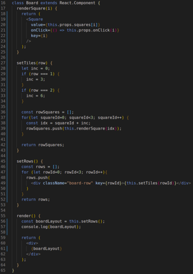
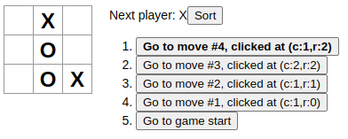
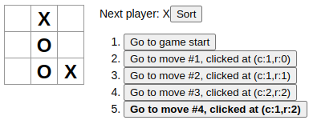
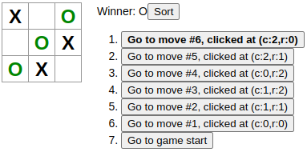

# Occasional Retrospective Notes

Semi-regular notes taken during my software developer journey.

## Thursday 1-Dec-2022

These notes span both Weds and Thursday.

Explored Auth0's "APIs" feature. This could be helpful for enabling Auth0 to authorize access to parts of an SPA or Node app. For now I've backed-out of the settings and am moving on to other things.

For now, the authentication requirements are removed from my exploratory API server so I can concentrate on updating the schema models and get those working with the existing routes, web templates, and processing functions.

Some REST and CRUD takeaways from today's experiences:

- Forms support POST, GET, PUT/PATCH, and DELETE.
- Forms do so while submitting *a query formatted data steam*, meaning it is in the URL e.g. 'http://foo.net/thing?item=bar'.
- To submit a JSON (or XML) Body from a form, the action must be *POST*, which could be unsafe for idempotent resource requests.
- Idempotent: On every execution/trigger, the function will return the same result.
- To work around the form-submission problem, a means to get an identifier is necessary so that the REST Verbs can be used consistent with RESTful design.
- Recall that a GET request will accept a URL parameter. In route/path it will look like `/foo/:id` and the URL address will be `https://foobar.org/foo/identity`. ExpressJS Request object will have 'identity' stored in the 'params' field.

Mongoose/MongoDB:

- It is helpful to have errors returned in HTML from an API server. Sometime the HTML-embedded message is more helpful than the try-catch captured error!
- Always use `Model.find(params).exec()` until something better is learned (promises and Mongoose Schema tricks).
- A Mongoose Model can have a field of type 'Array' like so `new mongoose.Schema({ things: { type: [String], } });`. This allows use of `push()` on the field once the ref object is created to add items to the array (see documentation for examples of using `$push`).
- Try to use your custom Mongoose-based Model as a means to create and update database items. This will increase readability of code and also enables built-in Mongoose validation checking on field entries! I need to explore this some more.

IDs versus Hash Codes versus UUIDs:

- There are many hashing modules availabe from NPM registry. Some of them are utter garbage (single test, terrible documentation, not updated for years, etc).
- Module 'uuid' has many facets, allowing generation of many types of codes and conversions, including universally unique idenfiers.
- Module 'node:buffer' is a super-simple load-and-convert tool for use with URL en/decoding, base64 and hexadecimal en/decoding, and more. It's as easy as `const foo = buf.toString('hex');` :fireworks:

General Coding and Design:

- Spend *more time on design* and less on code.
- When coding cannot be done to design, it is time to go back to the drawingboard, not battle with code!
- When an efficient and effective design is found/discovered, keep using it! If I had stuck with some realizations with Buffer and Mongoose as soon as I realized them, I would have saved at least a couple hours of flailing around.
- Just because a JS Module is intended to be used by Express (req, res, next, error, etc) doesn't mean it has to be 100% integrated. Next time, create more generic, testable modules and use middleware or go-between modules to interface Express.

Interesting reference:

[REST API Tutorial website](https://www.restapitutorial.com/lessons/httpmethods.html) breaks the REST verbs down into easily digestable chunks.

These are now done:

- [X] Build a getter-setter middleware for presenter model.
- [X] Build a getter-setter middleware for gameboard model.

## Tuesday 29-Nov-2022

Worked through Ryan's latest PR and approved and merged it.

Continued API Server design efforts:

- Found some issues with previous design documentation and cleaned those up.
- Feels like I am converging on set of schemas and designs for the data, API server structure, and the WRRC.
- Evaluated using server-side cache for GET methods using the Middleware design pattern.

Completed goals:

- [X] Implement caching on the API server demo.
- [X] Implement a sign-in and sign-out functionality to the API server demo.

The sign-in/out functionality is implemented but the Presenter User Stories paths haven't been fully implemented in the UI or in the routes. That will be a work in progress for a few more days.

Started adding models and middleware to the exploratory API Server:

- [X] Models for presenters and gameboards.
- [X] Refactored word model and schema into one file.
- [ ] Build a getter-setter middleware for presenter model.
- [ ] Build a getter-setter middleware for gameboard model.

## Monday 28-Nov-2022

Did some looking for apps that would create an animated gif, hopefully really small in file size, of the LingoBingo website. I settled on [ScreenToGif](https://www.screentogif.com) because it is pretty simple and straightforward. It is a Windows app though, and it wasn't able to make small enough files to be hosted in our GH repo. There are some options for how to host an animated gif and link to it that I will have to explore. Turns out the project is built in CSharp and is open source (perhaps something to look further in to, in the future).

Authentiation - Auth0:

- Store a cookie to 'remember' a logged-on user (App Session).
- Enable the ability to log out a user's App Session with a button that removes the App Session cookie.
- Utilize the Auth0 information to associate a logged-on user with their created and fetched data.

## Sunday 27-Nov-2022

Goals:

-[X] Re-watch WDS episode, uninterrupted.
-[X] Review LingoBingo Trello and work on at least 1 card.
-[ ] Implement caching on the API server demo.
-[ ] Implement a sign-in and sign-out functionality to the API server demo.

Middleware:

- A function that can be called to perform common actions on a request.
- For example, getting an entity from a database using 'findById()' might be needed by multiple routes. This reuses code effeciently.
- Param 'next' is a placeholder for additional middleware calls.
- If using Express Router, just export the middleware function as router.
- Place the middleware function name as the 2nd parameter in the router call e.g. `router.get('/:id', getMiddleware, (req, res) => { res.send(req.params.id)})`.
- Logging and some other middleware should be set in `app.use()` or `router.use()` just-in-time before it is needed, so that code that does not need the middleware doesn't have access to it.

## Saturday 26-Nov-2022

Reviewed Azure Friday Episode: Azure Kubernetes VSCode Extension introduction. This short feature quickly overviewed creating, deploying, updating, monitoring, and managing a [Node.js instance in an AKS (Azure Kubernetes Service)](./azure-nodejs-kubernetes.html) service.

Worked with Ryan here and there on the hamburger menu PR. Lots of progress made after a bunch of discussion. Somehow my local git got out of sync with the PR despite carefully pulling from the correct remote and PR branch. A quick clone to a new folder, git pull from remote PR branch, npm i, and npm start, and the code on my local was fixed. This is the 2nd time this has happened to me. I'll have to figure out how this keeps happening because it is causing interruptions in the dev and test processes.

I reviewed a Web Dev Simplified episode on quickly building an Express + Mongo API server. There are multiple good nuggets of information in there:

- Extention "Rest Client" is worth looking into. Simplifies sending req's and viewing responses.
- Middleware was explained very simply as: Code that executes after the request is received but before it is routed. :+1:
- Updating package.json 'scripts' element to define 'devStart' as `nodemon src/server.js` will explicitly call this functionality in an environment where `env.Dev=true`.
- Installing env and nodemon using `--save-dev` puts these modules in the 'devDependencies' section of package.json, rather than 'dependencies' section, so they are only loaded when `env.Dev=true`.

I'll need to watch it again and take better notes. There were too many interruptions to capture all there was to get.

## Friday 25-Nov-2022

Ryan and I met for several hours to go over design and architecture details of our next planned version. We refined some of the work items in Trello and moved lots of stuff into TODO. There is more architecture to get sorted out though:

- Caching: I need to brush-up on how this is done and Ryan hasn't implemented it before. I already have a personal work item to review this.
- Where to host the UI for a Presenter role user to add, update, and remove categories and word lists: API server or React website?
- Lots of fiddly details about authorization, associating lists with Presenter users, and other schema-based and WRRC-like considerations to work through.

Had pretty good success developing API server path(s) and using Pug for forms-based interaction with the API server, interfacing the Mongo DB:

- Created a home page with a few starter forms where Presenters can interact with the API server.
- Need to learn how to style Pug-based websites.
- If a form submission needs to return data to the caller, there needs to be a page delivered in a 'response' from the API server, with the data attached.

## Wednesday 23-Nov-2022

Some things to consider when planning API Server development for LingoBingo:

- Utilize custom error handler pages. See [Branden Enge's GitHub](https://github.com/brandenge/basic-api-server/tree/main/src/error-handlers) for examples.
- Define my own middleware tools. See Branden's GitHub for that, too. Simply put, middleware is just a module with functionality that can be required by other components within the server.
- Consider how to organize similar routes into a sub folder and simply export their functionality as modules.
- If separate environment behaviors and features are needed, use an [environment selector](https://github.com/Keelen-Fisher/bearer-auth/blob/main/src/auth/models/index.js), as shown in Keelen Fisher's GitHub.
- Separate permissions into a simple module that exports a function that simply checks permissions claims in a request against a list of permissions necessary for a function, prior to executing. Take a look at TTraylor310's example in [acl.js](https://github.com/TTraylor310/ExpressServer-Auth-and-Api/blob/main/src/auth/middleware/acl.js).

Lots of learning new things today. Also, reminders of lessons from previous experiences. I'm not writing fabulous code out of the gate, but I'm pushing boundaries and getting further along building an API Server using my own resources. If I would have been asked "what is 'middleware' in ExpressJS" last week, I wouldn't have had much for an answer. Today this is different and I feel like this is something I can intelligently discuss with others now.

## Tuesday 22-Nov-2022

LingoBingo setup stuff:

- Moved the lingoword table from one DB to another in Mongo Atlas.
- Set up a search function to return all entries within a specified category.
- Implemented all CRUD functions using Mongoose. There are some architecture details and some assumptions that will need to get fleshed out into details, but at this point, it seems like a few turnary functions can be implemented to enforce authentication and authorization, and it will be up to the caller to meet those requirements. For example: A non-authenticated user should not have authorization to update an existingn record.
- I will need to go back and make sure that only the requisite information is actually returns from an endpoint, too. Spilling an entire document from Mongo to the caller is not an efficient use of processing nor bandwidth.
- Calling '.exec()' at the end of a Mongoose statement (find et al) is required, unless I want to process the command *later*.

Somehow I couldn't recall how to do object destructuring so I looked it up on MDN. Simple: `{ param1, param2, param3 } = inputObject`

- This assumes the inputObject has fields 'param1', 'param2', and 'param3'.
- It doens't matter in the inputObject has additional properties.
- It doesn't matter what order the properties are in, just that the destructure syntax *uses the correct field names*.

## Monday 21-Nov-2022

Back to Express, this time revisiting Forms, Jade, and Auth0. Will work on integrating with a database a little later.

Pug takeaways:

- Forms: Remember that the Submit button must bound to or nested within the Form, else it will not have a click event.
- Pug Formatting: Nesting is critical to get the desired effect. This includes Forms and nesting dependent elements (like a Submit button).

I posted an answer to [a StackOverflow question](https://stackoverflow.com/questions/16970856/form-does-not-postback-when-submit-is-clicked-jade-node-js/74523674#74523674) that seemed to lack good answers, and it felt good to work through the problem, find a solution based on the original poster's code, and provide a structured, descriptive solution with a simple, tested code example. Hopefully it helps somebody. I had forgotten about being a StackOverflow member - probably because answers to questions are so common, and rarely is much additional information helpful (i.e. others that have answered have done a really good job). To update my profile, I added a slightly modified introductory statement, and inclduded a profile pic.

As I get ideas and find a few extra minutes, I will update Miro (and Trello) with LingoBingo JS features for v.next.

Express CRUD with Mongo Atlas takeaways (so far):

- Set up Schema and Model either together or separately, then require them where necessary.
- Build async functions to process actions on the Model(s).
- Mongo Atlas supplies a connection string although the database name should be entered before '?retry...'.
- Mongo DB table will be named after the Model name, and the data will be formatted according to the Model Schema.
- Using dotenv config makes accessing and hiding a connection string pretty simple.

## Sunday 20-Nov-2022

Continuing using express with postgresql from LogRocket blog. I was stuck on querying a single user by ID:

- Must use REST verb 'GET' if that's how the binding is set.
- A defined path of '/users/:id' for a GET means the URL is 'http://localhost:8080/path/path/user/n' where n is the ID to get.
- Query Parameters in URLs are different and looke like 'http://localhost:8080/path?name=n&state=s' where n is a string and s is a string.

Some other takeaways from the ExpressJS + PostgreSQL exercise:

- SQL Queries tend to use arrays for the values that you intend to insert or mutate, even if it is just one item, so use brackets `[ ]` around the variable to insert.
- Use parseInt(string, radix) to ensure a Number input is accepted as an integer, not a string.
- Create a module to export functionality that is all related, for example GET Users, PUT User {}, and GET User/:id should all be exported using `module exports = { getUsers, getUser, addUser };` at the end of the file.
- 'require' the exported module and have Express or ExpressRouter set a path and bind the required 'module.function' to the path.
- Remember object deconstruction? Me neither. I mean, I do, but it isn't ever front of mind when it needs to be.

LingoBingo MVP is live! Currently it is hosted on Netlify using built-in "ITU Phonetics" wordlist. We plan to set up the back end for the next version, and it will take some time to flesh out all the details.

## Saturday 19-Nov-2022

While getting the computers set up for today, I ran across some older C# project files, mostly during and soon after Bellevue College classes a few years ago. So many exercises and some clever solutions to problems are hidden in there! I recall having difficulties dealing with Chars and Strings (conversions, slicing and splicing, and regex operations) during Code Fellows. This was very frustrating because I felt like I had solved those problems before, but I couldn't recall how to do it. Takeaways:

- As I keep making projects and exploring frameworks and languages, I need to continue storing them in repositories (well named) so that I can easily find them later for review.
- Remember to use all my resources to help resolve issues or to get inspiration for future ideas or solutions.

I'm realizing that using the same Express server to explore and develop multiple features is getting a little complicated, so this weekend the goal is to create new Express servers for each single or limited number of features. This will force me to review the setup and install and implementatin processes, which should be good exercise.

Started working through a Log Rocket blog post [using express with postgresql](https://blog.logrocket.com/crud-rest-api-node-js-express-postgresql/) in a separate Express instance to quickly connect to a relational DB instance. It has been a while since I've done this so some of it is a little awkward. Hopefully this experience will help me when LingoBingo moves into post-MVP development.

## Friday 18-Nov-2022

Reviewed current status of LingoBingo with Ryan. We have just a couple more work items to resolve and we are going to call MVP achieved! We will have more development sessions this weekend, most likely Sunday.

There were a few other tasks I had to complete today for my volunteer work. This slowed my progress with everythingn dev related, but at least those tasks are sorted out and I can move on.

While exploring Cookies in ExpressJS, I ran across a scenario that I haven't considered before: Using Pug/Jade templates to design a submittable Form. This led to an older [blog post on 456Bereastreet.com](https://www.456bereastreet.com/archive/200711/use_the_label_element_to_make_your_html_forms_accessible/) that talks about including labels on forms for the sake of accessibility. Some key takeaways:

- Labels associate form data with form elements.
- Labels are used by screen readers to announce the form elements.
- Labels:Form elements is 1:1
- Lables:Forms is many:1
- Button elements and Input element of type 'button' are already labeled (don't need to add one).
- Implicit and explicit Label associations exist: Implicit = nested, Explicity = 'label for='
- Label text *is clickable* which effectively increases the clickable area of a clickable element, like a small checkbox.
- Use `div` or `fieldset` to wrap Form elements.
- Match up the Input elements 'id=' attribute with the label's 'for=' attribute to bind the data.
- Often the 'name=' attribute is named the same as the id and for attributes.
- Use CSS to make visual adjustments to a label's text so it does not interfere with screen readers e.g. just put the label text following the label element, not another styling element wrapping the text.

Continuing on, I found that there were intracacies of Pug and ExpressJS's Request and Response API's that I either don't have a good grasp of, or have otherwise forgotten how to use effectively, so I will need to review some of my prior work and de-clutter my learning environment to make better progress.

## Thursday 17-Nov-2022

This week has been very busy. Unfortunately not all of it was busy in the ways I wanted it to be.

Worked with Ryan intermittently to get these last few PR's reviewed and merged in, and locate other last-minute changes necessary to meet MVP. We will meet on Friday to discuss the state of things and next steps.

I spent some time updating my profile on LinkedIn, adding links and some descriptions of current projects, revamping my intro, and creating a tagline. I still need to rework the resume a little bit. As the LingoBingo project comes to be useable, I'll have to promote that a bit more.

Today I spent a couple hours with Kevin L to look at purchasing equipment for the volunteer team's operations. We had good conversation and find a lot of agreement on the approach to interoperating between the agency and the volunteer team. Most of the budgeted items for this year were purchased. There may be networking opportunitites here in the future.

Also today I worked through some interview preparation tasks including refining responses to behavioral questions, considering what I want in a 'dream job' team and organization, and thinking up important questions I want answered as part of the interviewing process. These activities are helping me gain confidence in my ability to have a relaxed, productive conversation where I can put myself in a good light, and also determine if the prospective employer is one I want to work for.

ExpressJS has been displaying a warning whenever I launch the server. The message is "using form_post for response_mode may cause issues for you logging in over http...". In a development server, without a self-signed certificate, http is the way to go. Production servers would (of course) use a signed cert and leverage https. Since the example server I'm working on leverages Auth0, they have steps for running [https in development](https://auth0.com/docs/libraries/secure-local-development), which should resolve the warning by implementing a reverse proxy (they recommend caddy). When running expressjs behind a proxy, 'trust proxy' must be configured, otherwise expressjs will register the incorrect 'client ip'. See [Express Behind Proxies](https://expressjs.com/en/guide/behind-proxies.html) documentation for details.

## Tuesday 15-Nov-2022

Spent lots of time working through LingoBingo PRs on my own and with Ryan. This was the focus for today.

## Monday 14-Nov-2022

Much of my day was spent working on volunteer work items, to clear the way for trainings, meetings, and exercises in 2023.

Completed a code challenge, whiteboard session only. It took 70 minutes to complete all facets:

- Define and refine the problem domain.
- Depict inputs and outputs.
- Design and write out an algorithms.
- Create a step-through and walk through the algorithm to display operation, function.
- Describe test approach and test cases.
- Write Pseudocode.
- Write code in my language of choice (Java this time).
- Analyze the code using BigO notation.

## Sunday 13-Nov-2022

Completed Graph write-up, implementation, and full suite of unit tests. There are a few minor lingering items that I could revisit in the future as a means to jog my memory on this data structure and the algorithms used to traverse it.

- [X] Revisit Graph challenge, try to wrap it up before EOD.

Sorry Friday, it wasn't your day.

The Lingo Bingo project continues to move forward, and we are marching ever closer to MVP launch!

## Saturday 12-Nov-2022

Met with Ryan on Lingo Bingo project and made lots of progress reviewing the Trello board:

- Very close to MVP, just a few more items to knock out.
- We have a potential customer that could be ready to use our app this winter.
- Avoid adding authentication and authorization until post MVP.
- Need to decide on a Netlify domain name so that when we hit MVP and push to the deploy branch the site is up and running.

Reviewed an Azure Friday video on using Mongo and Cosmo DB via a local, virtualized developer instance of the services. Very cool!

## Thursday and Friday 10 and 11-Nov-2022

Thursday:

- At least 4 hours working through volunteer communications and logistical planning.
- Re-opened java-code-challenges and continued work implementing tests, squashing bugs, and refining functionality of the MyGraph class, nodes, and edges.
- Revisited my C# project Initial Bearing Example. It is a DotNET 5 Project, which wasn't installed on my laptop so I edited the Project File so it is now DotNET 6.
- Project Initial Bearing has some issues in the calculations but operationally the console messages are informative and the app is stable. Solving problems of distance and direction on the surface of a spherical shape are quite complex. I added this to my list of personal projects backlog.

Friday:

- [X] Spend some time working through interview preparation tasks.
- [X] Continue work refining Screen Party functionality, debugging.
- [ ] Revisit Graph challenge, try to wrap it up before EOD.
- [X] It is 'Azure Friday': Review an episode.
- [X] End of week retro: Brain-dump what went well this week, and what needs improvement or could I have done differently?
- [X] Power Hour and Presentation sessions at Code Fellows.

Meeting with Ryan about project Lingo Bingo has been rescheduled for Saturday 12-Nov.

GitHub Codespaces Sounds Interesting!

- GitHub Universe was this week so some new features were released.
- Cloud-based dev environment.
- No local machine setup.
- Develop, test, and deploy in a fully online environment.
- Supports many common languages, and platforms
- Is a Linux VM on Azure with its own Docker Container so it is fully isolated, with protected access.
- Secure, forwarded port deployment (node app example).
- Use VSCode locally to interact with CodeSpace! Also JetBrains IDE, VSCode Browser, and SSH via GitHub Cli.
- Templates are available to quick-start an environment (but are billed only to Personal Accounts, not Organizations).
- Free (to a limit), then billed monthly.

CSS Animations can be tricky:

- Absolute or Fixed display type? Both are effective, but Fixed takes the box *out of the usual flow* so the animation doesn't interfere with the rest of the page.
- Animating fonts advice: Font sizes can get really large but too big might not be good for the overall experience.
- Animating boxes: Assign a starting height and width of 0 and in the keyframes use auto.
- Use `overflow: hidden` to keep objects from expanding the view port size when they spill over.
- Animating fonts: Can use font-weight from 100-900 to make font thinner or thicker as part of the animation.

## Wednesday 9-Nov-2022

More DotNET Conference 2022 video viewings and [note taking](./dotnetconf-2022.html).

[SVG](svg-files.html) and [Playwright](playwright-notes.html) were mentioned.

Completed some tasks for LingoBingo and prepped a test deployment of the latest changes to Netlify. Many of the tweaks I am encountering seem much easier to approach and deal with than in the past. :smiley: Progress! :fire:

Lastly, I spent some time tweaking the Screen Party animations:

- Tone-down the center star-eyed smiley animation so it's not quite so alarming.
- Contain the animations within the borders of the existing viewport to eliminate the vertical scrollbar and reduce the amount of horizontal scrollbar that appears.

## Tuesday 8-Nov-2022

DotNET Conference 2022 starts today. Notes will be stored [elsewhere](./dotnetconf-2022.html).

Between interesting DotNET Conference sessions I worked on java-code-challenges, implementing a Graph class and requisite unit tests.

## Monday 7-Nov-2022

Took some time out to respond to some interview questions before tackling [Cheerio](cheerio.html). It took much of the day to learn how to use Cheerio once I got an Express server running (which was key, really). Since I have been focusing on Express recently, I also reviewed the following packages since it was convenient to do so:

- Jade (Pug)
- Express Router
- Morgan
- DotEnv

The one part of deploying Express that I didn't pay much attention to (but I should in the future) is using NPX vs NPM INIT and building by hand. The NPX initializer builds-out a deprecated templating library (Jade) and includes Express Router and lots of setup and sample files. This isn't a bad thing. In most cases though I think it would be good for me to build the server by hand and get more out of the experience.

## Sunday 6-Nov-2022

Reviewing Express.js today:

- [X] Simple Routing.
- [X] Static pages.
- [X] Static pages with absolute path using path module.
- [X] OAuth integration.
- [ ] Implementing server-side cache.

Worked with Ryan on LingoBingo updates, PRs, code reviews... via GitHub, Email, and Slack. We are getting *very close*! He resolved several bugs and is moving things forward nicely.

While exploring Express.js and Auth0, I discovered Auth0 provides profile information for free. It's not a lot of info and really only includes the user name, locale, email, and an access grant token that is only used in the current authentication session. However, my exploratory Express server didn't have a way to display the data in a user friendly way.

Express.js and server-side HTML Key Takeaways:

- Whenever protesting server-side data but pushing rendered html to a client, use a template engine or submit data to a template via fragments.
- Jade is a templating engine, but has been deprecated in favor of Pug.
- Pug takes a template file that is plain text, has reserved keywords for common elements, and uses `#{variableName}` to pass-in data.
- Pug renders the template using a combination of `compileFile(path/to/pugfile.pug)` and `compiledFunction({ propertyName: variableName })`
- In express, this can be sent to the caller via `res.send()`, just stuff the compiledFunction into the send parameter.

Express.js Social ID Providers and Developer Keys:

- The freebee Auth0 Developer Keys are useful for temporary testing, and not available in private cloud deployments.
- A ClientID and ClientSecret are part of the Developer Keys set and should be obtained via the target provider (Google, GitHub, Twitter, etc).
- Auth0 *will not show your custom logo* on the OAuth screen when using Developer Keys.

## Saturday 5-Nov-2022

Survived the windstorm and power outages last night and this morning. Back to it!

Attended a webinar by a Code Fellows alumni and ex-instructor re: CSS. Was well worth the time, and he was very good at walking and talking through what he was doing and why.

Walked through the steps necessary to deploy React Apps to Netlify and Azure App Services. Netlify is pretty easy just on its own, and deploying to Azure App Service is made *super simple* using the Azure Extension for VSCode. 9/10 do recommend! For LingoBingo we will plan to deploy "production" front end to Netlify, and back end features (API, DB, Authentication and Authorization, etc) to Azure.

## Friday 4-Nov-2022

The local MongoDB installation needed to be removed from my main dev workstation, so that is now done. There were some Linux updates ready to install so I knocked those out too. After some additional research about Netlify vs. Azure App Service Web App. Before I do any more research, I need to deploy the LingoBingo website as-is to each and document the experience.

Next was to review Hash Tables. I keep forgetting about a few important Fields and Methods:

- IsEmpty(): Why not? Simplifies testing the data state in the Hash Table for a calling function.
- Replace(K, V, newV): This shouldn't be so hard for me to remember, yet it is. There are definitely cases where this would be necessary.
- Hashcode() and Equals() overrides: These might be required depending on whether the Key or Value has appropriate implementation for the use.
- Has, Contains, and Includes: Sheesh. It is true that the implementation (whatever it ends up being called) should be able to return boolean for any K and any V. I want to be able to talk through what the implementation would be like.

Pattern and Matcher classes:

- Do not confuse these with `String.replace(regex, String)` or `String.replaceAll(regex, String)` which can be used to replace substrings within a larger string.
- Use Pattern and Matcher to get a boolean answer as to whether the input matches the intended regex pattern.
- Matcher can be used against many Pattern instances so that various filter options can be tested.
- For example, Pattern and Matcher might be good at validating a phone number, but won't be helpful if substrings in a String need to be removed or replaced or extracted.

Here's the suggested development pattern from Oracle Docs on Java:

```java
Pattern pattern = Pattern.compile("\sword\s");
Matcher matcher = Pattern.matcher(Input_String);
boolean result = matcher.matches();
```

## Thursday 3-Nov-2022

Finished off the Rotate 3x3 Matrix code challenge from yesterday. Added a feature where it would rotate other sizes including non-equal sized rows and columns, so long as the input matrix x and y are 3 or longer.

Walked through some documentation about deploying a server-side Node.js app to Azure. Documentation is pretty good and there is now a VS Code Extension (several actually) for Azure. It's worth noting that full Linux-based, Express.js server applications are supported, and MongoDB can be part of the Web App solution, too. This could work well for Lingo Bingo.

MongoDB (local installation) was not playing nice so troubleshooting and reinstallation consumed a bit of my time. It's funny that although Mongo Org has lots of great documentation, they are pushing pretty hard for users to just use Mongo Atlas...which is what I'm going to do for most projects going forward. I guess PostgreSQL will be the local DB platform for me? Maybe MySQL? We'll see.

## Wednesday 2-Nov-2022

Took some time out to attend a Microsoft Reactor presentation on Rust (of all things). Key takeaways:

- Lots of talk about mutability, atomicity, threads & locks, and referencing: It is important that I continue to review these core concepts of OOP so that I talk and think about development as more than iterators and assignments of primatives and Classes.
- Analysing code is more than just counting lines and how many times they are processed. Various features of the language, compiler, and runtime impact how the code will compile and execute, and the effects of things like parallelism and concurrency, and memory access requirements and restrictions.
- Locks and Race Conditions: In synchronous programming, locking memory is helpful to ensure the memory is mutated by only one thread at a time. Unfortunately, attempting to await or access a lock can put the code into a race condition.
- Code Crimes: Panicking on a function return after processing data.

I'm not at a point where learning a new language is a productive endeavour. It is good to take the pulse of the dev world.

Back to deployment options for Lingo Bingo:

I found a blog article that talks about using Netlify Serverless Functions to talk to a MongoDB Atlas cluster, rather than rely on a back-end API: [Netlify Serverless Functions with Mongo DB](https://www.mongodb.com/developer/languages/javascript/developing-web-application-netlify-serverless-functions-mongodb/). It wasn't terribly good, but I understand the jist of how it works, and the numerous gotchas and limitations. Not sure this is what we are looking for.

After some additional research on deploying our React Site and a possible API Server w/ DB Access, I changed gears and completed a 40 minute Code Challenge - rotate 3x3 matrix by 90 degrees. This went fairly well, although the final code had a major bug it in. Analyzing the solution, documenting take aways, writing unit tests, and implementing (and bug squashing) the code was a good exercise. I have updated the 'java-code-challenges' repository with commits from this effort.

## Tuesday 1-Nov-2022

Hard to believe it is November already. I took time out yesterday and today to brain-dump everything I thought I knew about Stacks, Queues, Linked Lists, Hash Tables, Graphs, Trees, and sorting algorithms. Sorting Algorithms is different in that recently not much time has been spent studying them. Given my experience with the other data structures and algorithms, I feel like it is a good time to take on a merge-sort algorithm and just see how far I can get on my own.

Key Takeaways - Problem Solving:

- With some quiet, concentration time, a good amount of problem deconstruction could happen.
- Two of my IF statements were written backwards, meaning I meant to test if one was greater than another, but wrote the test the wrong way.
- No step-through of the algorithm or pseudocode allowed several bugs to get through to the Java implementation.

Key Takeaways - Java Coding:

- Java and its build tools and IntelliJ IDEA are very sensitive to namespaces (not surprising).
- Namespaces must NOT include the work 'java' as a single term in the namespace, other than the reserved directory 'java' in the 'main' and 'test' branches of the Project. Namespace issues like this will block building and testing code with errors that are not helpful.
- The best way to convert from a `List<T>` type to a `[]` type (e.g. `int[]`) is to Ehanced For loop through the List and assign values one at a time to the destination Array, index by index.

## Monday 31-Oct-2022

Saturday featured a communications exercise through early afternoon, and then family time for the rest of the day.

Sunday was a down-time day. I managed some documentation related to Saturday's post-exercise debriefing discussion, but largely it was an opportunity to decompress from a busy several weeks.

Today I had a late start and decided to work on yaml skills. My java-code-challenges repository in GitHub is a good candidate to explore yaml files and will benefit me in assuring builds build and tests are passing before merging into main. I've looked at YAML before and it had confused me (still does). Today I was able to make progress and defined 2 files: One for on push and another for on PR.

YAML key takeaways:

- File extension '.yaml' or '.yml'.
- Store in `./github/workflows/` directory of the repo.
- On: Single or multiple events can be defined.
- Branches, branches-ignore, paths, and paths-ignore: Refine *when* an Action is executed.
- Can be scheduled (like CRON) or called by workflow and other events.

Resources:

- How to [build gradle projects with GH Actions](https://tomgregory.com/build-gradle-projects-with-github-actions/) by Tom Gregory.
- [GH Docs: Trigger a Workflow](https://docs.github.com/en/actions/using-workflows/triggering-a-workflow).
- [GH Docs: Filter matching pattern cheat-sheet](https://docs.github.com/en/actions/using-workflows/workflow-syntax-for-github-actions#patterns-to-match-branches-and-tags).

## Friday 28-Oct-2022

Attended a PPH Session today with a guy from Microsoft talking about his journey of 40 years in the tech industry, from C++ to Xamarin and C#, to Cloud Advocacy. Good session, enthusiastic guest, enlightening takeaways, and overall enjoyable. Turns out he has had a similar experience to mine, in having to leave a job due to a bad manager.

Spent some time reviewing Cheerio and the more I look at it, the more I wonder if this is something I want to get involved with. I will give it some more time, to see what it can do. Also, having some experience with it should help me gain the context necessary to help solve that (8 year old!) Issue they have sitting there.

Took some time out to sketch a REST and CRUD design for Lingo Bingo. This came to me relatively quickly including n-to-m relationships. We now have a draft outline of custom API server features, interactions with an external authentication service, a database service, and users based on authorization types.

Revisited ExpressJS to jumpstart my memory on how this all works. It's nice that it is such a small, simple thing, but there are a lot of libraries that can be bolted-on that make it (highly extensible and capable) difficult. :smiley: Key takeaways so far:

- Create the project folder and run `npm init`, responding to multiple questions to create a default package.json file.
- Remember to `git init` so changes can be reverted, committed, and pushed to a remote repo.
- To use the ExpressJS generator, use `npx express-generator`. This installs 'jade' as the default view engine (which will be deprecated from future versions and will require `--view=jade` to put it back).
- Remember to `npm install`. Should be gut-reaction at this point (but it's not).
- Execute `npm start` to run the Express server, regardless of exactly how you created it.
- Package.json will have a pointer to the default 'entrypoint' file, so be sure that is correct/up-to-date.
- NODEMON! When editing the config or code in an Express server, your changes *might not be reflected* without restarting `npm start`. Instead, do `npm install nodemon` and then execute `nodemon` and when changes are detected, Express is restarted automatically so changes are 'picked up' right away.

Last thing to note: Working server side is making me smile a lot. I am excited to move to this server-side portion of the project!

## Thursday 27-Oct-2022

Today I spent most of the day working through some older assignments in the data structures and algorithms repo. Key takeaways:

- Having a design document for the solution (whether it is coded or not) really helps with designing unit tests and with refactoring (and bug squashing) the solution code.
- The 'unchecked' situation was simply an unhandled null situation that would have been rare to run across, but there was no reason to leave such an obvious bug in the code.
- Leveraging 'throws' in a method declaration reduces the amount of code necessary to handle exception cases gracefully. Seeing an Exception bubble-up from a deeper class method to the calling method I was working on told me exactly what I needed to do in the calling function to handle the situation, and it was pretty simple.
- When adding lots of conditionals and/or testing for the same situation a lot in the same method, it is time to create a field and a method that sets that field, and then an 'escape hatch' code path that bypasses the method(s) or code blocks that do not need to run if the field is set a certain way. The code will be easier to read and simpler to debug.
- I am proud of the design and coding of 'balancedBrackets', even as it was prior to refactoring it today. There were very few bugs, and most of the refactoring needed today was because I introduced a few more edge cases that I hadn't thought of before (or did and I avoided them because they were too much to think about at the time).

I am celebrating my successess in updating these months-old projects. :fire: :firecracker: :fireworks: :grin:

## Wednesday 26-Oct-2022

Sometimes challenges are designed in a way that the candidate is very likely to fail. It doesn't matter if the wording is imprecise, wrong, or otherwise misleading. The idea behind code challenges is to determine:

- How does the candidate problem solve?
- What questions does the candidate ask to learn the size and shape of the problem?
- What does the candidate do with the information provided by the answers to the questions?
- Does the candidate use good communication skills to explain how they are solving the problem?
- Does the candidates solution show logical steps solving small portions of the problem?
- How does the candidate respond to challenging problems?
- How does the candidate respond to failure?

Here's an example of how to frustrate your candidate and see how they deal with it:

- Provide a challenge that states the input will be an integer, but provide examples and imply the input will actually be a String.
- Put restrictions on the challenge to avoid using built-in methods in the language of choice, and then explain the best solution uses built-in methods such as indexing into an Array.
- Assert that the 'best solution' is O(1) in both space and time, despite the solution requiring one or more arrays pre-loaded with data AND utilizes at least one iterator to cycle through values in 2 different arrays.

At any rate, it was fun to solve the challenge a few different ways. There are at least 2 other ways to solve the challenge but I am not going to pursue those today. I am glad I have the brain dumps, code, tests, and analysis to review in the future as I see fit.

## Tuesday 25-Oct-2022

If I had an extra couple hours yesterday I would have completed implementing a CSS theme-selecting feature to Lingo Bingo earlier. This is exciting! I accomplished CSS magic with little help and lots of exploration and logically working through the problem on my own:

- Utilized CSS Variables to define a set of colors. This was already set from several weeks ago, but made implementing a theme much easier, and will enable simplified code updates and management.
- Leveraged property selectors on CSS Classes to define color, background, and border properties.
- Enabled programmatic selection of these pre-defined CSS themes through a field in react class component code
- Enabled programmatic selection of these pre-defined CSS themes through a local variable in react function component code.

The idea to use a CSS Class selector came from [css-tricks.com](https://css-tricks.com/creating-color-themes-with-custom-properties-hsl-and-a-little-calc/).

I reviewed my latest code challenge attempt and there are problems with the pseudocode and the slightly altered actual Java code:

1. Character class is a single String character, but is stored as an integer. So when casting a char of an integer (lets say 23) to an int, the *value* of the char is returned instead of the character as an int. Instead of casting the Character class to an Integer, I should first cast Character to a String, and then to an Integer.
2. Creating temp variables should be done with a purpose, meaning they need to be used sometime later, and probably destroyed. This needs to get corrected to be sure that temporarily stored value is used.

## Monday 24-Oct-2022

We've been looking to find a font or three to use for the Lingo Bingo project. Some resources were added to the Trello board so I read the article about Roboto and took a peek at [FontJoy](https://fontjoy.com/) to find some reasonable pairings. Will have to revisit this in the future with the goal of making a decision.

While researching hosting options for Lingo Bingo I found Azure to be a pretty capable. Looking at Heroku and Azure, it is clear that deploying a database server/service, storing the data, and dealing with transaction or request limits is much more expensive (and complex) than deploying a web app, desktop virtual machine, or some other services. Azure does have one benefit of having a pretty cheap SQL Server deployment tier that will consume *some* credits every month, but the capabilities of MS SQL are all there. It is possible that mutliple services will be used for example: Front-end webapp on Netlify and a back-end API with MongoDB in Azure.

More research is needed to review a few other hosting services to see what we might use, and what we should get ready for. RedHat OpenShift is so market-eeze that I can't tell what it might cost to use it, much less exactly what I'd use it for. Netlify is a known quantity, and as a front-end hosting platform it will only provide a part of the solution. Heroku has something called 'build packs' that support React, but are completely unknown (to me at this point). Heroku also has Add-Ons that will enable MongoDB access and other features, but my experience with those is they are supplied at a cost (although a minimal PostGresQL was available for Java-based deployments and was free, that doesn't help us in MERN-stack world).

I took some time out to look at Expressjs, since I haven't used it at all since May. It will take a minute to get back up to speed and I already have several other things to work on so I created a card to come back to exploring Expressjs in the near future, to support upcoming Lingo Bingo develoment tasks.

## Sunday 23-Oct-2022

Dedicated a good portion of today working on Lingo Bingo. Ryan addressed the issue with the React-hooks which is great because I couldn't quite get it done. Instead, most of the day was spent working through theming issues. I still don't quite have what I want. At least there is a colorful, and styled website now that we can work with and is less... sterile.

Tomorrow I need to look at hosting options. Ryan had some feedback earlier today and I want to participate in the information gathering and decision making process. Looking forward to that.

## Saturday 22-Oct-2022

Re-attempted a technical interview challenge [see previous attempt notes below](#friday-14-oct-2022). I managed to complete all of the technical aspects of the challenge and came up with a sensible solution, but it took me 2.5 hours to do. A vast majority of that time was breaking down the problem in such a way that I could visualize a solution, as well as vocally and visually walk through solving the problem, before I could write pseudocode and actual Java code.

Key takeaways:

- There were integers involved: Ask questions about min/max values, negatives and zero, and what (if any) are invalid inputs.
- An input could have been an empty string, so early on I should have written a test for that so there would be something early on, instead of waiting until the very end writing test approach.
- Input type was String (which was unexpected given the challenge name), so I need to immediately ask questions about handling all character types, not just the expected numeric types. What if the input was "12c4"?
- Utilizing a Stack to store input in a LIFO order is helpful for cases like this one, and it was good to come up with that portion rapidly. Although I should have made a few distinct notes about Stacks e.g. push, pop, peek, isEmpty, and LIFO.
- The overall performance of my solution in time is O(n*m), which makes me wonder if there is another data structure or approach that would be more efficient.
- Technical interviews are a means for the interviewer to better understand how the candidate problem solves. In this case, it might not be possible to solve the challenge within an hour.

Turned my attention to LingoBingo for a bit to work out some theming issue. I don't quite have my head wrapped around this yet, but I feel like it is close.

## Friday 21-Oct-2022

Took some time out to do a technical interview practice challenge. Key takeaways:

- I couldn't find a good datastructure to fit the problem, so could not find an efficient way to traverse and process the data.
- Much of my time I focused on breaking down the problem and found that a Stack would be helpful.
- I did manage to do a high-level Big-O analysis, but without stepping through a completed algorithm or pseudo/actual code, it is probably incorrect.

Completed 2 behavioral questions. There are just a few more that I need to write out responses to, then I can start a serious review and better prepare for interviewing.

Attended a presentation session on web accessibility. I was aware there are standards out there providing guidance to make sites, services, products, and software accessible, but I wasn't aware just how far along those resources have come. Check out the W3C for details about the WCAG (Web Content Accessibility Guidelines) at all stages during the software development process. Doing so will bring the site/service/product closer to compliance, but the main point is to design for *inclusivity*.

Saw presentations by Javascript Full Stack developers and they were using a package called [inquirer](https://www.npmjs.com/package/inquirer). It is a command-line interface for Node.js. They were using it to administratively update database entries, and manage services running on their backend infrastructures. This could be useful in future Node and Express projects! Turns out the class was instructed to do their projects *without any graphical user interface at all*, and use AWS Services for CRUD, authentication and authorization, and build custom API servers to manage their data calls. They all did really well!

Went through the java-code-challenges repository to review properties, methods, traversals, and algorithmic complexities. There were a couple of errors, some points that needed refinement, and some reference links that needed to be updated, so I did that. Having that repository with all of the documentation included seems to be a good idea as I am able to easily review the information and refresh it in my mind. This actually raises my interest in coding, so it might be good to do these reviews earlier in the day so I can take advantage of that coding desire.

## Thursday 20-Oct-2022

Continued research using React Hooks. Much of the documentation introduces the concept of Context and 'useContext' all in the same file. That's fine except those examples fail to demonstrate leveraging a defined context *across files* in a React hierarchy.

Key Takeaways:

- Define a context file that initializes 'MyContext' using `createContext(null)` and exports `{MyContext}`.
- In the parent Component, import the custom Context component and set up a value that will be transferred via that Context.
- Also in the parent, wrap child component(s) in a `<MyContext.Provider value={myValue}>`.
- In the child component(s) import the custom Context component and assign the Context value to a variable by calling `useContext(MyContext)`.
- Whenever the Context value(s) change, the child *components that import it will re-render*.

Checkout [this post on react usecontext hook](https://www.robinwieruch.de/react-usecontext-hook/) by 'rw;eruch' aka Robin Wieruch.

Once I had spent a few hours with 'useContext' hook to get the hang of it, I took some time to work through some more CSS issues. Turns out there are areas where CSS and Bootstrap styling could be refined to make the GameBoard display more appealing. Right now it is a little weird in how the Tiles are sized and shaped, but the benefit of the CSS layout and using Bootstrap is the site is responsive to both desktop-sized and phone-sized screens.

I attended the Bellingham Codes Software Forum, where plenty of good discussion around building websites using React and javascript, among other things. Afterwards, I had more good discussion with Ryan, another attendee, about navigating becoming a software developer.

Some takeaways from the Software Forum discussions:

- I really enjoyed talking about code, with developers from all backgrounds.
- Just because your React hierarchy is getting large or complex is *not* an indication that it is wrong or otherwise bad.
- Framer: A production-ready [Motion library for React](https://www.framer.com/developers/guides/).
- [Inkscape-react](https://github.com/konsumer/inkscape-react#readme): Converts Inkscape images to React Components.

## Wednesday 19-Oct-2022

Researching Theming in React has tough. There are several articles that are very out-of-date, using older React techniques, are too vague for new developers, or the backing "see my github repo for the code" doesn't actually exist.

What I did learn is using React Hooks is a thing, and it could be helpful in creating themes for a React website. I started [documenting some react hook takeaways](./react-hooks.html) for reference.

React Hooks uses concepts that are pretty familiar, now that I am gaining a basic understanding of the design patterns of Hooks:

- Functions are functions are functions, except when they are Classes.
- State can be values stored in React, without using Classes at all.
- Leveraging an existing Functional Component can be as simple as defining a custom Hook, and then calling the hook with valid arguments in React to manage state or perform complex logic.
- The example of 'todosReducer()' custom function reminded me of 'Array.prototype.reduce()'.

About 'Array.prototype.reduce()':

- Input parameters are previousValue, currentValue.
- Arrow function just points to the expression *to be performed on the inputs*.
- The expression component '(previousValue + currentValue, ...' literally means 'replace the first input with the result of this expression'.
- The expression component '...initialValue)' literally means 'replace the second input with the result of this expression'.

```javascript
// from mdn.org Array.prototype.reduce() documentation
const array1 - [1, 2, 3, 4];
const initialValue = 0;
const sumWithInitial = array1.reduce(
  (previousValue, currentValue) => previousValue + currentValue, initialValue
);
```

Step Through::

Iteration 1: (previousValue = initialValue = 0, currentValue = 1) => (0+1, 0)
Iteration 2: (previousValue=1, currentValue=2) => (1+2, 0)
Iteration 3: (previousValue=3, currenValue=3) => (3+3, 0)
Iteration 3: (previousValue=6, currentValue=4) => (6+4, 0)
Return: 10

## Tuesday 18-Oct-2022

Finished CSS cleanup from yesterday and built upon that by submitting a new PR to the Lingo Bingo project. Some display bugs were solved and general rules like avoiding in-line CSS and using classes or Bootstrap were implemented. The project is looking better!

Next step is to finish working on devloping a theme for the color scheme. For now the effort might be overkill, but in the long run it will simplify implementing alternate themes, and perhaps user-configurable ones. Not an official feature right now but will be good experience to have.

## Monday 17-Oct-2022

Took a little bit of a break over the weekend. Some development and exploration was done, but not at the level of the previous month.

Put some effort into learning CSS Variable usage:

- Set up a custom pseudo-class: `:root {}`
- Define variables using dash-dash prefixing: `--rgba-primary-0: rgba(36, 69, 146, 1);`
- Call the variable to assign the element value using 'var()': `color: var(--rgba-primary-0);`

I'm thinking there is probably a more robust way to implement this to simplify applying a theme to an entire webapp. Looking more into this subject, I started to see some style issues in the Lingo Bingo project, so I worked on fixing those. Some key takeaways recorded on [Sunday September 3rd](#sunday-3-sep-2022).

I also watched a video where a guy developed a javascript version of the Minesweeper game. It only took him 55 minutes (of video time) to get the core elements of the game working, including a UI. He jumped back and forth between whiteboarding and coding, so it was interesting and inspirational!

## Friday 14-Oct-2022

Attempted a code challenge "convert integers into roman numerals". This was very difficult and I ended with a partial algorithm and will need to attempt it again.

Attended a seminar on DevOps and AWS. Was very interesting and help re-kindle my interest in working with AWS, like in the Java 401 class.

Key takeaways:

- Continue to experiment with code and services.
- DevOps might not be first job but is achievable with experience from Code Fellows.
- Get a job as a back-end engineer.
- Build-out your own projects.
- Work with coworkers asking for help etc.

Tailwind CSS was mentioned again with lots of positive feedback and kudos. I have that on my list of things to investigate.

Ryan and I updated some Lingo Bingo code and some PR's were merged in. So I moved forward with the "screen party" feature implementation. So far the integration of planned code into the gameboard was not too difficult. There is more work to do in the next few days to make it more awesome!

As of right now, I have a streak of a solid month of contributing code to GitHub. Some of that is due to my endless typing in this retrospective markdown, however there are definitely some significant code updates and project completions:

- Many contributions to EnigmaBay including code, unit tests, code reviews, and pull requests.
- Lots of effort into describing data structures and algorithms, including code analysis, pseudocode, Java implementations and refactorings, and JUnit unit tests.
- Completed BitmapTransformer! This was an early Lab assignment for Java Code 401 that I did not complete during class. I am proud of my effort to restart it from zero, and build it up through all the requirements, to a completed, functional console app!

I took a look at a few blog articles about theming, and it is pretty invovled. It might be worth the time to look for a package that will manage theming and end-user-selectable theming. Until then, a baseline theme using CSS will be implemented, and I will consider what to do about theming longer term.

## Thursday 13-Oct-2022

Monitored MS Ignite sessions again today. Notes are stored at [MSIgnite 2022 Notes](./ms-ignite-2022-notes.html).

MSFT has done a lot of work to enable remote development, and IT management of remote development resources, via the Azure cloud. Although it is very Visual Studio-centric, they did demostrate Maui features (cross-platform build, hot-reload, and an *android emulator*).

I completed a React-Tac-Toe challenge: [Highlight Winning Tiles](#react-tac-toe). I updated the blargh article where the challenges are listed. Takeaways:

- Analyze the output of functions to be sure I understand what it is they are returning.
- Check for the closest Component to where the UI change needs to take place, and work backwards to the calling Component so that props can be back-traced properly.
- Javascript does not have a 'Contains()' method. It has `Array.prototype.includes()`. :confounded:
- One year ago I was not able to use code to change style on a website. Today *I can do it without much thought*!

## Wednesday 12-Oct-2022

Watching Microsoft Ignite 2022 this morning, looking forward to hear what is next from Microsoft.

GitHub Universe is set for November 9th and 10th 2022.

Git tid-bit:

`git commit -c {id}` allows updating a commit message for a commit with *id*.

What is an OKR? Objective and Key Result. OKRs enable setting and communicatingn goals and milestones.

- An objective is the focus of the work at hand; the achievement to unlock. These should be action orientated. The "what" to accomplish.
- Key Results are milestones along the journey to the objectice. These should be time-bound, measurable, and specific. The big "hows" to accomplish.

During the break in MS Ignite sessions I worked on LingoBingojs. I updated information on a PR so that my partner could make some tweaks and the PR could be incorporated to main. We're getting pretty close to first MVP!

Quite by accident I bumped into [cheeriojs/cheerio](https://github.com/cheeriojs/cheerio), an open source project that scrapes web pages and returns a tight, scaled-down DOM. [ikatyang's emoji cheat sheet](https://github.com/ikatyang/emoji-cheat-sheet) utilizes cheerio to create the list. Turns out there is a 'good first issue' item in the Cheeriojs repository, so I forked it for future inspection. This could be a good next opportunity to contribute to the OSS world.

Back to MS Ignite, David Fowler and Damian Edwards shared some interesting ASP.Net 6 and DotNET 7 preview code and features. In the past, these sessions have been difficult to track, but with Code Fellows training in full-stack web development, the terminology and features they discussed were consumable and interesting. :fireworks:

## Tuesday 11-Oct-2022

Another poster added a link to [Jake Archibald's blog page](https://jakearchibald.com/2021/cors/) that discusses *CORS* in historic detail. It's also pretty humorous. Key takeaways are stored in [cors-review](./cors-review.html). Key takeaways for right here:

- Preflight not required for same origin, non-credentialed requests.
- Preflight not required when headers include 'access-control-request-method' and 'access-control-request-headers' that are acceptable to the server.
- Preflight is triggered for requests that are *not* GET, HEAD, or POST, and/or include unusual Headers or Methods.
- Preflight is triggered when requests ask for headers *not on a safelist*.
- CORS preflight and responses can be seen using DevTools, Network tab. Use it!
- It is not good enough to just allow wildcards, as that will not override preflight requirements.
- Browser and CDN caches can cause issues with CORS. Use `Vary: Cookie` and `Vary: Origin` to ensure caches do not send aged response instead of fresh one.
- No private data? Use `Access-Control-Allow-Origin: *`.

## Monday 10-Oct-2022

Seems like using `this.setState((prevStat) => {})` will alter the developer's approach to updating State under certain circumstances. For example, if a collection of items is already a property of State, and another property changes based on that collection, then updating the second property will not be possible in a single setState call.

Some resources to review:

- Using prevState with React, basic and complex on [medium.com](https://medium.com/geekculture/using-prevstate-with-react-basic-and-complex-f7f8ab4ce1b6) (low quality article imho).
- Very helpful frequency asked question secton about State: What does setstate do on [Reactjs.org](https://reactjs.org/docs/faq-state.html#what-does-setstate-do)
- A long but pretty thorough discussion about setState a/syncronous in React, [on Meta's react github issues list](https://github.com/facebook/react/issues/11527#issuecomment-360199710)

Turns out the work around is to just call `this.setState({ item: {value based on otherStateItem ,}})` and it will work. My gut sense tells me that there are probably better ways to manage state than this, but I don't have concrete evidence to support it.

Many tests I wrote for the project were using lots of `.forEach()` statements and creating lots of arrays to store JSON data. Ryan suggested moving to a more object-oriented approach so I refactored the Jest files. While doing that I realized he could have meant doing something a little different, so I posted what I did and asked him for feedback. In any case, I learned:

- Using object literals can save a bit on code vs. lots of cheap local arrays.
- Gathering data from object literal properties can be done using `.find(arg=>arg.property===testSubject).property`.

Using '.find()' makes the code a litte bit longer horizontally, but from a readabilty perspective it is pretty good, and it hides the ugly iteration detail.

## Sunday 9-Oct-2022

Reviewed some of Ryan's code for the LingoBingo project. He's working on a play again button, so I reviewed the code, pulled in his changes and ran them, and sent him some feedback. That functionality will definitely be needed but it's not fully baked yet.

On Friday I experienced some anxiety figuring out why some of my Jest Tests were failing, and others would appear to hang. There are key takeaways for Friday that cover most of the items but there was one remaining question: Do Jest Tests run in parallel? Behavior of `npm test` output and the errors I was seeing suggested that was the case, and today I verified it with some internet searching. According to www.oreilly.com and [a github facebook Jest issue 5818](https://github.com/facebook/jest/issues/5818). A read through provided some detail on how Jest operates.

Key takeaway on Jest parallelism:

> Assume Jest will run your tests in parallel. It might not, but unexpected side-effects will happen when assuming otherwise.

After integrating my calculation components into the Lingo Bingo React project, it became clear that one of them needed to carry more weight, and provide better output, so I refactored it. This meant that the Jest tests had to be updated. This work is incomplete as of the end of tonight, so I'll pick it up tomorrow. Takeaways?

- Build Components that actually help with their output rather than just transform inputs to some other outputs that require more processing.
- That might not always be possible but it is helpful if a component is good at something, taking away the responsibility of the calling function or component to figure out what the output really means.

## Saturday 8-Oct-2022

Today I worked through writing the basics of a Graph Data Structure, and the traversal algorithms. I found an interesting slide deck for a computer science class at the UW [CSE 417: Algorithms and Computational Complexity](https://courses.cs.washington.edu/courses/cse417/12wi/notes/03graphs.pdf) that was helpful. It had an interesting quote from [Walter Ruzzo](https://homes.cs.washington.edu/~ruzzo/), Professor of Computer Science & Engineering and Adjunct Professor at the University of Washington.

> "Never write an argument you are not convinced in because this may damage your brain." *[Ruzzo]*

Some key takeaways:

- (preliminary) The Adjacency List could be used as a Visited Nodes collection for traversals.
- Graph Nodes need to store the Edge(s) that they connect to.
- Each Edge is considered a directional path leading to another Graph Node.
- An Edge could theoretically have a 'neighbor' that is the host Node itself, so maintaining a list of traversed nodes is necessary to prevent a iterating problem that this configuration could otherwise allow.
- Assume that an Edge has a weight of 0 even if the problem domain doesn't require it.

## Friday 7-Oct-2022

There are a couple of presentations I want to attend early this afternoon.

First was refactoring: How and why. In essence, code smells will appear for many reasons, and it is important to try and refactor code to remove the code smells, making it more easily readable, less prone to bugs, and better performing.

Started working through Lingo Bingo logic to determine when a Bingo has been attained. This will be in a dev branch and can get refactored and reworked as necessary.

Key Takeaways:

- Jest will not tell you everything you need to know about a test failure, so don't expect it.
- Jest is most likely running the tests *in parallel*. There are heuristics that decide whether to run asynchronously or not. It is probably best to assume synchronous most of the time.
- When Arrays or Objects are not supplying data the way you expect it, start at the data itself, then the first component to touch it, then the next component, and so-on.
- Don't troubleshoot the Jest Test when the problem is deeper than "the test fails", go to the modules/functions under test!
- When passing JS or ES6 Arrays as arguments to functions, use `.map()` and `.forEach()` to push data into an Array explicitly so there are no assumptions about A) the data getting added to the array, and B) the number of items the array will contain.
- It paid off to build Jest Tests early on while developing these functions (there were 5 of them!), as the tests discovered *plenty* of issues with my original code attempts.
- Worry less about making the code beautiful until *after* the code is passing unit tests and is 'done'... *then* refactor it.

## Thursday 6-Oct-2022

Bitmap Transformer Project: It took a bit longer than I thought it would, but I completed this project today! While writing up method descriptions I realized many methods were too busy, and some basic checks were not being done at all, or not very well. Also, while writing unit tests I realized there was some logical processing flow that didn't make sense, so some refactoring had to be done.

Key Takeaways:

1. I should have worked through the bitmap support problem I ran into rather than just moving to PNG. Not a big deal, but it does raise a question about the name of the app.
1. The Main entry point is a static method. That means instantiation is not required for entry. Other methods that App needs might need to be non-static, so take that into consideration when building a console app.
1. In hindsight it would have been better to do more design planning for this project, and the general flow would have been better. For example, a better naming scheme for methods, and the order the methods needed to be called, and when the app would exit, would have been better designed.
1. Exception handling was, exceptional, in the busy sort of sense. If I was to do this again I would try to track exception handling paths better so they were easier to track and manage during dev and test cycles.
1. Building the app to run in IntelliJ IDEA is different than producing Artifacts (JAR files and etc) for executing in a shell or terminal environment.
1. Gradle is a different beast. It is easy to forget the requirements to get initialize, build, test, and run a project properly. Review notes in bitmap-transformer and other places to get through these challenges.
1. Working with graphics is complex. Lots of math can be involved, and the existing Libraries in Java are not documented to my liking. At least docs existed and it was good that I found some example usages online and leveraged that code, then refactored it to apply to this project.
1. A good hands-on test is to re-use the same file over-and-over when reading and writing files. Running Bitmap Transformer JAR against a bitmap file multiple times would fail after 1-2 transformations. Not sure why, and don't plan to persue it at this time, but this is something that could happen on other projects where file Create, Read, and Update operations are performed.
1. REGEX can be a beast! I know this, but it got me again in this project. I have to step very carefully through the capture requirements and filtering in/out specific character and groups of characters in strings. It is easy to make a REGEX that is too complex for the problem at hand. Use REGEX101 and throw all known pass and fail garbage at it so it is clear what my defined REGEX string might actually do in a Pattern Matcher.

Behavioral questions: I addressed two of these today. One was a revisit, the other was one I hadn't responded to before.

Working through some Java concepts in ReplIt, I discovered that replit isn't really a great place to sandbox Java code. It seems to be unaware of basic Java libraries like Pattern and Matcher classes. So instead I spent a little time fiddling with JS arrow functions.

Key Takeaways about Arrow Functions:

- Are not methods.
- Do not understand scope, 'this', and 'super', in the usual sense.
- Cannot be used as constructors and are not able to use 'yield'.
- CAN be treated like variables when used in the 'function body' format: `const result = (params) => { codeBlock; return value; }`.
- Assigning the arrow function to a value allows calling it like `result(myParam)`.
- Any necessary operations can be performed *directly* on the result.

An example of what I threw together can be found on [ReplIt](https://replit.com/@JonRumsey/CoordinatesFun).

## Wednesday 5-Oct-2022

At this point I've deployed a new React website a few times. If from here-on-out I continue doing React Web Dev, I'm sure it wouldn't be an issue to know how to deploy a new React site, or add React to an existing one. However, right now I have many different tasks on my self-assigned plate, from web dev, to Java dev, to software design, project management, and algorithm studies. This makes it difficult to be an expert in any one area, and I recognize the power of knowing React and web development so it is important to have some key takeaways to look back on.

React Deployment Key Takeaways:

- For a new site, ground-up: `npx create-react-app {project-name}`. CD to 'project-name' => Default React site with Git already initialized.
- There is also `npx new-react-app {project-name}` but that is a bit different.
- Install dependencies: `npm install` or specify: `npm install {module-name module2-name ...}`
- Launch the React site: `npm start`
- Deploy production-ready: `npm run build`
- Execute defined tests in configured framework: `npm test`
- Follow README.md steps that React installs on your site for reminders and more info.
- Removing default icons and components is fairly easy, just be sure to review `manifest.json` and make edits only as necessary.

The Syntax podcast mentioned CORS and CORS-related issues, so I took some notes. This lead to writing a new article about [CORS](./cors-review.html) so I could easily reference it later. This could help helpful on future web projects such as LingoBingo and other project ideas I have.

My attempt at a 40-minute technical interview challenge ended with timer expired before I could finish writing java code. Completing the code, then writing about testing approach, and of course Big-O were necessary to ensure points capture. Later, this item will be added to the Java Code Challenges repository (just like the others) and must be re-attempted at a later date.

Since I had a little time before lunch, I responded to a few sample behavioral questions. These are slowly getting easier to respond to. I feel like they are less burdensome, and more like an opportunity to share my story of who I am and what I can do for a potential employer.

Back to CSS Animations:

- Timing and behavior can be achieved directly through `@keyframes`, or a combination of `@keyframes` and `animation-timing-function`.
- Keyframes programming can be a little tedious, but there is more precise control over the animation this way, including speed.
- Animation Timing can be edited using the 'cubic bezier' built-in function. To get some interesting effects open DevTools -> Elements tab, select the element with the animation-timing-function property, and click on the icon next to 'cubic-bezier()'. A neat little animated diagram will help define what inputs are necessary to get varying speed and timing effects.
- There is a near transformations experimenting tool, a [project built by @alterebro](https://css-transform.moro.es/) with live rendering and adjustment of several CSS3 Transform properties.

To experiment with CSS Animations, I created a ReplIt called [React Css Animations](https://replit.com/@JonRumsey/ReactCssAnimations#src).

Before the day ended implemented the technical interview challenge in my Java Code Challenges repo. My pseudocode solution really wasn't all bad, but it was lacking some simple bad-input checks. I still have a question about whether in a Kary Tree if checking across a "holey children array" could produce a Null Pointer Exception. I don't believe it would. That is something I'll have to explore some other time. The final solution, with a Kary Tree anyway, is all completed, unit tested, analyzed, documented, and checked-in now. Code implementation was pretty fast and very few lines, so I must have done something right. :smiley:

## Tuesday 4-Oct-2022

Back to the bitmap transformer project! Had I taken time to look into BufferedImage class back when I first did this assignment, I probably would have been able to complete it, or at least get one transform done (instead of none). Key takeaways:

- ImageIO suports bmp, png, gif, and jpg filetypes except for `write()` method => *bmp is not supported*. To get around write, write a PNG file instead.
- There are built-in draw and edit capabilities in the java library java.awt.Graphics that are good for drawing, filling, or adjusting the size of existing images.
- SGOESCH has an interesting github project called [java image processing survival guide](https://github.com/sgoeschl/java-image-processing-survival-guide/blob/master/paper/README.md) that has some helpful info about Java and image processing, handling.

If I ever want to show some regex skills, I'll need to become more familiar with [Pattern and Matcher](https://docs.oracle.com/javase/8/docs/api/java/util/regex/Pattern.html) classes in Java.

- Import java.util.regex.Pattern.
- Use the first codeblock for multi-use.
- Use the second codeblock for single-invokation.

Multi-use:

```java
String inputParam = "I contain letters and spaces.";
String regex = "[a-zA-Z]";
Pattern pattern = Pattern.compile(regex);
Matcher matcher = pattern.matcher(inputParam);
boolean result = matcher.matches();
```

Single-use:

```java
boolean result = Pattern.matches(regex, inputParam);
```

*Note*: The Oracle Java docs have a special set of REGEX rules that are *slightly* different than what I've seen elsewhere (e.g. regex101).

Responded to a behavioral interview question. This was in interesting one because it is basically asking what gets me exciting about software development. The basic answer is: solving problems, and watching unit tests pass, proving the problem is solved. There is more of course, but that is in the details of the answer I drew up and will refine.

Final set of takeaways:

- CodeFellows helped me to look up solutions to help me not get stuck.
- Rotating an image in Java isn't too difficult, but requires a little fiddling with the Graphics2D and BufferedImage classes.
- Flipping an image is more difficult - AffineTransform class documentation is lacking info that I really need to help me understand how to use it.
- AffineTransform leverages BufferedImage, but Graphics2D is not required.
- Mirror and Rotate were easier to implement using existing libraries than they would have been to write my own.

Last couple TODOs for the bitmap-transform project were completed on October 6th:

- [X] Add unit tests.
- [X] Add method documentation to the codefile.

While I was checking in to a couple of ham radio nets, I decided to take a peek at the NWS API. Key takeaways:

- There are requirements to connect, but no API Key nor cost for accessing the data.
- They will throttle requests.
- Be courteous - include your email in the User-Agent header.
- Examples of working API calls are stored in my ThunderClient.

I added some comments to my "Practice Boards" in Miro, as well as some added Cards and details to Trello for future projects based on using NWS API.

That will be it for this very productive day!

## Monday 3-Oct-2022

Updated the Trello and Whiteboard documentation for the LingoBingo project with ideas sparked from yesterday's conversation, and whatever occurred to me overnight.

In one of the forums I follow, a user is asking if folks are interested in learning about Streams...which is on my list of things to do, so that could be a nice additional resource!

Back to LingoBingo, I added a 'session' component that is used to get data and prep it for a gameboard to consume. The gameboard handles the display and click event and no longer has to manage importing the word data. This fixes a problem where clicking on the gameboard would reload all words.

We are going to have to figure out how to manage "Host" users vs. "Player" users. There is no decision on this just yet. A couple of ideas on how we could approach it:

1. Implement registration, authentication and authorization, and a profile page.
1. Create a Host landing page to just frame-in Host-only operations like importing a word list, assigning a category, and generating a link to play the selected category in a game.

Key takeaway: Trust myself a little more when it comes to solving problems related to React State.

Code Challenges: I discovered that my solution to "Is Anagram" challenge was not quite right. Turns out the input was to be *2 strings* and the comparison is whether they are anagrams *of each other*. I might take on the challenge of fixing that in the near future.

I attacked another React Challenge: Add a toggle button that lets you sort the moves in either ascending or descending order. See entries from about 2 weeks ago for the full list and images of results.

Key takeaways:

- Create a new boolean State property that can be toggled, tracking ascending/descending order.
- Define a variable to store the reverse-order of the list items. Since this was an array, use the built-in `.reverse()` method after using the spread operator `[...arr]` on existing items.
- Create an event handler that simply toggles the sortAscending boolean: `!this.state.sortAscending,`.
- Add a Button component to the rendered output and declare an *arrow function* as the 'onClick' argument: `onClick={()=>this.toggleDescending()}`.
- An arrow function is *critical* so that this.state can be accessed within the event handler function.

On to Java Code Challenges! Reviewing the isAnagram solution, it turns out I solved the *palindrome* problem instead of the anagram one. Granted, a palindrome *is* an anagram, there are a bunch of use cases that won't get solved by the isAnagram method I created. So I completed an update to the java code challenges repository that addresses that problem. There are now two classes - one for the Palindrome problem, another for the Anagram problem.

Takeaways:

- Pay closer attention to the problem domain. I shouldn't have missed the requirements of two string inputs, and it wouldn't have hurt to just Google (in this case) anagrams, to make sure I got it right to begin with.
- Remember to use Enhanced For (Java; for-each in other languages) when I need to iterate through all items in a collection *but I don't need to know the exact index of each one*. It's simpler to code it this way and gets the same result w/o fear of an out of bounds or mis-typed variable.

Also, when thinking about using Hash Table, recall that it:

- Stores both Keys and Values.
- Can return all keys.
- Can return all values.
- Can determine if a value is contained, or if a key is contained -- don't assume it is just the value that can be checked for!
- Add and Delete are included in Hashtable that is included with the java libraries.
- The hashtable might *not* solve the problem itself, but it can do the work of determining non-uniqueness in O(1) time with very little code.

That's it for today.

## Sunday 2-Oct-2022

Met with my project cohort and reviewed the Trello board work items, updating and closing a few of them. There is a lingering issue of the full-page refresh when State is updated. Normally that wouldn't be a problem except the refresh causes the words to randomize again, which is a bug. We think that changing the location where the wordlist is imported and randomized will fix the problem, so I'll work on that and see what I can come up with. Ideas:

1. Move the state to the level above the Gameboard. This makes sense from a few feature perspectives.
1. Store the organized words into state and recall them once they are there, rather than from the randomizer.

## Saturday 1-Oct-2022

I spent some time figuring out how to install, configure, and utilize Jest. It's not that difficult really. Some key takeaways:

- Non-strict comparisons (Equals) appear to be the default, and there chained methods that alter that behavior.
- When comparing an object, like an array, use `isStrictlyEquals()` chained method.

Jest supports:

- Promises // asynchronous calls.
- Mocking.
- Web UI frameworks.

I set up Jest on the Lingo Bingo project and submitted a PR with a couple of test files pointing to the purely functional modules. From here on out, it would be good to get unit tests written to any new PFM's, or any updates to existing ones.

## Friday 30-Sept-2022

This morning I attempted another technical interview question and could not get code on the board before 40 minutes was up. I believe the overall design is *close*, but there is definitely a problem with the iterators and indexing. Using a Stack seems like a great idea though.

Key takeaways:

1. Remember that the Stack data structure has a Peek() method *and* an isEmpty() method. Be sure to consider their use and how they can help solve the problem at hand.
1. When I'm struggling to deal with "cutting an array in half" and "iterating through the result(s)", just start drawing out an odd-count array and an even-count array and *work the problem until it is solved*. Do not just skip over it because it *will* bite later on.
1. Developing a Stack's Pop() and Push() methods requires careful operation, depending on how many items (if any) are already in the Stack. Push: More than One? Only one? None? Pop: None? One? More than One? ...in those orders.
1. When a method needs to raise an exception that means: *specify the exception in the method declaration* using the `throws` keyword.
1. Before implementing generics, just use `Object`. Yes, un/boxing and various Casting calls will be necessary, but this will allow developing the solution rapidly, without getting hung up with Generics.
1. When thinking about unit tests, especially with data structures that have linked Nodes, remember that an empty structure, a structure with a single item, and structures with few or many items may have slightly different behaviors, and those "boundaries" should be tested and are not really optional.
1. Java's Char class *does* have `Character.toLowerCase(char)` *but* it is a little different than `String string = character.toString()` followed by `string.toLowerCase(Locale.ROOT)`. This might be worth reviewing a few times to get the hang of.
1. Dividing an integer by 2 may cause a rounding error. I need to refamiliarize myself with what happens: Does it round UP or DOWN? (to be continued...)
1. It is okay to pseudocode lots of placeholder variables that in real code won't be necessary (and might even be confusing), so try not to worry about that while tackling a technical interview question.

This afternoon was a presentation by a Code Fellows alum and previously an instructor. She discussed the importance of, and how to work with, ambiguity.

Key Takeaways:

- You cannot get away from ambiguity, it is tech - it is life.
- MANAGING ambiguity is where the rubber meets the road.
- Asking questions is *critical* to working through ambiguity. Do *not* allow yourself (or anyone else) to say your question is not smart.
- Sometimes we just don't know what we don't know, and occasionally we don't know it until it is too late or find out "in the end". This is going to happen so be prepared for it by allowing yourself to move on. It is not the end if/when this happens.
- Use diagrams to help communicate your idea(s), or to help others guide you to answering questions.

Ask questions to:

- Determine what the starting point is.
- Discover what an "end state" might be.
- Determine "what type of" something is.
- Find out what "that thing looks like" to the requestor/client.
- Discovery inputs and outputs. These will help shape the "in between" that needs to be done.

Well, that's time for today. Many other tasks stood-by while I got this sorted out, however these challenges are forcing me to break-down problems into very small parts, and think through solving each step in a sensible way. Back at it tomorrow!

## Thursday 29-Sept-2022

I started today completing some housekeeping tasks - literally - so no technical work or exercises were completed this morning. At least the house and yard are a tidied up a bit.

Back to the Java Code Challenge: Browser Navigation History. I completed designing, implementing, and testing enhanced versions of Go, Forward, and Back methods. Confusing elements:

1. Using a linked-list, it is most effecient to insert a new node at Head, so moving 'forward' through history move toward head.
1. Moving foward through history means *decrementing an index* or traversing *previous* Node references (counter-intuitive).
1. Chrome's Forward and Back buttons have a different "view" of the Browser history than `Chrome://history`! Figuring out which to follow (and why) caused me to develop *2* solutions to the code challenge.

In retrospect:

- When considering the problem domain, I need to ask *more questions* to better define the problem. I am too eager to get to solving the problem before I fully understand it.
- Do not allow terms like 'forward' and 'back' pollute / distract from finding a viable algorithm design. Concentrate on the representations of those terms, and *how it translates to solving the problem*.

There are a bunch of tasks now in my Trello board, one of them I haven't touched for several weeks: Java Project 'bitmap-transformer'. I'll take a peek at it and try to knock out something small before the day gets away from me.

First things first: Can I build it? No, not with gradlew...and a few adjustments.

- Problem: `gradlew` -> Command on found!
- Solution: ZSH sees this as a label, not an executable file. Use `./` to prefix files in the current path.
- Problem: `./gradlew` permission denied!
- Solution: `sudo chmod +x ./gradlew`.
- Solution? There is also `git update-index --chmod=+x gradlew` but that didn't seem to work - perhaps it needs the prefix for current directory also.

It took a while but I started to figure out how the ImageBuffer class works, and the RGB / ARGB properties are handled internally. So I refactored and added to the existing code. Good news is it doesn't crash, and the arguments input to the App are accepted. Next step is to debug and find out why the output file is not written to disk. After that, find out if the image is changed at all, and if not, why not.

But that will wait until tomorrow.

## Wednesday 28-Sept-2022

There are never enough hours in a day:

- What I need to get done.
- What I want to get done.
- Rest.
- Socialization.

Of course this is nothing new.

This morning I knocked out a couple behavioral questions. One of them was asking what I aim to accomplish in my first 30, 60, and 90 days on a new team. Generally speaking there are things I can talk about. Without knowing anything about a company or team or code base, the answers are going to be fairly unrealitice -- although the general concepts around what is important as a new dev on a team should be well orientated. This speaks to actively reseraching companies I am interested in. Soon I will need to return to doing this as I am increasingly excited about my next big thing and look forward to getting underway!

As for the Browser Navigation History challenge in my Java-Code-Challenges repo, I decided to approach implementation from a test driven development perspective. Although I already have the algorithm written, the code is *not*. As I write the code I want to be able to run the tests and modify the code to make the tests pass. I made a good amount of progress and discovered that there are a couple ways to implement solutions to this challenge. Once I was done writing and testing the algorithm I designed in Miro, I started planning an "enhanced" version of the methods that would solve the problem, matching the behavior of "Chrome History" a little more closely. It will take me into tomorrow to finish designing, implementing, and testing that code.

## Tuesday 27-Sept-2022

First stop was to pick-up where I left off with CSS Animations. I have a video from [Web Dev Simplified](https://www.youtube.com/watch?v=YszONjKpgg4) to watch, some more experimentation in the sandbox Reactjs site to do, and some emojis and/or thumbnail images to make.

I completed a couple behavioral questions and am starting to think I need to re-think how I respond to these so that when the time comes, I have realistic answers to use with tie-ins to who and how I am.

Code challenge: Haven't quite got there yet!

CSS Animations: I updated my current exploratory ReactJS project and things are working with images and emojis. So far so good! Repl-it has a React template now, so I refactored the code into that environment and it works, so I'm doing something right.

I spent a little extra time exploring Hashtables to wrap my brain around the expectations of these technical interview questions. I'm pretty sure I have the technical aspects of these data structures. The issue is probably two things:

1. Understanding *when* to use them.
1. Boiling them down to a simplified explanation, without going into the weeds.

The impetus for that second point come from reading my README file about Hashtables and the Repeated Word challenge, and one of my takeaways from yesters: Don't waste time implementing those 'already implemented' structures and instead use an existing language library. Given the 1st point above, I should be able to talk my way through what I would be using, why, and how.

So I attempted a new 40 minute code challenge and time expired before I could complete writing Java code. I did manage to write out the problem domain, review inputs and outputs, depict the problem and step through it for 1 test case, write an Algorithm, supply information on my test approach, and perform Big-O analysis on the Algorithm. I'll do further analysis at a later time and code up the correct solution in my Java Code Challenges repository soon.

Since today is coming to a close, I updated my Trello board and noticed I was missing a few things. So I added key tasks and aspirational activities that were already on my mind and one of them (Bitmap Transformer project) that wasn't listed at all. This way I can better track my todos, and 'imdones'.

## Monday 26-Sept-2022

Today I started out working on a technical interview challenge question. This time the question was to make a function that accepted a String as input, and returned true if all the characters in the input string were unique. This time I was unable to complete all of the Code Fellows grading rubric items within 40 minutes, but that's ok. I was on the right track, implementing a method that uses a hashtable. Had I not spent so much time writing out the hashtable functionality during design time, I probably would have completed coding and a step through. Commonly, I pick the wrong level of detail (usually too much) for situations like these, and that is what happened this time. Another issue was I couldn't remember how Java's String methods were used to a) replace characters, and b) split a String into a character array. After the time was up, I opened up a new brach on my java-code-challenges repo and built-up the solution starting with my whiteboard notes, and going from there. Within about 2 hours I had a working solution, fully documented, with a full suite of unit tests.

Takeaways:

- I selected the most effecient solution (using a hashtable).
- Inputs and Output depictions were correct and helped me walk through a partially functional algorithm.
- Early on I wrote about my testing approach and several test cases, which prompted me to ask a few more questions about the problem domain, which helped later.
- Drawing logic steps into boxes with true/false yes/no branching helped me complete the algorithm.
- I need to ask if I am able to use existing language library data structures (like Hashtable), and be prepare to respond to interviewer questions about what I know. This way I don't waste time implementing those 'already implemented' structures if I don't really have to.
- More practice is needed with Java String methods especially Replace, ReplaceAll, and toCharArray.
- More practice is needed with simple RegEx like finding punctuation.

A detailed readme with code analysis and links to the code and unit tests can be found [in the java-code-challenges repo](https://github.com/nojronatron/java-code-challenges/blob/main/docs/readme-uniqueCharsInString.md).

Next up was behavioral questions practice. This really didn't take very long and I probably should have done 1 or 2 more, but there was an event coming up.

The event was an Ops-301 final presentation. The students did really well, and it was interesting to see how they were solving problems like securing a network and wifi connectivity using VPNs, a capture portal, and AAA at the perimeter.

Following that, I returned to CSS Animations. The goal is to learn how to make an animated "celebration" happen on a web page under certain conditions. I'm going to need several things:

1. Knowledge of and experience with `@keyframes` and `animation` properties in CSS.
1. Some emojis and/or small thumbnail images or drawings representing fun party stuff (party poppers, streamers, cake slices, lollipops, etc) that will be animated on-screen.
1. A design for how this will be implemented in the LingoBingo project.

I made a little progress by deploying a new ReactJS website to use as the experimentation sandbox. More to do tomorrow.

## Sunday 25-Sept-2022

In my collaborative project 'LingoBingo js', there is a need to design an animation that happens when a user gets a Bingo. This is going to be a design challenge for me, since that is not my forte'. So to warm-up to the idea, I opened up [cssbattle.dev, battle number 2, item 17](https://cssbattle.dev/play/17). The image is somewhat complex:

- Squished pill-shape with purple circles, one each at the left and right ends.
- Two light-brown circles "squishing" the pill-shape; one above, and one below.
- The title is "fidget spinner".

Key takeaways:

- I decided to tackle this using the `::before` and `::after` pseudo elements because I could use the existing div without battling z-index problems.
- My first approach was to use margins to push objects into position. The downside to doing this is every change to a parent or `::before` element, caused other elements to move, as if they are all relatively positioned to one-another. This was difficult.
- I changed course and used `position: absolute;` and `transform: translate(x,y)` instead, which made it much easier to edit each pseudo element directly, without moving other elements around.
- At some point early on I was using `display: inline-block;` but changed it to `display: block;`. Inline-block seemed to artificially move the pseudo-elements vs. using block, which seemed to place the pseudo elements in a way I felt was expected.
- In terms of css code required to meet the challenge, it *might* have been better to create 5 divs and use cascading techniques, since many of the elements ended up needed the same properties.
- I started this challenge thinking "wow, can I even do this?" and ended with *100% match*!

Next I completed CSS Battle 2 Challenge 18 "Matrix", earning 600 pts for a 100% match... but it took 834 characters to do it. It makes me wonder:

- Is there an iterating mechanism in CSS?
- Could columns or a minimalist Grid method saved on characters?

My initial idea was to use Divs with the `::before` and `::after` pseudo elements again, but I was concerned that I couldn't leverage property inheritance that way (may I can and I don't know it?).

I stuck with Divs and used a class hierarchy to identify the 2 colored shapes, each column, and each row. I then applied `position: absolute`, `transform: translateX()`, and margin-top (for Y translation) to position every div specifically.

To Dos:

1. Investigate how to iterate using CSS.
1. Investigate if it is possible to apply property inheritance in pseudo-elements.

One more challenge before I quit: Battle 3, 19 Cube. This was really tough!

Key Takeaways:

- I quickly figured out that transform properties were needed: `transform: translate(px,px) rotate(deg);`.
- Once I figured out the 2 additional polygons were NOT rotated, I investigated an alternative and `transform: skewx(deg);` came to the rescue.
- When a box is rotated and/or skewed, it becomes extremely difficult to position it because the X and Y axes are altered.

I'm still not entirely sure I know the size of the center diamond shape, so it is extremely difficult to get the positioning right!

Nevertheless, I *did* complete it with a 99.9% match, 598 character score! That's pretty good considering how little I have used rotate and skewx/skewy properties.

## Saturday 24-Sept-2022

For the last several weeks I have wanted to work on my desk a bit. There are USB and audio extensions that were just hanging around on and about the desktop and it was... messy. So I took apart the dual-monitor mounting system, added the USB + Audio line housing to the foot of the mount, and put the system back together. While I was behind the desk I added a second power stick to shore-up power cables to the monitors and a few other things, and cleaned-up the USB, audio, and D-port cabling so everything is nice and tidy now. My *Uplift* desk is *so good*.

I attended a seminar by Mica Goebig, where she discussed confidence issues, as well as managing fear and self-doubt. Her business is geared towards women, poc, etc. Her advice in this session was easily transportable to just about anybody. My takeaways to boosting my confidence are:

- I need to continue making advances, no matter how small or big.
- Regular retrospectives of my tasks, behavior, etc will help me better understand myself and make improvements.
- Whenever challenges are overcome, I should take time out to celebrate it.

This afternoon I put some time into the Lingo Bingo JS. Although development has slowed, I am completing tasks one-by-one, successfully, and things are coming together. Some things that went well:

- I am gaining confidence with React and am able to build Functional and Class component types.
- Leveraging CSS to make screen elements align and look nice is taking less time than it used to.
- Troubleshooting React issues is easier today than I remember it being.

Some things that need improvement:

- It is important to work on the 'In Process' Trello cards so that they get addressed, rather than 'Todo' and 'Backlog' items that we have already decided should wait until later.
- Styling: This is not top priority yet, but there is a mix of in-line, Bootstrap, and file-based styles utilized across the site. We need to consider if we want to continue this, or somehow address it so that styling does not get too complicate.

## Friday 23-Sept-2022

Back to React! Some key takeaways when developing a site that requires some initial processing to display a page:

- Create purely functional Components (code snippet 'rfc' in VSCode) to do highly focused bits of work.
- Rely on those to get the results you need *prior to the return() statement* in your main Component's `render() {}` function.
- Pay attention to the data schema. If data is imported and there are data fields you don't need, then don't include them. Use `map()` or `filter()` function to get what you *do need*.
- Passing data as props is one thing, but learn how to pass style information as props so that style can be managed by parent and grand-parent components as needed.

On another topic, some of my Code Fellows student-friends are at their 401-level finals week. I won't be able to see it live but I'm looking forward to seeing a video of what they did!

## Thursday 22-Sept-2022

Worked on React again. Had some difficulty figuring out how to pull-in data, process it, and then set it into state. When setting State the Component reloads, causing timing issues. I should have been concentrating on passing functions as props anyway (that was more the goal), and handling the input data properly to begin with. In a future revision of this project, there will be a back-end API server that will manage gathering the correct data, processing it, and returning a data set that can then be set into State.

Code Fellows held a Code 401 Instructor's Forum this afternoon. These are always fun, and are chock full of reminders about what the classes have to offer (and what I learned taking Java 401!). Also, the banter between the instructors is pretty good. Someone usually has a good tid-bit about the industry, new hot frameworks, or tips around contracting or freelancing.

Speaking of which: I'm interesting in learning a little bit about [Tailwind C S S](https://tailwindcss.com/). This has been added to my list of things I want to learn more about.

Lastly, I worked through a couple behavioral questions this morning. It is getting easier to write these. I need to remember to speak these responses out loud so I get used to hearing the question asked, and hearing myself respond. During several of the Code Fellows class sessions, it was pointed out that having ready-to-go responses to many behavioral questions is good preparation for interviewing. The practice helps to releive anxiety, and makes for a more natural, relaxed, and focus response.

No code challenges nor technical interview practice sessions were done this week, and it isn't likely I will get to them before this weekend. The plan is to get back to knocking out 1 of everything every day as much as is possible. Keeping a busy schedule with productive, impactful tasks will help me in the in the long run.

## Wednesday 21-Sept-2022

React challenges, continued!

I completed the challenge of making the currently selected move text bold (see the checklist below for a screen snip). The code was fairly easy, but it requires an understanding of the backing State and data, and also an ability to leverage boolean logic to select and apply CSS to an element.

```javascript
<button 
  onClick={() => this.jumpTo(move)} 
  className={this.state.stepNumber === move ? 'selectedBold' : ''}
>{desc}</button>
```

```css
.selectedBold {
  font-weight: 700;
}
```

The next challenge proved to be much more difficult, but I finally figured it out. The Board component had a hard-coded render statement that explicitly set the row element and each "tile" element, and the challenge was to convert that into a pair of loops that would generate the tiles on the fly, instead. Scroll down to see the challenges and the solutions.

In summary:

- An 'outer' and an 'inner' loop structure were necessary.
- Breaking down the problem into two simple, distinct functions helped solve it.
- Leveraging arrays and JSX syntax it was possible to inject Squares within DIVs that created rows around them.
- Despite using an array, it was not necessary to use a `map()` or `forEach()` to prepare data for rendering in the `render()` function.
- React requires Keys on all elements that are generated so that React can find them in the DOM later. This was accomplished by adding `key={}` to functions `renderSquare()` and `setRows()`.

```javascript
  renderSquare(i) {
    return (
      <Square
        value={this.props.squares[i]}
        onClick={() => this.props.onClick(i)}
        key={i}
      />
    );
  }

  setRows() {
    const rows = [];
    for (let rowId=0; rowId<3; rowId++){
      rows.push(
        <div className="board-row" key={rowId}>{this.setTiles(rowId)}</div>
      )
    }
    return rows;
  }
```

## Tuesday 20-Sept-2022

Reviewing React facts and usage this morning, here are some key takeaways:

- React utilizes a syntax called JSX to simplify writing HTML and javascript. Any js expression is allowed in JSX.
- React is basically a layer between the DOM and the developer, where JSX syntax is transformed into DOM CreateElement and other statements.
- Use arrow-function syntax when passing functions or event handlers as props. This avoids having the function fire when the page renders.
- Components remember their state when it is defined in its Constructor. Call `super()` when defining the constructor of a subclass.
- React elements are first-class JavaScript objects and can be passed around as parameters in React apps.
- When building lists dynamically, which is often done with `Array.map()`, assign a proper key to each item. It only needs to be unique between Components and their siblings.
- React dis-allows storing `key` items in State; they are used internally by React. Simply assign them in your code i.e. using `map()` and move along.
- Components reload when state is changed. Before changing data in State: copy the element(s), edit their value(s), then use `setState{}` to replace them. Calling `slice()` is a good method for copying an array from State. The spread operator `...` will also work to copy Arrays and Objects from State.
- When `setState{}` is called, only the items specified within the braces are changed in State, the rest remain unchanged.
- Pushing into an array is usual, but consider using `concat()` because it does not mutuate the original array. This makes it compatible with State operations.
- Design logic functions to process a single element or state. This will simplify the logic and allow returning a meaningful result to the calling function.
- Remember, javascript functions can be declared and used in React *just like they are in javascript and node*. Use this to your advantage to further componentize the solution and for code reuse.

Arrow Function used for an onClick event: `onClick={() => this.setState({value: 'X'})}`

Passing a function via props:

```javascript
// in the parent class
handleClick(i) {
  const squares = this.state.squares.slice();
  if (calculateWinner(squares) || squares[i]) {
    return;
  }
}
    
// in the parent class render statement
<MyComponent
  onClick={() => this.handleClick(i)}
/>

// inside MyComponent
<Button
  onClick={props.onClick}
  >Click me</Button>
```

---

### React-Tac-Toe

Here is a neat little [React js tutorial](https://reactjs.org/tutorial/tutorial.html), and at the end some code challenges are posed. I started working through these because I was feeling like I was a little too rusty with React to make effective progress on the Enigma Bay project.

- [X] Display the location for each move in the format (col, row) in the move history list. This took a minute to sort out *where* the data needed to be added, but once I realized the index of the clicked Square was maintained in the callback, and the coordinates needed to be tied to move history, I figured it out.

  > 

- [X] Bold the currently selected item in the move list.

  > 

- [X] Rewrite Board to use two loops to make the squares instead of hardcoding them.

  > 

- [X] Add a toggle button that lets you sort the moves in either ascending or descending order.

> 
> 

- [X] When someone wins, highlight the three squares that caused the win.

> 

- [ ] When no one wins, display a message about the result being a draw.

---

## Monday 19-Sept-2022

Put some effort into the javascript project today. Some key takeaways follow.

React:

1. Use React Function Components as much as possible, unless a Component *absolutely needs to maintain its own State*, then it should be a Class Component.
1. React Function Components are just javascript functions, so adding a parameter to the function allows the function to utilize it as input.
1. *Avoid* chaining the input parameter(s) within the Functional Component code blocks... they are read-only.
1. React Function Components are simple, and must contain a return statement.
1. React Class Components must extend React.Component and have a *render function* with a return statement.
1. When defining props (in a functional component for example), remember to set the PropTypes at the end of the Component to avoid type mis-match errors. See the example code below.

```javascript
// import statements
import PropTypes from 'prop-types';

export default function MyFunction(props) {
  return (
    <div className={props.styleclass}>{props.message}</div>
  );
}
MyFunction.propTypes = {
  styleclass: PropTypes.string,
  message: PropTypes.string
};
```

[React State and Lifecycle, react-js documents](https://reactjs.org/docs/state-and-lifecycle.html)

[Components and Props, react-js documents](https://reactjs.org/docs/components-and-props.html)

[Type checking with PropTypes, react-js documents](https://reactjs.org/docs/typechecking-with-proptypes.html)

Bootstrap:

1. Bootstrap and react-bootstrap have built-in color themes.
1. Color themes can be applied to bootstrap components fairly easily, like with the Warning, or by using the SASS Theming system on just about any element.
1. It is possible to use your own colors and backgrounds on Bootstrap components, just as you normally would using CSS and your own elements.

[Color customizations and theme system, from getbootstrap.com](https://getbootstrap.com/docs/5.2/customize/color/)

CSS:

1. Remember `display: flex` ? Then remember to also set 'height', 'align-items', and 'justify-content' in the parent container to make your life easy arranging content in the child box.
1. Be careful with class naming schemes and multiple CSS files. Class names can *clash* and produce unexpected rendering. Remember, importing multiple CSS files ends up creating one large CSS file under the covers.
1. Enable CSS variables to do stuff like create a single CSS file with all the theme-based color designations (see example below).

```css
:root {
  /* selects all elements */
  --primary-main-color: #12AE55;
  --secondary-main-color: #0055FF;
  --shadow-color: #112233;
}
```

To use these variable colors just call them using the 'var(--named-variable)'.

```css
element {
  color: var(--primary-main-color);
}
```

[Using variables in css from MDN web docs](https://developer.mozilla.org/en-US/docs/Web/CSS/Using_CSS_custom_properties)

## Friday 16-Sept-2022 thru Sunday 18-Sept-2022

Wow did this week go by quickly, I can't believe it's friday already! Earlier this week I tackled another Java Code Challenge. It actually tackled me, so I had to do some research and due-dilligence to figure it out. Essentially the problem was I did not identify the correct data structure, or rather I picked the correct data structure *but for the wrong reason* and so I couldn't determine how to utilize it within the time limit.

The challenge is basically this: You are given a book's worth of text, and you must write a function that processes that String input to return the most commonly encountered word (the first one if there are many).

For example: Input <= "The quick brown fox jumped over the lazy grey cat."; Output => "the".

There are probably 2 or 3 really wrong ways to solve this problem that are inefficient, difficult to code, and probably hard to test. The correct solution involves using a hashtable. Where I got stuck was determining exactly how the hashtable could help me get the right answer. I wrote a custom hashtable with a custom Linked List as Buckets to help solve this problem, but had to sleep on it to come to a legical, working solution.

So this experience spills-over into Saturday and Sunday, delaying work on other things I really wanted to do, but this is important if I ever want to be an effective software developer.

Key takeaways:

1. When a code challenge requires String input, a whole host of questions should be asked of the interviewer to try and hone-in on a viable solution (and buy some time for the creative problem-solving juices to flow). For example: Does case-sensitivity matter? How about punctuation - is there a difference between 'cat' and 'cat!'? What about whitespace and null or empty string characters, should they be ignored or are they somehow important to the output? Answers to these questions (and more) will help bring to light the amount of additional processing the algorithm might need to do to the input.
1. Code challenges that state an input will be a String, or a Collection, might have some requirement to process those inputs. Remember to consider a String input *could* become an array of items in your algorithm, in order to better deal with the input.
1. A code challenge that asks for a comparison, inclusion or exclusion (uniqueness), should immediately become a condidate for Types like Hashtable or Set. These types were developed to find and properly manage unique items.

More takeaways, about hashtables in general:

1. Buckets are each comprised of a LinkedList, which will be initialized and `isEmpty() == true` upon hashtable instantiation.
1. LinkedLists might be generic, or could be predefined to hold specific values or types. In any case, that needs to be abstracted away, so that LinkedList Nodes are simply part of the operation of a LinkedList, and callers do not need to try to utilize Nodes directly, only the functionality the LinkedList exposes (Add, Contains, Find, Remove, AddBefore, etc).
1. Even with a large sized backing array, the hashing function could still result in a duplicate Key index. A *good* hashtable algorithm will abstract that situation and do the right thing to the right item. In the case of an Add, the Bucket will insert a Node; In the case of Find or Get, the Bucket will return the correct item from the LinkedList, whether there are 1 or multiple Nodes in the list.
1. Remember that hashtables won't answer the question as to how many items have been de-duplicated, but they can be used to find out, given a stream of inquiries and by interrogating the results from hashtable.has(item) results.

Administrative Stuff:

I added an entry to the Linux learnings documentation - how to keep MAN output in the terminal scrollback. While I was in there I cleaned up a bunch of text formatting that was just terrible. Not a great use of time I suppose, but it was a nice change of gear from code challenge solving, code planning and writing, and brain-dumping during and after.

## Wednesday 14-Sept-2022

Multiple other tasks consumed quite a bit of my day, and I managed to do some studying for interviewing, as well as knock out a code challenge session.

The code challenge was to find the most common word "in a book". The input would be a String containing lots of words, punctuation, and spaces. This detailed analysis was lacking in my 40-minute time-limited exercise, which slowed my progress. It was pretty clear that I needed to use some sort of Collection that would help me determine duplicate items, but I didn't quite get the right selection. If I had walked through the data structure and how it is traversed, I would have discovered helpful facts that I could have used in designing a solving algorithm.

When approaching code challenges, I need to remember to:

- Break down the problem further, by describing the input in as basic terms as possible.
- Analyze the selected data structure for how it is used including traversal.
- If the start of my solution looks to be too complicated, consider where the complexity is entering the solution because the correct solution should be *easy*, not hard.

## Tuesday 13-Sept-2022

Continuing with the Java code challenges, I completed working on the core functionality of the Tree libraries. The K-Ary Tree was challening enough, and once I figured out to just stick with making "a tree of nodes" rather than a specific tree Class things got a lot easier.

I bumped into an interesting reference for using Java Generics at codejava.net called [18 Java Collections and Generics Best Practices](https://www.codejava.net/java-core/collections/18-java-collections-and-generics-best-practices). Although many points did not apply to what I was working on a the time, it looks like there is plenty to study and work toward understanding in the future:

1. Choosing the right collections.
1. Use interface types when declaring collections.
1. Use generic type and diamond operator.
1. Specifying initial capacity of collection.
1. Prefer isEmpty() over size().
1. Return an empty collection instead of null.
1. Use the Enhanced For Loop or a While statement instead of classic For Loop.
1. Using a lambda expression? Try to use a forEach().
1. Override equals() and hashCode() propertly.
1. Correctly implement Comparable interface.
1. Using utility classes Arrays and Collections.
1. Using Stream API on Collections.
1. Prefer concurrent Collections over synchronized wrappers.
1. Using 3rd party Collections libraries.
1. Eliminate unchecked warnings.
1. Favor generic Types.
1. Favor generic Methods.
1. Use bounded wildcards to increase API flexibility.

Check out the site for details.

I've already implemented a few of these, and am working toward using generic Types more often and handling unchecked warnings (rather than ignoring or avoiding them).

I could use more practice with generic methods and lambda expressions with forEach(), but I'm pretty regularly using the diamond operator and Enhanced For and While iterating structures.

The Stream API is still a dark art and I just need to gain some experience with it and I should be able to grok it.

When developing in C-sharp, I tend to implement Equals() and HashCode() overrides, but in Java I have not been doing so (and I could stand to do so for the exercise).

As I learn more about these best practices and start implementing them, I'm sure I have more notes and comments to make here and elsewhere.

### Recursive Functions

While working through the Binary Search Tree Node class, I realized there was still a challenge ahead with recursive functions if I wanted to use them. Because recursive functions pop-off the Call Stack automatically when they exit, any of their data also disappears, never to be seen again. Passing data between recursive calls is possible, but tricky. But I wanted to be able to return an in-order list of values within a BST, so I had to figure this out.

Key takeaways:

- In the class that owns the recursive function, create private variable of whatever necessary type, for storing values (or references, whichever you need) as they are processed.
- Within the recursive function, decide where "processing" of the node (or current item) needs to happen. In the case of In-Order, it is between the LeftChild and RightChild IF statements.
- When processing the node, value, or item, simply call `this.storage` (or whatever it is named at the Class level) and add (or otherwise append) to it from the recursive call.
- It doesn't matter that the processing happens after the call to get the Left Child, because every call to the recursive function will *have to execute the processing code* for each child.
- Remove any return type requirements as the return will not be necessary - the calling function will have to query `this.storage` to get the data the recursive function outputs.

Working code:

```java
public class MyNodeClass {
  // fields
  private List<Integer> values;

  // methods getLeft(), getRight(), and .getValue()

  private boolean inOrderTraversal(MyNodeClass root) {
      if (root.getLeft() != null) {
          inOrderTraversal(root.getLeft());
      }

      // process root node here
      this.values.add(root.getValue());

      if (root.getRight() != null) {
          inOrderTraversal(root.getRight());
      }

      return true;
  }

  public String callingFunction(MyNodeClass root) {
    this.values = new ArrayList<>();
    StringBuilder result = new StringBuilder(); // for example
    MyNodeClass tempNode = this; // critical to enabling access to this.values

    if (this.inOrderTraversal(tempNode)) {
      // process the results within this.values
    }
    return result;
  }
}
```

Not really that difficult nor complex... just took a while to wrap my brain around the problem enough to work a viable solution.

## Monday 12-Sept-2022

Now that I'm back from my volunteer event, I have some work to do. It's time to revisit K-ary Trees and Binary Search Trees. Coding these up and writing unit tests for these might take a minute, but I'm looking forward to reviewing these data structures and finding key takaway points for future use.

### Java Generics

I've battled with these before and I did so again today. For future reference, I need to remember the following to help guide me to a solution, faster:

1. Utilize an interface if you have to. This will set up a constraining rule that limits (or enforces) the types are actually supported within the class or class member.
1. Remember to separate type template placeholders for reference types, versus reference type's value(s) they might be holding.
1. Start with a completely non-generic class so it is easy to tell where the template placeholder types should go.
1. When certain methods do not easily support being generisized, consider moving the functionality closer to the expected/intended type(s), perhaps up the inheritance chain or via a new class that supports inheritance and/or inherits from another, similar class.

### Data Structures

Often times I struggle with taking instructions a little too literally. This causes me to try again and again to get code to work where it really shouldn't (see [Java Generics, above]{#java-generics}) or is above my skill level to complete in an efficient way. It will help me to remember that when writing code becomes difficult or I keep re-writing code and coming to a dead end, there are better ways to approach and resolve the problem:

1. Stop. Take a break and think about the problem that needs to be solved, logically.
1. Write out the problem domain and ask some questions about it to better describe the problem to solve, and perhaps uncover some ways to solve it.
1. Break out a diagramming or drawing app (or an actual dry-erase board) and try solving it through diagrams and simplified steps.

My experiences at Code Fellows taught me the importance of breaking down a problem into the smallest possible bits, and working through each individual component carefully. This should help keep me from "coding in circles" and instead, finding a solution that I can then write tests for and start coding, and move forward.

### Trees

Up until today I have been thinking of Trees as a separate class or structure than Tree Nodes. This has caused some issues:

1. When challenged with a problem that includes a Tree data structure, I tend to worry about the complexity of development multiple classes to solve the problem, and the limited time-space to write algorithms and code, this slows me down.
1. When implementing a generic data structure, separating Tree from the Node causes complexities with the Generics (see [Java Generics, above](#java-generics)). Developing a Tree Node as its own class with all the necessary functionality helps to overcome setting type placeholders and allows managing Node Data (values) without all the code gymnastics.

It is probably better for me if I think of Trees as a Node that might/not have child nodes. Any Tree Node should have the functionality necessary to get/set its value, one or more children, and know how to traverse, and be generic for all types that it could store.

## Friday 9-Sept-2022

Today I have a volunteer event scheduled that will keep me busy through Sunday. Before that, I coded the Code Challenge and wrote a test for it and it passes! There are probably a few other tests to write to ensure the code is functional in all the expected ways including failure cases, while will be developed over time. For now, I'm calling the code challenge exercise a success, and can safely say that I passed the challenge per the rubric scoring system.

## Thursday 8-Sep-2022

Met with Ryan to go over our project, update the Trello cards, and plan next steps. Made good progress completing several MVP cards, created a few new ones, and updated existing ones. There are a few cards that seemed a little lacking in detail so we added to them when we could, otherwise left a comment reminding us that more definition would be necessary to do work.

Following the meeting I completed the tasks at hand and then got back to work building my Java Code Challenge Libraries, starting with Trees and Queues. They needed to be built from the ground up following the curriculum, which I found to be much easier to do this time around (versus when learning them in classes, earlier). I guess the pressure of everything including homework and new material every day, multiplied by lack of sleep and limited time, fried my brain a bit!

Once I built-out a Binary Tree with Pre-Order, In-Order, and Post-Order traversal methods, I then had to build-out a Queue class so that I could implement a breadth-first traversal method. This required implementing generics as well. All the while I was writing and running unit tests to ensure the code I wrote was working and when it wasn't, I would know quickly and could pin-point the problem and fix it.

I am to the point where I am ready to write the Code Challenge code that I planned-out on the whiteboard, but it is too late to get involved with that right now. When I get a little time I'll get back to it and find out just how well (or not!) I did in the mock interview!

## Wednesday 7-Sep-2022

I don't know where the time goes! Actually, plenty of it is spent doing research, learning about aspects of coding, taking care of things around my home and neighborhood, and volunteering in my community. Most recent community volunteer event was Tuesday where the ham radio emcomm team worked on a local repeater system to try and improved its coverage of the service area. No towers were climbed, and progress was made.

Things I've been working on include:

- Added planning and design work for EnigmaBay's React project, including a code review and PR approval and subsequent merge to main.
- Preparing for a volunteer event the weekend of Sept 12th.
- Cleaning up the yard, as there is a lot of loose grass clippings and other trimmings laying around. What fun.

Today and on Monday I spent a few hours doing interview preparation activities, mostly working with behavioral questions, but also looking at some software developer openings around the area. There was a post on a bulletin board I frequent about a remote job opening that could be interesting. The OP works for the company and stated the entry requirements might look very high, but the hiring managers are likely to accept more junior developers for the role. Some of the entry requirements include C#, Azure, SQL, Git, and Selenium -- all of which are things I have experience with. I have some research to do.

Today I completed a technical interview challenge. The expectation was to build a function that accepts to binary trees, counts tree nodes that have no children, compares the two counts, and return true if both counts are the same, false if not. In 40 minutes I was able to build a plausible algorithm, write the code (Java this time!), define my testing approach and tools, and analyze the solution using Big-O notation. The only part I was missing was a step-through of my solution using the identified inputs and outputs, which cost a few points in total. Even without verifying my Java code for syntactical and idiomatically correct, my self-analysis shows I would likely pass a Code Fellows technical interview. I'll write the Java code anyway to get the practice and confirm my assumption though.

Completing that code challenge in Java prompted me to review how Tree data structures are arranged, how to traverse them, and how to and analyze them. Doing this work begged for a new repository so I created one from scratch, and intend to build-out the repo with various code challenges including basic data structures (for reuse) such as Trees, Stacks, Graphs, and so on.

All of this aught to keep me quite busy for the forseeable future! :zany_face:

## Sunday 3-Sep-2022

Friday was busy with lots of tasks in lots of areas, including software. Most of the software-side of things was researching React-js design and techniques including planning, routing, and nav bars. Plenty of time was spent fiddling with CSS and react-bootstrap. The Enigma Bay team is making progress on the site layout based on wireframes and selected color palette, and I have a little work to do fixing up an alignment problem in a Component. Some things I should keep in mind when buiding a responsive site using CSS and Bootstrap:

- Try to avoid setting custom in-line CSS properties when they could be done in Boostrap. Not a hard-and-fast rule, but keeps the front-end code a little cleaner and easier to troubleshoot.
- Use 'm' for margin and 'p' for padding, along with 'x', 'y', 't', 'r', 'b', and 'l' to managing margin and padding the Boostrap way.
- Remember to use 'mx-auto' when necessary to help with centering items.
- Modify images and icons to be the right size for where they belong in the site, especially when using a responsive design that could either expand (causing the image to pixelate) or contract.
- Leverage 'text-center' in Bootstrap to simplify centering text within a box.
- Using 'd-flex' in Bootstrap is similar to declaring a flex-box. Applying this to a Grid Column can help with responsive design. Adding on to this, additional properties like 'justify-content-evenly' match-up well with CSS flex-box.
- Bootstrap also has width 'w' and height 'h' elements, and these can be applied to boxes as well as an `` tag by setting its class e.g. `class="mw-100"`.
- Leverage `<div>` tags rather than `<p>` and other block or inline tags to improve control over customization. Otherwise, override each tag style, or better yet import a CSS reset file and define your own tag style defaults.
- Centering content both horizontally AND vertically is easily accomplished with flexbox. See the css and html code example below:

```css
.parent {
  height: 100%;
  display: flex;
  align-items: center; // horizontal centering
  justify-content: center; // vertical centering
  padding: .25rem; // your choice
}
```

```html
<div class="parent">{text}</div>
```

For responsive design, and allowing viewability on varying sized browser windows, try using 'vw', 'em', and 'rem' (relative em) units. Be aware that font styles and browser-zoom levels might cause unexpected results. There is a lot to this, and many resources exist that dive deeper into how to get responsive design working well.

After battling with Bootstrap for a little longer, I was reminded how difficult styling websites can be when mixing it with CSS, because Bootstrap implements margin, padding, and box-sizing automatically, which makes some CSS styling ineffective. I keep going back and forth between "stick with pure CSS!" and "stick with just using Bootstrap" and there is never a winning decision, it is always a draw. At least for the purposes of the current project, the time spent fiddling with style is just practice time anyway, and much of the styling wil be revamped completely as the project moves forward.

## Thursday 1-Sep-2022

This morning I worked on a [LeetCode](https://www.leetcode.com) challenge, medium level, in javascript. The goal was to implement a function that takes two non-empty linked lists with data type Integer (Number), and sum the values across lists. Remember elementary school math, summing large numbers like 714 and 237? Like that but with singly-linked nodes, and (of course) the numbers are in reverse-order, which makes carrying-over values a little more difficult. I'm about 75% done and will get back to it in a bit.

Meanwhile, EnigmaBay had a meeting to discuss moving the project forward. We chatted about color schemes, icons, CSS, Bootstrap, and SASS, React Router, and the React Component hierarchy we want to implement. Very productive! We start developing the layout and basic design of the website today.

ESLint with React was reporting some errors and warnings that were unexpected. After reinstalling eslinter and learning there is a plug-in specifically for React, I installed that too. Two elements needed to be udpated in the eslintrc.json file:

1. "extends" element needed to be updated to a collection that included both "eslint:recommended" and "plugin:react/recommended"
1. "parserOptions" element needed "sourceType": "module" added

Now linting seems to be working as expected.

## Wednesday 31-Aug-2022

It has been a busy start to the week. Not all of my activities have been code-related, unfortunately. Several tasks related to volunteer activities came up and I decided to concentrate efforts there to try and meet some deadlines in the coming weeks.

At any rate, I took time this morning to respond to a few interview questions and practiced speaking them aloud in an effort to gain my confidence and organize my thoughts, preparing for when the interviewing starts.

This morning I completed a technical interview challenge: Sum Odd Values in a Binary Tree. Ending (self) score was 34/40 (32 is passing). I was able to depict the problem domain, inputs and expected output, testing approach and basic test cases, write an algorithm and analyze it in Big O notation, as well as write pretty-close-to-working javascript code (minus a few syntactical errors).

To check my work (because testing ones self is dubious) opened a [replit](https://replit.com/@JonRumsey/SumOddNumsInBinaryTree#index.js) to validate my code. Note that I had to create classes to meet the requirements of the challenge:

- MyBinaryNode: For the Binary Tree class
- MyBinaryTree: For creating and storing the initial input
- MyNode: For the MyQueue class
- MyQueue: For breadth-first traversal

It was time consuming to write all of this out, but exercising my mind to get to the correct solution is important. I find myself questioning the code I write before, during, and after I write it (before testing it). Perhaps its the test engineer in me.

The next challenge was from [CodeWars](codewars.com) using javascript. In 40 minutes I completed whiteboarding Kata "Testing 1-2-3" and got very close to a solution. Below are some retrospective commments:

1. Array.prototype.length is a property, not a function/method.
1. Indexing into an array is zero-based so do not change the beginning iterator in a for loop unless you really really need to.
1. Next time consider using `Array.prototype.map( (element, idx)=> { return ... });` and increment idx value within the string concatenation (or template literal).
1. Concatenating strings in javascript using template literal requires `${}` placeholders and *back ticks* (e.g. code fencing characters).

```javascript
// template literals
let var1 = 1;
let var2 = 2;
let var3 = var1 + var2;
let myString = `${var1} plus ${var2} equals ${var3}`;
```

Considering my internal anxiety coding with javascript, not all that bad really.

## Saturday 27-Aug-2022

Reactjs oh-my!

I'm glad I started fiddling with React, javascript, and CSS these last few days. Today's adventure was trying to get a React site looking okay and passing props around. Looking back at issues and resolutions:

When importing a collection of data using a json file:

1. Be sure it is directly in the 'src' folder. A sub-folder or some other part of the React project folder hierarchy will not work.
1. Ensure the json collection is a collection starting with '[' and ending with ']', and also be sure to make all collection items objects using braces, separated by commas.
1. File contents do not need to be loaded into state in order to use them. They can be passed as props e.g. `<GameBoard wordlist={words} />`

When using React-Bootstrap, be sure to:

1. Install it: `npm install react-bootstrap bootstrap`
1. Import it in the root file: `import 'bootstrap/dist/css/bootstrap.min.css';`
1. Import the specific Bootstrap Component(s) you want to use on the Component you want to use it in `import { Container, Row, Col } from 'react-bootstrap';`

Track Keys and Values when passing a collection as props:

1. Review [React Keys](https://reactjs.org/docs/lists-and-keys.html#keys)
1. The Parent Component should specify the key attribute inside the array (inside a Map function).
1. The Child Component that uses the passed-in props does *not* need to reference props.key, only props.value (whatever value is).

Lastly, whenever it is not clear whether data is being passed around or what it looks like in-flight, use console.log and check it out at run time.

## Friday 26-Aug-2022

After finishing some tasks around the house, I jumped right in to a 40 minute technical interview challenge. This one was summing odd numbers in a binary tree. It tests the interviewee's understanding on binary trees, including traversal and Node data structures. Whiteboarding these challenges in Miro (and similar apps) is quite difficult because there is an additional interface layer between me and the depiction I'm attempting to draw and layout. When working on a real, in-person, dry-erase board, it is much easier to erase, correct, and draw-out the brainstorming and ideation. Granted, one benefit of Miro (and similar) is duplication of complex drawings is super fast!

It took the full 40 minutes but I earned a passing score because I pretty much nailed every section in the rubrik except for code and Big-O. The failures there were not writing any Big-O evaluation *at all*, and my javascript code was only 85% complete before the time expired.

To solve this challenge I used Breadth-first Traversal using a Queue, rather than Depth-first using a recursive function because it is more difficult to store Recursive function values/outputs than it is to collect and store data within a while structure.

Code Fellows hosted a Big-O algorithm analysis webinar with guest speaker and alumn Isaiah Burkes. He reviewed why we do code analysis, how it is done using Big-O notiation, and gave a few rules of thumb to help remember algorithm analysis:

- "code slows as data grows"
- "How does the run time of my code grow as the size of the input grows?:
- Analyze time (or space needed) for code to execute all steps for any and all inputs.

The last bulletpoint is referencing algorithms that take multiple input parameters. Each parameter has an impact of the algorithm run time and could significantly add to the run time.

After this I started in on the LingoBingo-js project, working in a dev branch to initialize a React singe-page webapp. The goal is to sort out how to build-out Components so they fit into the existing wireframe design intentions. I plan to do more work through the weekend, and the plan is to pick-up collaborative work early next week.

## Thursday 25-Aug-2022

As happens on most days when I leave my Linux box powered-on overnight, a Printer Added popup appears in the notification area on the desktop. This hasn't been a problem, but my curiosity about it got me researching. It's pretty simple: The CUPS service is restarted at about midnight daily in order to 'roll the log file'. There is a [bug](https://bugs.launchpad.net/ubuntu/+source/cups-filters/+bug/1869981) filled with Cannonical with discussion, and the basic result is there is not a problem per se, and it can be worked around.

I realized, after reviewing yesterday's technical interview problem js solution, that I failed to nullify a node within the `pop()` method. While this is not a problem per se, it is best practice to nullify objects so the memory is freed. For managed code the object will get garbage collected when all references to it are removed. The larger the code base, the more important this design practice becomes in terms of memory efficiency, so is a good habit to get into now.

```javascript
// updated pop() method code
  pop() {
    // returns the TOP node or item (LIFO) from the stack
    if (this.isEmpty) {
      return "Stack is empty";
    }
    let tempNode = this.top;
    this.top = tempNode.next;
    this.nodeCount = this.nodeCount - 1;
    this.isEmpty = this.nodeCount < 1;
    tempNode.next = null; // orphan tempNode from the Stack for cleanliness' sake
    return tempNode.data;
  }
```

My Stack's `isEmpty()` method is relying on a hidden nodeCount property to compute a boolean return when called. Looking at a best practice pseudo code example, I could instead just check to see if 'head' is null, and so long as I manage the 'head' node reference properly, `isEmpty()` should always return correctly and without throwing.

```javascript
// updated isEmpty() method code
class Stack {
  constructor() {
    this.top = null;
    // this.nodeCount = 0; // this is no longer necessary
    // this.isEmpty = true;
  }
  isEmpty() {
    return this.top === null;
  }
  // this.nodeCount operations removed from any methods that have it
  // this.isEmpty interrogations are replaced with this.isEmpty()
  // any code where this.isEmpty is calculated should instead point to this.isEmpty()
```

Earlier this morning I read an update from SalesForce about Heroku free products pricing changes. Yep, that's right, those free Dynos and Postgres instances you've been using for all these year might become charged services. Check out Heroku's Blog Article [Heroku's Next Chapter](https://blog.heroku.com/next-chapter) for information from Bob Wise, GM and EVP at SalesForce. Thankfully, no immediate action is needed, but sometime in October I'll need to revisit my Heroku instances and figure out what will be going away and what will stay.

Back to code! I failed another technical interview challenge (couldn't complete in 40 minutes, and was doing it wrong anyway) so I attempted to solve it without a time limit on my physical dry-erase board, and then punished myself :wink: by writing out the code in javascript.

I started with a Node class, similar to a linked list Node, but this will be used in a Queue class.

```javascript
class Node {
  constructor(data) {
    this.value = data;
    this.next = null;
  }
}
```

Then built the Queue class with count, front, and back properties, and functions isEmpty, getCount, peek, enqueue, and dequeue.

```javascript
class Queue {
  constructor() {
    this.count = 0;
    this.front = null;
    this.back = null;
  }
  isEmpty() {
    return this.front === null;
  }
  getCount() {
    return this.count;
  }
  peek() {
    if (this.front === null) {
      return null;
    } else {
      return this.front.value;
    }
  }
  enqueue(data) {
    let newNode = new Node(data);
    // case 1: no nodes in queue
    if (this.front === null &&
        this.front === this.back) {
      this.front = newNode;
      this.back = this.front;
      this.count = 1;
      return;
      }
    // case 2: 1 node in queue
    if (this.front !== null &&
       this.front === this.back) {
      this.back = newNode;
      this.front.next = this.back;
      this.count++;
      return;
     }
    // case 3: more than 1 node in queue
    this.back.next = newNode;
    this.back = newNode;
    this.count++;
  }
  dequeue() {
    if (this.isEmpty()) {
      return null;
    }
    let temp = this.front;
    this.front = this.front.next;
    temp.next = null;
    this.count--;
    return temp.value;
  }
}
```

Next up is the duck-duck-goose function code. Code Fellows utilized arrow functions for their datastructures and algorithms training assignments, so I followed suit.

The important part of the code starts with the Queue instantiation and loading from the input array. From there the main processing code is pretty short and sweet, but entails two iterating structures, which is not always the most efficient algorithm in BigO.

The worst-case BigO of Time for duckDuckGoose() is probably O(n * k). Thankfully, the Queue datastructure has a O(1) in time and O(1) in space for all of its operations so total time through each iteration is fairly fast and lean.

BigO in space for duckDuckGoose() is more like O(n) because the entire input array is stuffed into the Queue O(1) storage at a time for every item in the array.

```javascript
const duckDuckGoose = (arr, k) => {
  // test for null and empty cases here
  if (!Array.isArray(arr) || !Number.isInteger(k)) {
    return null;
  }
  if (arr.length < 1 || k === 0) {
    return null;
  }
  if (arr.length === 1) {
    return arr[0];
  }
  if (k === 1) {
    return arr.at(-1);
  }
  // end null empty test returns
  if (k < 0) {
    k = Math.abs(k);
  }
  
  let myQueue = new Queue();
  // enqueue the array!
  for (let idx=0; idx < arr.length; idx++) {
    myQueue.enqueue(arr[idx]);
  }

  // main processing
  while (myQueue.getCount() > 1) {
    for (let jdx=1; jdx < k; jdx++) {
      myQueue.enqueue(myQueue.dequeue());
    }
    myQueue.dequeue(); // this should be the kth item
  }

  // return result
  return myQueue.dequeue();
}
```

It's not always necessary to code all of the edge case tests (depends on your interviewer I guess), but I decided to do it to exercise my software test engineer skills.

Next I wrote some exercises starting with the example case, and added a bunch of edge case inputs and a few larger input cases. Below is the base example case:

```javascript
let result = duckDuckGoose(['a', 'b', 'c', 'd', 'e'], 3);
console.log('result a-e, 3: ', result);
```

In the end the challenge isn't really that hard, in fact it was easier to write it using a Queue (including coding the queue in full) than it was to try and solve it will various types of for and while loops.

## Wednesday 24-Aug-2022

While updating my notes organization yesterday, I also added some emojis that did not work at first. Some investigating revealed that I didn't have the correct plug-ins selected. Some references that lead me to the correct solution:

GitHub Docs on [Publishing GH Pages using Actions](https://docs.github.com/en/pages/getting-started-with-github-pages/configuring-a-publishing-source-for-your-github-pages-site)

GitHub Docs on [Using Jekyll with GH Pages](https://docs.github.com/en/pages/setting-up-a-github-pages-site-with-jekyll/about-github-pages-and-jekyll)

Jeykyll's GH [README](https://github.com/jekyll/jemoji) defining the jemoji plugin.

Jekyll Docs on [Plugins](https://jekyllrb.com/docs/plugins/)

Sounds like Jekyll-themed GH Pages can be locally tested, which might require some Ruby knowledge - I didn't look too deeply into this as there are more important things for me to research and practice right now.

Technical Interviewing exercise: I attempted to complete a Stack-related technical interview question but could not complete the discussion and solution design within 40 minutes. This is not uncommon for me. So I took an additional 40 mins or so to try and create a Stack using Node just to see if I could do it using [replit.com](replit.com), and I could! Following is the code I wrote:

```javascript
'use strict';

// node class constructor
class Node {
  constructor(value) {
    this.data = value;
    this.next = null;
  }
}

// stack class constructor
class Stack {
  constructor() {
    this.top = null;
    this.nodeCount = 0;
    this.isEmpty = true;
  }
  push(value) {
    // node or item is added FILO to this stack and returns nothing
    let newNode = new Node(value);
    if (!this.isEmpty) {
      newNode.next = this.top;
    } 
    this.top = newNode;
    this.nodeCount = this.nodeCount + 1;
    this.isEmpty = this.nodeCount < 1;
  }
  pop() {
    // returns the TOP node or item (LIFO) from the stack
    if (this.isEmpty) {
      return "Stack is empty";
    }
    let tempNode = this.top;
    this.top = tempNode.next;
    this.nodeCount = this.nodeCount - 1;
    this.isEmpty = this.nodeCount < 1;
    return tempNode.data;
  }
  peek() {
    // returns a copy of the value at TOP node without removing it
    if (this.isEmpty) {
      return "Stack is empty";
    }
    return this.top.data;
  }
}
```

While this is not fully vetted (unit tests etc), the properties are updated correctly, and the pop(), peek(), and push() functions operate as expected.

The technical interview question was to track the maximum value within a Stack, so I worked on some code to implement that feature. Below is the additional code:

```javascript
// the code above...
  maxVal() {
    let arr = [];
    let result = this.peek();
    while (!this.isEmpty) {
      let temp = this.pop();
      result = temp > result ? temp : result;
      arr.push(temp);
    }
    for (let idx=arr.length - 1; idx >= 0; idx--){
      this.push(arr[idx]);
    }
    return result;
  }
// end of class definition
```

The code was all developed using a real dry-erase board and replit. Testing the code required `console.log()` and replit breakpoints and their built-in debugger. Here is the rest of the code:

```javascript
let myStack = new Stack();
let emptyStack = myStack.isEmpty;
console.log("Created stack. emptyStack? ", emptyStack);
myStack.push(100);
emptyStack = myStack.isEmpty;
console.log("Pushed a value. emptyStack? ", emptyStack);
let stackPeek = myStack.peek();
console.log("Peeking the stack, value is: ", stackPeek);
let popResult = myStack.pop();
console.log("popResult: ", popResult);
emptyStack = myStack.isEmpty;
console.log("emptyStack? ", emptyStack);
myStack.push(3);
myStack.push(2);
myStack.push(5);
myStack.push(1);
myStack.push(4);
console.log("stack empty should be false: ", myStack.isEmpty);
console.log("peek should be 4: ", myStack.peek());
console.log("maxVal should be 5: ", myStack.maxVal());
console.log("stack empty should be false: ", myStack.isEmpty);
console.log("peek should be 4: ", myStack.peek());
```

Just now I noticed that replit has a 'unit tests' tool! Something else to check out for sure.

That will be it for today. There is plenty more to do (of course), and never enough time.

## Tuesday 23-Aug-2022

After some meetings with Ryan about our MERN-stack project, I decided it would be a good idea to brush-up on various topics so I am primed for planning and development, especially React and CSS/Bootstrap. While I was browsing around my Code Fellows notes, I realized I did a terrible job of organizing my reading notes and in-class notes, so I reorganized them a bit. Several topics were missing altogether, others were incomplete, incoherent, or just not-quite-done. For some of these items I simply went in to the documentation, referenced authoritative materials, and made necessary edits, updates, and additions. For those topics that are missing, I'll have to create new documentation notes - one example is ReactRouter - which will be added to my [cont-ed index of topics](./conted-index.html).

## Saturday 20-Aug-2022

Despite telling myself I wouldn't do much "techie" stuff today, here I am working through CSSBattles.

Battle #2, Eye Of The Tiger #16 is pretty great. I couldn't finish it in 10 minutes like [these guys](https://www.youtube.com/watch?v=4ya4wpDgy_o) but that's not really important. The key take-aways are:

1. When using `display: flex;` always try `margin: auto;` in the child box to center it easily
1. Creating circular-ish items (think eyelid, teardrop, etc) use `border-radius: {top-left} {top-right} {bottom-right} {bottom-left}` in that order to control each corner
1. Margin properties can be short-handed into a single line similar to border and border-radius: `margin: {top} {right} {bottom} {left}`
1. Rotating a box with `transform: rotate(ndeg);` will make your margin-adjusting efforts confusing - just remember the previous take-away (tilt your head)

A decent overview of [flex box](https://www.youtube.com/watch?v=fYq5PXgSsbE).

Details about CSS [margin property](https://developer.mozilla.org/en-US/docs/Web/CSS/margin).

## Friday 19-Aug-2022

Over the past 2 weeks I have been busy with preparing for, and participating in, volunteer activities. The Multiple Sclorosis NW Division holds fund-raising bike rides throughout the US, and I helped by providing amateur radio and transportation services to promote a successful, incident-free, and enjoyable event for all participants and the MS Society itself. Less than a week later, I travelled into the woods to support Destination Trail's "Bigfoot 200" ultra-trail-marathon through the Gifford-Pinchot National Forest. Again, I provided ham radio communications to support the success of this event in terms of tracking runner's bib numbers as they enter and leave aid stations, as well as ones that "drop out" of the race due to time cutoff or exhaustion. Logistics is another big part of my volunteer efforts in person as well as "on the air" using ham radio, to help arrange supply deliveries, transportation of runners and crew from an Aid Station to another location, etc.

CodeWars challenges are a great way to prepare for technical interviews, especially wnen using a whiteboard to rationally work through the problem and design a possible solution. Practicing javascript challenges will help prepare me for anticipated work in the EnigmaBay team, on the Lingo Bingo WebApp.

Fridays at Code Fellows tend to be busy with streams of final presentations, mid-term presentations, guest speakers, and collective social events for CF students and alumni. Today's JavaScript 401 Finals presentations included a team with Andrew S, whom I hadn't talk to in a while. He was a peer in previous CF classes with me, and it was great to see him present his team's project. All teams presented very well and it was great to see their progress toward graduation!

There was also a Python Midterm presentation. The first team included previous team-mate Liesl, and the team obviously had a *lot* of fun presenting their app. The next team included previous team-mate Dana H and Gina N, as well as co-Code Fellows team mate Vinny S! Their app searches Wikipedia and finds related articles that link together a "start" and "end" article. The other teams also had amazing projects including a Chess game built from the ground up that included a console version as well as a GUI, and an app that scaped Canvas data and provided graphs, calendaring items, and quick links to common tools and areas of Canvas.

Back into coding practice, I work on CSSBattle.dev again. I need to remember how to make trangles, so here is an example of an upright isocolese triangle in red:

1. Set the left border as 100px solid and *transparent*
1. Set the right border as 100px solid and *tranparent*
1. Set the top border as 100px solid and red (or your preferred color for the entire triangle)

It is important to remember that the vertex angle is determined by border-left and border-right unit settings.

## Friday 29-July-2022

At some point in the future, I'll want to change-up this format to something like a more formal blog article. I haven't decided yet what it will be, other than not a massively long MD file with a FILO stack of entries.

I finished up the Zip Linked Lists code challenge review by performing a mock whiteboard interview within a 45 minute period and then adding the whiteboard to the solution. This is not really sustainable in that it will cause a tremendous number of repositories to appear in my GH profile with little benefit (to anyone), so I plan to set up separate code challenge repositories for various languages.

Related, I worked my way through a CodeWars challenge in javascript (which I haven't written much of lately). I followed the general rubrik outlined by Code Fellows for a technical interview and produced reasonable code that passed the default CodeWars unit tests. Not that that is everything! So this prompted me to create a new js-specific code challenge repository, so this a future efforts will have a place to live.

Somehow I decided today was a good day to look up how to add emojis to markdown files. There are at least two ways:

- If supported, just use colon-surrounding syntax i.e. `:smile:`
- Point to the appropriate API using image placeholder syntax i.e. ``

For example:

`:smile:` in supported markdown interpreters results in a :smile:

`` results in a vvv large smiley vvv


Here are a couple of references with more info:

[Emoji Cheat Sheet](https://github.com/ikatyang/emoji-cheat-sheet#smileys--emotion)

Markdownguide.org's [Extended Syntax guide](https://www.markdownguide.org/extended-syntax/#overview)

## Thursday 28-July-2022

Building Java Projects in GitHub using GH Actions. There is a template in github repo 'actions/starter-workflows' that is a good starter. Originally I copied an existing yml file from a CodeFellows example, but that was designed for a slightly different environment and project, so I had to modify it. There were a couple issues:

1. gradlew could not be found. This was probably because I was forcing a CHDIR in the yml file and I didn't need to.
1. gradlew could not be executed. In Linux, file permissions are managed using bits for Read, Write, eXecute, etc. Windows does as well but it is a little different. In my yml I defined an Ubuntu environment for building and testing, so permissions could be a problem. Git has the ability to set permissions via `git update-index --chmod=` and to add eXecute permissions append `+x` to the end.
1. The last change that was required was to set the JDK compatibility level to 11, instead of 17 (not supported in GH Actions?).

Earlier today was a Code 401 instructor's panel where they discussed current content in those classes. There was a good amount of discussion around C#/DotNet, and TypeScript (which is starting to make inroads to the JS class due to increased use in the industry). There was also good discussion around strategies to deal with learning to code, especially JS, such as breaking down the problem in words, and writing solutions as comments rather than code, and then worry about coding the problem once an algorithm appears to solve the problem at hand.

## Wednesday 27-July-2022

Today I passed the final technical interview at Code Fellows and am officially an alum! Certificate is due in a week or so!

Passing the technical interview was extremely difficult, and I followed the advice I'd received from Code Fellows instructors and staff: Stick with it, pay attention to the details, break down a problem into the smallest parts, and take care of myself along the way. I will continue to do more technical interview practicing while I job hunt, so that I am well practiced and can more easily get over nervousness during a real interview.

Today I picked-up where I left off with one of my older projects, the [Bigfoot Bib Report WL Form](https://nojronatron.github.io/Bigfoot-Bib-Report-WL-Form/). The BigFoot 200 event is coming up and during a recent preparatory meeting the form was re-introduced (much to my surprise and delight) and there was new (and renewed) interest in it. I'm going to try and get this as ready as possible, with help from other interested volunteers to test it and provide feedback on possible improvements.

There are a ton of projects on my pet-project kanban board that I stil need to get to. There is definitely more work than there is time. At least these projects and tasks are centered around the goals of improving my software developer skills in every regard, and prepare me for my next big thing.

## Footer

Back to [root README](../README.md)
