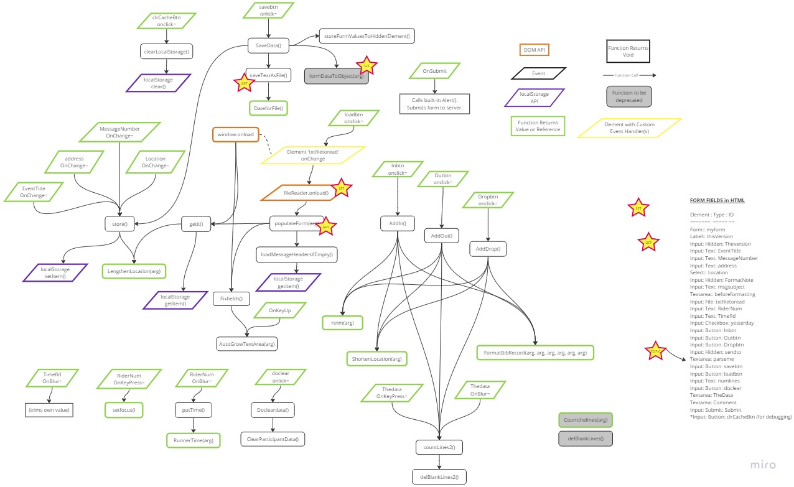
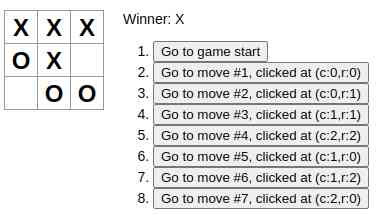

# Occasional Retrospective Notes

Semi-regular notes taken during my software developer journey.

## Monday 3-July-2023

Cleaned up documentation references in this repo - there were a few floating documents with no links to them so they were difficult to find.

## Sunday 2-July-2023

Updated my Create-Markdown-TOC VSCode extension to version 0.2.1 with bug fixes and an enhancement (based on the bug fix). The Visual Studio Marketplace page has some metrics on downloads and page views that might be worth watching as I continue to develop the extension. The automatic update was seamless and I verified functionality on a few files locally.

Takeaways:

- Continue following the Test-Driven-Development (TDD) process, it worked well for this project to squash bugs and implement the feature more fully.
- Ensure the package.json has the version listed in it, which allows `vsce publish` to package and publish the correct version to the marketplace.
- Using the changelog file is a little tedious but it is a good way to track changes and to ensure the version number is updated.

## Thursday 29-June-2023

Learned something about CSS, by accident, while looking at a fun project at [github.com/jdan/98.css](https://github.com/jdan/98.css):

- The horizontal run `<hr />` by default appears as a single line across the width of it parent container.
- Not only can the width of the `<hr />` be set, but also the height. This effectively makes a box outline.
- Basically, borders are the way to style the `<hr />` element.

```css
/* just showing some styling possibilities */
hr {
  height: 0.5rem;
  width: 90%;
  text-decoration: none;
  border-top: 1px dashed rgb(0, 0, 0);
  border-bottom: 2px solid rgb(255, 0, 0);
  border-left: none;
  border-right: none;
}
```

## Wednesday 28-June-2023

Last night I finished implementing some fixes to my create-markdown-toc VS Code Extension. The bug was related to how the extension handled unsupported characters in link fragments. The result of the bug was a linter warning that (in most cases) would be easy to fix by hand. Since the extension creates the entries that should be legitimate but aren't, it's a bug. The solution uses `string.replaceAll(/regex/)` to find a list of unwanted characters from the captured heading's "title text", and replace them with nothing (remove them). The result is a link fragment that is more likely to work as expected. I added unit tests to support the new code and am working on some manual-test scenarios to further test the code before publishing the update to the VS Code Marketplace.

GitHub Copilot has been helpful. I've learned how to prompt it to generate better suggestions. Microsoft Build had a session discussing how to leverage GitHub Copilot, and it turns out I was using some of those techniques already.

## Tuesday 27-June-2023

Refined a bug description in project markdown-toc: This markdown file contains L2 headings that include a dash `-` character in the name. My code generates fragmented links for these headings. An Issue is already in the project and is capturing problem experiences so that I can generate a list of test cases to use when I get to fixing the bug.

I worked through a new code challenge and learned a few things, and then updated code and tests to a previous challenge due to lack of code coverage that I hadn't noticed before:

- Blind spot: I need to remember to review my written code immediately after writing it to remove code that is not needed. For example, I wrote a block of code that checked for a condition, and then after a (rather long) for loop I wrote code that did the same check. This resulted in a lowered code coverage score.
- Blind spot: In the subsection of code where an if statement returns false if any sub-array size is less than 9, I failed to check for a sub-array size _greater than_ 9. To ensure catching either case, the correct test is `if (thisSubArr != 0) {...}` instead of `if (thisSubArr < 9) {...}`.
- EditorConfig: Somehow I didn't know (or forgot) that `.editorconfig` works to enforce linting on the encompassing project, and can target specific files and file types. Updating this in the `js-code-challenges` simplifies execution of Prettier without having to battle with VS Code settings or `ESLint` settings.
- Because my `yaml` workflow asks to lint files on merge or push, I still have to retain the `.eslintrc.json` but I could simplify it a bit by removing items that the `.editorconfig` file will handle. Perhaps this is still duplicating effort? I'll figure that out some time.
- Arrays and Maps have different properties. This is somewhat obvious: Maps have a `.size` property (like Java), and Arrays have a `.length` property.
- The `package.json` file was targeting dependencies that were out of date. I removed the existing `node_modules` folder, then uninstalled and reinstalled the dependencies to ensure they would be to the latest versions.
- Also, `package.json` has a schema (of course) that I'd _never looked at before_. Today I did and learned that I should be using a few settings like `private` and `repository {type, url}`. Also, there is not only an `author` (a person) but also `contributors` (collection of people). `name`, `email`, and `url` are Person properties that I should be including.
- Lastly, I tried using `chai` and it wasn't too difficult. There is some syntax that I would need to learn (or get used to looking up) that make it different than Jest, but overall is a viable option. I'm not sure what the benefit of using one over another is, but I'll figure it out some day.

```javascript
// fast fail if any zeroes are detected or if size of a row is not equal to 9
if (rowMap.size != 9 || rowMap.has(0)) {
  return false;
}

// later on...
if (thisCol.size < 9) {
  // not as precise as the previous if statement and is never true if the previous is true
  return false;
}
```

## Monday 26-June-2023

Posted an update to LinkedIn about completion of my VS Code extension create-markdown-toc. I added a short description and a few in-action screen shots. As I complete other projects I look forward to doing the same.

Looking at an older team project - EZ-PC-Shopper:

- I realize just how much I have learned about HTML, CSS, and JavaScript.
- The website leaves a lot to be desired (like figuring out to click the image of the item to edit in the shopping cart).
- However, many aspects of the project were new to ALL of us on the team and we powered through and presented it with smiles and sales-pitchey delivery. :smiley:

Some code snippets I developed these last few days working on the Winlink Form project:

- Use of media queries! Scales the font size and some element sizes depending on the detected size of the viewport.
- Centering items without using 'flexbox' or 'float' for extended browser compatibility.
- Identifying a read-only text input `<input type='text' class='readOnlyText' readonly />` to be different than regular (read + write) text inputs, providing a hint of alternate functionality. A user can still select and copy the generated text from the readonly text input without accidentally editing or deleting it.
- Providing hints that an input is currently selected and can be clicked and used, through border alterations and cursor changes.
- Code Fellows taught me to how to plan the layout of a page using HTML elements, and then apply CSS for the desired look and feel. This training helped me to arrange `<div>` elements in conjunction with CSS to help move elements around when the viewport size changes. This may seem like simple stuff to experienced JS developers, but it is a big win for me.
- Simplifying use of Local Storage API. The API itself is fairly simple, but the Winlink Form code was a bit convoluted and unnecessarily complex. By simplifying the code to simply add values from existing elements to a JSON object and then storing it (or, for the converse action, loading the JSON object from Local Storage and just reading-in values directly to the page elements) the code is much easier to read and troubleshoot.

Media queries to control font size and element size:

```css
@media screen and (width < 650px) {
  label,
  input,
  textarea,
  select,
  button {
    font-size: 0.7em;
  }
  input {
    margin: 0.2em 0.2em;
  }
  input[type='checkbox'] {
    width: 1em;
    height: 1em;
  }
  .formTitleHeader {
    font-size: 2em;
  }
  .msgHeaderTitle {
    font-size: 0.7em;
  }
  .addressInput {
    min-width: 70%;
  }
}

@media screen and (width >= 650px) {
  label,
  input,
  textarea,
  select,
  button {
    font-size: 1em;
  }
  input {
    margin: 0.3em 0.3em;
  }
  input[type='checkbox'] {
    width: 1.2em;
    height: 1.2em;
  }
  .formTitleHeader {
    font-size: 3em;
  }
  .msgHeaderTitle {
    font-size: 1.1em;
  }
  .addressInput {
    max-width: 55%;
  }
}
```

Centering elements without using flexbox or float:

```css
.div-across-auto-align {
  width: 100%;
  margin: auto;
  text-align: center;
}
```

Read only text input field decoration:

```css
.readOnlyText {
  color: rgb(84, 84, 84) !important;
  outline: none !important;
  cursor: default !important;
  opacity: unset !important;
}
```

Items that are hovered over change the cursor, opacity, and border style for visual feedback:

```css
input {
  padding: 0.2em 0.2em;
  border-radius: 0.5rem;
}
textarea,
select {
  padding: 0.3em 0.3em;
  border: rgb(0, 0, 0) solid 0.15em;
  border-radius: 0.5rem;
}
input:hover,
textarea:hover,
select:hover {
  cursor: pointer;
  opacity: 0.8;
}
```

An active element (clicked or tabbed-in to) border style changes for visual feedback:

```css
input {
  padding: 0.2em 0.2em;
  border-radius: 0.5rem;
}
textarea,
select {
  padding: 0.3em 0.3em;
  border: rgb(0, 0, 0) solid 0.15em;
  border-radius: 0.5rem;
}
input:focus,
textarea:focus,
select:focus {
  outline: rgb(255, 153, 0) solid 3px;
}
```

Simple local storage API usage:

```javascript
// store Form element values into localStorage
function storeElementValueToLocalStorage() {
  var addressFormatted = document.getElementById('address');
  localStorage.setItem('addressKey', addressFormatted.value);
}
// load values from localStorage and populate elements in a Form
function loadValueFromLocalStorage() {
  const storedAddress = localStorage.getItem('addressKey');
  if (document.getElementById('address').value == '' && storedAddress != '') {
    document.getElementById('address').value = storedAddress;
  }
}
```

Use of JSON Stringify to store multiple values into a single element value:

```javascript
// this is useful for storing values destined
// for localStorage or for saving to a file
function captureValuesToHiddenElement() {
  // call this function prior to saving data to a file
  const address = document.getElementById('address').value;
  const Location = document.getElementById('location').value;
  const message = document.getElementById('message').value;
  const formObject = JSON.stringify({
    address,
    location,
    message,
  });
  // when the saveToFile function is called it will save
  // the values stored in hiddenData element to a file
  document.getElementById('hiddenData').value = formObject;
}
```

There is plenty more work to do with this project, but that will wait until after some of the intended users have a chance to use the latest update and provide some feedback.

## Sunday 25-June-2023

Continued efforts with the Winlink Form have paid off. The form now features:

- High contrast color palette.
- Responsive design supporting both large and small viewports.
- Use of labels and `for` attributes to improve accessibility (Lighthouse Score: 100).
- Fixed LocalStorage issues with capturing and storing data.
- Fixed File Save and Load operations by implementing JSON format commpletely.

One note about responsive design: I tried to keep all API usages compatible all the way back to Windows 7-era browsers, but have not tested outside of Chrome, Edge, and Firefox, so there is a possibility that Opera, Safari, or phone-based browsers won't see the benefits of these efforts. This is a low-risk situation because Winlink Express requires Windows 7 and newer, and most smart phones support Chrome or Firefox at a reasonable API level. I'm not sure about Opera or Safari, I guess I'll find out one way or another.

Major wins this week:

- Use of Media Queries to implement responsive design. I've known about this for over a year now, but have not decided to work with it directly until now.
- Diagramming code functions that someone else wrote, to learn the code and to enable faster, more effective refactoring and debugging (see image below).



## Saturday 24-June-2023

Diagramming software is pretty fun, and very helpful. Looking at the functions listed in the Bigfoot Winlink Form, it is hard to trace the paths and where the paths split, and which functions return anything, or affect the UI in some way. The diagram documented the following key components:

- Function name and whether it returned anything, and an arrow to any other function it called.
- Events that are triggered by the API (focus, blur, etc) and those triggered by the user (click) and one that is triggered by another event handler (change).
- Built-in API functions that are called by the event handlers and other functions such as LocalStorage, FileReader, and the Windown object.

I discovered several things while developing the diagram:

- The HTML element 'textarea' is _not_ an input element. It is a container element that can contain text, and it can be used to input text, but it is not an input element.
- Most of the input elements on the form are of type 'text' and 'button' (not surprising).
- There are two 'hidden' type elements that are used to store data for save and load functionality (which is weird considering LocalStorage is used -- partially).

## Friday 23-June-2023

Exploring use of FileReader, setting element values, and saving/loading data to/from localStorage.

- Setting an Option element, selected property to true is more challenging than I anticipated. There are many ways to make the selection, and looking at [alvarotrigo.com](https://alvarotrigo.com/blog/javascript-select-option/) some methods to do it aren't possible depending on whether multiple selections are allowed. In the end I impelmented a comparison that returned the index of the selected option, and then set the `selected` property on that indexed option attribute to `true`.
- If a user changes the selected option, and then the saved file data is reloaded, the selected option will not be updated. I'm not sure exactly why this happens, but I suspect it has to do with a lack of event handling.
- Saving and loading files is a little tricky as well. Prepare a sensible file format early on that is easily traversable. Ensure it is also portable between [Web API Blob](https://developer.mozilla.org/en-US/docs/Web/API/Blob) and your HTML Form or data.
- In some situations it might appear to make sense to store all data entered into a `textarea` element, but in the case of the Bigfoot Winlink form, it is better to _not_ maintain the location suffix with the rest of the bib records and instead just append that data when writing back to the server.

I have some work to do to figure out how to get that last bullet point solved. Although it seems simple, the challenge is going to be how to solve it _on the existing form_ without undesireable, unanticipated side effects. This could take a few days to solve completely, but I feel like I'm getting close to a solution.

## Thursday 22-June-2023

Continued efforts cleaning up the Bigfoot Winlink form:

- Lots of code that just doesn't do anything.
- Rewrote the help text so it applies to the form as it is intended to be operated.
- Debugging issues with saving and loading data provided me with an excuse to write a test SPA with a Form so I can experiment with using LocalStorage and interacting with Files.

Working with the Home Sales Tracker Example app, in an attempt to get video and screen shots of it in operation, I ran into some bugs:

- In the past I was not aware of how to deal with null objects.
- Returning a null object when a concrete instance was expected causes the application to throw an Exception (understandable).
- In the past year and a half I have picked up enough experience to work through that type of situation (or avoid making it happen in the first place), which is a true sign of moving forward! :clap: :clap:

## Wednesday 21-June-2023

Happy Summer Solstice!

In an effort to add more completed projects to my portfolio, I started working on upgrading Home Sales Tracker App (from 2019 - 2021) from DotNET Framework 4.7 to DotNET 6. Here are some takeaways:

1. Use Visual Studio 2022, not VSCode (even with the VS Solutions Extension it is more complicated in VSCode).
2. Ensure dependencies are installed after cloning (i.e. SQL Server).
3. Ensure the correct Project is set as Startup and then do a Build on the Solution.
4. Install DotNET Upgrade Assistant using the Extensions Manager is VS 2022.
5. Diagram the Solution into a dependency tree to identify leaf Projects, and to find other dependancies and supporting files.
6. Run the DotNET Upgrade Assistant on the leaf-node projects first, and then clean the build for that Project, then run Build on the Project. Solve any issues.
7. Repeat step 6 for the remaining leaf project.
8. Repeat step 6 for the remaining parent project(s) up to the last, most-common/root project.
9. Update or add NuGet package Microsoft Extension Configuration to use `appsettings.json`, in place of `App.config` files.

There could be some errors along the way:

- When using a SQL DB there will be a Connection String dependency somewhere.
- A unit test project might not have access to a database whose connection string is stored in another project such as a Data Access library. Upgrading and building that depenedant project will be necessary before running tests.
- DotNET Targeting might not be compatible with the new SDK "way" of targeting in the Project file(s).
- If a Project won't build (like a Test Project) it could be because another Project has not been cleaned and built, or there are still problems that need to be resolved before it will build successfully. This is because the Build process outputs binaries (dll files)

The following will cause an error when building a WPF project:

```xml
<Project Sdk="Microsoft.NET.Sdk">
  <PropertyGroup>
    <TargetFramework>net6.0</TargetFramework>
  </PropertyGroup>
</Project>
```

The solution is to target DotNET 6 using `-windows` as a suffix:

```xml
<Project Sdk="Microsoft.NET.Sdk">
  <PropertyGroup>
    <TargetFramework>net6.0-windows</TargetFramework>
  </PropertyGroup>
</Project>
```

I made some other notes in [dotnetconf-2022](./dotnetconf-2022.html) with some added reference links.

Also GH Copilot Extension exists for VS 2022! Will have to investigate other Extensions as well.

## Tuesday 20-June-2023

Updated my Portfolio project today and started to figure out how a few more code blocks work.

- Themes: The basic gist is an alternate set of SCSS definitions get applied based on whether a bit is set (true) or unset (false) in the DOM 'body' element. I didn't look closely enough to verify this, but it seems like child Components, when loaded, can be passed props so they 'know' which theme is selected, and the SCSS properties simply override default settings, or otherwise defined settings.
- Displaying DevIcons in React can be done via the minified CSS file (see below).
- The 'spinning icon' feature does not appear to be working (which is okay) but I am curious as to why it fails to spin. I don't intend to implement that now, because I've replaced the laptop icon with my mugshot in front of my computer desk.

DevIcons in React - options:

- Usually, adding an icon will not require much adjustment unless the icon doesn't have contrasting colors to the page it's on.
- In React, one way to add files is directly through imports at the top of the component that needs to display them. This is not particularly dynamic.
- In HTML5, a Link element rel stylesheet, href to a minified DevIcon css file allows calling the icons directly in the body of the HTML like `class='deficon-vscode-plain colored'`.
- So one solution is to add an import statement to the SCSS file like `@import url('https://cdn.jsdelivr.net/gh/devicons/devicon@v2.15.1/devicon.min.css');` which enables settings the 'class' attribute with multiple values like 'colored'.

It occurred to me that one of the issues with the Bigfoot Winlink Form is it is not obvious which element is currently selected, especially while 'tabbing around' the form. A solution could be to apply a 'box-shadow' to the element types that need to be highlighted when they have focus.

```css
input:focus {
  background-color: rgba(200, 200, 200, 0.2);
  box-shadow: 2px 2px 10px rgba(16, 194, 45, 0.7), -2px -2px 10px rgba(16, 194, 45, 0.7);
}
```

Other input types can be targeted with this pseudo-class, including `select:focus`, `text:focus`, and `textarea:focus`. The downside is the solution is 'heavy handed' in that every single element targeted gets this background-color and box-shadow. Another approach is to leverage `onfocus` and `onblur` events on the specific elements themselves:

```html
<input
  title="Send your responses to the survey."
  class="submitButton"
  enctype="multipart/form-data"
  id="submit"
  method="Post"
  name="submit"
  value="SUBMIT"
  type="submit"
  onfocus="style.boxShadow='2px 2px 10px rgba(16, 194, 45, 0.7), -2px -2px 10px rgba(16, 194, 45, 0.7)'"
  onblur="style.boxShadow='0px 0px 0px rgba(0, 0, 0, 0.0), 0px 0px 0px rgba(0, 0, 0, 0.0)'"
/>
```

## Monday 19-June-2023

Webpage design learnings and takeaways:

- In the Events system `event.keyCode` is deprecated: Instead, use `event.code` and use `Key_` where the underscore represents the key, for example: `if (event.code == KeyL) { // returns true if key 'N' is pressed }`.
- Utilize `window.onLoad()` method to make set calls on DOM elements.
- There are cases where setting a Style property directly on elements makes more sense than developing a CSS class. One of them is while testing. Another case is if there are just a few elements that need some minor adjustments or specialized adjustments (i.e. an event-driven style change).

## Sunday 18-June-2023

Webpage design thoughts:

- Layout: ebsite design and look rely on layout. Layout design is critical in how inner elements are nested and the impacts that might have on event bubbling.
- Styling: A well designed, attractive styling will help bring viewers to a website and keep them. It can be a real bear to maintain a website with styling that is not well thought out, with poor choises of class names and use of deprecated style properties.
- Responsive style: Using 'px' instead of other relative units when defining style properties can risk reducing website responsiveness to different view ports and devices.

## Friday 16-June-2023

VSCode API: The TextDocument interface `lineAt()` function defines 2 overloads:

- LineAt(position: Position): Returns a TextLine
- LineAt(position: Position): Returns a number

The TextLine interface defines `lineNumber` (a Number primitive) but does not differentiate between what I would expect to be "Line Numbers" in a text document, and the zero-based numbering system for a structure like a Collection. So, when processing a TextDocument Type, be careful with handling line numbers to avoid unexpected results.

## Thursday 15-June-2023

Took some time out this morning to help a fellow ham with some email-over-ham technology setup steps. He was close, and together we got the configuration squared away.

## Wednesday 14-June-2023

Worked on building out tests to increase code coverage to the remaining two functions in my VS Code Extension.

Lots of effort put into preparing for various upcoming events, including an all volunteer meeting tonight that included a presentation I was pegged to deliver on the agenda.

## Tuesday 13-June-2023

Completed a code challenge: Sum rows and columns from a 2D Array of Numbers. Key takeaways:

- Within an algorithm, avoid hard-coding input array or collection length (size). Instead, use methods to get the length of the input array, and apply the return value to iterators, indexers, etc.
- 2D Arrays are not always symmetric. Jagged arrays have unequal row and/or column lengths.
- JavaScript Arrays may not handle empty elements the way I expect them to, so 'undefined' or 'NaN' may be returned. See previous bullet point.
- Using indexing to get and set values in a JavaScript Array is effective.
- Leveraging built-in functions can drastically alter the algorithmic performance, example: `const arr = new Array(100).fill(0)` is an iterating structure and counts toward Big O calculations.
- Collapsing summing operations within a for loop reduces the number of variables to track within an algorithm.
- Creating an Object with Array fields in JavaScript is easy: `const result = { rowSum: [], colSum: [], }`.

Watched a presentation about Azure Bicep:

- Is yet another markup language similar to YAML used to define Azure Containers.
- Container environment(s) can be applied to Kubernetes.
- Local dev-test environment configuration via Bicep is possible.
- Azure Bicep is seeing relatively active development in [GitHub](https://github.com/Azure/bicep).

Worked through some preparatory work to get my VS Code Extension published. While I could have just published it the way it is, I decided to continue working on the last few unit tests to get better code coverage. Some key takeaways:

- The vscode module is available during testing!
- The templated Mocha test harness is set up to run a full GUI version of VSCode and I need to sort out how to work with documents in that scenario.
- I probably won't need Jest for the custom module file unit tests, and can stick with Mocha instead after I read up a little and get used to it.

## Monday 12-June-2023

Was introduced to [JSDoc](https://jsdoc.app/) this morning while listening to the Syntax Podcast. Historically I think I've done a pretty okay documenting my code. In some instances it hasn't happened until after the implementations (and maybe even testing) are completed. Turns out, my default mode of documenting seems to be compatible with JSDoc `/** This function returns ~something~ */` so if/when I decide to use JSDoc it should be pretty simple getting going.

```javascript
/**
 * Find the first occurrence of a second level heading in the document.
 * @returns Number The line number of the first 2nd Level Heading of the page.
 * @param {vscode.TextEditor} editor The active text editor.
 */
module.exports = function findFirstSecondLevelHeading(editor, topHeading) { ... }
```

Key Takeaways Using Jest:

- If a test _should_ be passing (console logs etc show correct, matching output of sut), go to [JestJS.io Documentation](https://jestjs.io/docs/using-matchers) and confirm the correct _Matcher_ is being used. For example: Strings are matched using `.toMatch()` and `.not.toMatch()`, whereas Numbers are matched using `toBe()`, `toEqual()`, `toBeCloseTo()` (etc).
- Leverage node module 'path' to help locate files for running unit tests. For example: Tests that import modules across a separate directory branch can try `const rootDir = path.resolve(__dirname, '../../sut-functions');` and similar to help simplify traversing the directory tree.

Have to remember that Linux and Windows "slash" characters are different. For example:

- Linux: `/`
- Windows: `\`
- Node.js: `/`
- Developing Node.js on Windows: `/`

Fun.

VS Code Extension development status:

- YAML file activation GH Action to ensure unit tests run on push.
- README getting close to finished.
- Implemented code is working in expected cases.
- Opened an Issue on GitHub to start tracking items.
- Completed full manual testing and testing using Mocha and Electron.

There are several more steps to take before publishing. It is getting close!

## Thursday 8-June-2023

Focused on learning VSCode Extensions. I have a working idea for an MVP and am currently working on unit tests, documentation, and meeting VSCode Extension standards. :tada: :smiley:

## Tuesday 6-June-2023

Caught up on VSCode happenings with an episode of VSCode Day from earlier this year. Appended some notes from this session to the [github-copilot](./github-copilot.html) from a few weeks ago.

Started reading up on VSCode Extensions, and worked on developing an idea.

## Monday 5-June-2023

Completed a personal challenge: Update the Quicksort algorithm to accept any Number types, or other Types that implement `Comparable<T>`. Final code can be found in [java-code-challenges, Quicksort.java](https://github.com/nojronatron/java-code-challenges/blob/main/lib/src/main/java/myJava/code/Sorters/Quicksort.java).

## Saturday 3-June-2023

Spent 4 hours this morning at a volunteer event in Kenmore, which was a good experience overall. Beautiful day for an outdoor activity!

Researched WPF Controls and connected aspects, looking to find a solution to the Issue discussed yesterday. Not sure if my solution will meet the Issue (because the description is a little ambiguous), but I'll see how I feel after attempting to address it, and decide from there what to do.

## Friday 2-June-2023

Worked through a code challenge in JavaScript, sourced from CodeWars. Took about 2 hours to do everything except for actual code, and about an hour to implement code and unit tests, and perform debugging (majority of the debugging was of the unit tests, not the implemented code).

Took some time out to look at some MSFT open-source code (C#). It was interesting trying to piece together a large, multi-project solution I hadn't seen before. Drilling-down into a posted GitHub Issue in the project, I found the area that would need the fix, and started on a quest to re-learn the components that are necessary to adjust in order to address the Issue.

## Thursday 1-June-2023

While working through Portfolio project tasks, I found the templated code used JavaScript 'var' to initialize a new variable. It was assigned within an `if` statement code block, and was later used in the contianing function, appearing to be referenced before being declared. In C# and Java, var is used to limit the typing necessary to instantiate something that is otherwise obviously a specific Type. For example `var newNode = new MyLLNode<Integer>(some_value);`. In JavaScript, `var` is used to create and assign a variable that is scoped to the containing method (or globally if not in a nested function). This feature is allowed due to `var hoisting`, which causes var declarations to be processed before other variables. The result is the variable is effectively assigned at the top of the function. [MDN Var Statement](https://developer.mozilla.org/en-US/docs/Web/JavaScript/Reference/Statements/var). Next time I dive into that code I'll leverage this capability, and undo some of the code I added prior to understanding how to properly use the var statement.

Had a phone conversation with another software developer, Ken, about the C# language. Was great to meet him, geek out on programming languages, and share some empathy around the challenges of learning syntax, patterns, and frameworks.

## Wednesday 31-May-2023

Learned a little about integrating Chat GPT into applications, and some of the issues with securing an LLM Prompt.

Was able to finish configuring a Raspberry Pi security camera for watching the yard. There is some tweaking to do but it is ready for deployment, later today. The problem with focus was due to the manually adjustable lens. Simply turning it clockwise or counter-clockwise (slowly) adjusts the focal length.

Started refactoring the Portfolio project to better handle skills icons and simplifying code. My first attempt was changing too many ui and data elements, which broke rendering completely.

## Tuesday 30-May-2023

Lots of administrative stuff to do today, including volunteer-related emails, research, and preparations. The Ride Around Mt. Rainier in One Day (RAMROD) communcations team was looking for help so I signed up for that event, in the latter half of July.

Completed initial setup of a Raspberry Pi-based motion-sensing, streaming camera. It was a bit of a pain to set up, but I finally got it going. The video quality is quite low and appears to be completely out of focus. I'l have to do a bit more testing, with the camera set up to view items farther than just a few feet to confirm this is a known issue with some Pi Cams that set the focal distance to something less than infinite.

## Monday 29-May-2023

My Portfolio project React App was using something in SCSS called 'transparentize'. It was used to adjust the opaqueness of the background color of icons. Although it did the job I decided to change it to RGBA instead. Transparentize accepted hex values for color, and RGBA uses integers 0-254 for each color channel, and a decimal representing alpha from 0 to 1. I had not used these styling techniques before and they worked well.

Next time I decide to use DevIcons or Iconify, I need to use Iconify's [search tool](https://icon-sets.iconify.design/) to get me started. Iconify has DevIcon sets within its massive store of icons, and the search tools has code in the search results for implementing in HTML, React, etc.

## Sunday 28-May-2023

Deployed LBJS API using a YAML file! Assigned the task to a specific branch (not main) so that deployments would be managed with specific PRs. One issue is there are no tests yet, and that should really be part of the pipeline operations.

## Saturday 27-May-2023

Completed implementing an Express server with Jest tests and GitHub Action that builds, tests, and deploys the server to Azure App Service. Next step is to apply what I've learned to LingoBingo API server so that tests can be implemented and deployment will be automatic. :tada:

## Friday 26-May-2023

Spent the day working on odds and ends.

- Updated LingoBingo with some style to the Login and Logout buttons, and reset their locations so they look like they belong.
- Took screen shots of LingoBingo in its current form, operating the Presenters Page, creating a Bingoboard, etc to add to my Portfolio site.
- Researched [MongoDB topics](../code301-files/mongo-and-mongoose.html) to complete a long-running, 20-ish item training task re: MongoDB topics.
- Moved Bigfoot Bib Report Form deployment to Netlify, created a link to the Form itself, and emailed the core team with the latest updates. Still a few months away from the actual event, but I expect things to ramp-up a bit in the next 6-8 weeks.

## Thursday 25-May-2023

Did some cleanup of my [Bigfoot Bib Report Form repo](https://github.com/nojronatron/Bigfoot-Bib-Report-WL-Form), editing the README for clarity and to be up-to-date, removing an unused GH Action, updating the Packages to the latest version of HTML and TXT files, and deploying a [preview site to Netlify](https://enchanting-pony-09ae40.netlify.app/bigfoot-bib-report-initial) of what an end user would see when launched within Winlink Express.

Completed the [SQLBolt](https://www.sqlbolt.com) exercises to refresh my memory on using SQL Queries. Aside from all of the synax necessary to become proficient at CRUD, the exercises mentioned the order of operations within SQL Statements. In order they are:

1. FROM and JOIN clauses execute, usually creating a temporary table for the remaining operations to work on.
2. Where clause is executed, eliminating data that won't be included further into query execution.
3. Group By clause organizes the current result set based on the expression.
4. Having clause will execute if there was a Group By clause ahead of it, further reducing the dataset.
5. Select causes the dataset to retain only those columns identified in its clause, including Aggregate Functions and the Distinct keyword.
6. ORDER BY executes to further arrange data by columns, ascending or descending.
7. LIMIT (and OFFSET if included) retain the final output elements of the dataset.
8. The resulting view is returned.

Worked on a few issues with my [Portfolio Website Project](https://github.com/nojronatron/portfolio). Took a bit to warm-up to Bootstrap and in-line Styling. The major issue was alignment problems on the About page, and the minor issue was the About Me write-up. Both got attention and the webapp is now updated. Some things of note:

- `@iconify` is awesome! I utilized the imported iconify logos for now. In the future I'll want to try using the SVG files instead.
- Just because a webapp layout is a certain way doesn't mean it is right. Fixing some of the alignment issues in desktop and phone-sized viewports meant rearranging the layout a bit.
- Sometimes it is good to _remove css and bootstrap_ properties. Sometimes the properties don't do anything anyway, so removing them doesn't do any harm.
- The 'About' statement was a single-string entry in a JSON file. Because I write so much, the content was difficult to read in a single paragraph. Refactoring the JSON file to use an array of Strings, and then refactoring the code to `map()` over the description props, assigning JSX to the output in the iterations, made the paragraph layout a little easier to read.

## Wednesday 24-May-2023

Today is day 2 of Microsoft Build 2023. Key takeaways:

- DevHome is a Windows Store app that will help get a physical computer ready for developer productivity rapidly with common tools and custmizable, configurability.
- DSC: Desired State Configuration is not integrated into WinGet!
- Windows Terminal has been built-out to overlap Windows, PowerShell, and several flavors of Linux, and now includes customizations (backgrounds, colors, look-and-feel).
- MSFT Teams is becoming its own Ecosystem with commercial and custom apps, integration points, and Copilot plugins.
- Creating a plugin for Copilot is a 5-step process that enables the Copilot feature integration with a custom API endpoint.
- Microsoft 365 plugins can enable in-app as well as external-app capabilities.
- Microsoft Mesh is the new 'Metaverse', missing legs and all, that integrates with M365.
- Windows Copilot will be ready to Preview in June 2023.
- GitHub Copilot X for Windows Terminal can help orchestrate tasks and operations: Waitlisted, preview later this year.
- Getting started using AI is (surprisingly) easy when starting with Windows AI Libraries. More advanced integration points exist usingn ONINX Runtime and Olive Toolchain.
- Windows 11 OOBE (out of box experience) has been updated to include a 'Developer' setting to tweak performance settings and install DevHome and the new Winget, to shrink time between New Box to Productive Developer.
- Also check out [aka.ms/LearnAtBuild](https://aka.ms/LearnAtBuild)

I started using GitHub Copilot today. Often enough I waste a good amount of time flailing around trying to produce just the right syntax, or looking up details on the internet to get to a sensible, effective implementation. I should instead be making better use of my coding time by minimizing time-to-learn and finishing managable tasks within a reasonable timeframe.

1. There is a 30-day free trial, so why not?
2. GitHub Copilot is like pair-programming (which I enjoy) although probably not as cool as working with a real human.
3. I am not creating anything new. There is no IP in my code or apps. Everything I write more-or-less ends up on my publicly available GitHub anyway. And for those situations where my code needs to be private or ownership is involved, GH Copilot can be told to not use that code as part of its learning/context building feature.
4. My goals are to learn and build my skillset, and to start producing applications and services that achieve things.

Seems like the best place to start is to resolve some existing issues in one of my exploratory code repos on my local laptop:

- I had an issue in a Java ListIterator method that could not return what seemed like an appropriate `ListIterator<E>` instance. I removed the instance initializer and wrote a comments describing what was needed, just above the lines where the results were needed. Suggested code lines resolved the problem in devtime.
- I set a comment within a simple function to change the value stored within a LinkedList Node. GH Copilot returned exactly the correct code to implement the change.

## Tuesday 23-May-2023

Today is day 1 of Microsoft Build 2023. Key takeaways:

- ChatGPT and GPT-4 are the platform upon which developers can build custom services without having to know all of the details of AI, large Language Models, etc.
- GitHub Copilot Chat can help with reading YAML files.
- AI capabilities and performance are only as good as its data inputs.
- Azure Dev Environments and DevBox enable templated, self-service infrastructure for develop, test, review, and deploy code projects. Integrates with GitHub Actions and Git flow actions like Push and PR/Merge.
- PowerBI has ChatGTP integrations now, too. This will help with generating reports with tempated style and consistent chart types, without the hassle of Chart Wizards and property setting.
- Bing integration with ChatGPT, AI Safety, and Copilot integration with Windows, Microsoft 365, Azure, and more.
- Custom Copilots can be built. They are simply an API, running as a web service (perhaps in Azure), and so are easily extensible.
- Microsoft provides the _platform_ upon which developers will implement solutions based on AI and Language Learning Models.
- Microsoft made it very clear that trustworthy computing (and services) are key to enabling open development and utilization of the platform.

In between MSFT Build sessions, I worked on implementing AbstractSequentialList interface to a custom LinkedList class I recently created. Although the implementations aren't working yet, I learned a few things:

- Lists can be randomly accessed, or sequentially accessed. An ArrayList is the former type, and a LinkedList is the latter.
- In the context of a Singly-LinkedList, sequential access moving forward is relatively easy, moving backward is a bit more of a chore.
- I was able to create `@Override public Iterator<E> iterator()` method without much trouble. It contains `hasNext()`, `next()`, and `remove()` methods, and meets some interface implementation requirements. The rest of the requirements are hidden in `ListIterator<E>`.
- Java's Object Class has a default `hashMap()` function that is not guaranteed to produce unique hash codes (but is likely to due to sourcing hashmap from the memory location of the object) and can be relied on in most basic cases of needing a hashing function. Some cases will require overriding hashMap to include private field data that can uniquely identify an instance. This is not very different from C#.
- I'm starting to wonder if implementing ListIterator at the LinkedList class level is part of the problem. Does it need to be implemented at a wrapper-class level? ...Or at the Node level? TBD.

References for today:

- [Three Cursors in Java Collections (Medium.com)](https://abhimanyu081.medium.com/three-cursors-in-java-collections-c93f75f69b16)
- [Abstract Sequential List (Docs.Oracle.com)](https://docs.oracle.com/javase/7/docs/api/java/util/AbstractSequentialList.html)

## Monday 22-May-2023

Long volunteer weekend in Portland was fun, supporting the Multiple Sclerosis Society's Walk MS event. Great people, great cause.

Java Scanner class review key takeaways:

- A detailed, thorough discussion of Scanner can be found at [Oracle Java Docs - Scanner](https://docs.oracle.com/javase/8/docs/api/java/util/Scanner.html)
- Scanner parses primitive types and strings using regular expressions.
- Supply Scanner with an 'input stream' type such as `FileInputStream`.
- If using FileInputStream, remember to add checked `IOException`.
- Always close scanner when done using it e.g. `scanner.close()`.
- Scanner's `.close()` method _closes the source too_, which will affect other instances of Scanner.
- Reading 'tokenized' data is performed with `scanner.next()`.
- Scanner has a regex method `.useDelimiter(string regex)` that works as expected. The default delimiter is an empty String. Multiple delimiters can be used in _regex_ as a single string token.
- If a match is not found, throw (or catch) `NoSuchElementException`.
- Scanner method `nextLine()` reads the entire line into a processable token.
- To avoid missing input data from an ignored LF/CRLS, use `nextLine()` an additional time, or use `scanner.skip("\r\n")` to force Scanner to move past New Line character(s).
- Generally speaking, use `BufferedReader` to process lines from a file, instead of `scanner.nextLine()`.
- Capture input from the console: `new Scanner(System.in)`: Accepts a `ByteArrayInputStream` (as an `InputStream`).
- Review my notes on [Java Streams](./java-io-data-object-streams.html) and [Baeldung.com](https://www.baeldung.com/java-scanner) for details.
- Use `.next()`, `.nextInt()`, and `.nextDouble()` to identify tokens as those types natively. These are basically conversion methods with specific output types: string, int, and double, respectively.
- To search for a pattern use `.findInLine(string regex)` and the matched token will be returned. To search a wider scope use `.findWithinHorizon(string regex, int count)` to define the domain/boundary of the search.

Rummaging through Java Collections library I discovered a few handy things:

- Types that implement the List Interface can leverage the List Factory method `List.of()` in the constructor.
- Certain Collection member types differentiate between returning Null, False, or throwing an Exception. This is because some implementations do not allow storing Null elements within the list type. For example, it is probably better to throw a `NullPointerException` or `false` when an element doesn't exist, versus returning `null` in the same situation.
- Use Abstract Types over Concrete Types to make methods flexible. Return type should be `Collection` for any collection types, and if the method accepts a parameter that could be an `ArrayList<E>` or `LinkedList<E>`, then set the parameter as a `List<E>` Interface type.
- Similar to the previous point, avoid returning `null` when a method returns a Collection Type (or Interface), instead return an empty collection.

Using the List Interface Factory Method in a Constructor:

```java
List<String> testLL = new LinkedList<>(List.of("alpha", "bravo", "charlie"));
```

As I experimented with Java based on inspiration from the above readings, I felt like I needed to review [java collections and generics best practices](codejava.net/java-core/collections/18-java-collections-and-generics-best-practices). This led me back to some Java code examples I wrote while configuring VSCode for Java several weeks ago. Collections in Java include various types of Lists and Maps, and the supporting interfaces help drive functionality implementation and inherited capabilities. Turns out writing a custom LinkedList (or other collection type) class can be assisted by extending `AbstractSequentialList` and other interfaces from the Java Collections library. I spent a few hours refactoring existing code into a Collections-extended, custom LinkedList class.

## Thursday 18-May-2023

VS Code's twitter account linked to a VSCode YouTube Channel event featuring Dan Shiffman (@shiffman) discussing [p5js usage in VSCode](./coding-with-p5.html). It was inspiring and lots of fun.

## Wednesday 17-May-2023

Decided to create a [DSA note taking page](./dsa-notes.html) to track experiences and references so I can refer to those separately from the java-code-challenges or other repositories.

## Tuesday 16-May-2023

It's concerning to start the day opening an existing (last-known good/functioning) java project in VSCode and it logs errors on imports stating source cannot be found. Opening the Gradle Extension and clicking "Reload All Gradle Projects" solves the problem. :tada:

Working through Quicksort one last time. I was still confused about how exactly the algorithm does what it does, and would get stuck with certain test cases failing due to duplicates in the array, or ending up not-sorted or endlessly sorting. For those cases that ended up not-sorted/endless, stepping through the code in debug mode showed that the algorithm _would_ sort the array, but the stop conditions were not correct to _keep it sorted_ and the algorithm would then un-sort the array, putting it into a state that further recursive calls would never be able to sort because there would be out-of-scope values that are out of order.

## Monday 15-May-2023

Posh-Git:

- Quote types matter when configuring `$GitPromptSettings` properties. Open a quoted output with single quote `'`, use double-quotes for inner quotations `"`.
- The Profile settings for powershell are stored in several places, but the one that impacts Post-Git for the current user is in '$env:homepath\Documents\PowerShell\profile.ps1'

Portfolio:

- Writing an effective and concise About statement takes some crafting.
- Need to go back to my CF notes and follow that advice to avoid complexity or extended length.

Code Challenge:

- Started attempt #3 at solving Quicksort.
- Whiteboarding was not too difficult, and I was able to come up with a solution that the step-through indicates will work.
- If I can't get it this time, I'll have to look it up and study the solution closely to understand what is going on.

## Wednesday 10-May-2023

Added a GH Repo for a small project I started working on back in November. Updated the old default branch to 'main' (surprisingly easy). Added GH Actions to build and test, and enforce PR and Status checks prior to merging to main.

Got a little off-track setting up my local for more work with CoordinateConversionUtility and changed-up the Posh-Git prompt:

- `$GitPromptSettings`: Display all settings.
- `$GitPromptSettings.DefaultPromptAbbreviatedHomeDirectory = $true`: Yay a tilde!
- Store the settings you want to keep for future PowerShell instances by adding the command(s) to profile.ps1, after the line that imports posh-git.

PowerShell has its own prompt settings:

- `$(Get-Command Prompt)` [Powershell 7.3.x Documentation](https://learn.microsoft.com/en-us/powershell/module/microsoft.powershell.core/about/about_prompts?view=powershell-7.3)
- For example, to reduce the prompt down to the last folder name in your path set up a Prompt function and add `'$($(Get-PromptPath).Split("\")[-1])'`. Mmm, nested commands.

## Tuesday 9-May-2023

JavaScript. So useful and at times so elusive. I completed a basic JS challenge within 45 minutes following the full CF rubrick, and the only hang-up was with validating JS built-in types. Key takeaways:

- In JS, the Number built-in Object represents floating-point numbers and it has a constructor that _could_ be used but MDN recommends it should rarely be used.
- When working with number-like inputs, watch out for potential divide-by-zero, min-val, and max-val situations.
- Number properties include: `.NaN` which is unique to JS (arguably Python), and `.MAX_VALUE` and `.MIN_VALUE`, which are similar to Integer properties in Java.
- Testing for an object type in JS can be done using 'typeof' within a conditional statement: `if (inputVar typeof === 'string'){...}`.
- Confusingly, JS returns a string name for built-in objects like Number as 'number', not 'Number'. Gets me just about every time.
- In a strongly-typed language (Java, C#, etc) ways to test are to use getClass(): `if (inputVar.getClass() == Integer.class){...}`.
- Another example from Java: `if (inputVar instanceOf ParentClass){...}`. This is particularly useful when working with polymorphism.
- Boolean checks can usually be consolidated into single-line statements, and perhaps as part of a return statement (see below).

```javascript
// multiline boolean return (simple example)
const bool1 = input1 % 2 === 0;
const bool2 = input2 % 2 === 0;
return bool1 !== boo2;
```

```javascript
// single line boolean return from above example
return input1 % 2 !== input2 % 2;
```

Took a few side-trips:

- Reviewed Microsoft Reactor series Introduction to ML for Beginners. Good stuff. Make me want to write some Python code.
- Found 2 more job opportunities that were interesting, although location was an issue for one, and the other was a very marketing-centric Web Dev position, which might not be a great fit for me.

Back to preparing Coordinate Conversion Utility for MPV demonstrating:

- `dotnet test` and `dotnet test {path-to-unittest-csproj} --configuration release` both execute and pass.
- VSCode 'Testing' plugin does not find tests.
- If necessary, use `dotnet new console --framework net6.0 --use-program-main` and take a peek at `.\vscode\launch.json` configurations[] and `.\vscode\tasks.json` tasks[].
- VSCode Extension vscode-solution-explorer (Fernando Escolar) was helpful in finding and verifying dependencies and packages. In the Unittest Project Packages node, ensure MSTest.TestFramework, MSTest.TestAdapter, and Microsoft.NET.Test.Sdk are all up-to-date. This will update unittest assets and package references to support testing in VSCode.
- Test Runner (the flask) seemed to lock up and sometimes throw "cannot read properties of undefined (reading 'id')" when searching for tests. Updating the Nunit Test Runner Project Patterns to include the unittests.dll file didn't help. Turns out _uninstalling the Nunit Test Runner_ (by Forms) and installing '.NET Core Test Explorer' (Jun Han) fixed the problem. Unit Tests can now be executed by the Test Runner. This gives me confidence I will be able to set up GH Actions to automate testing so I can start patching the code for release to DotNET 6. Note: Net Core Test Explorer is a bit old so it could become a problem in the near future.
- The Coordinate Converter Utility project is old enough that it had the old default branch name. It is not difficult to rename the default branch. The trouble might come when contributors don't update their locals, so I added a file to remind them (me actually) to fix-up my local Git environment before working on it.

## Monday 8-May-2023

Worked on some presentation materials for a volunteer meeting on Wednesday night. It's always a time sink _but_ it forces me to organize my thoughts, and generate plans for the future of the organization, and for myself.

Worked through some reading and research on Java Streams API and functional interfaces.

Researched a potential employer (they don't appear to be hiring). Web-design consultancy in Seattle. Very small team, supports websites of at least one local event in my area. Turns out they use Wordpress site development, so my interest has waned somewhat. They have a good sales pitch describing who they are, what they do, and why. It was inspiring.

## Sunday 7-May-2023

Worked on LingoBingo quite a bit, getting the code ready for cloud-hosted deployments. This is much more tricky than I anticipated:

- It is easy to overload a useEffect child function to do more work than might be necessary. This can easily lead to multiple requests being sent to the back-end API when only a single is necessary.
- When Axios get a non-200 level response code, it calls `.catch()` so there is no need to test for status codes. :smiley:
- React documentation mentioned use of a conditional to stop useEffect from running fully twice while in test mode, so I implemented that and it works (of course).
- Sometimes conditionals (in a useEffect) really _don't_ need to update items in `useState`. For example, it might not be a good idea to update `useState` with nulls and empty strings in an `else` statement, otherwise that forces a refresh that really isn't necessary.
- I am good at writing too much code to do simple things. It is totally great that I thought through using cache and cookies and all of that stuff, but I should have concentrated on authentication on the front end much earlier, as well as authorization and use of middleware on the backend much earlier in the design process. What happened was some of the functionality I assumed was necessary really wan't, and in fact did not provide the necessary capability. This made debugging more difficult because it became a refactoring _and_ debugging festival.
- Netlify has a 'branch deploy' feature that is super-handy for testing new webapp features and functionality while allowing the main deployed webapp to run untouched. It really paid off to have a separate GitHub branch for branch-deploy to use!

It is pretty clear that one of my lacking skills is creative design in the UI. It's not that I don't _want_ to be good at it. It could be argued that I am not that skilled at back-end development either, but the result isn't visual and so is not prone to immediate recognition of 'ugly' or 'not quite right'. Something for me to work on, and consider as I push forward in my developer journey.

Developing the back-end to be Azure AppService deploy and functional with Authorization and MongoDB CRUD took me about 4 months in all. Code was developed here and there as I learned new things and came up with new ideas. There were definitely times where no work was put into it. However IT IS NOW LIVE AT AN MVP LEVEL! Users can login (auto-register), create words and categories, and create gameboards that the React FE will consume and 'fetch' the correct set of words. :tada: There is more work to do though and the next step is to document what is done, demonstrate how it can be used, and debug it so it is stable and reliable. A little farther down the road additional features like Delete Word, Delete Gameboard, and Update (replace) Word will be implemented. :tada: :boom: :smiley:

## Saturday 6-May-2023

After some analysis of LingoBingo front-end and back-end environment variables and local vs. cloud configurations, the causes of the AuthN and AuthZ failures are now identified and my goal for the next few days is to get an MVP of the full-stack solution up and running in Netlify + Azure. Not much else to report other than lots of updating environment variables, editing code, squashing bugs, and deploying to Netlify and Azure again and again. Getting close, not there yet though.

## Friday 5-May-2023

There is a growing list of things that I want to do, and should do. These lists are forever getting larger despite the many things I do actually complete. The good news is part of the problem is there are a lot of things I want to learn about and explore. I need to remember that so long as I keep moving forward and achieve professional and personal goals, how big these lists are is less important than what I am doing overall.

Moved the LingoBingoJS FE & BE dev environment over to my Windows workstation. Took a little over an hour to get both FE and API Server up and running, connecting to a database, and authenticating via Auth0. This exercise (and helping Ryan get setup last weekend) informs me that I have a bit to learn about maintaining effective documentation during the development process.

Some key takeaways:

- Early in this project I thought it would be okay to share tenant info so that both DEV and TEST environments in Auth0 and MongoDB would use the same data. This goes against everything I'd learned as a software test engineer so I'm not sure why. This exercise, and the experience last weekend with Ryan reinforced the importance of having separate tenants for those services for Dev, Test, and Production.
- Using Auth0 can be confusing and seem complex. Open up the SPA configuration and review it first.
- Walk through the front-end enviornment variables first with Auth0 SPA configuration open, and make edits to get the React App functional on localhost. If there is a problem with authentication at this point, authorization with an API won't matter (in fact will be confusing). Once this is working, move on.
- Save configuring environment variables for the API/back-end until after authentication is working on the front end (unless API/back does the authentication for you).
- MongoDB connection string Atlas give you will look like `mongodb+srv://<username>:<password>@cluster0.0gxux.mongodb.net/?retryWrites=true&w=majority`. Be sure to edit this to point to a specific namespace such as `LocalDevDocuments` e.g. `mongodb+srv://<username>:<password>@cluster0.0gxux.mongodb.net/LocalDevDocuments?retryWrites=true&w=majority` to control where documents are stored and accessed. Configure this in the back-end `.env` file before launching Node/Express.
- Maintain `.env.example` by taking an existing, working `.env` file, copying it to `.env.example` and then redacting actual values with explanations of what the value should be, and be specific.

There are still plenty of issues to work through, but at least now I have a workable environment and can help move this last major portion of the environment forward.

Why did I wait so long to install MongoDB Compass? _What was I waiting for_? Compass is more capable than the Atlas website!

I started using [VSCode.dev](https://vscode.dev/) to write code in a web browser. While it is missing some functionality like Run-and-Debug and some Extensions support, it is practically the same as working in VSCode the application. Open the website, connect to a GitHub repo, create a new branch, write code, then use the Source Control widget to manage staging and commits. Simple, quick, and integrated. Good job MSFT and GitHub!

Watching Code Fellow students demo their 301 and 401 projects I learned a few things, and want to explore a few other things:

- Leverage the ChatGPT API. The demo was a text-based adventure game using ChatGPT to develop room descriptions. Great idea!
- Utilize SendGrid API for sending emails. This could be applied to LingoBingoJS.
- TOML files can be used similar to a `_redirects` file to manage Netlify route handling.
- Use a javascript object _to set CSS Style properties within a React webapp_. This is probably _fantastic_ for exploring stylings during development, without having to juggle multiple CSS files or many classes.

```javascript
// within the body of the React module:
const cardImage = {
  width: '90%',
};

// and then within the render function:
<Card.Img style={cardIimage} src='' />;

// etc
```

## Thursday 4-May-2023

Received some resume feedback. Will be using that to update my resume to be a little closer to stellar.

Worked on a few administrative tasks. Started building a presentation deck to review the commex completed last weekend. More to do, but it will be done in pieces.

Looking at my Portfolio webapp, it can use some help. I have run across at least one job posting that is asking for examples online, and this is a good way to aggregate the links to what I've accomplished. The Portfolio webapp is clearly missing a few projects, and some creative design elements. For projects, not a single Python project is listed, and the one DotNET project is pretty basic and does not highlight my experience with DotNET and automated testing. This prompted me to get a new project listed: Coordinate Converter. This was last updated 2 years ago using DotNET 5 (which is now out of support) so an upgrade was necessary. Also, the last time this project was edited I was using Visual Studio Community Edition. All of my development efforts have moved over to VS Code so there are some other updates that are needed.

Upgrading NET5 to NET6 Key Takeaways:

- Fairly simple for smaller projects with few (or none) dependencies.
- Update the csproj file so that `<TargetFramework></TargetFramework>` targets `dotnet6` instead of `dotnet5`.
- Some dependencies will require updating. In my case I moved away from NUnit to MSTest.
- Update `<ItemGroup>` elements in TEST CSPROJ files to include Micorosft NET Test SDK, MSTest Framework, and coverlet.collector (see below).
- Update `using` statements: For MSTest this is `using Microsoft.VisualStudio.TestTools.UnitTesting`.
- Update test file Attributes to use MSTest terminology (in place of NUnit): `[TestClass]` instead of `[TestFixture()]`, and `[TestMethod]` instead of `[Test()]`.

```xml
  <ItemGroup>
    <PackageReference Include="Microsoft.NET.Test.Sdk" Version="17.1.0" />
    <PackageReference Include="MSTest.TestAdapter" Version="2.2.8" />
    <PackageReference Include="MSTest.TestFramework" Version="2.2.8" />
    <PackageReference Include="coverlet.collector" Version="3.1.2" />
  </ItemGroup>
```

In the future I want to:

- [ ] Change 'master' to 'main'.
- [ ] Set a YAML file to trigger a GH Action to build and test the project before PR is allowed.
- [ ] Automate setting a Label and Release upon successfull merge into main.

While rewriting the readme, it became apparent there are more bugs in the code than I had anticipated. A few new Issues were added to the queue with these bugs, but I'm certain there are even more. The next time I pick up this project I need to build it and run it locally, fix any major issues, and produce a NET6 MVP. This will provide a 'golden path' for demonstration purposes and for grabbing screenshots of the Terminal app in use for the portfolio site. From there, additional fixes and enhancements can be planned and later implemented as necessary.

I bumped into a Microsoft Learn event that occurred in April: [VS Code Day 2023](https://learn.microsoft.com/en-us/events/vs-code-day-2023/). Silly name, however the content is focused on productivity using VSCode. There are definitely things I could learn about VSCode to help me out, so this is in the queue, too.

## Wednesday 3-May-2023

Interesting email regarding a job opportunity not far from home. After some research, I submitted a resume. The research was helpful, but the company is private, so information is (relatively) limited, and I don't subscribe to information-gathering services to draw from. I am interested to learn more about the opportunity because the description was a bit lacking, however I look forward to asking about the role and its responsibilities if the opportunity arises.

I've moved back over to my Windows development machine (nothing is wrong with the Linux environment). I discovered my NPM installation is a little behind, so it took me a bit to get it up to speed.

Upgrading NPM on Windows Key Takeaway:

- NPM versions prior to 8 might require a custom script to upgrade NPM.
- NPM 8.x and above _do not require a separate script_.
- Remember PowerShell ExecutionPolicy? It's a little difference in PowerShell 7 on Windows 11.
- Use `npm install -g npm` for versions GT 6 but _note this will upgrade to v.9.x_!

I recall reading about GitAttributes having some overriding effect on local git configurations. [Bigfoot Bib Report](https://github.com/nojronatron/Bigfoot-Bib-Report-WL-Form) is a Windows-targeted project that I partially developed in a Linux environment, later to discover an issue with LF vs CRLF handling. Previously this was handled by setting up a CircleCI pipeline to re-write the text file with CRLF symbols in place of LF. That worked. Going forward, I wanted to see if GitAttributes would solve this problem going forward without using a pipeline. [GitHub Docs](https://docs.github.com/en/get-started/getting-started-with-git/configuring-git-to-handle-line-endings) has a nice little write-up.

Git Attributes and LF vs CRLF Key Takeaways:

- By default the top of GitAttributes has `* text=auto` which is usually an okay setting.
- Comment that out and add `text eol=crlf` which will force Git to maintain CRLF symbols instead of strip them down to LF symbols.
- The file(s) need to be updated _after_ GitIgnore is checked-in, in order for changes to take hold.

Initial testing indicates this will work. I look forward to feedback from the other contributors and users once they get this latest version (probably late July and early August).

## Tuesday 2-May-2023

Second iteration working through Quicksort was close but did not complete passing all of the tests. After some additional research I realize my mind was stuck on thinking of partitioning the array as an equal, symmetric operation. It doesn't have to be that way. For this challenge it might be better for me to think about solving the sorting problem by filling the ends of the array first. In other words instead of just picking the first index with a value that needs to be in a different position, find the index with the value that is most likely to be put at one end of the array. This requires sweeping the array several times, however after the first few sweeps the largest elements should be near the ends, and any elements still of the 'wrong side' of the array can then be managed within a sub-array (partition) without worrying that the out-of-order item will get 'cut off' from the rest of the array (and therefore never find the index where it belongs).

## Monday 1-May-2023

Worked through another iteration of Quicksort. Some corner-cases still failing (actually, corner-cases are good now its the golden path that won't pass). Seems like a large enough value at the end of the input array won't get moved far enough to the left. Will debug again on another day.

At some point I need to start figuring out how to use anonymous method and lambdas in Java. I have no problem using lambdas in Java when I see documentation showing usage, but it has yet to materialize without assistance.

## Sunday 30-Apr-2023

Continued working on Quicksort algorithm in between other projects. So far this second attempt seems close, although it feels like cases where inputs have duplicate values might fail completely. Once I finish off the core logic, refactoring code to the new implementation plan will begin, in tandem with regular unit test executions to guide the refactoring process.

Assisted Ryan getting his local environment working for LingoBingo. The tricky parts were:

1. Refactoring Auth0 configuration for a new deployment is a little tricky and _requires_ a super-keen focus on details to get the Auth0 Application configuration and the project environment variables correctly set.
2. My code was not well documented so there was a bit of stepping-through that was necessary to find where it needed to be updated.
3. It had been just long enough since working in the code that a bit of re-discovery was necessary to get myself up-to-speed enought to be able to help at all.

Over all it was _great_ to work through the issues in a remote pair programming session that results in a working environment!

## Friday 28-Apr-2023

Returned to designing a Quicksort algorithm and implementing tests and code in Java. It was close, but failed on 2 fronts:

1. The code could not pass 2 of the tests that other sorting algorithms can pass.
2. The code does not match a quicksort algorithm example (see Wikipedia).

The plan is to return to this challenge in a day or two with a tiny bit more research, and a fresh perspective on solving the problem.

## Wednesday 26-Apr-2023

Lots of emails with questions about the volunteer exercise coming up on Saturday have been distracting me. Despite this, here are some takeaways from today:

- Great to get a reminder on using SQL Inner and Outer JOIN statements.
- SQL Alias is helpful not only in renaming an existing column but for _naming an expression_ that processes data within the query.
- Handling 'Null's in SQL statements: Using a JOIN statement that relies on the asymmetric table, then joins the completed table(s) will return Null values. This could be _good or bad_ depending on the purpose.
- Quicksort algorithm development is going more slowly than I had hoped. Will continue working through the requirements in an attempt to break down the problem as much on my own as I can.

## Tuesday 25-Apr-2023

Much of the weekend was spent at volunteer events. On Monday the 24th I configured Netlify to deploy a test build branch based on my updates over the last several weeks, incorporating Auth0 and API calls. It works, however there is a problem and I suspect it is a timing issue when an API call is made but the page renders without a valid response.

CodeWars has been acquired and has had a bit of a redesign, including a restart of their email campaigns that I hadn't seen for several months. The latest email had an interesting code question: How to verify a Sudoku puzzle has been solved. I started fiddling with possible solutions in between other tasks.

Completed two JavaScript code challenges and posted them to js-code-challenges. Added GHActions to run tests prior to merging, updated README notes, and added code commentary to analyze code in Big-O notation.

The antenna swap activity was successful and the repeater seems to be functioning properly, although it hasn't been tested to determine if signal quality (or coverage) has improved at all. At least the site has an actual 'repeater antenna' that has been used in that purpose before, so I have hope that it will perform well for many years to come.

## Friday 21-Apr-2023

My day was a little blown up with final prepping for several upcoming volunteer activities. However, I completed some interview preparatory tasks, got back into Microsoft Learn training paths, and also supported Code Fellows students by attending and interacting in their mid-term and final presentations.

## Thursday 20-Apr-2023

Microsoft Reactor has been ramping up their informational and educational sessions. Three that are interesting to me are all happening today.

- Took a look at [MSFT Learn Module on the Agile Framework](https://aka.ms/Apr20AgileApproach3), spurred by a MSFT Reactor session on Agile development.
- MeetUp had an interesting session on [ChatGPT](./chat-gpt-llms.html) so I took some notes, signed up for the free tier, and it is already providing helpful responses in the context of my volunteer work.
- MSFT Reactor had a session about GitHub Copilot with CodeSpaces integration. Free tier is limited however overall experience is a VSCode instance in a web browser with GH Copilot code assistance!

## Tuesday 18-Apr-2023

It's that time again: Update the resume.

While researching job openings I noticed quite a few that are looking for SQL Query skills. While I have worked with SQL relational system before, and am currently working with Mongo DB, I felt like the question "write a T-SQL statement that would return a list of book titles, sorted by author" would be met with a lot of "uhh" noises from me, so I added a task to review SQL Statements to refresh my memory.

Did some refactoring and debugging on LBJS front-end:

- Axios will return successful when it receives a 200-level Status Code, otherwise it will trigger a catch-handler block, so testing for specific Status Codes is not required.
- Exactly _when_ useState's setItem is called can make a difference when several State variables need to be set. The result of multiple useState setItem calls within a useEffect can cause multiple re-renders (as in: beyond the 2 in developer mode, and could continue in production mode). Try to consolidate and colocate the setItem function calls so they happen together.
- Using logs of Console.Log statements can really hinder performance, and actually cause other effects during rendering. This is because writing to the console is a blocking, synchronous, and relatively slow operation.
- Although `prop-types` is not necessary as a hard-and-fast rule in React, implementing it has helped me to keep straight in my head what types I am passing around between Components (and how many).

## Monday 17-Apr-2023

Did some Git cleanup on this article. I occasionally delete older branches and found a missed branch that was never merged-in to main, with some comments from August 2022, so I got it merged in. There are a bunch of administrative catch-up items I need to complete this morning, then do some preparatory work for 4 upcoming volunteer events that will require completing and publishing plans and notes from previous meetings, as well as preparing hardware for in-the-field operations over this coming weekend.

I updated java-code-challenges with some refactorings of code and tests that I did a few weeks ago:

- Removing items like unsafe operations, duplicate operations, and YAGNI members.
- Implemented core members were actually called (not just ignored).
- Cleanup comments.

There is some more work to do with the code to "clean it up", but it is in a much better place now and it can be loaded, code can be edited, and tests developed and executed _in VSCode_ now! :bang:

Lots of work with React and Express today, working through implementations for LBJS. Key takeaways:

- `useEffect()` has consequences. Know (or find out) what they are, how to work around them. Good rule of thumb is to change your logic to _do something different_ to get the desired end result, instead of blaming `useEffect()` and having the same (bad) result. :smiley:
- Be careful with order of operations when massaging Strings, so that necessary space characters are not eliminated when in fact they are necessary.
- Mapping and ForEach higher level functions in JavaScript: Map replaces items in an array; ForEach simply iterates over the elements, so any "acceptable" (or mutated) element must be `push()`ed into another array during processing.

React does this thing in development where `useEffect()` executes twice - once to test the integrity and setup of the Component, and again to actually execute it. [react dev documentation](https://react.dev/learn/synchronizing-with-effects#how-to-handle-the-effect-firing-twice-in-development) walks through why this is and how to work around it. There are still edge cases where it will not fix a problem and presents some options for resolution:

- Some bug is causing the remounting process to break application logic. Step through the code and see what might be happening.
- Iteractions should driven through event handlers, not a page load.
- To test whether a user's experience is altered with a remount operation, click in to the page, click a link to another page, then click the back button. The expected result of loading the page both times _should be identical_. If not, there is a logic bug, regardless of whether component mounting is involved.

I also read through a section of Baeldung's Java Streams and took some notes in my [Java Streams Reading Notes](./java-io-data-object-streams.html).

Finally, there were a few interesting job opportunities posted recently that I need to research and circle-back to.

## Friday, Saturday, Sunday, April 14 through 16, 2023

Lots going on ending last week:

- Several meetings unrelated to software dev.
- Prepared a presentation _just in case_ someone else did not bring theirs (they did not).
- Completed Auth0 readings and reconfiguring the Auth0 tenant SPA (Single-Page App) and API Server instances. Localhost development environments are working again.
- Implemented a means to authenticate users on the SPA and capture enough data to enable authorization to the API.
- Implemented new code to authorize users at the API, using a combination of Auth0 bearer token and an encoded user identifier.
- Committed changes to both FE and BE codebases with updates so far.

I still need to test published deployment using 'deployed settings' for both SPA and API Server.

Saturday and Sunday were spent working through implementing a componentized and state-managed design to the front-end:

- Some bugs in my API Server code were undetected prior to these efforts.
- If I never write tests to check for bugs, am I saying I prefer finding them while I'm coding other components? How about when a customer finds one for me?
- Finding un-tested, undetected bugs can force uncomfortable and inconvenient refactoring. For example, the Mongoose Schema did not support 'required' fields for all of the properties for a particular Model. This allowed creating unexpected documents in the DB.
- Working with Form Data in React can be a little tricky. There are lots of notes from my previous work, and other resources that I am using to help work through those.

## Thursday 13-Apr-2023

Lots of effort was put into volunteer projects yesteray and today. Now I'm back to the program.

CodeWars: I hadn't done one of these challenges for quite a while so I decided to do a technical design practice and follow up with actual code. Apparently this was a good idea because:

- I got frustrated trying to remember how types are -handled- almost ignored in JavaScript.
- My solution was good and took less than 45 minutes despite not leveraging higher-level methods.

Key takeaways:

- JavaScript arrays are totally mutable, unlike Java.
- JavaScript arrays don't care what types are stored in it, unlike Java.
- Built-in methods like `shift()`, `reverse()`, and `unshift()` are surprisingly easy but could be O(n) operations under the hood (I don't know) so if I'm going to use them I need to be prepare to talk about how they work, otherwise my code analysis will not be accurate.
- If I want items in an array to be converted to a specific type (like String to Number) then I can use prototypes like `Number.parseInt(string, radix)` but I have to remember my assumption that the input is a String and if it is not `NaN` will be returned.

```javascript
const array1 = [];
console.log('array1 size is', array1.length);
array1.push(10);
console.log('array1 size is', array1.length);
array1.push(20);
console.log('array1 size is', array1.length);
```

```javascript
// altering items in an array can be done with replacement
array1.push('40'); // a String
console.log('array1 contents', array1);
array1[4] = Number.parseInt(array1[4], 10); // parse String to an int of specified radix
console.log('array1 is now', array1);
```

```javascript
// js arrays can contain different data types
array1.push('a');
console.log('array1 size is', array1.length);
console.log('array1 index 3', array1[3]);
console.log('array1 contents', array1);
```

```javascript
// shift removes element at index 0 from an array and returns it
let index0 = array1.shift();
console.log('removed item', index0, 'from front of array', array1);
let alpha = array1.shift();
console.log('removed item', alpha, 'from front of array', array1);
```

```javascript
// unshift adds elements to beginning of an array
alpha = array1.pop();
console.log('array1 is now', array1);
let fourty = array1.pop();
console.log('array1 is now', array1);
array1.unshift(alpha, fourty);
console.log('array1 is now', array1);
```

```javascript
// Number.parseInt() is helpful but might provide unexpected results
const number = 'letter';
const letter = Number.parseInt(number, 10);
console.log('string', letter, 'is now Number', letter);
```

## Wednesday 12-Apr-2023

Interesting discussion with a person at the dentist office today about the tech industry, layoffs yet lots of openings, how fast the software world moves, and building portfolios.

## Tuesday 11-Apr-2023

Did a bunch of studying and redesign planning in Express js for my custom API server. Some key takeaways:

- Many of the existing functions are very verbose, probably due to my inexperience with middleware, Promises (at the time), and Mongoose.
- When exporting a function module it is NOT necessary to use parentheses, otherwise the intended function call become a promise-like object which I believe means the function is passed-in as a reference, rather than executed.
- If an API server is not going to be responsible for authenticating a user with a 3rd party Authenticator (like Auth0), then the front-end is going to have to send any needed additional data to identify the user. Otherwise, the front-end will need to be a 'secured service' instead of 'public' (untrusted).

## Monday 10-Apr-2023

Back to Auth0 challenges from a week ago:

- Summary from last week: Front-end could not get appropriate Authorization Token from Auth0 to use against custom API Server.
- Auth0 has deprecated Well-Known-JWKS keyset Endpoint. Grant Types have been moved around (presumedly due to this and other deprecations) so the SPA definitions are no longer compliant with latest secure settings.

My plan going forward:

- Remove the SPA and API entries.
- Recreate the SPA entry for the front-end system using a current, supported Client Authorization Flow.

Whelp, that wasn't really the problem but that's okay. Since using the canned SPA (React) and API (node, express) code does not get the data the API needs, a different route will be taken tomorrow:

1. Read [Auth0 Scopes and Claims](https://auth0.com/docs/get-started/apis/scopes/sample-use-cases-scopes-and-claims)
2. Implement the OID request with user-consent.
3. Have the SPA request tokens.
4. Decode the token and grab the needed claims.

For the rest of tonight I am working through a small code challenge: Find the 'middle value element' in an array of elements, and return its index.

## Sunday 9-Apr-2023

This morning was dedicated to doing some catch-up work due to my heavy focus on code and environment setup last week.

Completed the task of documenting how to use VSCode for Java projects. It is very sparse comments that covers:

- Necessary VSCode Extensions to support New, Dev, Import, Build, and Test cycles.
- Test Process and configuration (when necessary).
- Runtime configurations.
- Test configuration.
- Directory Structure-based projects, Maven projects, and Gradle projects.
- Importing existing projects into VSCode e.g. Git Clone :arrow_right: Open Folder.
- Where JAR output is stored.

The best resource for this is [Java Project Management for VSCode](https://code.visualstudio.com/docs/java/java-project) at code.visualstudio.com.

Spent some time looking through [Baeldung Java 8 Streams](https://www.baeldung.com/java-8-streams), in the hopes I will exercise my previous learnings, build on that knowledge, and expand my Java skill set.

## Saturday 8-Apr-2023

Focused on implementing "Remove Node" and "Remove Edge" functionality on the java-code-challenges repo's Graph class. When I originally built this class and came to the point of having to remove Vertices or an Edge, I didn't have a clear path to a solution, and the ideas I had at the time were inefficient and difficult. With a little dry-erase modeling and design work, I discovered the problem is fairly simple (although there is probably a more time-effeicient way to do them).

Removing an Edge in a Directed Graph:

1. Find the Vertex that has the Edge to be removed.
2. Call the Vertex's Remove Edge function, passing in an argument of the neighboring Vertex.
3. The Remove Edge function find the Vertex's Edge that has the Neighbor Vertex reference and deletes it from the collection.

Removing a Vertex in a Directed Graph:

1. The Graph class finds the Vertex to be deleted and creates a reference to it.
2. The Graph then traverses the Adjacency List and calls each Vertex's Remove Edge function, passing in the Vertex Reference to be deleted. This _could_ be done asynchronously.
3. Once the traversal completes (all Vertices remove their Edge references to the referece Vertex), the Graph Class tells the Adjacency List to remove the Vertex to be deleted.

Looks like moving to VSCode to do Java development and testing is not too tough, and the Extensions have enough smarts to use configuration-style project setup, or file-hierarchy style project setup, as well as integrate Gradle or Maven.

## Friday 7-Apr-2023

Spent the morning configuring my main workstation Windows installation for development work. VSCode and Git and various support files were already installed, and some configurations were good. Git needed to be updated to support CRLF in a Windows AND Unix friendly way. Some takeaways:

- GitPosh: Not difficult to install. Default configuration is pretty close to my needs. See [GitPost Installation](https://github.com/dahlbyk/posh-git#installation) on Dahlbyk's GitHub for details.
- AutoCRLF in Git Config is confusing. Following [this response by Antony Hatchkins on StackOverflow](https://stackoverflow.com/questions/1967370/git-replacing-lf-with-crlf) provides a wealth of information about where to find the settings, how to change them, and _which setting should be used in various circumstances_.
- The Git Config AutoCRLF setting options are amusing (and confusing in part) because the configuration parameters are boolean 'true' and 'false', _and_ the non-boolean 'input'. It just breaks my brain when I see these mixed-type enumerations.

I still need to confirm my Windows workstation can play nice with:

- Java development, especially in VSCode, but probably in IntelliJ IDEA too.
- React development, new projects, existing repos, etc.
- Azure deployments and updates to App Service, etc.
- DotNET Development.

Learning to get comfortable with Linux has been a journey that I've enjoyed and am sure will help me in the future. For now, I want to expand my ability to develop in both Linux and Windows environments. This agility could come in helpful for future employment, as well as when I am home and away from my primary Linux workstation.

Cloning to a Windows machine from a Git Repo that contains files with unsupported file name characters or filenames that are too long, will cause a Clone problem. Good news is Git provides a helpful message:

```text
error: invalid path 'license.'
fatal: unable to checkout working tree
warning: Clone succeeded, but checkout failed.
You can inspect what was checked out with 'git status'
and retry with 'get restore --source=HEAD :/'
```

Installing WSL seems like a good solution for this. The inconventient result is a reboot is required to complete the installation and configuration. Additional takeaways:

- Pushing code changes to GitHub must be done using a certificate/ssl key.
- Git [for Windows](https://github.com/git-for-windows) has an official GitHub page now.
- Use [Git Credential Manager](https://github.com/git-ecosystem/git-credential-manager) to store manage new or existing SSL Keys for authenticating on _push_. Point the WSL Git Config credential.helper setting to the \_mounted windows file system where Git Credential Manager gets installed.
- Generating a new SSL Key might be necessary, so use 'ssh-keygen' to create a new rsa or ed25519 key set per [GitHub SSL Keys](https://docs.github.com/en/authentication/connecting-to-github-with-ssh/generating-a-new-ssh-key-and-adding-it-to-the-ssh-agent).
- When installing WSL: Be sure to use the `wsl --status` command for step-by-step help _and_ be sure to run 'apt-get update' to get the latest deb references to allow installing new and latest packages.

This worked, but took much longer than expected because _its not everday that I work with ssl certificates and a credential manager_. For my future reference, some key takeaways about adding SSL Credentials to Git:

1. Generate new keys with `ssl-keygen`.
1. Add the generated public key to your GitHub profile's SSH Keys.
1. Install `Git Credential Manager` or the latest `git-for-windows` to get the manager installed locally (rather than use the cache).
1. Set the `credential helper` Git configuration to `manager-core` (or `manager` which might be deprecated).
1. Test the SSH Key setup by using `ssh -T git@github.com` per instructions from [GitHub Docs](https://docs.github.com/en/authentication/connecting-to-github-with-ssh/testing-your-ssh-connection).

> Also: If credential manager is already setup in a host Windows machine with WSL 2.0 installed, the WLS OS VM can access the existing CredMan installation and use that as its own configuration.

## Thursday 6-Apr-2023

Spent more time tweaking VSCode for Java development, and working with the Testing and Debugging tools (for Java) in VSCode. I was able to import an existing project with a large file hierarchy, edit files, run tests (passing), and do the usual git operations.

The Bucket Sort experimentation took several more hours of my day. I was exploring the performance implications of various changes to the algorithm, and trying to understand the algorithmic complexity through the modular method calls. At some point in the future I want to design Bucket Sort again, from the ground up using a TDD approach.

## Wednesday 5-Apr-2023

More on getting tests set up for Java in VSCode:

- VSCode settings.json (local copy) should be configured with sourcePaths, outputPath, and referencedLibraries. See example below.
- Folder structure should be set up for build output (bin), dependency jar files (lib), and source code (src).
- A POM file should probably be set up as well.
- Once this is done, select the Test Runner in VSCode and allow it to install the dependecies (JUnit 4 suggested).

```json
{
  "java.project.sourcePaths": ["src"],
  "java.project.outputPath": "bin",
  "java.project.referencedLibraries": ["lib/**/*.jar"]
}
```

[Testing Java in VSCode](https://code.visualstudio.com/docs/java/java-testing) has more detailed information.

At first I selected JUnit Jupiter and it wasn't clear if fully supported (turns out it is fine).

Some takeaways while working with solution designing, Java coding, and Java debugging:

- If a Constructor cannot complete the job of instantiating the class, then it should throw an `IllegalArgumentException`. The calling function should provide the necessary parameters for a fully fledged object instance, so it is up to the caller to handle that exception.
- While `Comparable<T>` is a fancy way to ensure a method only consumes comparable types, some work might still be necessesary to work with _non-numeric_ types for example: Sorting words or characters within boundaries is not as straighforward as sorting numbers within boundaries. Not impossible, but could require a bit more design and code.
- When wrapping a data structure like a `LinkedList` with an `ArrayList<T>` be sure to _instantiate each element before attempting to access or modify it_.

About generating random numbers in Java:

- Although `Random rand = new Random()` is simple to remember and implement, the Random class has the problem of not being very random when instantiated within a function every time it is called. Instead, instantiate it within a Field of a longer-living Class instance to get better randomized results.
- Reading through a [Stackoverflow question](https://stackoverflow.com/questions/363681/how-do-i-generate-random-integers-within-a-specific-range-in-java) (and many answers) a better approach to acquiring randomized values is to use the `java.util.concurrent.ThreadLocalRandom` library instead.
- Details about Class [ThreadLocalRandom](<https://docs.oracle.com/en/java/javase/11/docs/api/java.base/java/util/concurrent/ThreadLocalRandom.html#nextInt(int,int)>) indicate this class utilizes fewer resources, provides better results, and is not shared across theads. It is not good for crypto, but is a utility random Number-type generator.

## Tuesday 4-Apr-2023

Took care of some administrative and volunteer stuff.

Worked through some code challenges:

- Bubble Sort. This was actually done last week when I started studying sorting algorithms, but I couldn't name it as such.
- Bucket Sort. Theoretically this is a simple sorting method, but design and coding proved to be a bit more difficult. Will finish it up tomorrow.

Developing Java in VSCode is a matter of installing supporting tools:

- Extension Pack for Java, which captures most of them.
- Maven.
- Debugger.
- Project Manager.
- Test Runner.
- Language Support for Java(TM) by RedHat.

## Monday 3-Apr-2023

Long day of battling Auth0:

- Started with issues getting React hooks written in a way that didn't fall into _worst practices_ and error conditions.
- At one point I was using a button click handler to call another function that implemented useState and useEffect, and React did not like that.
- Better to stick with React functions (than plain JS ones) and have them return JSX when possible, especially for asynchronous calls like awaiting a response from a distant API.
- When executing authentication calls using a tool like Thunderclient, I'm able to get the correct bearer token.
- Doing the same from the SPA on localhost fails with CORS errors, and I feel like this can be solved by moving the SPA to Netlify so the browser isn't calling from an HTTP context, as well as adding the appropriate Allow URLs (and be careful about trailing slashes).

So much for Monday, hello Tuesday please be more productive! :smiley:

## Sunday 2-Apr-2023

I took a look into using GitHub Actions to enfore code style. Because Prettier is pretty great, and is now included with VSCode it is becoming fairly ubiquitous. GH Marketplace has a [prettier-action](https://github.com/marketplace/actions/prettier-action) that would do the trick. I'm not sure I feel comfortable with it adding a Commit to a Push or Merge. However, it has a dry run parameter which will fail the Action if Prettier has to make changes. The remaining challenge then is to ensure the settings in the GH Action match the actual desired codestyle _and_ the VSCode user profile Prettier settings are in-sync. And isn't that the problem to begin with? With some experimentation I got it to work and will use it as a (potentially ongoing) learning experiment on my Portfolio project. Key takeaways:

- Use the latest version, not a previous.
- If the tools published page (e.g. NPM, GH Action Marketplace, etc) has a use-this-tool button or UI element, consider using it to get the latest, known-good configuration parameters.
- Just because Prettier is installed automatically in VS Code doesn't mean it is taking affect. Either use "Format Document With..." and select Prettier, or go into Settings and set Prettier to run on Save (or do both).
- YAML files are confusing and get over it they will help improve code workflow.
- After getting the GH Action to function, and applying Prettier rules to a new Pull Request, GH Actions might continue to fail until the correct `prettier_options` are added. An example in my case: `--check **/*.{js,scss,css,json} --single-quote --jsx-single-quote`.

## Saturday 1-Apr-2023

Finished up a version of Merge Sort that I can be happy with. Some takeaways:

- I should have tried using a temporary array to help solve the difficult challenge of the Merge function processing.
- I used my resources to find a workable solution, and integrated it into my code for a working solution.
- Calculating algorithmic complexity is not very easy with algorithms like this one. It took a good hour to figure out ways to determine what code was executing when, and record that info for counting post-execution. The solution I came up with here is _not_ scalable but good enough to ballpark a Big-O estimation.

The final Merge function turned out like this example code:

```java
public void merge(int start, int midPoint, int end, int[] inputArr) {
    int leftIDX = start;
    int rightIDX = midPoint;
    int tempIDX = start;
    int[] tempArray = new int[inputArr.length];

    while (leftIDX < midPoint && rightIDX <= end) {
        if (inputArr[leftIDX] <= inputArr[rightIDX]) {
            tempArray[tempIDX] = inputArr[leftIDX];
            leftIDX++;
        } else {
            tempArray[tempIDX] = inputArr[rightIDX];
            rightIDX++;
        }
        tempIDX++;
    }

    for (int fillIDX=leftIDX; fillIDX < midPoint; fillIDX++) {
        tempArray[tempIDX] = inputArr[fillIDX];
        tempIDX++;
    }
    for (int fillIDX=rightIDX; fillIDX <= end; fillIDX++) {
        tempArray[tempIDX] = inputArr[fillIDX];
        tempIDX++;
    }
    // the following built-in array copying utility was added by the IDE
    // my code was a for loop from start to end, tempArray to inputArr
    if (end + 1 - start >= 0) System.arraycopy(tempArray, start, inputArr, start, end + 1 - start);
}
```

## Friday 31-Mar-2023

Worked through a Merge Sort algorithm challenge. Started last night, whiteboarding the basic idea behind the solution. Came back to it today to do a full technical interview style solution. It took about 3 hours total including writing actual code and the golden path test. While the code is not fully vetted, this is arguably the best I've been able to implement a Merge Sort algorithm without looking at a reference to get through it. Key takeaways:

- Recursive algorithms require an exit condition. Sometimes the exit condition is a return void, as is the case with an in-place sorting algorithm.
- When finding the midpoint of an array, use modulo to find if total array length is odd or even. If off, add 1 to length, divide by 2 to get Mid, then add first index ID to mid to get actual mid for this sub-array. See example below.
- The Mid variable might only be necessary for the partitioning function (depending on how merge is implemented).
- Avoid adjusting indicies withing nested iterators, instead have the inner iterator starting value dependant on the outer iterator's value. Let the code do the work for you! See example below.
- If the value at a left index is ever larger than a value at a right index, shift the value at right index through decrementing indices until it is swapped with the original 'left index' value.
- My code design had 3 lexical flaws, and at least 1 operational flaw. A seasoned developer probably would have found these bugs before writing code. In my case I found then as I was writing the code, and while debugging the golden-path test.

```java
// find "left" sub-array and "right" sub-arry of an input array
public void partition(int startIdx, int endIdx, int[] fullArray) {
  // if endIdx is 6 then mid = 3
  // if endIdx is 7 then mid = 4
  int mid = endIdx % 2 == 0 ? endIdx / 2 : (endIdx + 1) / 2;
  // assigning startLeft for clarity
  int startLeft = startIdx;
  // assigning endLeft to be last IDX of "left" sub-array
  int endLeft = mid - 1;
  // assigning startRight to be mid aka first IDX of "right" sub-array
  int startRight = mid;
  // assigining endRight for clarity
  int endRight = endIdx;
  // call another function to process "left" and "right" sub-arrays
  var result = processLeft(startLeft, endLeft, fullArray);
}
```

```java
// avoid adjusting the incrementing indices within nested loops
// instead just have the loops do the work for you
public void merge(int startLeft, int endRight, int[] fullArray) {
  for (int leftIdx = startLeft; leftIdx < endRight; leftIdx++) {
    // by forcing the inner loop to start 1 index greater than outer loop index
    // the inner loop auto-adjusts and never gets overlapped by the outer loop
    for (int rightIdx = leftIdx + 1; rightIdx <= endRight; rightIdx++) {
      // compare values at array leftIdx and rightIdx and call a shift function
      // to move higher-value item at array rightIdx to the leftIdx location
    }
  }
}
```

## Thursday 30-Mar-2023

Took care of some administrative stuff this morning, and cleaned up a couple notes files from previous events.

Reviewed Graph data structures and a custom method I developed (by hand) that find accumulated weight between two vertices. Also updated TODO lists with completed tasks.

While reviewing job postings I found one on LinkedIn that turned out to be click-bait. That makes job hunting that much less fun, oh well.

I was out for a bit, and when I came back I reviewed "Zip Linked Lists" challenge and made some minor changes. This is tight, well designed code. There is room for improvement in the tests themselves, but adding To String overrides allows visualizing the test inputs and outputs for confirmation that the zipper code is doing what is promised.

## Wednesday 29-Mar-2023

Reviewed Promises again. Maybe this time it'll stick. :smiley: Just for the record, in recent weeks I have been using Promises correctly, and have also been implementing async-await whenever possible due to its simplicity. It is also worth noting that a Top-level Await in JS Modules is not available and newer browser support is pretty good (see [MDN](https://developer.mozilla.org/en-US/docs/Web/JavaScript/Reference/Operators/await)).

## Tuesday 28-Mar-2023

Attended a MSFT Reactor "Monitoring Azure Resources" event. Hoping this will provide some basics on adding monitoring to my AppService deployments. Somehow, I've missed a regular MSFT Reactor newsletter offering with more info about virtual and in-person events, until today.

Bumped into an interesting way to avoid compile-time warnings of Unchecked cast statements in Java. See [Java Exceptions and Scanner](../code401-files/java-exceptions-scanner.html) for details. I also cleaned up that exceptions and scanner content for readability.

Completed a code challenge for Java to practice using File IO and NIO: Build a console application that will return the count of characters within a provided text file. This took me about 3 hours to complete from design, through implement, test, refine, and document. I updated [java-code-challenges](https://github.com/nojronatron/java-code-challenges/) with the results of this exercise.

## Monday 27-Mar-2023

Researching SWE openings recently I've noticed more `Java Kafka` positions. This is the first I've heard of Kafka so I took a peek. It is a framework for processing and presenting 'big data' for your applications or services, in Java. It is open source, based on Java 8+, and abstracts away the complexities of big data so your app can adapt to the Kafka inputs, and not worry about processing large amounts of data. Sounds interesting! I've added a task to take a peek at Kafka.

Reviewing Insertion Sort and Selection Sort, two key takeaways on the basics of these 2 algorithms:

- Insertion Sort creates new storage of size n, and inserts the elements in sorted order, and returns it to the caller.
- Selection Sort is an in-place algorithm that swaps values of the input elements until they are in sorted order, then stops.
- My first shot writing a sorting algorithm is essentially an in-place, selection sort. My assumptions about BigO in time are off a bit: Time effeciency will be O(n^2).

## Sunday 26-Mar-2023

Spent several hours trying to debug an Auth0 problem:

- Two identically configured SPA applications, named differently.
- Both running on localhost while testing and developing the 2nd site.
- Identical authorization and user meta_data capture flows in code.
- User meta_data comes back fine in one webapp upon request.
- User meta_data is 'undefined' upon request in the other webapp.
- Also: The API Configuration in Auth0 for the end-points (in Azure) is locked, and I am unable to make adjustments to the configuration and there is no apparent reason why (because the actual webapp is running??)

Completed some administrative and wrap-up work left over from last week.

## Saturday 25-Mar-2023

Completed integrating Auth0 into a dev branch of LBJS. Key takeaways:

- Remember to modularize. Bolting-on functionality makes for large components that are more difficult to debug.
- Use the Auth0 Log function available at the Tenant webpage, Monitoring topic.

Started working on API calls using authorization:

- I need to quick reference and some reminders for using Promises.
- Auth0 has a `fetchAuthConfig()` method and a `createAuth0Client()` method that I want to look into utilizing to simplify authorization calls.

## Friday 24-Mar-2023

Continued working on authorized section of LBJS. Key takeaways:

- Use other existing components as a template for a new page. Building from new should not be necessary _unless there is a specified requirement to do so_. Otherwise, redesign will really be re-architect, which should be done on a design surface, not in code.
- Use the instructions provided by Auth0 to get authentication working. Sometimes functions and patterns change, and the instructions will walk through those so the configuration is correct.

## Thursday 23-Mar-2023

Working with LBJS attempting to get a page of forms designed for this next version. My initial idea was to use Bootstrap Accordions and Forms, and of course Accordions gave me trouble. Key takeaways:

- Other components can be made to act like an Accordion by using the Accordion API `as` attribute, which sets a custom element for the current component.
- Applying styles via themed CSS to the Accordion component itself is more challenging than I anticipated, but once I utilized Bootstrap's code sample from the 'Custom Toggle' section, theme application started working.
- I was losing confidence in my abilities to style a webpage for a few hours, but I stuck with it, and tried a few approaches, and now remember that leveraging Bootstrap's built-in keywords for formatting is the way to go without diving deep into a large CSS file.

## Wednesday 22-Mar-2023

The JavaSE Tutorials on Basic IO are quite long, and I'm nearly done studying them. Hopefully I'll have a better grasp on what I'm doing next time I need to work with Files, Scanning, and Streams in general.

Reviewed Hash Tables data structure and methods. Did pretty well, and could probably be conversant about the topic. Coding one without help might be mostly successful - not quite there yet.

## Tuesday 21-Mar-2023

Researching algorithmic complexity, it is good to remember:

- When adding a list, array, or collection to store the results of processing, this is potentially an O(n) operation because _storage is being added_.
- Algorithms that alter an input 'in-place' will use O(1) space but could be problematic in cases where a reference is passed in and the caller is not expecting its data to be mutated.

Completed Insertion Sort code challenge. This was difficult. Key takeaways:

- Insertion Sort uses a Linked List as the sorting mechanism. Knowing this is a fast-track to writing the algorithm.
- When a sorting mechanism is necessary, remember to use comparison operators on primitives, and `Equals()` and `CompareTo()` on Generics and Types.
- Overriding Equals is not always necessary, but a custom Type will likely need a `HashCode()` and a `CompareTo()` override or overload to get sorting to work properly and without runtime exceptions.
- Identify the conditions under which actions must be taken. For example, to know where to insert a value into a Linked List, it is good to compare the Current with the In-Hand value, and Current.Next with In-Hand value. Also, test for Head GT/LT In-Hand Value to know whether to replace or add after Head. Lastly, null (Tail) is the last place to add only after all other checks are completed.
- Try to push as much functionality to a custom LinkedList Class and its Nodes, rather than passing around a LinkedList instance, or struggling with existing methods from some other Library. For an algorithm like this one, customizing the Data Structure makes a huge difference.

## Monday 20-Mar-2023

Job hunting has revealed many more advanced position openings in the last week or so. Also, several interesting positions are looking for AWS experience that I would need to brush up on. I have a few backlogged projects I'd like to work on that would support using AWS tools, so I am inclined to consider how to reorganize my task log to make room for that.

Working through a code challenge to sort an Integer array I realize my sort algorithm knowledge is lacking. I kept trying to implement a merge-sort algorithm but couldn't quite get it working so I fell back to a simpler, very inefficient, selection sort-like algorithm. After coding and testing this, I will take some time out to study and analyze other algorithms.

## Sunday 19-Mar-2023

Working through the Java SE documentation on Streams. Code Fellows curriculum covered this, but I need this added context and detail to get a better handle and to know when and how to use them:

- Remember that defining an array in Java uses _braces_ to store the initializing values: `static final String[] myArr = { "alpha", "bravo", "charlie" };`
- Byte and Character Streams are small and handy but lack other features and compatibility outside of simple character and String-like Streams.
- Object Streams are handy for complex Streamed data but there are tricks with ordering Fields, and confirming unique or reference types at the other end of the stream.
- The Command Line implements a Streaming interface.
- The File Systems of Unix and Windows are presented as Streams, allowing lots of operations including full CRUD, path comparison, representation, and traversal.

Ryan submitted some comments on PRs and merged a few in to Main. One issue was an inefficient check performed at every Game Session load (whether starting, during a game, or playing again) that was O(n) in time and space. I wasn't sure I could solve the problem, but after some studying and trying things out, I found an O(1) time and O(n) space solution that should do the trick. This also eliminated an additional `useEffect()` hook, further consolidating code into an existing hook with similar dependancies. :medal_sports:

## Saturday 18-Mar-2023

Completed a code challenge adding one Binary Tree to another. It was completely incidental that I ran into this challenge, and it just happened that designing a solution worked well in my current workload -- better than some other tasks would have. Key takeaways:

- Recall that a Binary Node knows about its children, referencing their instances in its own fields. It is, in effect, a Binary Tree on its own.
- Based on that fact, finding a Node within one tree that has an available "child Node" reference is all that is needed to attach an entire Binary Tree to another one.
- A 'Queue' in the Java Utils library is an abstraction, and therefore should be used as an interface for implementing the Queue-like operations, but it cannot be instantiated.
- Instead, the most "Queue-like" Class is the generic LinkedTransferQueue, and this should be used in most cases, except possibly where concurrency matters (check the docs).

I added to my network a little bit, but I still need to update my resume.

Reviewed an Azure Friday episode [Developing Azure Functions using v2 Programming Model for Python](https://learn.microsoft.com/en-us/shows/azure-friday/developing-azure-functions-using-the-v2-programming-model-for-python). This breaks down to decorated functions that Azure Functions Service recognizes and deploys accordingly, and there is a local (virtualized) dev environment for rapid ramp-up.

Completed my weekly retrospective, stored elsewhere. I know what I need to work on, I just need to keep moving forward and keep my head up along the way.

## Friday 17-Mar-2023

Prettier was integrated into VSCode recently, which is great! There are some things to know:

- If your project uses an `.editorconfig` file, its settings will override Prettier settings stored in VSCode user config file.
- Prettier will not enforce single-quotes around JSX syntax. For example, `<Row className='p-2'>...</Row>` is JSX and has a String in the className. JSX Single Quote is the Prettier setting that needs to be enabled to enforce this.
- New to me: VSCode Output window has a drop-down where Prettier and many other Extensions will pipe results to - I need to start using this now that I know its there. :anguished:
- HTML Attribute names and JSX reminder: use camelCase e.g.: `className` and `tabIndex`, among others.

Review [React Documentation on JSX](https://legacy.reactjs.org/docs/introducing-jsx.html).

## Thursday 16-Mar-2023

While researching open positions with a C# / Scala team in US-East, I uncovered a bit of an interesting rabbit hole, discovering different views about investing, decision-making, and meritocracy. I don't believe the company/team would be a good match for me, but I came away from the research with a few notes and slightly changed view of the world...an unexpected takeaway.

Reviewed java code challenge: Binary Trees and decided to merge-in the PR as-is. There will always be more to do, but not right now.

Completed some administrative tasks, and discovered I should rework my social media follows a little bit, and also try to squeeze in some official podcast time so I am more regularly introduced to on-going tech topics.

LBJS on Netlify work takeaways:

- Netlify does not handle routing on SPAs so if a URL Parameter is included in the address bar and HTTP 404 will be thrown. Include a `_redirects` file in the `public` folder (for React, might be elsewhere for other frameworks) to include `index.html` and force an HTTP 200.
- The LBJS API Server in Azure takes about 90 seconds to power-on, but otherwise shows good performance. Viewing the Log Stream from Azure Portal (or VSCode Azure Extension) is helpful when console logging is implemented.
- Some additional tasks are now necessary to A) Catch up the main branch with the needed file for Netlify, and B) Update Readme with info, and C) Research the BrowserList DB and consider updating it.

Create React App documents on [deploying to Netlify](https://create-react-app.dev/docs/deployment/#netlify).

## Wednesday 15-Mar-2023

It's practically Thursday and I'm just now writing about my day.

I completed some interview prep and job hunting tasks. There were a couple of interesting openings - one required relocation (would pay but I'm not interested in moving right now) and another was not a well formed job opportunity posting, just failing to describe the job or who the hiring manager was looking for. I did pick up some good insight into what a few teams were looking for in a candidate, even if the experience or other aspects did not match well for me.

Self tested on some data structures and algorithms, and completed a code challenge: Whiteboarded a complete solution in 45 minutes with analysis, test approach, step through and code, and then validated the code in Java with tests. Along the way discovered something called a TreeSet: A Java utility class that provides sorted data. I didn't research it completely, and am assuming it is a Binary Search Tree. This was useful for ordering a large number of inputs to get the largest value (last sorted item) without knowing what the values were, so a unit test using large random value inputs could be used to test my code.

Back to LBJS:

- Ryan merged in some approved PRs and made some comments on a couple others.
- I fixed a couple issues and pushed update commits to the PR with problems.
- Netlify build was failing, so I took a peek at what was going on - it was a linting problem: "Must use single-quotes around Strings". It took a bit to sort out the issue because eslint was not helping and Prettier was makng the problem worse. Once I fixed the file with the problems, I pushed the commit directly to the Netlify branch and a build-deploy completed without issue.
- Since the Netlify site was back up, I took a stab at running a gameboard ID in the Play route. Netlify returns a default 404 page so something is not quite right there (it works on my machine!).

## Tuesday 14-Mar-2023

Happy Pi Day!

This morning I continued development on the Binary Tree class, completing implementation of the `remove()` function, verified tests passing, and performed some general code cleanup. There are a few more things I want to get done with this code challenge, but it will wait for another day.

I found a few software job postings online today that were worthy of some time to research.

I also reviewed my previous java code challenge work on Graphs. There are some issues with the Readme content, and perhaps sometime I will address that. For now it stays as-is. However, I came away with some thoughts about using HashTables and Sets to store unique values for later lookup (Graph, Traversals with Visited Collections, etc):

- Why test to see if an object or value is in the Set if it just needs to be in there anyways?
- Just add an item to the Set if it will need to be tracked for later lookup.
- Only time to avoid adding without lookup first, is when a lookup is needed to decide to take another route in the code, or if the current item needs to be processed later anyway.

Started researching Java Streams and making notes [here](./java-io-data-object-streams.html).

## Monday 13-Mar-2023

Put some time into designing Binary Trees, continuing from yesterday, and also started coding tests and implementing from designs. Key takeaways:

- Use a tracking HashSet when using Depth First and NOT using recursion, to ensure child nodes are not visited multiple times.
- Code is easier to ready when simple methods like `hasRightChild()` and `isLeaf()` are implemented.
- Removing a node from a Binary Tree is complex so I will give it a try for 30 minutes then look up existing solutions so I can implement one, and not get stuck.
- IntelliJ IDEA: Use `souf` (template for `System.out.printf("")` with `%s`, `%n`, etc) instead of `sout` to easily in-line string formatting.
- Setting `public Stringn toString()` method will help with debugging if crafted to expose necessary fields and values.
- The further I get into these code challenges, the more obvious it is that parent classes like Linked List, Binary Tree, etc, are really just extensions of the Nodes themselves.

About Binary Tree Nodes vs their (possibly) containing Classes:

- If I want to remove the Root Node from a Balanced Binary Tree with at least 3 Nodes, I might want to split the Tree into two Trees, which might seem daunting but really isn't.
- If I assume a Tree is just a collection of Binary-Tree-like-Nodes, then every time I have a Node reference, I actually have a Tree Root Node reference, with all descendants too.
- If I have a Tree Root Node reference, I should expect to be able to traverse it, count it, determine the height of it and its children, and etc.

I plan to add the ability to find the Height and Width of the Tree, as well as implement recursive depth-first traversal, as well as a generalized breadth-first traversal function. At that point, this challenge should be done, effectively replacing the older binary tree implementation.

## Sunday 12-Mar-2023

Completed some administrative tasks including end-of-week retro. Since I have missed completing my retros on Fridays, I'm going to reset the goal to Saturdays instead. Seems to make sense anyways because I track weeks Sunday through Saturday.

Whiteboarded some Binary Tree structures and traversals, but somehow am getting stuck on depth-first. I'll need to work on that tomorrow (I know it, just need to work it out again which is good practice). This is in preparation to replace my Binary Tree implementation in my java-code-challenges repo.

## Saturday 11-Mar-2023

This morning was a little disrupted with a vehicle repair situation, followed by a drive to Puyallup for a ham convention and electronics show. I met up with a few hams I have volunteered with in the past and we caught up a little. It was good to get out and be social.

At home I designed a set of functions using Java, on a Singly Linked List to do various things:

- Traverse the list looking for a specific value and returning it.
- Return true if the linked list contains a value, otherwise false.
- Find a node and return the value of the node **before it**.
- Insert a value **before** a node with another value.

I still need to do my end-of-week tasks, but that will have to wait until Sunday.

## Friday 10-Mar-2023

Completed a code challenge on a real dry-erase board with pseudocode and step-through (excluding BigO analysis and tests).

Attended a Code Fellows Code301 Final Presentation session. The Code301 curriculum has been updated with React Hooks and WebSockets. I am a little envious about this, but I have already started to use React Hooks, and can always add Sockets as a topic I want to explore in the future.

The MS Graph project is not very exciting to me. I thought it would be, but I find myself not getting excited about interacting with MS Graph, and feel like I am putting more into it than I am getting back, so for now I'm going to set it aside. There are a few more days left so I might go back to it, meanwhile there are tasks I _am_ passionate about, so I will pursue those.

I completed some LBJS activities, and with some research and experimentation came away with these tidbits:

- React useEffect "fires after layout and paint", is suitable for event handlers, and events that should not "block the browser from updating the screen." _[ReactJS hooks-reference docs]_
- Using the _addition operator_ in console logs in React and Node cause issues.
- Submitted PRs to address a bug and a refactoring to avoid duplicate code.

Later, I set up my SurfacePro 7 VSCode with Java development Extensions and it is working well for dev and simple debugging. I will need to learn how to set up unit tests as well as find build output (JAR) files, but that will come in time. Using this setup I coded (in Java) the code challenge from earlier today (a singly linked list) and starting building out additional functionality:

- Insert a value to the head of the linked list.
- Traverse the list and output the contents to the console.

## Thursday 9-Mar-2023

Lots to do today. For starters, attend an MS Reactor presentation on TS: Deploying React+TS App with Azure Static WebApps. Next, some volunteer administrivia finalizing a capabilities diagram and sending a few follow-up emails from last nights meeting. Then, to finish up the morning, complete some job research and preparatory tasks. This afternoon I'll get back to MS Graph development, and try to sneak in a technical challenge or two. Friday is usually a busy morning, and Saturday I'll be at another event for a large portion of the day, so today is probably the last 'full day' to get some impactful things accomplished.

I'm realizing that I can be organized and yet still experience some chaos of my own doing and from outside inputs, without concluding I lack structure.

## Wednesday 8-Mar-2023

Holy wowzers it took me 2 hours of fighting with DotNET ConfigurationManager extensions to figure out how to get environment variables into a console app. Good news is I DID IT. Key takeaways:

- The ConfigurationManager extension class is the key, along with the various Interfaces.
- Per usual DotNET expectations, implement a static BuildConfig method that accepts an IConfiguraitonBuilder parameter, and "build" the configuraiton using chained extension methods.
- Chained methods are `.SetBasePath()`, and `.AddJsonFile()`.
- Remember how to find the current working directory in DotNET (oh you don't? Here you go:) `Directory.GetCurrentDirectory()`.
- The `BuildConfig(IConfigurationBuilder)` method operates on a an object instance _reference_ :arrow-right: Whatever argument is put it must meet `IConfigurationBuilder` requirements and will be 'configured' in-memory.
- After calling `BuildConfig()` just ask for the data you want i.e. `builder.GetValue<T>("parent:childKey");`

Took some time out from the MS Graph project and studied some OOP and C# lessons from a few years back. It is interesting to see the anonymous functions, Delegates, and other keyword implementations after studying JavaScript and Java for the last year and 6 months (respectively). I can't believe I had such a hard time with data structures and algorithms in Java, given that I had already be training those concepts in 2021. Anyway, it was good to go over some of this and I'll count that at code challenge studying for the day.

Back to MSGraph: I was having an issue where authentication was failing in a weird way. The message indicated that the wrong tenant was selected for authentication. It took a bit to figure out which portion of my setup was bad, but the only thing remaining was to verify my app was properly registered (was the ClientID correct?). I remember creating an Application and setting a ClientID, but perhaps that was deleted after my first (very rough) attempt to develop this hacky solution. Once I went back in and registered the an and set the ClientId, the code would run without hanging or throwing, and data was actually returned.

## Tuesday 7-Mar-2023

Spent a good amount of time reviewing code already written for LBJS API server and finding some places where things could be improved, and updated the uuid generation to use base64url encoding instead of hex. I was originally going to implement Secure Cookies but I'm going to table that effort for now, and put a work item in my backlog for focusing on later. For now I need to spend more time in front of MS Graph and C# so I can submit something for the hack-together event.

On Monday, before diving deep into the API Server, I did some research on a few companies. Nothing terribly exciting has come up yet but it is interesting to see lots of job expectations, company values, and ways companies interact with the internet.

This evening, my MS Graph project could no longer get past authentication. The problem might be related to my changing the app.config file (per docs) but I'm not sure. Will look into it tomorrow morning.

## Sunday 5-Mar-2023

Continued working on LBJS API Server, reviewing the implemented paths and refining the code, runing manual tests to validate functionality and crash avoidance. Utilized whiteboarding to work out logic fix-ups and refactorings for some functions. There is still work to do here but it is better. Began researching SecureCookies, which seem simple enough, just need to figure out the proper syntax to get the secure key working. Current thinking is to use a secret salt and just go with that. One concern is dealing with these massively long UUIDs - it might be good to use URLEncoded or some other conversion or digest method to keep the IDs from becoming too long for the frameworks to handle them (introducing unexpected results and matching or authorization bugs).

## Saturday 4-Mar-2023

Did some job search work and updated lots of administrative items and documentation. I also completed a week-end retro for this week. These are helpful in setting a pace and expectations going forward.

Whiteboarded some new appoaches to existing API Server functions. Turns out there were some issues with some routes and also the default error handler. One route issue was checking for situations that would never occur because the cookie handler middleware would have caught it, leading to cleaner code. Takeaways:

- Leverage Promise chaining when possible, but realize it will not always be the best approach for every situation.
- Only return with a `next(message)` if there is an error, otherwise always if-then through all scenarios that apply.
- Use a try-catch structure and put `next(error)` in the catch after any logging statements so the default handler catches the 'err' condition in middleware.

There are 7 more tasks to complete before I will feel like the API server is in a good-to-go state.

## Friday 3-Mar-2023

Some developments this morning:

- MS Graph: Discovered the tutorial for working with MS Graph SDK in a console app. Will be following that.
- Java Generics: I remembered that Interfaces can be used in an Upper Bounded Wildcard.
- Java Generics: Stop trying to use Primitives when instantiating arrays, lists/collections, etc.
- Java Generics: Using these helps enforce type safety, allow using Types as parameters, and enable developing generic algorithms.
- Java: Stop assuming the word 'array' translates to a Collection type (e.g. `List<T>` or `ArrayList<T>`). Everytime this happens, the code gets larger and does not meet the requirement of using a bracketed array.
- Java Generics: It is not necessary to make an enclosing Class generic in order to make generic methods. I assume the class _would_ need to be labeled generic if any private or public fields _are_ generic.

Completed the Java Generics exercises, and experimenting with the code and tests I produced.

I updated the MS Graph code a little bit. There is much more to do and learn. The main hang-up right now is figuring out how to handle the result type from a successful, filtered request. It is not obvious to me.

## Thursday 2-Mar-2023

Attended another seminar on Microsoft Graph API and SDK, and signed up for the hack-a-thon challenge at [MS Hack Together](https://github.com/microsoft/hack-together). Initially I considered a Java-based Android app for my submission, but the DotNET SDK is a requirement for entry, so I'll stick with that. It took some time to get used to how the Graph Explorer works, including permissions allowances to various endpoints. While using the tool I set up some ideas for project features I could implement, and wrote a Console App in C# with DotNET SDK 7. Key Takeaways:

- Java and C# are very similar, however some of the differences are in casing requirements for Classes and its members, and it is a little confusing at times.
- VSCode now supports new project templates that remove the usual namespace declarations. In Visual Studio, there is a namespace monitor that tells you what namespace you are in for a particular selected file, so it is a little alarming in VSCode to have neither that monitor nor the namespace declaration in a file (where does this code reside?). The only way I am aware of to get around this (when necessary) is to manually add-back the namespace declarations and VSCode will understand.
- When designing and implementing custom Classes, VSCode isn't very good at finding the class file in the filesystem, and there are time that instantiating a custom class fails with (somewhat of a red herring) message that says an import statement or missing assembly reference. Not as intuitive as Visual Studio.
- Microsoft Graph SDK encapsulates a _lot_ of the business of authorization and calling the Graph API. However, there is lacking documentation on what some of the SDK Class methods actually return, so it's not always obvious how to process a result from an API call.
- Relearning how to use Environment Variables (configuation secrets) in DotNET was a little tricky but I was able to get a single variable imported using public documentation. Turns out there are a few more variables necessary for Graph that I'll need to get imported.
- Moving between languages is still a little tricky just from the perspective of the toolsets, environment expectations, frameworks and libraries including configuration and setup. At some point I suspect this will get easier as I gain work experince.

## Wednesday 1-Mar-2023

Attended a seminar on Microsoft Graph API and SDK for DotNET. Microsoft 365 is building features and functionality on top of Azure services and the DotNET platform. Microsoft Graph allows querying for "me" data, meaning the API endpoint root is "me" and after authorization, the REST methods allow calling for calendar, email, task, and other data. MS Reactor will be holding more sessions about [Microsoft Graph](./azure-graphapi-dotnet.html) in the coming days and weeks.

Reviewed [Java Generics](./generics-java-strongtypelangs.html) on Oracle's Java Documentation. It went into much more detail than I had expected. It made sense although it was slow going at times. In the past I ran into issues with Generics and saw some warning messages that I didn't understand, now they make sense. For starters, the Raw Types message: This means the code risks operating without type safety, and Object is used as the base Type, allowing Boxing and Unboxing to occur, and unchecked Casts, which can negatively impact performance, or allow Runtime Errors.

Some other key takeaways:

- Java does not allow using Operators like `<` and `>` on Types, only Primitives.
- Bounded Types and Wildcards allow constricting or directing what Type supers or children are allowed in a Generic Class, Interface, or Member.
- Type Erasure is used at Run Time to ensure only ordinary classes, interfaces, and methods are included in the byte code.

## Tuesday 28-Feb-2023

It's snowing again.

Worked on researching interesting job openings, and exercised my brain with some q-and-a practice early this morning. It's a good wake-up exercise once I get some food and a cup of coffee in me. :coffee: :smiley:

Snow stopped falling, everything is drying out now.

Took at a look at some job openings, more research is needed.

Decided to take a peek at the Portfolio webapp project from April last year. There were many issues, partly due to deprecated and vulnerable versions of modules, and partly due to various CSS and content problems. I took some time out to fix all of that and deployed a working version to Netlify. I added work items of things to fix and update to make this portfolio webapp a bit more appealing and useful.

## Monday 27-Feb-2023

Continued working with Graph data structure and completed the challenge: Write a function for a directed, complete graph, that finds a total value of a path between two vertices. Key takeaways:

- Attempts to use depth-first traversal were challenging. It could be that my design was not careful enough. At the time it 'felt wrong' which prompted me to do various whiteboard sessions.
- Utilizing the adjacency collection was an early idea that I should have explored on the whiteboard earlier on. It ended up being a reasonable way to solve the problem.
- When developing a solution, look at the true/false deicisions that must be made and develop small functions that just manage that data first, then organize a larger method that can call the correct function(s) at the correct time, given the circumstances/context.
- When tracking values, consider whether immediately summing or concatenating them is necessary, or if it is better to store them in another data structure so they can be parsed later. In this case, it was best to push possible values into a Stack, and when values ended up being incorrect, they could be 'popped' back out (breadcrumbs). They can also be easily ( O(1) ) popped within an iterator to sum/concatenate them later.
- Recursive functions for depth-mining are not always the right answer. Part of the problem is when the recursed functions pop off the stack, they could alter the state that actually needs to be maintained. In these cases use multiple functions to handle small portions of the implementation, and manage the state/data in a higher-level function or an owning Class instead.

## Sunday 26-Feb-2023

Revisited updating dependencies of a React-JS webapp. Every so often vulnerabilities are found in node-js modules that probably should be cleaned up. Good news is, there are bug-bounties and free-lancers that find these vulnerabilities, so they get fixed in the OSS world pretty rapidly. Now the problem is for the implementers (dependecy dependers?) to update the node modules and redploy apps to avoid these attach vectors, for the sake of their own deployment, and their users.

Key takeaways:

- You _must_ use `npm audit` to make a list of installed, vulnerable packages and dependencies.
- You _could_ go in and edit package.json and package-lock.json to surgically fix modules' version requirements and those of their dependencies.
- However you _should_ use `npm update package-name` instead to update a specific top-level dependency.
- Running `npm audit fix` is also an option and will be helpful to automatically resolve some (or all if you're luck) vulnerable dependencies.
- On occasion you will _need to_ go into package-lock.json and update vulnerable dependencies' versions and remove references to the vulnerable module, as well as delete the entire node_modules directory and all of its children. Follow that with `npm audit fix` again to force acquisition of the correct dependecy/ies.

Plenty of bouncing around today, between the Graph code challenge problem solving design efforts, and catching-up on LBJS PRs and enqueued work.

LBJS: We are very close to a point where we can launch V1 front-end and utilize the deployed API server to get existing gameboards if needed. We have means to authorize for adding words and creating gameboards all on the backend, so custom requests can be made. There are just a few bugs and a couple loose ends to resolve on the front end before pushing the latest to Netlify and basically having V1 ready-to-go for players.

I realized that instead of manually editing package.json and package-lock.json files I can use npm to manipulate dependencies safely. There are a few situations where manual editing is still required, but a lot of the complexity is gone now that I've worked out and refined a step-by-step.

Promises made a return, related to an Axios call in a useEffect on a React site. Some takeaways:

- When possible, use the 'syntactic sugar' of `async` and `await` instead of Promises, they are just easier.
- In cases where async-await is not possible, remember that a Promise returns a 'pending' state to the JS Event Loop, and is placed in a separate structure until the Promise is Fulfilled or Rejected.
- The three possible states of a Promise are 'Rejected' (Failed operation), 'Fulfilled' (Promise resolved successfully), or 'Pending' (Initial state - neight Rejected nor Fulfilled).

See [conted index](./conted-index.html) for an entry about Promises.

Ryan got back to me about some updates I supplied to him earlier in the day. He raised a good question about a PR that I submitted, so I went in and fixed it. I need to watch for obvious code-line omissions, kinda like 'copy-pasta' problems.

## Saturday 25-Feb-2023

Worked on a few administrative and interview prep tasks, and watched an Azure Friday episode about billing: Monitoring and Reporting. This was timely since I recently started getting charges for a couple of AppServices (dimes and quarters worth, so at least it is small).

Working through a tougher Java challenge: How to get the weight between multiple vertices. Key takeaways:

- Generally speaking, a good traversal mechanism is Depth First, because reaching another Vertex requires searching the connected Edges to the Root (starting) Vertex.
- Between two neighoring Vertices (on the same Edge) the algorithm just needs to get that one Edge Weight value and return it.
- When there are Vertices between the root and target Vertices, some tracking mechanism is necessary.
- The tracking mechanism needs to be able to 'back track' in case a Leaf (Vertex with no Edges) is reached.
- Utilizing a recursive method is not a good choice because the Target Vertex might be found before all recursions have completed, and depending on exactly how the "back-out" is coded, this could cause the correct list of Edges to be removed (corrupt bread crumbs).

I'll take a look at this again tomorrow, and I'll use a Stack rather than recursion to solve it. This way I'll have full control over the exit from the search pattern.

## Friday 24-Feb-2023

Thursday was spent designing, testing, fiddling, redesigning, coding, and testing Graph class. The key takeaways are:

- When using REFERENCE types, use them as such do NOT treat them as value types. For example, creating a reference to an existing object, then changing it, changes it at the memory location, so it is not necessary to copy it back.
- REF types must be cloned in order to break the link from origin to a new, current version. Data will be the same, but the memory references will NOT.
- When using REF types always use `.equals(obj)` instead of `==` operator.
- If necessary, add custom `.equals(obj)` and operator overrides so the JVM can properly differentiate same-for-same values within custom objects (otherwise it will always see them as different memory location mappings regardless of values stored in them).

Friday morning I made the mistake of trying to change Themes to get something closer to VS Code's Night Owl custom Theme. There is one, but it is NOT the same. Also, I don't understand how changing themes in IntelliJ can possibly be fun. Couldn't they have just added a one-stop-shop to import, use, change, and edit UI Themes?

I continued with more redesigning and test-driven development with the Graph Class. Key Takeaways:

- Do _not_ try to use a `for(...)` or `for(each)` loops when items are going to be removed from a Collection.
- To remove item(s) from a Collection use an Iterator: Check for `hasNext()`, reassign REF using `next()`, and removing the last item returned with `remove()`.

## Wednesday 22-Feb-2023

Back to code challenges:

- [x] Work through pseudo-coding a Graph datastructure.
- [ ] Work through pseudo-coding Graph traversals (in process).

Some takeaways from working on code challenges:

- Still slow but drawings are easier to understand and are therefore allowing me to write better pseudocode.
- HashSet in Java implements the Iterator interface so using `hasNext()` to test for an item, and then `next().value` to get the value is helpful to rapidly find whatever value is 'next' in a specialized Collection like a HashSet.

Worked through interview preparation tasks. I need to review some documentation from back in June and July '22 to refine my preparatory tasks, resume, and etc.

The live stream about Windows Subsystem for Linux was canceled.

## Tuesday 21-Feb-2023

Back to the drawing board to figure out the logic necessary to bulk-load words into a DB via an API. I was practically dreaming about this problem last night. Whiteboarding the problem took about an hour, but the resulting code works better than any of Monday's attempts. The final hangup is managing status codes and any result message. Gotta love it when the code works as expected, but the hang up is just error handling and final portion of the WRRC.

I generally find HTML Forms to be fairly easy to work with, with some referencing MDN for details and some syntax. Using PUG to display a form that will accept an array of strings was a little challenging. The key takeaways:

- PUG documentation is not too helpful.
- It is very simple to tempate a form using PUG.
- Implementing attributes to define an input as a collection in HTML is a matter of `name="name[]"` but in PUG that does not work.
- If the input cannot be identified as an array then the API must cleanse and massage the input before attempting to use it.

Methods of cleansing and massaging a long input string into an array:

- Test for empty or invalid type (as best is possible is JS) using `typeof myVar !== 'string'` etc.
- Use `String.prototype.replace(regex, '')` to replace spaces with nothing, as an alternative to an iterator that does `trim()` to each item.
- Use `String.prototype.split(delimiter)` to break the string into an array.
- Test array length to ensure minimum input is met.
- Probably a good idea to test for other specialized characters using `string.replace(regex)` to avoid importing executable code.

Reviewed Graph Data Structures:

- Was able to brain dump about 50% of the details of a Graph DS.
- I wrote-out most of the fields and other class members including those for GraphNode and GraphEdge.
- There are some aspects of Breadth- and Depth-first Traversals that I am still shakey with so my next goal here will be to pseudocode then code and test in Java on an exercise branch.

## Monday 20-Feb-2023

Approached LBJS bulk-load words via an API. There are some limitations (like only authenticated users can do this) and requirements that must be met (at least 24 words, and the database should not be polluted with duplicate words for a single owner) that results in some design and slightly more complex implementation details. First idea was okay and leveraged Promises nicely, but the logic did not work out - duplicate words were allowed. Second and third attempts were better but still some logic failures were allowing duplicates. I shouldn't have let 3 attempts go by before re-designing. Will work on this tomorrow.

I knocked out several interview preparation tasks and took some time out to reorganize and re-prioritize work items.

## Friday 17-Feb-2023

Knocked out a few more LBJS tasks including fixing code vulnerabilities in dependent node modules. Determining the correct set of steps to find and remove the vulnerable code was a challenge. This exercise led to some side-track investigations into a few things:

- Babel: Web code compiler too that converts ECMAScript to JavaScript for current and older browser DOMs.
- WebPack: A web component composition tool.
- Next.js: A tool-chain for React.

Ryan approved and merged-in a few PRs so I updated the Trello board.

Vercel has a [getting started with Next.js](https://nextjs.org/learn/basics/create-nextjs-app) onling training session that I should explore some day.

End of week retro:

- My primary focus was preparing for a training class in digital radio for the community, which was well received. This will probably be a thing a couple times per year going forward. Since I have the curriculum completed (more-or-less), future classes will take less effort to prepare for.
- It was good to dive into challenges that appear difficult on the surface, or I assume will take a long time to resolve, because those assumptions aren't always correct. Updating dependencies in node_modules can be messy, but a little investigation and exploration enabled plugging some security holes.
- It has been 1 year since I enrolled at Code Fellows. The curriculum allowed me to change how I approach coding, design, and troubleshooting. My experiences have expanded deeper into web development, and back into Java (which I hadn't touched in nearly 20 years). Attending CodeFellows was a good challenge and was well worth the investment.

## Thursday 16-Feb-2023

Most of my time earlier this week has been spent on volunteer and around-the-house tasks. I will be presenting how to use "Email over ham radio" to a class of 12 hams on Saturday the 18th, and I think my presentation and plan is ready to go.

Completed an LBJS PR to componentize a pair of nested functions within a React Class component. After initial discovery and fiddling with the code I started to thing the effort was not going to be worth it. I took a break and thought about it, came back to it and implemented a slighly different solution that started working well. After a few short refactorings while testing, the webapp was working without errors. Key takeaways:

- Refactoring the two child functions into their own React Functional Components meant passing params _through_ one component just so the other component could use it.
- Both functions were ALWAYS CALLED TOGETHER so it made sense that they should continue to be together and not broken into separate components.
- Put the dependent function(s) inside the 1st called component function so the params will be easily accessible.
- A React Component farther up the tree calls useEffect hook so two render cycles are run, which meant that some parameters did not yet exist on the 1st rendering. Added a Conditional (turnary) Operator to ensure the componentized function would only be called once the dependent props were no longer _underfined_.

Watched a presentation on Linux on Azure. It wasn't too informative but I already have some experience with Azure services, so some of it was review. It was interesting to learn:

- How Microsoft changed their messaging about Linux over time, from "its cancerous" to "it's great!"
- Just how popular Linux on Azure is, not just as an IaaS VM, but mostly as PaaS applications, services, and containers.

Knocked out an example 'favicon' file for LBJS. Was a good exercise in using creativity, Paint.net for image editing, documentation, and code management using git.

## Thursday 9-Feb-2023

Completed a java code challenge, this time using a Queue data structure. Although I was unable to complete requirements of the technical interview, the diagram had good basic logic and required few edits to make it a good resource for writing pseudocode and actual Java code. Once I wrote Java code, about 4 lines of code needed to be _removed_, and there was only one small bug in the code that was quick to fix. All the tests, even the empty cases and those containing zeroes passed right away. One other positive takeaway is: I implemented a Queue class and Queue Node specifically for this solution and only needed to peek at a working solution once before the Queue implementation was fully functional (Peek, Enqueue, Dequeue, IsEmpty, and getSize/Count)!

## Wednesday 8-Feb-2023

Took some time researching Azure and Linux. Microsoft Learn has resources and training materials that I started in on. Hopefully this will help me take the next steps, which is continuous integration, and eventually continuous delivery. See notes added to [linux references](../linux-terminal-files/linux-reference.html).

## Monday 6-Feb-2023

This morning I realized there was a problem with a test for the latest java code challenge so I fixed the test, which uncovered another bug in the latest revision of the code. I spend some time redesinging the code (to avoid writing really long and tedious garbage code) and came up with a solution. Some key takeaways:

- It is incredibly important to make sure "copy pasta" (copying code) does the right thing.
- It is incredibly important to _update_ the copy pasta code before running it, assuming it will do what is expected for where it now lives and runs.
- Checking for null in Java is all to critical.
- Using `if-then-else` can get really tedious. Options are to use `if-continue` or `switch() case:` to avoid crazy-nested decision trees.
- Using Stacks to solve this sorting problem is not ideal.

There are other data structures I will try to get a good sorting algorithm working for this code challenge.

I also spent some time working on LBJS front-end. When a user is given a link to the gameboard by the presenter, the website should load the appropriate words and randomize them so the bingoboard is ready for the user to play. Lacking an appropriate gameboard ID in the URI link, the gameboard should still load a canned set of words. Last week I wrote a possible solution and included a 'then-able' Axios call, but I didn't quite implement it correctly. Key takeaways using Then-able Axios:

- When the `.catch()` statement is hit, be sure to include any/all code that must be run following the error condition.
- To avoid catching a simple situation (like an undefined input), implement an if-then or other conditional statement so the then-able statement is less likely to run code that would guarantee crash/fail/catch.
- Using `console.log()` in React can be dangerous! Avoid using concatenations or template literals. Instead, just comma-separate text and values.

## Sunday 5-Feb-2023

On Friday I attempted to impelment the code I created during a 45-minute code challenge and it became clear there were many issues. So today I retried the same code challenge and it moved along pretty well. I utilize a different data structure and traversing it was a bit easier. The 45-minute timer expired before I was able to walk through the code visually, but there was code on the board, and it had been stepped through using the design diagram I sketched up. What was lacking was stepping through the code using the example input collection values.

## Saturday 4-Feb-2023

The code challenge yesterday has one pretty bad bug that makes it a failing solution, and there were a few idiomatic and syntactical issues, docking a few points. Given I haven't written Java in a while, this is not a total surprise. Plan is to re-try this challenge soon and do a better job of defining the problem before building an algorithm, and then walking-through the algorithm (debug it!) before writing the code.

Worked with Ryan, sorting out Auth0 authentication configuration and use of JSON Web Tokens and Keys.

## Friday 3-Feb-2023

Slowly I am getting back to my weekly schedule. There have been enough interruptions the last few months that I have fallen behind on things like technical interview practice and other preparatory tasks. I am so fortunate I have the time and ability to put in this effort.

Completed a technical interview question that required code in order to 'complete' it. Initial rubric scoring of my solution indicates a likely pass, however I will need to review the idiomatic and syntactical correctness of the code (later today). One error I made was in code analysis:

- In code complexity of storage, if there are always 3 variable used regardless of input size, that could be written as O(3), which boils down to O(1). I failed to boil-it-down.

After watching a presentation on algorithms and data structures, it occurred to me that during technical interviewing I often times get caught up in values. The presentation used colors as Linked List Nodes, rather than numbers or characters/strings. While it is true that values are important in an algorithm, it is more important early on to determine _how to traverse a data structure_. Walking the structure is necessary for the algorithm to process the values within it. Once a data structure and traversing algorithm are selected, plug-in the numbers while performing a walk-through to verify the planned implementation.

Some advice shared by David:

- Advice for solving problems: Define the problem, ID test cases, Visualize (forwards and backwards), Plan the algorithm, write Code, then Verify the solution.
- Forwards-backwards visualization: Write input case at top and output case at the bottom. Start at the output and think about a question that needs to be asked to get a specific output case. The output is the answer, so respond in the form of a question (how to get the output).
- Visualizations do not need to be complicated, for example a string input of "some value" is easily visualized as the string within quotes.
- Visualization stage: Probably do not know what the code will look like, only what the input(s) and possible output examples look like.
- Step-through stage: Smallest possible steps to incrementally define the actual algorithm.
- In an interview setting, ask specific questions of the interviewer so that you get useful information. Yes/No questions are probably best. Avoid subjective questions (answers to these probably won't help anyway).

## Thursday 2-Feb-2023

Made some experiments with LBJS React using Axios to acquire a payload from our custom API server.

Also took some time to execute the implemented routes on the Azure-deployed API Server and everything is working so far.

## Wednesday 1-Feb-2023

Attended MSFT Reactor session "Building Your First Typescript Project" and made notes in my Cont-Ed folder for reference. Key takeaways:

- TS and JS can be written side-by-side, just update 'tsconfig.json' to allow it and to turn off 'strict' mode.
- When writing a TS project from scratch, keep 'strict' mode on for better IDE snippets and helpers.
- TSC is used to build projects or individual files. The JS that comes out is _very busy_ and imho messy. That will not matter when it comes to type-safe, trustworthy apps in the end.
- Instead of using `.env` file to set environment variables, use `.envrc` and set it up the same as `.env`, then create an `app-config.ts` file, import `zod` and create a `z.object({})` with full typing for each environment variable. Include a try-catch with `process.exit(1)` in the catch in case the config typing is ever invalid. Lastly, in the TS file that needs the config e.g. an Express-js app entry point `app.ts`, load the configuration as a const e.g. `const config = loadConfig()`. Config items can then be accessed using `config.some_property` in the code.

While working on what looked like a good fit for a Turnary Operator (which avoids writing _yet another_ set of if-then-else codeblocks). While fiddling with the right Turnary Operator statement, I explored some alternatives and discovered that node.js will accept the Logical AND operator `&&` followed by a Logical OR operator `||`:

```node
function getCode(arr) {
  return (arr.length > 1 && 200) || 404;
}

console.log('statusCode from [1,2,3]:', getCode([1, 2, 3]));
// output: statusCode from [1,2,3]: 200

console.log('statusCode from []:', getCode([]));
// output: statusCode from []: 404
```

MDN covers this in their JavaScript Reference documentation on [Operators](https://developer.mozilla.org/en-US/docs/Web/JavaScript/Reference/Operators/Logical_AND) so there is no real surprise here but it was fun to stumble upon it while working on a real project. Fairly easy to read and less typing than if-else conditionals. Pretty neat! :sunglasses:

## Tuesday 31-Jan-2023

Practiced whiteboarding while developing a route on the LBJS API Server: Problem statement, inputs and outputs, step-through definition (but no depictions/drawings), and javascript code (but no pseudocode). Took about 45 minutes to complete whiteboarding, perhaps 5 minutes to implement the code with only minor adjustments, and another 5-10 minutes of debugging and the code is functional! There are probably a few more bugs to work out, but only _one major bug-fix was required_ to get the happy-path working as intended. :boom:

Implemented cache and Promises on one of the routes. All of this practice is paying off and implementations like these are getting easier, and are completed more quickly than before. I still need to add tests to the functions for sanity sake, and there are plenty of refactorings needed on most of the other routes... those things will be done in time.

The LBJS-Back API AppService has been redeployed with the latest PR code and it appears to be functioning! It can successfully return a JSON collection of words, and all of the existing routes are protected by default. Tomorrow I will do more testing using authorized users while watching the Streaming Log to validate API paths are doing the right things and Node.js is not falling over in Azure.

## Monday 30-Jan-2023

Spent a good deal of time battling Express Middleware and Error Handling again. I somehow allow myself to ignore the rules of these concepts, run into errors, and wonder why implementations are failing. Important aspects:

- Be careful to notice functions that will return a Promise. Either await it, or handle it by chaining Resolve and Catch.
- Throw errors _inside of try blocks_. This is nothing new, just took me a minute to understand why Nodejs would fall over when I expected it to return a sensible message instead.
- Middleware _must_ do one of these things to succeed: Call next; complete the request-response cycle. Otherwise, a request will never get a response and Express will leak memory.

## Sunday 29-Jan-2023

Chatted with Ryan to get up to speed with LBJS and we are both pretty busy lately. Overviewed the WRRC, current dev state of API Server to-be-deployed, and using Auth0 in a React (SPA). Will deploy a sample SPA that works with my Auth0 acct so Ryan can test and dev on his local using the working sample code.

## Thursday 26-Jan-2023

This morning I attended a Microsoft Reactor live stream introducing TypeScript. I have some experience with TS as a test engineer but haven't tried developing with it yet. I'm not in a big rush to learn it, and this session gave me a pretty good idea about how to get started so I can start exploring when I'm ready.

Most of the rest of this week through Satruday was busy with other administrative and volunteer-orientated tasks.

## Wednesday 25-Jan-2023

Key takeaways for Wednesday:

- Mongoose: Use `findOne()` instead of `find()` to limit results to the first Document, unless it is necessary to return a collection of matching documents (or all of them).
- Mongoose: Using `updateOne()` has the added feature of reporting on whether the DB operation was executed, how many Documents were matched, and how many were _upserted_ or _modified_. Output this information to a log so update transactions can be reviewed or audited.
- Middleware in ExpressJS: If the custom middleware doesn't end the Request-Response cycle it _must_ call `next()`.

## Tuesday 24-Jan-2023

Key takeaways for the day:

- Promises: Why? Use Async-Await. As MDN puts it "[async await] enable asynchronous, _promise-based behavior_... ... avoiding the need to explicitly configure promise chains.". :tada: [MDN Async Function](https://developer.mozilla.org/en-US/docs/Web/JavaScript/Reference/Statements/async_function) :tada:
- Accessing MongoDB from Azure AppService: MongoDB Atlas has a Network Access page where 'allowed IP addresses' can be added to enable access to a Mongo Atlas _Project_ databases within an Organization. It will accept CIDR addresses such as '20.0.0.0/24' to cover an entire range.
- Mongoose 7 will introduce a bug in my code if I'm not careful. Granted, the update to Mongoose 7 would be purposeful in most cases, it is better to fend against breaking things by removing the bug _before_ Mongoose 7 is available via `npm -i`.
- It is _exhilarating_ seeing a back-end server I developed, running in Azure, accessing a DB in another Cloud-based service, and seeing it respond to Browser or other User Agent requests!

## Monday 23-Jan-2023

Worked on the API Server a bit. Got caught-up in Promises and complexities of asynchronous server-side code. Will address this tomorrow.

Scheduled a meeting with Ryan to discuss LingoBingo for this comming weekend.

## Sunday 22-Jan-2023

Was out of town last week and didn't do any coding or writing. Instead, worked on other tasks in between skiing sessions and other activities.

## Friday 13-Jan-2023

Busy week. Lots of dev Weds and Thurs that didn't get logged here, that's okay here's a summary:

- Deployed EBLBJS Back/API Server to Azure App Services using VSCode Extension (how super easy and cool is this?).
- Implemented MongoDB (Atlas cloud) connection with Mongoose to EBLBJS API.
- Reviewed Auth0 implementation for API Servers and implemented on EBLBJS API.
- Implemented Response Headers Cookie (paired with Authorization flow) to EBLBJS API.
- Reviewed Custom Errors in Express, implemented on the EBLBJS API.

Going forward I won't have much time for implementing and securing routes, verifying username/password authN and authZ, and adding caching. Before the end of the month I hope to have the API server in such a state that the front-end can call an open route and get a valid response, and soon after that get authorized requests working as intended. Additional social login types will have to wait in the backlog.

Some other takeaways about deploying a Node.js project to Azure AppService:

- CORS seems to cause Node.js fail-to-start every time. There is probably some more I need to know about CORS to ensure I am implementing/configuring it properly for Azure.
- Env variables aka Application Settings in VSCode Azure Extension: Do not quotation the values _unless you want delimited quotation marks_ in the value.
- There is a NODE_ENV variable that should be set to 'production' to change error catch/throw behavior.

For the Nth time in a few months, I've found myself getting a little confused around Promises. At least it's a new year. :smiley: Perhaps part of the confusion is I am mingling promises with Express middleware and custom error handling? In some instances the headers are getting rewritten (after already sent) and in others the system crashes instead of catching an error (despite being in a catch block). Some research followed by refactoring will be necessary to get this going properly.

## Tuesday 10-Jan-2023

Started working on what will be the production API server for the LingoBingo project. Basic API paths hierarchy is laid out, schemas are added, database connection is working, and some core functional modules are implemented. Next steps:

1. Implement authorization validation.
2. Implement cookies to maintain application sessions.
3. Test a live Azure deployment can access MongoDB Atlas.
4. Implement additional API routes ones at a time.
5. Implement caching and other features.

Security will be maintained through Authorization Validation checks and use of Write- and Delete-capable modules only on specified paths with input and processing guardrails.

## Saturday 7-Jan-2023

Technical Datastructures Review, areas where I need to brush-up on:

- Edge: In a Tree datastructure, the link between a Parent and Child Node.
- Height: In a Tree datastructure, the number of Edges between the Root and the furthest Leaf Node.
- Pre-Order: Process the current item/node prior to traversing any child references.
- In-Order: Process the Node.Left child reference prior to processing the current Node.
- Post-Order: Process the Node.Left and Node.Right child references prior to processing the current Node.

Completed some interview preparatory tasks, and an end of week retrospective.

Completed writing up a summary of Firebase Authentication: Setup and Implementation. I still need to go back and do it again from scratch so that I exercise what I know, and learn what I don't.

Wrote-up notes on an Azure Friday episode about Azure support for Java Development. Microsoft released their own OpenJDK of Java 17 (LTS). It might be based on Adoptium.

Writing up some notes on error handling in ExpressJS. I left-off about 1/3 the way through the API documentation while implementing the basics on a few cached routes.

Other Key Takeaways:

- HTTP Status Codes: Client/browser might cache certain 3xx codes and paths. For example, when I tested sending a 301 (Moved Permanently) instead of a 302 (Found) for a login redirect response, I was no longer able to get to the Home page despite having authenticated.
- Multi-line arrow functions _must_: Use braces; Use a return statement before the closing brace.
- Single-line arrow functions _automatically return the result of the statement on the right side of the arrow_.
- Do not try to `String.toString(obj)` within a Node environment, even if you know the obj is a String, because it will come back as the String description of a 'native object'.
- Horray for JSON objects! It is really nice to move data between function calls and simply destructure it or property-select what is necessary, when necessary!
- The `'use strict';` declaration is not necessary within exporting modules, it is implied.

## Friday 6-Jan-2023

Fiddled with PowerShell 7.x for a minute (2 hours). Now I remember one of the driving forces to find another language to learn and to get a better understanding of object-oriented principles. PowerShell has its place none-the-less.

Took some time to implement caching on the (private) getting-started API server:

- [x] Two paths (API Endpoints) now implement caching, demonstrating how to reduce DB calls to Mongo.
- [x] As a personal challenge, implemented use of Promises. I am still a little confused by Promises, but not as badly as last week.

A good portion of the rest of my day was spent preparing and emailing items in my volunteer capacity. It is set in stone (pretty much) that I will be running a training session, demonstrating basic Winlink startup and usage. Within a couple hours of the email announcement going out, the 'registration survey' already had 1 response, and I know there will be at least 2 more, maybe as many as a dozen!

Goals for Saturday:

- [x] Complete write-up/eval of Firebase Auth.
- [x] Review an Azure Friday episode.
- [x] Run through interview preparation questions.
- [x] Run through technical datastructure basics.
- [x] Complete an end-of-week retrospective.

## Wednesday 4-Jan-2023

For the first time in over a month I went for a run on Tuesday morning and I overdid it. So I ran again this morning and it was much easier so _back to work_!

Working on the Auth0 front-end:back-end authentication project:

- [x] Unexpected 'aud' value was coming from an environment setting in variable `checkJwt` that was pointing to the correct express server, but relying on the Auth0 API server, but other configuration code was missing in order to do JWT authentication in this way.
- [x] The JWT setup was close, just missing some code to get the correct JWT from the Auth0 API service configuration, which Auth0 documentation shows a long path to get to. Instead, I installed `jsonwebtoken` and `jwks-rsa` node modules and set up an Authorize component that defined a client pointing to the JWKS URI (an Advanced configuration Endpoint setting on the front-end application page), a `getKey()` method that acquires the public signing key, and a `verifyUser()` method with a nested `valid()` method, that acquires and formats the authorization token and validates in using `jwt.verify()`.
- [x] Fixing the prior to items solved the question 'is my front-end acquiring the correct JWT': It was not, but now it is!

Now the front-end is able to access unprotected routes without an Authorization header, and CAN access PROTECTED routes WITH an Authorization header and a valid Token:

- See implementation details in task list (above ^^^).
- Front-end was in an endless loop, repeatedly acquiring response from protected route. This was caused by a buggy implementation of useEffect.

UseEffect is easy to get wrong, here are things I learned getting it wrong, then debugging and getting it right:

- UseEffect was declared separately from the async method that _relied on a Module parameter_ to execute.
- Encapsulating the async method call (uses Axios to call the protected path using a valid Authorization header + token) allows the useEffect to avoid re-rendering, thus executing again.
- See [UseEffect FAQ: Dependencies change too often](https://reactjs.org/docs/hooks-faq.html#what-can-i-do-if-my-effect-dependencies-change-too-often). In summary, make an external parameter a useEffect dependency (the square bracket parameter) and put the dependant function inside the useEffect code block.
- See [UseEffect FAQ: Omitting functions from list of dependencies](https://reactjs.org/docs/hooks-faq.html#is-it-safe-to-omit-functions-from-the-list-of-dependencies). In summary, do not omit them. Follow the FAQ entry instead.

## Monday 2-Jan-2023

Happy new year!

Entering retro notes daily is a little overkill for my purposes, so I'm going to try a weekly branch => push cadence instead.

Deployed an example API server with canned authentication and data (no DB backend) to Azure App Service:

- Don't include CORS as an unconfigured dependency otherwise it will block many valid requests, including App Service telemetry e.g. logging.
- Configure dotenv (ENV aka Environment Variable) settings via Azure App Service _Application Settings_. There are reserved settings for the App Service itself, but otherwise fill-in what is needed the same as a `.env` or in Heroku's _environment variables_ settings page.
- There is no need to set a custom server port. Azure App Service defaults to 8080 and at least 1 gateway exists between the internet and the App Service itself.
- Bearer Token is usually concatenated in code. For this example it is an environment variable to simplify development without relying on an actual authentication service, until we are confident in our ability to deploy it especially on the front-end.

Going back to the React + Auth0 + Express example deployment:

- Using pure functional components with useState and useEffect has been simpler and fairly effective.
- Along the way I kept running into errors that looked like their were client-side but they might be server-side instead.
- It is critical to look at both sides of a client-server communication/conversation to understand what is might be going wrong.

Tomorrow I will get back to this and:

- Find out if `unexpected 'aud' value` is referring to 'audience' or something else.
- Review server-side JWT setup to ensure I have it right.
- Review the Auth0 API Service documentation to ensure my front-end is acquiring the correct JWT in the first place.

## Friday 30-Dec-2022 and Saturday 31-Dec-2022

Express Learnings:

- Passing results from middleware to `next()` is simply a matter of assigning a KVP to `res.locals`, for ex: `res.locals.authResult = 'Authorized'` will attach key:authResult, value:'Authorized' to the `Response` handler.
- When examining cookies it is easier to install and use `cookie-parser` than it is to dive through the headers manually.
- Adding middleware functions does _not_ require including `res,req,next` in the params list. In fact, the params list can be left out altogether when called in-line with a handler i.e. `app.get('/', myMiddleware, (req, res) => { res.json({message:'Ok!'})});`.
- It would be really super helpful if I would just draw-out all the middlewares and their dependancies before I started writing code. I'm spending too much time debugging 'on the run' instead of coding, validating, and moving to the next design.

## Thursday 29-Dec-2022

A markdown surprise: H1 Headings can be made using equals signs. It will render the same as `# Heading1`.

```text
Heading1
===
```

Demonstrated Firebase Auth and Auth0 capabilities to Ryan, for LingoBingo. We are both pretty confident that we can make Auth0 work with React FE and ExpressJS API Server, so we plan to start moving forward with server setup and deployment, and developing needed React pages.

Some more takeaways:

- DotEnv does NOT need to be installed on a React site. Just prefix the variables with `REACT_APP`.
- Using DotEnv requires the '.env' file to be at the root of the project (as far as I can tell - I will have to do some investigating to confirm this or learn how to point to another location).
- DotEnv file entries are NOT key-value-pairs e.g. `AUTH0_DOMAIN:"dev-asdfasdf.us.auth0.com"` they are value _assignments_ i.e. `AUTH0_DOMAIN="dev-asdfasdf.us.auth0.com"`.

## Wednesday 28-Dec-2022

Random comments and discoveries:

- When destructuring output from a module function, the same variable names should be used. Renaming them requires using a KVP-style syntax e.g. `const items = { numbersArray: numsArr, proportionsCollection: proportions }`.
- Jest: When testing floating-point numbers, rounding errors can occur due to base-10 to binary conversion. To work with floats and still get valid test results, use `.toBeCloseTo(number, numDigits?)` (numDigits is optional).
- It's okay to revisit an algorithm, decide it is too complicated or awkward, and re-write it while developing an app or module.
- Out of curiosity I took a look at Vue.js. Documentation looked pretty good. I didn't spend much time trying to digest much of how to use it, but it looks like a good thing to explore sometime in the future.

I had a good lunch break with my friend Dave in Snohomish. It was great to catch up with him and to talk techie stuff over tacos and coca-cola.

## Tuesday 27-Dec-2022

Christmas week is over and it's time to get back to business:

- [x] GoogleAuth added to demo Firebase Auth React App. Verified can access protected path using Firebase Auth Validation on server-side.
- [x] Retro plan for integrating with API Server for authorization.

Some key takeaways:

- Remember Axios? Set up axios configuration using `axios({ key:value, key:value })`.
- Set Axios headers with `headers: { headerName: headerValue }`. This can be used to 'Authorization' header fields such as for a Bearer Token.
- Axios responseType 'json' (not application/json) and responseEncoding 'utf8' (not charset=utf-8) should be used to specify a known response type and encoding.
- Axios stores response data in `response.data`, so a response that contains a JSON object with a 'message' field is acquired via `response.data.message` when 'responseType: json' is used.
- Be sure to require CORS on the Express server otherwise cross-origin requests will get blocked.

## Friday 23-Dec-2022

Started working through integration of Firebase Auth into an ExpressJS server.

Attended a partner power hour presentation by Roger R, about Graphs, demoing a simple navigation app. Well done!

## Wednesday 21-Dec2022

Goals for today:

- [x] Create new Firebase password exploratory project.
- [x] Bolt-on eslinting with react add-on.
- [x] Add Firebase SDK and set up config.
- [x] Test dotenv is functional.
- [x] Create Register Form and set up Firebase registration.
- [x] Create Login Form and set up Firebase login.
- [x] Create Logout button and workflow.
- [x] Implement a basic Profile page using Firebase auth info.
- [x] Enable Bearer Token authentication verification on back-end server to protect route(s).
- [ ] Add-on Google Auth and consider other OAuth methods.
- [ ] Retro this and plan for integrating with API Server for authorization.

Takeaways:

- STOP using JSHint Extension in VSCode and instead realy on ESLint latest.
- Try to implement the latest ECMA version possible in the ESLint configuration/rules.
- Adding a SJX parser option like 'ecmaFeatures': 'jsx': 'true' can be helpful for some wrapped JSX code in React.
- ESLint configuration and rule sets can get complicated (and incompatible) quickly and easily, so only implement what is absolutely required, or use a canned solution that is close-enough and apply specific rules only when absolutely necessary.
- Babel Parser in ESLint: Might need to set 'eslint.workingDirectories' array item 'mode' to 'auto', after setting 'parser': '@babel/eslint-parser'.
- Export default in ES6+ can be thought of as simply as this: When importing the module, braces are not required to use the module output [Stackoverflow What Is Export Default in JS](https://stackoverflow.com/questions/21117160/what-is-export-default-in-javascript).
- Hey guess what!?! React-router-dom was updated recently and Switch is no longer supported. Also, they 'switched up' the way that Routes need to be defined in React to use 'element' instead of 'component'. Exact Path and Path appear to be the same. 'useHistory' is now (basically) 'useNavigate'. Redirect element `<Redirect to=...>` are now `<Navigate to=...>`, and instead of using 'push', 'replace' or nothing.
- Navigate vs useNavigate: If a child React Component needs to redirect a user then use the Navigate element in the JSX/Render function (it wraps useNavigate to make it safe when useEffect() cannot be used). Otherwise, put useNavigate in a useEffect to safely redirect within functional code.
- Firebase docs recommend using an Authentication State Observer that accepts the 'auth' context as an input. Without that 'auth' object (context), functions like Logout will fail because 'onAuthStateChanged()' will not have a context to work with.

## Tuesday 20-Dec-2022

I ran into a problem with getting the user context back from Firebase...rather, I knew the user was registered (and logged on) but somehow my code was missing the ability to update the state properly so that the site would show the user was logged in and allow logout. After trying some things I ran across some web resources about using Firebase and decided to explore them. Because my React App was manually configured, the WebPack and ReactScripts versions are in a buggy state that blocks using dotenv 'process' properly. This is a super-bad situation and probably means the site could have other broken issues I might not want to have to fix, so I'm starting over using the standard Create React App method. _argh_

## Monday 19-Dec-2022

While working through an Advent of Code challenge, I found a need to develop a collection of custom Class instances.

- Stack: The custom class. Has the usual Peek, Push, Pop, and isEmpty functions, as well as a Count property.
- StackCollection: Creates an indexed list of unique Stack instances. Leveragages a Map to ensure O(1) reference to each Stack instance in the collection.
- Modularity: Most of my experience devloping modules are simple: 0, 1, or 2 inputs, and a (generally) simple output. This time, I needed a reference via the StackCollection to each Stack instance, so the Module had to return a Function so the StackCollection would instantiate as an initialized list. In other words, the code in the module had to execute in order for the Module Output to be worth anything, and that wasn't happening until I wrapped the functionality with in a function explicitly (an arrow function did not work, and nor did a static const variable).

Working through Firebase Authentication again:

- Doing this with React has been quite a challenge but I feel like I am learning all the time.
- Errors and failures happen often enough and I am able to address them, change course as necessary, and keep moving forward.
- Configuring Firebase using modules was not that bad, I just made it harder on myself the first few attempts. :smiley:
- Leveraged `ComponentDidMount()` to configure Firebase in the end, and it appears to be functioning!
- Registration of new user(s) is functioning, but the React app State isn't getting an updated 'isAuthenticated' bit.

Will keep moving forward tomorrow, after a good night's rest.

## Sunday 18-Dec-2022

- [x] Back-end design updating.
- [ ] Complete my Firebase Authentication review.
- [ ] Implement caching on the example server.

Interspersed: Various administrative tasks that need to be completed, outside of coding.

Implementing Firebase Authentication required resetting to my Linux dev environment. I wasn't too interested in using NPX to set up my new React project for this purpose, so I did it by hand following (most of the) advice of [vish448's Gist on GitHub](https://gist.github.com/vish448/). Vish448's method included installing and configuring WebPack and Babel (neither of which are well understood by me just yet) so I spent some time working through issues:

- JSHint can't parse JSX and marks valid code with errors it cannot recover from. Resolution: Stop using it and move to ESLint.
- ESLint has issues natively understanding React terminology and file setup symantics. Resolution: Enable plugins 'react' and 'react-hooks', remove the common rules from 'extends[]' and replace with 'plugin:react/recommended' instead. It might also have helped to include in Rules: 'react-hooks/rules-of-hooks', but I didn't investigate to verify.
- Building and launching the React site with 'npm start' threw a Syntax Error 'module build failed...support for the experimental syntax 'jsx' isn't currenlty enabled'. Resolution: The error detail says 'add @babel/preset-react to presets section of Babel config to enable transformation'. Babel highly recommends setting 'babel.config.json' for project-wide configuration control, so I added `"presets":[ "@babel/preset-react" ]` and the site rendered.

Quite accidentally, I ran across what could be a helpful article next time I approach Auth0 + React (soon!):

- [ ] Revisit [Auth0 Blog: React User Authentication](https://auth0.com/blog/complete-guide-to-react-user-authentication/) and implement the sample to gain experience.

React State and Forms:

- Controlled vs Uncontrolled Components: Forms and form components have their own State. React wants to manage State as single source of Truth. Utilize Event Handlers to push Form State Data to React State so that other React Components can use that data right away.
- Use `event.target` to get the Form elements submitted on an Event handler.
- Targets will contain the element components e.g. Type (textbox, password, etc) or Name (in html `<input name='username'>`...).
- Target will also carry a value for the current Event. If a single event handler is expecting a text field and a checkbox, then it is necessary to test for the Name or Type of the event.target prior to capturing its Value.

## Saturday 17-Dec-2022

Was ill last week and did not add notes here. Instead, I worked through several Advent of Code challenges and have completed the first 4 days' challenges.

Some takeaways re: Advent of Code solutions using javascript:

- Linting: I'm a little behind the times here - I've finally found the magic sequence of configurations to get jshint working in a PowerShell-based project environment (more below).
- Test-Driven Development: Implementing Jest testing early has helped deliver effective code solutions.
- Modularization: Using modules to develop partial solutions and testing them with Jest has been effective.
- Object Oriented When Needed: Why not? Create objects to process and manage data as needed. This has made module code look cleaner and made it easier to read.
- Remember datastructures: Use them to help provide a means to traverse and process data, for example: Stacks to handle FILO operations effeciently.

Lingo Bingo:

- Ryan has done some fantastic work lately, including adding accessible-friendly UX to the react-based front-end.
- I've been revamping the back-end designs, but the progress has been slow. I hope to get more done this weekend.

## Saturday 10-Dec-2022 and Sunday 11-Dec-2022

Saturday:

- Completed Advent-of-Code Day 2 Part 1. My algorithm idea to start was pretty close once I decided to use a dictionary (lookup), and after a little refactoring and implementing Jest to help me squash a couple bugs, my 3rd solution/output submission was accepted.
- Deployed a YouTube channel to host an example video of LingoBingo-js in action. No big video plans at this time.
- Validated some PR code from Ryan. Updates to the FE are coming along for this next version! Still some work left to do to get ready for BE dev and deploy.

Sunday:

-[ ] Review Firebase authentication and determine if this is a viable solution for a current project. -[ ] Update Miro with new design thought and approaches to the back-end API server.

## Friday 9-Dec-2022

Completed some job hunting and interviewing tasks this morning.

Against my better judgement I took on part 2 of Advent of Code 2022 Day 1 challenge. I retro'd the outcomes elsewhere but in essence:

- Performed a full technical interview style design, test, debug, and analysis.
- Came up with a pretty simple solution fairly quickly, although I had the best results using a real dry-erase board to get the algorithm idea started.
- Although my solution wasn't the most efficient, I discovered an easy, 2-line fix that reduced code step execution by 1/20th (Input n=260: Original code steps: 56k; Refactored code steps: 2.4k).

Completed end-of-week retro (elsewhere). While it was a good, productive week, there are areas where I can improve, so I will continue taking time and effort to better plan and execute my projects and time.

## Thursday 8-Dec-2022

Fixed-up most of the CRUD methods in the exploratory API Server to ensure consistent output and status code returns. Still need to refactor OUT the req, res, and next from the gameboard functions module.

Had to do a `git reset --soft <commit>` due to my running `git commit -m 'message'` after an incidental `git add .` when I meant to `git add <file>`. Still not the ideal solution, but for this project the git history and messages aren't super critical.

I discovered that adding non-async calls to another module, from within an async function can really cause timing havoc. The best solution is probably to move to promises over async/await.

Mongoose provides for model validation within the schema, so I added that.

Completing implementation of 'deleted' (boolean) and 'updated' (dateTime) field updates was not too bad. The biggest hurdle was learning how to create a valid timestamp in javascript: `const dateNow = new Date(Date.now());`. I modularized that so it can be called JIT from any other function that needs it.

I'm not too thrilled with Pug. While it is nice as a quick-and-dirty html templating engine, doing anything too fancy with it is just too tedious. Also, the documentation mentions 'native' handling of arrays, which is true, but then they use examples that are awful (using hard-coded values) AND what is meant by 'native' is an Array can be passed-in to the rendered Pug file, and it will just list it horizontally within a 'p' element without any additional effort on the developer's part. It is probably the case that the desired output needs to be processed _prior_ to passing it in to the rendered Pug file? Not sure I care much about it right now -- if I wanted to do something truly good for the user, I'd just create a React App and be done with it.

Code Fellows hosted a "Code 401 Instructor Panel" as they have done every so often in the past. It is always enlightening, and usually uplifting. Today one of the instructors reminded the audience that honing expertise takes 10,000 hours, so keep hacking through the tough times and learning will happen along the way. This is a good reminder for me to consider where I was a year ago versus today, and 10k hrs is still a ways away, so I should not be expecting 'expert level code' by any means at this point. In other words: Keep at it, but take it easy on yourself.

The exploratory API server now has cookies fully implemented to use as an authorization tool for the various paths. Next goal is to get cache working on get calls.

Good places to start:

- [city explorer lab8api](https://github.com/nojronatron/city-explorer-lab8api/blob/main/movies.js).
- [Chidume Nnamdi's blog on server-side-caching in expressjs](https://blog.bitsrc.io/server-side-caching-in-expressjs-24038daec102).

## Wednesday 7-Dec-2022

Skipping an authentication provider service for now, working with cookies takeaways:

- Requests contains Cookies. Plural.
- Response can have a Cookie set on it. Singular and one-at-a-time.
- One a client or user has been identified, set a cookie with a reasonable maxAge option and ensure routes check for that cookie.
- Utilize cookies to pass always-needed info (e.g. a user idenfication mechanism or other contextual info) to avoid prompting the user or accessing DB lookups repeatedly.
- Don't store PII or application secrets in cookies.
- Use redirects when cookies are empty/missing so that the proper path can set the cookie with the correct info.

It was becoming more and more clear that I needed to implement middleware and Express Routes, so I started working in that direction. The goals are:

- Maintain functionality as it stands right now.
- Clean up the code for readability sake.
- Stop writing the same code over and over again.
- Enable test-ability of the functional components.

Enabling cookies was definitely a good idea. Validating cookies is a bit more difficult. Refactoring the code lead to some typos that consumed lots of time, but I can 'login' and 'logout' using just cookies. Next steps:

- Enable getting categories without any user-input data.
- Enable getting words by only asking user for a category.
- Enable other methods without prompting the user to 'login'.

Some things I learned:

- Javascript will not handle a fancy return statement like `return item1 !== undefined && item2 typeOf 'string';` the way I would have hoped.
- Placement of middleware and the `app.use(middleware);` statement are super important to pay attention to.
- Clearing a cookie requires knowing its last state, otherwise it will not be overwriten at all.
- It is important to return an appropriate HTTP code with REST calls.
- It is not difficult to factor-out Request, Response, and Next params from functions that don't need to use them.
- Use cookie data and object destructuring techniques to manage input and outputs.
- Data validation and user feedback at the UI _might be helped_ with the use of appropriate HTTP Status Codes and short, succinct response messages.

Goals for Tomorrow:

- Finish refactoring OUT (req, res, next) from the route functions.
- Continue refacting route functions to ensure proper HTTP Status Codes and message payloads are returned.
- Continue factoring-in checking for 'deleted' field in database calls.
- Implement use of 'updated' field in the 'updateword' and 'deleteword' and 'deletegameboard' routes.

## Tuesday 6-Dec-2022

Auth0 struggles stole most of my day. There were a few other interruptions too, and that didn't help. Key takeaways:

- Auth0 setup for Front-end (React et al) is a client-auth flow with an API.
- Auth0 setup for Regular Web Apps (Node.js, Express, ASP.NET, Java, etc) relies on redirects and Application Registration.
- Auth0 has this thing called Authentication API that provides endpoints for most actions and scenarios (OID, OAuth2, and SAML), and requires configuring an OAuth2 Access Token, or ClientID + Secret, or ClientID only for public apps.
- I should have known this from prior exercises in Code Fellows but also from SysAdmin experiences.
- Instead of continuing to fail with this process, I'll use Cookies to track users (without an official authenticator) and get that working, so that when authentication comes into play, it will be a smaller part of tracking authorization over the API Server.
- Reviewing [Auth0 Docs - Authentication API](https://auth0.com/docs/api/authentication#introduction) will be necessary to get evertying straight in my mind.

## Monday 5-Dec-2022

- [x] Review Cookies and work on an implementation plan for LingoBingo.

Cookie exploration was interesting. I had forgotten a lot of what I'd been exposed to 20 years ago in college. The challenge then was learning how to use the cookie-parser middleware function. High level takeaways:

- Require cookie-parser then app.use the cookie-parser function.
- Cookie-parser is a middleware _function_!
- Getting a cookie will be done via `Request.cookie`, and key-value data can be captures with property selectors (e.g. `req.cookie["foo"]` returns a cookie with value 'bar' if it was set).
- Setting a cookie will be done on a Response as `response.cookie(Key: String, Value: String, { options })`.

The basic plan going forward will be to use Cookies only in very specific places in LingoBingo:

- User authorization: Once authorized, a cookie with a reasonable maxAge should be set on the caller's browser with user's UUID.
- User validation: During requests, the cookie should be checked as part of validating authorization to perform action, if not there then return an 'unauthorized' page to the caller.
- User logout: When the user logs-out of the Auth service, the verification cookie should be set with an expiration in the past so it is immediately expired, therefore revoking authorization to the user.
- Any protected page needs to check for the cookie and utilize the 'unauthorized' return, or if authorized, use the cookie data to perform the correct DB query.

## Sunday 4-Dec-2022

Met with Ryan, discussed the exploratory API server, set some work items, and moved forward from there. He now has access to the exploratory API server to review the code and explore it's configuration and operation. I have a few new work items that will take some time to knock out.

The afternoon activity (not dev related) took up a good amount more time than I expected. Good progress was made but I was pretty much done for the day after that. Goals for today now pushed forward into the week.

## Saturday 3-Dec-2022

USMNT is out of the FIFA World Cup, oh well.

Did some more work on API Server experimentation. Some key takeaways:

- Mongoose and Callbacks: Provide a function for Mongoose to call once the operation has been executed. Example: `MyModel.findOne({ name: 'Jon' }, function (err, myModel) {})`.
- Mongoose and async/await: Prefix the Mongoose Client call with 'await' inside of an 'async' function: `const result = await MyModel.findOne({ name: 'Jon' }).exec()`.
- Always enclose Mongoose operations inside of a Try-Catch. Using multiple Try-Catch blocks won't help much. A single one will call the Catch block at the first throw, saving from potentially executing code while in a bad or unknown state.
- As I developed more CRUD functions to back-end the REST calls, I found myself developing a design pattern. When implementing an API server in the future, I will need to follow a design pattern that will ensure error-free, crash-free, effecient functions that leverage higher-order functions, and returns appropriate codes and information. See the following entry for a prime example.

Update multiple documents across model namespaces in the same DB:

1. Validate the inputs to the function that will perform this trick. Return an appropriate http status code and exit if validation fails.
1. Execute `Model.findOne({}).exec()` for each input and store each result into a variable.
1. At every findOne step for every variable, test if null. Return an appropriate http status code and exit if validation fails.
1. Use the captured findOne result objects to update the Fields as required.
1. Use `myModel.save()` to store the least impactful document first (e.g. a child array or ancillary meta data item). If that fails, return an appropriate http status code and exit.
1. Continue the previous step until all updated Models have been saved successfully, then return the appropriate http code and any status message in Body or JSON.

I wasn't following these steps very carefully when developing a function that updated 2 documents with one API call, and it was tough to determine what the problems were when things weren't going as expected.

Commonly Used HTTP Status Codes:

1. Bad input? User error so return HTTP 400.
1. User not authenticated or doesn't have correct authorization? Return HTTP 401.
1. Cannot find the DB items associated with the validated user inputs? Return HTTP 404.
1. Cannot create a new instance? Probably a programmatic error so return HTTP 500.
1. Everything executed without throwing, data is 'in hand' and/or the state is verifiably 'good' (expected)? Return HTTP 200 along with any expected return data/message.
1. Everything executed without throwing and an object was added to the DB? Return HTTP 201.

Some more database lessons:

- Leverage the `updated: DateTime` field to capture when a change was made to a document.
- Leverage `deleted: Boolean` field to 'delete' a document. This can be helpful to ensure the ability to 'roll-back' a delete operation, either administratively, or via an end-user control (if the API allows it).
- Leverage `deleted: Boolean` to track documents that are ready for actual deletion by an automated or otherwise triggered process during low activity levels or at certain other times.

Findings about Server-side Cache:

- While it is handy to use just the URI or PreviousURI as the 'key' for caching content, it is _not reliable_ across requests with different JSON-body payloads and will return previous requests rather than new ones.
- Simply assigning specific `request` properties (JSON, Body, Params, etc) isn't good enough because not all requests use the same payload mechanism.
- It is possible that my API implementation is making caching more difficult, but it seems like a caching function (module) should be more dynamic, capable of plugging in to different environments yet still doing necessary processing.
- It is clear to me now: Caching should _only be done on GET_ requests, not on POST, PUT, DELETE (etc).

Goals for Tomorrow:

- [ ] Review Cookie use in Express and work on an implementation plan.
- [ ] Re-implement Auth0 authentication.
- [ ] When Auth0 is integrated: Implement login/register at Profile path. This wil require setting an Application Session Cookie.
- [ ] When Auth0 is integrated: Implement authorization at necessary paths. This could be augmented with cookies.
- [ ] When Auth0 is integrated: Implement a logout UI and the '/logout' path. This will require using cookies.
- [ ] If time permits, implement using 'deleted' field (true -> false) instead of actual document deletion.

Meeting with Ryan:

- Demo current state of the PUG pages and REST + CRUD operations in the UI.
- Review code behind the scenes with Ryan to display how this is all working, including MongoDB Atlas Collection views.

## Friday 2-Dec-2022

Discovered MSFT Learning has beginner's videos about Java! Hosted by Brian Benz (@bbenz) and Mark Heckler (@mkheck) at [Microsoft Learn - Java for Beginners](https://learn.microsoft.com/en-us/shows/java-for-beginners).

Watched an episode of Azure Friday and [took some notes](./azure-static-webapps-api-options.html). Not sure I completely understand what is going on here. Perhaps it would be worth looking in to and maybe applying to Lingo Bingo.

Completed some end-of-week tasks focused on accomplishments and improvements going forward.

In a CodeFellows channel, a member mentioned [Advent of Code 2022](https://adventofcode.com/2022), an 'advent calendar' of code challenges. I had put on my task list to take on a code challenge, technical-interview style, so I used that as fodder to do so. I failed the design portion miserably, but after opening a repl.it to work through the issues I realized my approach was not taking advantage of javascript's capabilities.

Some key takeaways:

- Pay attention to the input type. If it looks like a String of numbers, then there is work to do to maybe put that into an Array _before_ trying to traverse the datastructure.
- Is my input really a bunch of numbers _or is it a String_? Consider how to massage the String input so it can be used to solve the problem at hand, for example: Parsing Strings into Integers/Numbers might be _required_ to find the answer.
- Use RegEx! `String.replace(regex, replaceString)` can work wonders.
- Use `String.split()` to easily transform a CSV of Strings into an array of arrays.
- Avoid `for...` loops and instead use `Array.forEach( item => n)` to work through each iteration.
- Only use `Array.map( item => n)` for situations where _replacement_ of original array is necessary.
- Use the Step Through to help understand how to traverse a data structure. Walking through the steps will help design an initial algorithm, which can then be translated to Pseudo/Code more easily.
- Like always: If the problem requires writing a lot of code, then the approach is probably wrong and should be restarted.

## Thursday 1-Dec-2022

These notes span both Weds and Thursday.

Explored Auth0's "APIs" feature. This could be helpful for enabling Auth0 to authorize access to parts of an SPA or Node app. For now I've backed-out of the settings and am moving on to other things.

For now, the authentication requirements are removed from my exploratory API server so I can concentrate on updating the schema models and get those working with the existing routes, web templates, and processing functions.

Some REST and CRUD takeaways from today's experiences:

- Forms support POST, GET, PUT/PATCH, and DELETE.
- Forms do so while submitting _a query formatted data steam_, meaning it is in the URL for example [http://foo.net/thing?item=bar].
- To submit a JSON (or XML) Body from a form, the action must be _POST_, which could be unsafe for idempotent resource requests.
- Idempotent: On every execution/trigger, the function will return the same result.
- To work around the form-submission problem, a means to get an identifier is necessary so that the REST Verbs can be used consistent with RESTful design.
- Recall that a GET request will accept a URL parameter. In route/path it will look like `/foo/:id` and the URL address will be `https://foobar.org/foo/identity`. ExpressJS Request object will have 'identity' stored in the 'params' field.

Mongoose/MongoDB:

- It is helpful to have errors returned in HTML from an API server. Sometime the HTML-embedded message is more helpful than the try-catch captured error!
- Always use `Model.find(params).exec()` until something better is learned (promises and Mongoose Schema tricks).
- A Mongoose Model can have a field of type 'Array' like so `new mongoose.Schema({ things: { type: [String], } });`. This allows use of `push()` on the field once the ref object is created to add items to the array (see documentation for examples of using `$push`).
- Try to use your custom Mongoose-based Model as a means to create and update database items. This will increase readability of code and also enables built-in Mongoose validation checking on field entries! I need to explore this some more.

IDs versus Hash Codes versus UUIDs:

- There are many hashing modules availabe from NPM registry. Some of them are utter garbage (single test, terrible documentation, not updated for years, etc).
- Module 'uuid' has many facets, allowing generation of many types of codes and conversions, including universally unique idenfiers.
- Module 'node:buffer' is a super-simple load-and-convert tool for use with URL en/decoding, base64 and hexadecimal en/decoding, and more. It's as easy as `const foo = buf.toString('hex');` :fireworks:

General Coding and Design:

- Spend _more time on design_ and less on code.
- When coding cannot be done to design, it is time to go back to the drawingboard, not battle with code!
- When an efficient and effective design is found/discovered, keep using it! If I had stuck with some realizations with Buffer and Mongoose as soon as I realized them, I would have saved at least a couple hours of flailing around.
- Just because a JS Module is intended to be used by Express (req, res, next, error, etc) doesn't mean it has to be 100% integrated. Next time, create more generic, testable modules and use middleware or go-between modules to interface Express.

Interesting reference:

[REST API Tutorial website](https://www.restapitutorial.com/lessons/httpmethods.html) breaks the REST verbs down into easily digestable chunks.

These are now done:

- [x] Build a getter-setter middleware for presenter model.
- [x] Build a getter-setter middleware for gameboard model.

## Tuesday 29-Nov-2022

Worked through Ryan's latest PR and approved and merged it.

Continued API Server design efforts:

- Found some issues with previous design documentation and cleaned those up.
- Feels like I am converging on set of schemas and designs for the data, API server structure, and the WRRC.
- Evaluated using server-side cache for GET methods using the Middleware design pattern.

Completed goals:

- [x] Implement caching on the API server demo.
- [x] Implement a sign-in and sign-out functionality to the API server demo.

The sign-in/out functionality is implemented but the Presenter User Stories paths haven't been fully implemented in the UI or in the routes. That will be a work in progress for a few more days.

Started adding models and middleware to the exploratory API Server:

- [x] Models for presenters and gameboards.
- [x] Refactored word model and schema into one file.
- [ ] Build a getter-setter middleware for presenter model.
- [ ] Build a getter-setter middleware for gameboard model.

## Monday 28-Nov-2022

Did some looking for apps that would create an animated gif, hopefully really small in file size, of the LingoBingo website. I settled on [ScreenToGif](https://www.screentogif.com) because it is pretty simple and straightforward. It is a Windows app though, and it wasn't able to make small enough files to be hosted in our GH repo. There are some options for how to host an animated gif and link to it that I will have to explore. Turns out the project is built in CSharp and is open source (perhaps something to look further in to, in the future).

Authentiation - Auth0:

- Store a cookie to 'remember' a logged-on user (App Session).
- Enable the ability to log out a user's App Session with a button that removes the App Session cookie.
- Utilize the Auth0 information to associate a logged-on user with their created and fetched data.

## Sunday 27-Nov-2022

Goals:

-[X] Re-watch WDS episode, uninterrupted. -[X] Review LingoBingo Trello and work on at least 1 card. -[ ] Implement caching on the API server demo. -[ ] Implement a sign-in and sign-out functionality to the API server demo.

Middleware:

- A function that can be called to perform common actions on a request.
- For example, getting an entity from a database using 'findById()' might be needed by multiple routes. This reuses code effeciently.
- Param 'next' is a placeholder for additional middleware calls.
- If using Express Router, just export the middleware function as router.
- Place the middleware function name as the 2nd parameter in the router call e.g. `router.get('/:id', getMiddleware, (req, res) => { res.send(req.params.id)})`.
- Logging and some other middleware should be set in `app.use()` or `router.use()` just-in-time before it is needed, so that code that does not need the middleware doesn't have access to it.

## Saturday 26-Nov-2022

Reviewed Azure Friday Episode: Azure Kubernetes VSCode Extension introduction. This short feature quickly overviewed creating, deploying, updating, monitoring, and managing a [Node.js instance in an AKS (Azure Kubernetes Service)](./azure-nodejs-kubernetes.html) service.

Worked with Ryan here and there on the hamburger menu PR. Lots of progress made after a bunch of discussion. Somehow my local git got out of sync with the PR despite carefully pulling from the correct remote and PR branch. A quick clone to a new folder, git pull from remote PR branch, npm i, and npm start, and the code on my local was fixed. This is the 2nd time this has happened to me. I'll have to figure out how this keeps happening because it is causing interruptions in the dev and test processes.

I reviewed a Web Dev Simplified episode on quickly building an Express + Mongo API server. There are multiple good nuggets of information in there:

- Extention "Rest Client" is worth looking into. Simplifies sending req's and viewing responses.
- Middleware was explained very simply as: Code that executes after the request is received but before it is routed. :+1:
- Updating package.json 'scripts' element to define 'devStart' as `nodemon src/server.js` will explicitly call this functionality in an environment where `env.Dev=true`.
- Installing env and nodemon using `--save-dev` puts these modules in the 'devDependencies' section of package.json, rather than 'dependencies' section, so they are only loaded when `env.Dev=true`.

I'll need to watch it again and take better notes. There were too many interruptions to capture all there was to get.

## Friday 25-Nov-2022

Ryan and I met for several hours to go over design and architecture details of our next planned version. We refined some of the work items in Trello and moved lots of stuff into TODO. There is more architecture to get sorted out though:

- Caching: I need to brush-up on how this is done and Ryan hasn't implemented it before. I already have a personal work item to review this.
- Where to host the UI for a Presenter role user to add, update, and remove categories and word lists: API server or React website?
- Lots of fiddly details about authorization, associating lists with Presenter users, and other schema-based and WRRC-like considerations to work through.

Had pretty good success developing API server path(s) and using Pug for forms-based interaction with the API server, interfacing the Mongo DB:

- Created a home page with a few starter forms where Presenters can interact with the API server.
- Need to learn how to style Pug-based websites.
- If a form submission needs to return data to the caller, there needs to be a page delivered in a 'response' from the API server, with the data attached.

## Wednesday 23-Nov-2022

Some things to consider when planning API Server development for LingoBingo:

- Utilize custom error handler pages. See [Branden Enge's GitHub](https://github.com/brandenge/basic-api-server/tree/main/src/error-handlers) for examples.
- Define my own middleware tools. See Branden's GitHub for that, too. Simply put, middleware is just a module with functionality that can be required by other components within the server.
- Consider how to organize similar routes into a sub folder and simply export their functionality as modules.
- If separate environment behaviors and features are needed, use an [environment selector](https://github.com/Keelen-Fisher/bearer-auth/blob/main/src/auth/models/index.js), as shown in Keelen Fisher's GitHub.
- Separate permissions into a simple module that exports a function that simply checks permissions claims in a request against a list of permissions necessary for a function, prior to executing. Take a look at TTraylor310's example in [acl.js](https://github.com/TTraylor310/ExpressServer-Auth-and-Api/blob/main/src/auth/middleware/acl.js).

Lots of learning new things today. Also, reminders of lessons from previous experiences. I'm not writing fabulous code out of the gate, but I'm pushing boundaries and getting further along building an API Server using my own resources. If I would have been asked "what is 'middleware' in ExpressJS" last week, I wouldn't have had much for an answer. Today this is different and I feel like this is something I can intelligently discuss with others now.

## Tuesday 22-Nov-2022

LingoBingo setup stuff:

- Moved the lingoword table from one DB to another in Mongo Atlas.
- Set up a search function to return all entries within a specified category.
- Implemented all CRUD functions using Mongoose. There are some architecture details and some assumptions that will need to get fleshed out into details, but at this point, it seems like a few turnary functions can be implemented to enforce authentication and authorization, and it will be up to the caller to meet those requirements. For example: A non-authenticated user should not have authorization to update an existingn record.
- I will need to go back and make sure that only the requisite information is actually returns from an endpoint, too. Spilling an entire document from Mongo to the caller is not an efficient use of processing nor bandwidth.
- Calling '.exec()' at the end of a Mongoose statement (find et al) is required, unless I want to process the command _later_.

Somehow I couldn't recall how to do object destructuring so I looked it up on MDN. Simple: `{ param1, param2, param3 } = inputObject`

- This assumes the inputObject has fields 'param1', 'param2', and 'param3'.
- It doens't matter in the inputObject has additional properties.
- It doesn't matter what order the properties are in, just that the destructure syntax _uses the correct field names_.

## Monday 21-Nov-2022

Back to Express, this time revisiting Forms, Jade, and Auth0. Will work on integrating with a database a little later.

Pug takeaways:

- Forms: Remember that the Submit button must bound to or nested within the Form, else it will not have a click event.
- Pug Formatting: Nesting is critical to get the desired effect. This includes Forms and nesting dependent elements (like a Submit button).

I posted an answer to [a StackOverflow question](https://stackoverflow.com/questions/16970856/form-does-not-postback-when-submit-is-clicked-jade-node-js/74523674#74523674) that seemed to lack good answers, and it felt good to work through the problem, find a solution based on the original poster's code, and provide a structured, descriptive solution with a simple, tested code example. Hopefully it helps somebody. I had forgotten about being a StackOverflow member - probably because answers to questions are so common, and rarely is much additional information helpful (i.e. others that have answered have done a really good job). To update my profile, I added a slightly modified introductory statement, and inclduded a profile pic.

As I get ideas and find a few extra minutes, I will update Miro (and Trello) with LingoBingo JS features for v.next.

Express CRUD with Mongo Atlas takeaways (so far):

- Set up Schema and Model either together or separately, then require them where necessary.
- Build async functions to process actions on the Model(s).
- Mongo Atlas supplies a connection string although the database name should be entered before '?retry...'.
- Mongo DB table will be named after the Model name, and the data will be formatted according to the Model Schema.
- Using dotenv config makes accessing and hiding a connection string pretty simple.

## Sunday 20-Nov-2022

Continuing using express with postgresql from LogRocket blog. I was stuck on querying a single user by ID:

- Must use REST verb 'GET' if that's how the binding is set.
- A defined path of '/users/:id' for a GET means the URL is [http://localhost:8080/path/path/user/n] where n is the ID to get.
- Query Parameters in URLs are different and looke like [http://localhost:8080/path?name=n&state=s] where n is a string and s is a string.

Some other takeaways from the ExpressJS + PostgreSQL exercise:

- SQL Queries tend to use arrays for the values that you intend to insert or mutate, even if it is just one item, so use brackets `[ ]` around the variable to insert.
- Use parseInt(string, radix) to ensure a Number input is accepted as an integer, not a string.
- Create a module to export functionality that is all related, for example GET Users, PUT User {}, and GET User/:id should all be exported using `module exports = { getUsers, getUser, addUser };` at the end of the file.
- 'require' the exported module and have Express or ExpressRouter set a path and bind the required 'module.function' to the path.
- Remember object deconstruction? Me neither. I mean, I do, but it isn't ever front of mind when it needs to be.

LingoBingo MVP is live! Currently it is hosted on Netlify using built-in "ITU Phonetics" wordlist. We plan to set up the back end for the next version, and it will take some time to flesh out all the details.

## Saturday 19-Nov-2022

While getting the computers set up for today, I ran across some older C# project files, mostly during and soon after Bellevue College classes a few years ago. So many exercises and some clever solutions to problems are hidden in there! I recall having difficulties dealing with Chars and Strings (conversions, slicing and splicing, and regex operations) during Code Fellows. This was very frustrating because I felt like I had solved those problems before, but I couldn't recall how to do it. Takeaways:

- As I keep making projects and exploring frameworks and languages, I need to continue storing them in repositories (well named) so that I can easily find them later for review.
- Remember to use all my resources to help resolve issues or to get inspiration for future ideas or solutions.

I'm realizing that using the same Express server to explore and develop multiple features is getting a little complicated, so this weekend the goal is to create new Express servers for each single or limited number of features. This will force me to review the setup and install and implementatin processes, which should be good exercise.

Started working through a Log Rocket blog post [using express with postgresql](https://blog.logrocket.com/crud-rest-api-node-js-express-postgresql/) in a separate Express instance to quickly connect to a relational DB instance. It has been a while since I've done this so some of it is a little awkward. Hopefully this experience will help me when LingoBingo moves into post-MVP development.

## Friday 18-Nov-2022

Reviewed current status of LingoBingo with Ryan. We have just a couple more work items to resolve and we are going to call MVP achieved! We will have more development sessions this weekend, most likely Sunday.

There were a few other tasks I had to complete today for my volunteer work. This slowed my progress with everythingn dev related, but at least those tasks are sorted out and I can move on.

While exploring Cookies in ExpressJS, I ran across a scenario that I haven't considered before: Using Pug/Jade templates to design a submittable Form. This led to an older [blog post on 456Bereastreet.com](https://www.456bereastreet.com/archive/200711/use_the_label_element_to_make_your_html_forms_accessible/) that talks about including labels on forms for the sake of accessibility. Some key takeaways:

- Labels associate form data with form elements.
- Labels are used by screen readers to announce the form elements.
- Labels:Form elements is 1:1
- Lables:Forms is many:1
- Button elements and Input element of type 'button' are already labeled (don't need to add one).
- Implicit and explicit Label associations exist: Implicit = nested, Explicity = 'label for='
- Label text _is clickable_ which effectively increases the clickable area of a clickable element, like a small checkbox.
- Use `div` or `fieldset` to wrap Form elements.
- Match up the Input elements 'id=' attribute with the label's 'for=' attribute to bind the data.
- Often the 'name=' attribute is named the same as the id and for attributes.
- Use CSS to make visual adjustments to a label's text so it does not interfere with screen readers e.g. just put the label text following the label element, not another styling element wrapping the text.

Continuing on, I found that there were intracacies of Pug and ExpressJS's Request and Response API's that I either don't have a good grasp of, or have otherwise forgotten how to use effectively, so I will need to review some of my prior work and de-clutter my learning environment to make better progress.

## Thursday 17-Nov-2022

This week has been very busy. Unfortunately not all of it was busy in the ways I wanted it to be.

Worked with Ryan intermittently to get these last few PR's reviewed and merged in, and locate other last-minute changes necessary to meet MVP. We will meet on Friday to discuss the state of things and next steps.

I spent some time updating my profile on LinkedIn, adding links and some descriptions of current projects, revamping my intro, and creating a tagline. I still need to rework the resume a little bit. As the LingoBingo project comes to be useable, I'll have to promote that a bit more.

Today I spent a couple hours with Kevin L to look at purchasing equipment for the volunteer team's operations. We had good conversation and find a lot of agreement on the approach to interoperating between the agency and the volunteer team. Most of the budgeted items for this year were purchased. There may be networking opportunitites here in the future.

Also today I worked through some interview preparation tasks including refining responses to behavioral questions, considering what I want in a 'dream job' team and organization, and thinking up important questions I want answered as part of the interviewing process. These activities are helping me gain confidence in my ability to have a relaxed, productive conversation where I can put myself in a good light, and also determine if the prospective employer is one I want to work for.

ExpressJS has been displaying a warning whenever I launch the server. The message is "using form_post for response_mode may cause issues for you logging in over http...". In a development server, without a self-signed certificate, http is the way to go. Production servers would (of course) use a signed cert and leverage https. Since the example server I'm working on leverages Auth0, they have steps for running [https in development](https://auth0.com/docs/libraries/secure-local-development), which should resolve the warning by implementing a reverse proxy (they recommend caddy). When running expressjs behind a proxy, 'trust proxy' must be configured, otherwise expressjs will register the incorrect 'client ip'. See [Express Behind Proxies](https://expressjs.com/en/guide/behind-proxies.html) documentation for details.

## Tuesday 15-Nov-2022

Spent lots of time working through LingoBingo PRs on my own and with Ryan. This was the focus for today.

## Monday 14-Nov-2022

Much of my day was spent working on volunteer work items, to clear the way for trainings, meetings, and exercises in 2023.

Completed a code challenge, whiteboard session only. It took 70 minutes to complete all facets:

- Define and refine the problem domain.
- Depict inputs and outputs.
- Design and write out an algorithms.
- Create a step-through and walk through the algorithm to display operation, function.
- Describe test approach and test cases.
- Write Pseudocode.
- Write code in my language of choice (Java this time).
- Analyze the code using BigO notation.

## Sunday 13-Nov-2022

Completed Graph write-up, implementation, and full suite of unit tests. There are a few minor lingering items that I could revisit in the future as a means to jog my memory on this data structure and the algorithms used to traverse it.

- [x] Revisit Graph challenge, try to wrap it up before EOD.

Sorry Friday, it wasn't your day.

The Lingo Bingo project continues to move forward, and we are marching ever closer to MVP launch!

## Saturday 12-Nov-2022

Met with Ryan on Lingo Bingo project and made lots of progress reviewing the Trello board:

- Very close to MVP, just a few more items to knock out.
- We have a potential customer that could be ready to use our app this winter.
- Avoid adding authentication and authorization until post MVP.
- Need to decide on a Netlify domain name so that when we hit MVP and push to the deploy branch the site is up and running.

Reviewed an Azure Friday video on using Mongo and Cosmo DB via a local, virtualized developer instance of the services. Very cool!

## Thursday and Friday 10 and 11-Nov-2022

Thursday:

- At least 4 hours working through volunteer communications and logistical planning.
- Re-opened java-code-challenges and continued work implementing tests, squashing bugs, and refining functionality of the MyGraph class, nodes, and edges.
- Revisited my C# project Initial Bearing Example. It is a DotNET 5 Project, which wasn't installed on my laptop so I edited the Project File so it is now DotNET 6.
- Project Initial Bearing has some issues in the calculations but operationally the console messages are informative and the app is stable. Solving problems of distance and direction on the surface of a spherical shape are quite complex. I added this to my list of personal projects backlog.

Friday:

- [x] Spend some time working through interview preparation tasks.
- [x] Continue work refining Screen Party functionality, debugging.
- [ ] Revisit Graph challenge, try to wrap it up before EOD.
- [x] It is 'Azure Friday': Review an episode.
- [x] End of week retro: Brain-dump what went well this week, and what needs improvement or could I have done differently?
- [x] Power Hour and Presentation sessions at Code Fellows.

Meeting with Ryan about project Lingo Bingo has been rescheduled for Saturday 12-Nov.

GitHub Codespaces Sounds Interesting!

- GitHub Universe was this week so some new features were released.
- Cloud-based dev environment.
- No local machine setup.
- Develop, test, and deploy in a fully online environment.
- Supports many common languages, and platforms
- Is a Linux VM on Azure with its own Docker Container so it is fully isolated, with protected access.
- Secure, forwarded port deployment (node app example).
- Use VSCode locally to interact with CodeSpace! Also JetBrains IDE, VSCode Browser, and SSH via GitHub Cli.
- Templates are available to quick-start an environment (but are billed only to Personal Accounts, not Organizations).
- Free (to a limit), then billed monthly.

CSS Animations can be tricky:

- Absolute or Fixed display type? Both are effective, but Fixed takes the box _out of the usual flow_ so the animation doesn't interfere with the rest of the page.
- Animating fonts advice: Font sizes can get really large but too big might not be good for the overall experience.
- Animating boxes: Assign a starting height and width of 0 and in the keyframes use auto.
- Use `overflow: hidden` to keep objects from expanding the view port size when they spill over.
- Animating fonts: Can use font-weight from 100-900 to make font thinner or thicker as part of the animation.

## Wednesday 9-Nov-2022

More DotNET Conference 2022 video viewings and [note taking](./dotnetconf-2022.html).

[SVG](svg-files.html) and [Playwright](playwright-notes.html) were mentioned.

Completed some tasks for LingoBingo and prepped a test deployment of the latest changes to Netlify. Many of the tweaks I am encountering seem much easier to approach and deal with than in the past. :smiley: Progress! :fire:

Lastly, I spent some time tweaking the Screen Party animations:

- Tone-down the center star-eyed smiley animation so it's not quite so alarming.
- Contain the animations within the borders of the existing viewport to eliminate the vertical scrollbar and reduce the amount of horizontal scrollbar that appears.

## Tuesday 8-Nov-2022

DotNET Conference 2022 starts today. Notes will be stored [elsewhere](./dotnetconf-2022.html).

Between interesting DotNET Conference sessions I worked on java-code-challenges, implementing a Graph class and requisite unit tests.

## Monday 7-Nov-2022

Took some time out to respond to some interview questions before tackling [Cheerio](cheerio.html). It took much of the day to learn how to use Cheerio once I got an Express server running (which was key, really). Since I have been focusing on Express recently, I also reviewed the following packages since it was convenient to do so:

- Jade (Pug)
- Express Router
- Morgan
- DotEnv

The one part of deploying Express that I didn't pay much attention to (but I should in the future) is using NPX vs NPM INIT and building by hand. The NPX initializer builds-out a deprecated templating library (Jade) and includes Express Router and lots of setup and sample files. This isn't a bad thing. In most cases though I think it would be good for me to build the server by hand and get more out of the experience.

## Sunday 6-Nov-2022

Reviewing Express.js today:

- [x] Simple Routing.
- [x] Static pages.
- [x] Static pages with absolute path using path module.
- [x] OAuth integration.
- [ ] Implementing server-side cache.

Worked with Ryan on LingoBingo updates, PRs, code reviews... via GitHub, Email, and Slack. We are getting _very close_! He resolved several bugs and is moving things forward nicely.

While exploring Express.js and Auth0, I discovered Auth0 provides profile information for free. It's not a lot of info and really only includes the user name, locale, email, and an access grant token that is only used in the current authentication session. However, my exploratory Express server didn't have a way to display the data in a user friendly way.

Express.js and server-side HTML Key Takeaways:

- Whenever protesting server-side data but pushing rendered html to a client, use a template engine or submit data to a template via fragments.
- Jade is a templating engine, but has been deprecated in favor of Pug.
- Pug takes a template file that is plain text, has reserved keywords for common elements, and uses `#{variableName}` to pass-in data.
- Pug renders the template using a combination of `compileFile(path/to/pugfile.pug)` and `compiledFunction({ propertyName: variableName })`
- In express, this can be sent to the caller via `res.send()`, just stuff the compiledFunction into the send parameter.

Express.js Social ID Providers and Developer Keys:

- The freebee Auth0 Developer Keys are useful for temporary testing, and not available in private cloud deployments.
- A ClientID and ClientSecret are part of the Developer Keys set and should be obtained via the target provider (Google, GitHub, Twitter, etc).
- Auth0 _will not show your custom logo_ on the OAuth screen when using Developer Keys.

## Saturday 5-Nov-2022

Survived the windstorm and power outages last night and this morning. Back to it!

Attended a webinar by a Code Fellows alumni and ex-instructor re: CSS. Was well worth the time, and he was very good at walking and talking through what he was doing and why.

Walked through the steps necessary to deploy React Apps to Netlify and Azure App Services. Netlify is pretty easy just on its own, and deploying to Azure App Service is made _super simple_ using the Azure Extension for VSCode. 9/10 do recommend! For LingoBingo we will plan to deploy "production" front end to Netlify, and back end features (API, DB, Authentication and Authorization, etc) to Azure.

## Friday 4-Nov-2022

The local MongoDB installation needed to be removed from my main dev workstation, so that is now done. There were some Linux updates ready to install so I knocked those out too. After some additional research about Netlify vs. Azure App Service Web App. Before I do any more research, I need to deploy the LingoBingo website as-is to each and document the experience.

Next was to review Hash Tables. I keep forgetting about a few important Fields and Methods:

- IsEmpty(): Why not? Simplifies testing the data state in the Hash Table for a calling function.
- Replace(K, V, newV): This shouldn't be so hard for me to remember, yet it is. There are definitely cases where this would be necessary.
- Hashcode() and Equals() overrides: These might be required depending on whether the Key or Value has appropriate implementation for the use.
- Has, Contains, and Includes: Sheesh. It is true that the implementation (whatever it ends up being called) should be able to return boolean for any K and any V. I want to be able to talk through what the implementation would be like.

Pattern and Matcher classes:

- Do not confuse these with `String.replace(regex, String)` or `String.replaceAll(regex, String)` which can be used to replace substrings within a larger string.
- Use Pattern and Matcher to get a boolean answer as to whether the input matches the intended regex pattern.
- Matcher can be used against many Pattern instances so that various filter options can be tested.
- For example, Pattern and Matcher might be good at validating a phone number, but won't be helpful if substrings in a String need to be removed or replaced or extracted.

Here's the suggested development pattern from Oracle Docs on Java:

```java
Pattern pattern = Pattern.compile("\sword\s");
Matcher matcher = Pattern.matcher(Input_String);
boolean result = matcher.matches();
```

## Thursday 3-Nov-2022

Finished off the Rotate 3x3 Matrix code challenge from yesterday. Added a feature where it would rotate other sizes including non-equal sized rows and columns, so long as the input matrix x and y are 3 or longer.

Walked through some documentation about deploying a server-side Node.js app to Azure. Documentation is pretty good and there is now a VS Code Extension (several actually) for Azure. It's worth noting that full Linux-based, Express.js server applications are supported, and MongoDB can be part of the Web App solution, too. This could work well for Lingo Bingo.

MongoDB (local installation) was not playing nice so troubleshooting and reinstallation consumed a bit of my time. It's funny that although Mongo Org has lots of great documentation, they are pushing pretty hard for users to just use Mongo Atlas...which is what I'm going to do for most projects going forward. I guess PostgreSQL will be the local DB platform for me? Maybe MySQL? We'll see.

## Wednesday 2-Nov-2022

Took some time out to attend a Microsoft Reactor presentation on Rust (of all things). Key takeaways:

- Lots of talk about mutability, atomicity, threads & locks, and referencing: It is important that I continue to review these core concepts of OOP so that I talk and think about development as more than iterators and assignments of primatives and Classes.
- Analysing code is more than just counting lines and how many times they are processed. Various features of the language, compiler, and runtime impact how the code will compile and execute, and the effects of things like parallelism and concurrency, and memory access requirements and restrictions.
- Locks and Race Conditions: In synchronous programming, locking memory is helpful to ensure the memory is mutated by only one thread at a time. Unfortunately, attempting to await or access a lock can put the code into a race condition.
- Code Crimes: Panicking on a function return after processing data.

I'm not at a point where learning a new language is a productive endeavour. It is good to take the pulse of the dev world.

Back to deployment options for Lingo Bingo:

I found a blog article that talks about using Netlify Serverless Functions to talk to a MongoDB Atlas cluster, rather than rely on a back-end API: [Netlify Serverless Functions with Mongo DB](https://www.mongodb.com/developer/languages/javascript/developing-web-application-netlify-serverless-functions-mongodb/). It wasn't terribly good, but I understand the jist of how it works, and the numerous gotchas and limitations. Not sure this is what we are looking for.

After some additional research on deploying our React Site and a possible API Server w/ DB Access, I changed gears and completed a 40 minute Code Challenge - rotate 3x3 matrix by 90 degrees. This went fairly well, although the final code had a major bug it in. Analyzing the solution, documenting take aways, writing unit tests, and implementing (and bug squashing) the code was a good exercise. I have updated the 'java-code-challenges' repository with commits from this effort.

## Tuesday 1-Nov-2022

Hard to believe it is November already. I took time out yesterday and today to brain-dump everything I thought I knew about Stacks, Queues, Linked Lists, Hash Tables, Graphs, Trees, and sorting algorithms. Sorting Algorithms is different in that recently not much time has been spent studying them. Given my experience with the other data structures and algorithms, I feel like it is a good time to take on a merge-sort algorithm and just see how far I can get on my own.

Key Takeaways - Problem Solving:

- With some quiet, concentration time, a good amount of problem deconstruction could happen.
- Two of my IF statements were written backwards, meaning I meant to test if one was greater than another, but wrote the test the wrong way.
- No step-through of the algorithm or pseudocode allowed several bugs to get through to the Java implementation.

Key Takeaways - Java Coding:

- Java and its build tools and IntelliJ IDEA are very sensitive to namespaces (not surprising).
- Namespaces must NOT include the work 'java' as a single term in the namespace, other than the reserved directory 'java' in the 'main' and 'test' branches of the Project. Namespace issues like this will block building and testing code with errors that are not helpful.
- The best way to convert from a `List<T>` type to a `[]` type (e.g. `int[]`) is to Ehanced For loop through the List and assign values one at a time to the destination Array, index by index.

## Monday 31-Oct-2022

Saturday featured a communications exercise through early afternoon, and then family time for the rest of the day.

Sunday was a down-time day. I managed some documentation related to Saturday's post-exercise debriefing discussion, but largely it was an opportunity to decompress from a busy several weeks.

Today I had a late start and decided to work on yaml skills. My java-code-challenges repository in GitHub is a good candidate to explore yaml files and will benefit me in assuring builds build and tests are passing before merging into main. I've looked at YAML before and it had confused me (still does). Today I was able to make progress and defined 2 files: One for on push and another for on PR.

YAML key takeaways:

- File extension '.yaml' or '.yml'.
- Store in `./github/workflows/` directory of the repo.
- On: Single or multiple events can be defined.
- Branches, branches-ignore, paths, and paths-ignore: Refine _when_ an Action is executed.
- Can be scheduled (like CRON) or called by workflow and other events.

Resources:

- How to [build gradle projects with GH Actions](https://tomgregory.com/build-gradle-projects-with-github-actions/) by Tom Gregory.
- [GH Docs: Trigger a Workflow](https://docs.github.com/en/actions/using-workflows/triggering-a-workflow).
- [GH Docs: Filter matching pattern cheat-sheet](https://docs.github.com/en/actions/using-workflows/workflow-syntax-for-github-actions#patterns-to-match-branches-and-tags).

## Friday 28-Oct-2022

Attended a PPH Session today with a guy from Microsoft talking about his journey of 40 years in the tech industry, from C++ to Xamarin and C#, to Cloud Advocacy. Good session, enthusiastic guest, enlightening takeaways, and overall enjoyable. Turns out he has had a similar experience to mine, in having to leave a job due to a bad manager.

Spent some time reviewing Cheerio and the more I look at it, the more I wonder if this is something I want to get involved with. I will give it some more time, to see what it can do. Also, having some experience with it should help me gain the context necessary to help solve that (8 year old!) Issue they have sitting there.

Took some time out to sketch a REST and CRUD design for Lingo Bingo. This came to me relatively quickly including n-to-m relationships. We now have a draft outline of custom API server features, interactions with an external authentication service, a database service, and users based on authorization types.

Revisited ExpressJS to jumpstart my memory on how this all works. It's nice that it is such a small, simple thing, but there are a lot of libraries that can be bolted-on that make it (highly extensible and capable) difficult. :smiley: Key takeaways so far:

- Create the project folder and run `npm init`, responding to multiple questions to create a default package.json file.
- Remember to `git init` so changes can be reverted, committed, and pushed to a remote repo.
- To use the ExpressJS generator, use `npx express-generator`. This installs 'jade' as the default view engine (which will be deprecated from future versions and will require `--view=jade` to put it back).
- Remember to `npm install`. Should be gut-reaction at this point (but it's not).
- Execute `npm start` to run the Express server, regardless of exactly how you created it.
- Package.json will have a pointer to the default 'entrypoint' file, so be sure that is correct/up-to-date.
- NODEMON! When editing the config or code in an Express server, your changes _might not be reflected_ without restarting `npm start`. Instead, do `npm install nodemon` and then execute `nodemon` and when changes are detected, Express is restarted automatically so changes are 'picked up' right away.

Last thing to note: Working server side is making me smile a lot. I am excited to move to this server-side portion of the project!

## Thursday 27-Oct-2022

Today I spent most of the day working through some older assignments in the data structures and algorithms repo. Key takeaways:

- Having a design document for the solution (whether it is coded or not) really helps with designing unit tests and with refactoring (and bug squashing) the solution code.
- The 'unchecked' situation was simply an unhandled null situation that would have been rare to run across, but there was no reason to leave such an obvious bug in the code.
- Leveraging 'throws' in a method declaration reduces the amount of code necessary to handle exception cases gracefully. Seeing an Exception bubble-up from a deeper class method to the calling method I was working on told me exactly what I needed to do in the calling function to handle the situation, and it was pretty simple.
- When adding lots of conditionals and/or testing for the same situation a lot in the same method, it is time to create a field and a method that sets that field, and then an 'escape hatch' code path that bypasses the method(s) or code blocks that do not need to run if the field is set a certain way. The code will be easier to read and simpler to debug.
- I am proud of the design and coding of 'balancedBrackets', even as it was prior to refactoring it today. There were very few bugs, and most of the refactoring needed today was because I introduced a few more edge cases that I hadn't thought of before (or did and I avoided them because they were too much to think about at the time).

I am celebrating my successess in updating these months-old projects. :fire: :firecracker: :fireworks: :grin:

## Wednesday 26-Oct-2022

Sometimes challenges are designed in a way that the candidate is very likely to fail. It doesn't matter if the wording is imprecise, wrong, or otherwise misleading. The idea behind code challenges is to determine:

- How does the candidate problem solve?
- What questions does the candidate ask to learn the size and shape of the problem?
- What does the candidate do with the information provided by the answers to the questions?
- Does the candidate use good communication skills to explain how they are solving the problem?
- Does the candidates solution show logical steps solving small portions of the problem?
- How does the candidate respond to challenging problems?
- How does the candidate respond to failure?

Here's an example of how to frustrate your candidate and see how they deal with it:

- Provide a challenge that states the input will be an integer, but provide examples and imply the input will actually be a String.
- Put restrictions on the challenge to avoid using built-in methods in the language of choice, and then explain the best solution uses built-in methods such as indexing into an Array.
- Assert that the 'best solution' is O(1) in both space and time, despite the solution requiring one or more arrays pre-loaded with data AND utilizes at least one iterator to cycle through values in 2 different arrays.

At any rate, it was fun to solve the challenge a few different ways. There are at least 2 other ways to solve the challenge but I am not going to pursue those today. I am glad I have the brain dumps, code, tests, and analysis to review in the future as I see fit.

## Tuesday 25-Oct-2022

If I had an extra couple hours yesterday I would have completed implementing a CSS theme-selecting feature to Lingo Bingo earlier. This is exciting! I accomplished CSS magic with little help and lots of exploration and logically working through the problem on my own:

- Utilized CSS Variables to define a set of colors. This was already set from several weeks ago, but made implementing a theme much easier, and will enable simplified code updates and management.
- Leveraged property selectors on CSS Classes to define color, background, and border properties.
- Enabled programmatic selection of these pre-defined CSS themes through a field in react class component code
- Enabled programmatic selection of these pre-defined CSS themes through a local variable in react function component code.

The idea to use a CSS Class selector came from [css-tricks.com](https://css-tricks.com/creating-color-themes-with-custom-properties-hsl-and-a-little-calc/).

I reviewed my latest code challenge attempt and there are problems with the pseudocode and the slightly altered actual Java code:

1. Character class is a single String character, but is stored as an integer. So when casting a char of an integer (lets say 23) to an int, the _value_ of the char is returned instead of the character as an int. Instead of casting the Character class to an Integer, I should first cast Character to a String, and then to an Integer.
2. Creating temp variables should be done with a purpose, meaning they need to be used sometime later, and probably destroyed. This needs to get corrected to be sure that temporarily stored value is used.

## Monday 24-Oct-2022

We've been looking to find a font or three to use for the Lingo Bingo project. Some resources were added to the Trello board so I read the article about Roboto and took a peek at [FontJoy](https://fontjoy.com/) to find some reasonable pairings. Will have to revisit this in the future with the goal of making a decision.

While researching hosting options for Lingo Bingo I found Azure to be a pretty capable. Looking at Heroku and Azure, it is clear that deploying a database server/service, storing the data, and dealing with transaction or request limits is much more expensive (and complex) than deploying a web app, desktop virtual machine, or some other services. Azure does have one benefit of having a pretty cheap SQL Server deployment tier that will consume _some_ credits every month, but the capabilities of MS SQL are all there. It is possible that mutliple services will be used for example: Front-end webapp on Netlify and a back-end API with MongoDB in Azure.

More research is needed to review a few other hosting services to see what we might use, and what we should get ready for. RedHat OpenShift is so market-eeze that I can't tell what it might cost to use it, much less exactly what I'd use it for. Netlify is a known quantity, and as a front-end hosting platform it will only provide a part of the solution. Heroku has something called 'build packs' that support React, but are completely unknown (to me at this point). Heroku also has Add-Ons that will enable MongoDB access and other features, but my experience with those is they are supplied at a cost (although a minimal PostGresQL was available for Java-based deployments and was free, that doesn't help us in MERN-stack world).

I took some time out to look at Expressjs, since I haven't used it at all since May. It will take a minute to get back up to speed and I already have several other things to work on so I created a card to come back to exploring Expressjs in the near future, to support upcoming Lingo Bingo develoment tasks.

## Sunday 23-Oct-2022

Dedicated a good portion of today working on Lingo Bingo. Ryan addressed the issue with the React-hooks which is great because I couldn't quite get it done. Instead, most of the day was spent working through theming issues. I still don't quite have what I want. At least there is a colorful, and styled website now that we can work with and is less... sterile.

Tomorrow I need to look at hosting options. Ryan had some feedback earlier today and I want to participate in the information gathering and decision making process. Looking forward to that.

## Saturday 22-Oct-2022

Re-attempted a technical interview challenge [see previous attempt notes below](#friday-14-oct-2022). I managed to complete all of the technical aspects of the challenge and came up with a sensible solution, but it took me 2.5 hours to do. A vast majority of that time was breaking down the problem in such a way that I could visualize a solution, as well as vocally and visually walk through solving the problem, before I could write pseudocode and actual Java code.

Key takeaways:

- There were integers involved: Ask questions about min/max values, negatives and zero, and what (if any) are invalid inputs.
- An input could have been an empty string, so early on I should have written a test for that so there would be something early on, instead of waiting until the very end writing test approach.
- Input type was String (which was unexpected given the challenge name), so I need to immediately ask questions about handling all character types, not just the expected numeric types. What if the input was "12c4"?
- Utilizing a Stack to store input in a LIFO order is helpful for cases like this one, and it was good to come up with that portion rapidly. Although I should have made a few distinct notes about Stacks e.g. push, pop, peek, isEmpty, and LIFO.
- The overall performance of my solution in time is O(n\*m), which makes me wonder if there is another data structure or approach that would be more efficient.
- Technical interviews are a means for the interviewer to better understand how the candidate problem solves. In this case, it might not be possible to solve the challenge within an hour.

Turned my attention to LingoBingo for a bit to work out some theming issue. I don't quite have my head wrapped around this yet, but I feel like it is close.

## Friday 21-Oct-2022

Took some time out to do a technical interview practice challenge. Key takeaways:

- I couldn't find a good datastructure to fit the problem, so could not find an efficient way to traverse and process the data.
- Much of my time I focused on breaking down the problem and found that a Stack would be helpful.
- I did manage to do a high-level Big-O analysis, but without stepping through a completed algorithm or pseudo/actual code, it is probably incorrect.

Completed 2 behavioral questions. There are just a few more that I need to write out responses to, then I can start a serious review and better prepare for interviewing.

Attended a presentation session on web accessibility. I was aware there are standards out there providing guidance to make sites, services, products, and software accessible, but I wasn't aware just how far along those resources have come. Check out the W3C for details about the WCAG (Web Content Accessibility Guidelines) at all stages during the software development process. Doing so will bring the site/service/product closer to compliance, but the main point is to design for _inclusivity_.

Saw presentations by Javascript Full Stack developers and they were using a package called [inquirer](https://www.npmjs.com/package/inquirer). It is a command-line interface for Node.js. They were using it to administratively update database entries, and manage services running on their backend infrastructures. This could be useful in future Node and Express projects! Turns out the class was instructed to do their projects _without any graphical user interface at all_, and use AWS Services for CRUD, authentication and authorization, and build custom API servers to manage their data calls. They all did really well!

Went through the java-code-challenges repository to review properties, methods, traversals, and algorithmic complexities. There were a couple of errors, some points that needed refinement, and some reference links that needed to be updated, so I did that. Having that repository with all of the documentation included seems to be a good idea as I am able to easily review the information and refresh it in my mind. This actually raises my interest in coding, so it might be good to do these reviews earlier in the day so I can take advantage of that coding desire.

## Thursday 20-Oct-2022

Continued research using React Hooks. Much of the documentation introduces the concept of Context and 'useContext' all in the same file. That's fine except those examples fail to demonstrate leveraging a defined context _across files_ in a React hierarchy.

Key Takeaways:

- Define a context file that initializes 'MyContext' using `createContext(null)` and exports `{MyContext}`.
- In the parent Component, import the custom Context component and set up a value that will be transferred via that Context.
- Also in the parent, wrap child component(s) in a `<MyContext.Provider value={myValue}>`.
- In the child component(s) import the custom Context component and assign the Context value to a variable by calling `useContext(MyContext)`.
- Whenever the Context value(s) change, the child _components that import it will re-render_.

Checkout [this post on react usecontext hook](https://www.robinwieruch.de/react-usecontext-hook/) by 'rw;eruch' aka Robin Wieruch.

Once I had spent a few hours with 'useContext' hook to get the hang of it, I took some time to work through some more CSS issues. Turns out there are areas where CSS and Bootstrap styling could be refined to make the GameBoard display more appealing. Right now it is a little weird in how the Tiles are sized and shaped, but the benefit of the CSS layout and using Bootstrap is the site is responsive to both desktop-sized and phone-sized screens.

I attended the Bellingham Codes Software Forum, where plenty of good discussion around building websites using React and javascript, among other things. Afterwards, I had more good discussion with Ryan, another attendee, about navigating becoming a software developer.

Some takeaways from the Software Forum discussions:

- I really enjoyed talking about code, with developers from all backgrounds.
- Just because your React hierarchy is getting large or complex is _not_ an indication that it is wrong or otherwise bad.
- Framer: A production-ready [Motion library for React](https://www.framer.com/developers/guides/).
- [Inkscape-react](https://github.com/konsumer/inkscape-react#readme): Converts Inkscape images to React Components.

## Wednesday 19-Oct-2022

Researching Theming in React has tough. There are several articles that are very out-of-date, using older React techniques, are too vague for new developers, or the backing "see my github repo for the code" doesn't actually exist.

What I did learn is using React Hooks is a thing, and it could be helpful in creating themes for a React website. I started [documenting some react hook takeaways](./react-hooks.html) for reference.

React Hooks uses concepts that are pretty familiar, now that I am gaining a basic understanding of the design patterns of Hooks:

- Functions are functions are functions, except when they are Classes.
- State can be values stored in React, without using Classes at all.
- Leveraging an existing Functional Component can be as simple as defining a custom Hook, and then calling the hook with valid arguments in React to manage state or perform complex logic.
- The example of 'todosReducer()' custom function reminded me of 'Array.prototype.reduce()'.

About 'Array.prototype.reduce()':

- Input parameters are previousValue, currentValue.
- Arrow function just points to the expression _to be performed on the inputs_.
- The expression component '(previousValue + currentValue, ...' literally means 'replace the first input with the result of this expression'.
- The expression component '...initialValue)' literally means 'replace the second input with the result of this expression'.

```javascript
// from mdn.org Array.prototype.reduce() documentation
const array1 - [1, 2, 3, 4];
const initialValue = 0;
const sumWithInitial = array1.reduce(
  (previousValue, currentValue) => previousValue + currentValue, initialValue
);
```

Step Through:

- Iteration 1: (previousValue = initialValue = 0, currentValue = 1) => (0+1, 0)
- Iteration 2: (previousValue=1, currentValue=2) => (1+2, 0)
- Iteration 3: (previousValue=3, currenValue=3) => (3+3, 0)
- Iteration 3: (previousValue=6, currentValue=4) => (6+4, 0)
- Return: 10

## Tuesday 18-Oct-2022

Finished CSS cleanup from yesterday and built upon that by submitting a new PR to the Lingo Bingo project. Some display bugs were solved and general rules like avoiding in-line CSS and using classes or Bootstrap were implemented. The project is looking better!

Next step is to finish working on devloping a theme for the color scheme. For now the effort might be overkill, but in the long run it will simplify implementing alternate themes, and perhaps user-configurable ones. Not an official feature right now but will be good experience to have.

## Monday 17-Oct-2022

Took a little bit of a break over the weekend. Some development and exploration was done, but not at the level of the previous month.

Put some effort into learning CSS Variable usage:

- Set up a custom pseudo-class: `:root {}`
- Define variables using dash-dash prefixing: `--rgba-primary-0: rgba(36, 69, 146, 1);`
- Call the variable to assign the element value using 'var()': `color: var(--rgba-primary-0);`

I'm thinking there is probably a more robust way to implement this to simplify applying a theme to an entire webapp. Looking more into this subject, I started to see some style issues in the Lingo Bingo project, so I worked on fixing those. Some key takeaways recorded on [Sunday September 3rd](#sunday-3-sep-2022).

I also watched a video where a guy developed a javascript version of the Minesweeper game. It only took him 55 minutes (of video time) to get the core elements of the game working, including a UI. He jumped back and forth between whiteboarding and coding, so it was interesting and inspirational!

## Friday 14-Oct-2022

Attempted a code challenge "convert integers into roman numerals". This was very difficult and I ended with a partial algorithm and will need to attempt it again.

Attended a seminar on DevOps and AWS. Was very interesting and help re-kindle my interest in working with AWS, like in the Java 401 class.

Key takeaways:

- Continue to experiment with code and services.
- DevOps might not be first job but is achievable with experience from Code Fellows.
- Get a job as a back-end engineer.
- Build-out your own projects.
- Work with coworkers asking for help etc.

Tailwind CSS was mentioned again with lots of positive feedback and kudos. I have that on my list of things to investigate.

Ryan and I updated some Lingo Bingo code and some PR's were merged in. So I moved forward with the "screen party" feature implementation. So far the integration of planned code into the gameboard was not too difficult. There is more work to do in the next few days to make it more awesome!

As of right now, I have a streak of a solid month of contributing code to GitHub. Some of that is due to my endless typing in this retrospective markdown, however there are definitely some significant code updates and project completions:

- Many contributions to EnigmaBay including code, unit tests, code reviews, and pull requests.
- Lots of effort into describing data structures and algorithms, including code analysis, pseudocode, Java implementations and refactorings, and JUnit unit tests.
- Completed BitmapTransformer! This was an early Lab assignment for Java Code 401 that I did not complete during class. I am proud of my effort to restart it from zero, and build it up through all the requirements, to a completed, functional console app!

I took a look at a few blog articles about theming, and it is pretty invovled. It might be worth the time to look for a package that will manage theming and end-user-selectable theming. Until then, a baseline theme using CSS will be implemented, and I will consider what to do about theming longer term.

## Thursday 13-Oct-2022

Monitored MS Ignite sessions again today. Notes are stored at [MSIgnite 2022 Notes](./ms-ignite-2022-notes.html).

MSFT has done a lot of work to enable remote development, and IT management of remote development resources, via the Azure cloud. Although it is very Visual Studio-centric, they did demostrate Maui features (cross-platform build, hot-reload, and an _android emulator_).

I completed a React-Tac-Toe challenge: [Highlight Winning Tiles](#react-tac-toe). I updated the blargh article where the challenges are listed. Takeaways:

- Analyze the output of functions to be sure I understand what it is they are returning.
- Check for the closest Component to where the UI change needs to take place, and work backwards to the calling Component so that props can be back-traced properly.
- Javascript does not have a 'Contains()' method. It has `Array.prototype.includes()`. :confounded:
- One year ago I was not able to use code to change style on a website. Today _I can do it without much thought_!

## Wednesday 12-Oct-2022

Watching Microsoft Ignite 2022 this morning, looking forward to hear what is next from Microsoft.

GitHub Universe is set for November 9th and 10th 2022.

Git tid-bit:

`git commit -c {id}` allows updating a commit message for a commit with _id_.

What is an OKR? Objective and Key Result. OKRs enable setting and communicatingn goals and milestones.

- An objective is the focus of the work at hand; the achievement to unlock. These should be action orientated. The "what" to accomplish.
- Key Results are milestones along the journey to the objectice. These should be time-bound, measurable, and specific. The big "hows" to accomplish.

During the break in MS Ignite sessions I worked on LingoBingojs. I updated information on a PR so that my partner could make some tweaks and the PR could be incorporated to main. We're getting pretty close to first MVP!

Quite by accident I bumped into [cheeriojs/cheerio](https://github.com/cheeriojs/cheerio), an open source project that scrapes web pages and returns a tight, scaled-down DOM. [ikatyang's emoji cheat sheet](https://github.com/ikatyang/emoji-cheat-sheet) utilizes cheerio to create the list. Turns out there is a 'good first issue' item in the Cheeriojs repository, so I forked it for future inspection. This could be a good next opportunity to contribute to the OSS world.

Back to MS Ignite, David Fowler and Damian Edwards shared some interesting ASP.Net 6 and DotNET 7 preview code and features. In the past, these sessions have been difficult to track, but with Code Fellows training in full-stack web development, the terminology and features they discussed were consumable and interesting. :fireworks:

## Tuesday 11-Oct-2022

Another poster added a link to [Jake Archibald's blog page](https://jakearchibald.com/2021/cors/) that discusses _CORS_ in historic detail. It's also pretty humorous. Key takeaways are stored in [cors-review](./cors-review.html). Key takeaways for right here:

- Preflight not required for same origin, non-credentialed requests.
- Preflight not required when headers include 'access-control-request-method' and 'access-control-request-headers' that are acceptable to the server.
- Preflight is triggered for requests that are _not_ GET, HEAD, or POST, and/or include unusual Headers or Methods.
- Preflight is triggered when requests ask for headers _not on a safelist_.
- CORS preflight and responses can be seen using DevTools, Network tab. Use it!
- It is not good enough to just allow wildcards, as that will not override preflight requirements.
- Browser and CDN caches can cause issues with CORS. Use `Vary: Cookie` and `Vary: Origin` to ensure caches do not send aged response instead of fresh one.
- No private data? Use `Access-Control-Allow-Origin: *`.

## Monday 10-Oct-2022

Seems like using `this.setState((prevStat) => {})` will alter the developer's approach to updating State under certain circumstances. For example, if a collection of items is already a property of State, and another property changes based on that collection, then updating the second property will not be possible in a single setState call.

Some resources to review:

- Using prevState with React, basic and complex on [medium.com](https://medium.com/geekculture/using-prevstate-with-react-basic-and-complex-f7f8ab4ce1b6) (low quality article imho).
- Very helpful frequency asked question secton about State: What does setstate do on [Reactjs.org](https://reactjs.org/docs/faq-state.html#what-does-setstate-do)
- A long but pretty thorough discussion about setState a/syncronous in React, [on Meta's react github issues list](https://github.com/facebook/react/issues/11527#issuecomment-360199710)

Turns out the work around is to just call `this.setState({ item: {value based on otherStateItem ,}})` and it will work. My gut sense tells me that there are probably better ways to manage state than this, but I don't have concrete evidence to support it.

Many tests I wrote for the project were using lots of `.forEach()` statements and creating lots of arrays to store JSON data. Ryan suggested moving to a more object-oriented approach so I refactored the Jest files. While doing that I realized he could have meant doing something a little different, so I posted what I did and asked him for feedback. In any case, I learned:

- Using object literals can save a bit on code vs. lots of cheap local arrays.
- Gathering data from object literal properties can be done using `.find(arg=>arg.property===testSubject).property`.

Using '.find()' makes the code a litte bit longer horizontally, but from a readabilty perspective it is pretty good, and it hides the ugly iteration detail.

## Sunday 9-Oct-2022

Reviewed some of Ryan's code for the LingoBingo project. He's working on a play again button, so I reviewed the code, pulled in his changes and ran them, and sent him some feedback. That functionality will definitely be needed but it's not fully baked yet.

On Friday I experienced some anxiety figuring out why some of my Jest Tests were failing, and others would appear to hang. There are key takeaways for Friday that cover most of the items but there was one remaining question: Do Jest Tests run in parallel? Behavior of `npm test` output and the errors I was seeing suggested that was the case, and today I verified it with some internet searching. According to [www.oreilly.com](https://www.oreilly.com) and [GitHub Facebook Jest issue 5818](https://github.com/facebook/jest/issues/5818). A read through provided some detail on how Jest operates.

Key takeaway on Jest parallelism:

> Assume Jest will run your tests in parallel. It might not, but unexpected side-effects will happen when assuming otherwise.

After integrating my calculation components into the Lingo Bingo React project, it became clear that one of them needed to carry more weight, and provide better output, so I refactored it. This meant that the Jest tests had to be updated. This work is incomplete as of the end of tonight, so I'll pick it up tomorrow. Takeaways?

- Build Components that actually help with their output rather than just transform inputs to some other outputs that require more processing.
- That might not always be possible but it is helpful if a component is good at something, taking away the responsibility of the calling function or component to figure out what the output really means.

## Saturday 8-Oct-2022

Today I worked through writing the basics of a Graph Data Structure, and the traversal algorithms. I found an interesting slide deck for a computer science class at the UW [CSE 417: Algorithms and Computational Complexity](https://courses.cs.washington.edu/courses/cse417/12wi/notes/03graphs.pdf) that was helpful. It had an interesting quote from [Walter Ruzzo](https://homes.cs.washington.edu/~ruzzo/), Professor of Computer Science & Engineering and Adjunct Professor at the University of Washington.

> "Never write an argument you are not convinced in because this may damage your brain." _[Ruzzo]_

Some key takeaways:

- (preliminary) The Adjacency List could be used as a Visited Nodes collection for traversals.
- Graph Nodes need to store the Edge(s) that they connect to.
- Each Edge is considered a directional path leading to another Graph Node.
- An Edge could theoretically have a 'neighbor' that is the host Node itself, so maintaining a list of traversed nodes is necessary to prevent a iterating problem that this configuration could otherwise allow.
- Assume that an Edge has a weight of 0 even if the problem domain doesn't require it.

## Friday 7-Oct-2022

There are a couple of presentations I want to attend early this afternoon.

First was refactoring: How and why. In essence, code smells will appear for many reasons, and it is important to try and refactor code to remove the code smells, making it more easily readable, less prone to bugs, and better performing.

Started working through Lingo Bingo logic to determine when a Bingo has been attained. This will be in a dev branch and can get refactored and reworked as necessary.

Key Takeaways:

- Jest will not tell you everything you need to know about a test failure, so don't expect it.
- Jest is most likely running the tests _in parallel_. There are heuristics that decide whether to run asynchronously or not. It is probably best to assume synchronous most of the time.
- When Arrays or Objects are not supplying data the way you expect it, start at the data itself, then the first component to touch it, then the next component, and so-on.
- Don't troubleshoot the Jest Test when the problem is deeper than "the test fails", go to the modules/functions under test!
- When passing JS or ES6 Arrays as arguments to functions, use `.map()` and `.forEach()` to push data into an Array explicitly so there are no assumptions about A) the data getting added to the array, and B) the number of items the array will contain.
- It paid off to build Jest Tests early on while developing these functions (there were 5 of them!), as the tests discovered _plenty_ of issues with my original code attempts.
- Worry less about making the code beautiful until _after_ the code is passing unit tests and is 'done'... _then_ refactor it.

## Thursday 6-Oct-2022

Bitmap Transformer Project: It took a bit longer than I thought it would, but I completed this project today! While writing up method descriptions I realized many methods were too busy, and some basic checks were not being done at all, or not very well. Also, while writing unit tests I realized there was some logical processing flow that didn't make sense, so some refactoring had to be done.

Key Takeaways:

1. I should have worked through the bitmap support problem I ran into rather than just moving to PNG. Not a big deal, but it does raise a question about the name of the app.
1. The Main entry point is a static method. That means instantiation is not required for entry. Other methods that App needs might need to be non-static, so take that into consideration when building a console app.
1. In hindsight it would have been better to do more design planning for this project, and the general flow would have been better. For example, a better naming scheme for methods, and the order the methods needed to be called, and when the app would exit, would have been better designed.
1. Exception handling was, exceptional, in the busy sort of sense. If I was to do this again I would try to track exception handling paths better so they were easier to track and manage during dev and test cycles.
1. Building the app to run in IntelliJ IDEA is different than producing Artifacts (JAR files and etc) for executing in a shell or terminal environment.
1. Gradle is a different beast. It is easy to forget the requirements to get initialize, build, test, and run a project properly. Review notes in bitmap-transformer and other places to get through these challenges.
1. Working with graphics is complex. Lots of math can be involved, and the existing Libraries in Java are not documented to my liking. At least docs existed and it was good that I found some example usages online and leveraged that code, then refactored it to apply to this project.
1. A good hands-on test is to re-use the same file over-and-over when reading and writing files. Running Bitmap Transformer JAR against a bitmap file multiple times would fail after 1-2 transformations. Not sure why, and don't plan to persue it at this time, but this is something that could happen on other projects where file Create, Read, and Update operations are performed.
1. REGEX can be a beast! I know this, but it got me again in this project. I have to step very carefully through the capture requirements and filtering in/out specific character and groups of characters in strings. It is easy to make a REGEX that is too complex for the problem at hand. Use REGEX101 and throw all known pass and fail garbage at it so it is clear what my defined REGEX string might actually do in a Pattern Matcher.

Behavioral questions: I addressed two of these today. One was a revisit, the other was one I hadn't responded to before.

Working through some Java concepts in ReplIt, I discovered that replit isn't really a great place to sandbox Java code. It seems to be unaware of basic Java libraries like Pattern and Matcher classes. So instead I spent a little time fiddling with JS arrow functions.

Key Takeaways about Arrow Functions:

- Are not methods.
- Do not understand scope, 'this', and 'super', in the usual sense.
- Cannot be used as constructors and are not able to use 'yield'.
- CAN be treated like variables when used in the 'function body' format: `const result = (params) => { codeBlock; return value; }`.
- Assigning the arrow function to a value allows calling it like `result(myParam)`.
- Any necessary operations can be performed _directly_ on the result.

An example of what I threw together can be found on [ReplIt](https://replit.com/@JonRumsey/CoordinatesFun).

## Wednesday 5-Oct-2022

At this point I've deployed a new React website a few times. If from here-on-out I continue doing React Web Dev, I'm sure it wouldn't be an issue to know how to deploy a new React site, or add React to an existing one. However, right now I have many different tasks on my self-assigned plate, from web dev, to Java dev, to software design, project management, and algorithm studies. This makes it difficult to be an expert in any one area, and I recognize the power of knowing React and web development so it is important to have some key takeaways to look back on.

React Deployment Key Takeaways:

- For a new site, ground-up: `npx create-react-app {project-name}`. CD to 'project-name' => Default React site with Git already initialized.
- There is also `npx new-react-app {project-name}` but that is a bit different.
- Install dependencies: `npm install` or specify: `npm install {module-name module2-name ...}`
- Launch the React site: `npm start`
- Deploy production-ready: `npm run build`
- Execute defined tests in configured framework: `npm test`
- Follow README.md steps that React installs on your site for reminders and more info.
- Removing default icons and components is fairly easy, just be sure to review `manifest.json` and make edits only as necessary.

The Syntax podcast mentioned CORS and CORS-related issues, so I took some notes. This lead to writing a new article about [CORS](./cors-review.html) so I could easily reference it later. This could help helpful on future web projects such as LingoBingo and other project ideas I have.

My attempt at a 40-minute technical interview challenge ended with timer expired before I could finish writing java code. Completing the code, then writing about testing approach, and of course Big-O were necessary to ensure points capture. Later, this item will be added to the Java Code Challenges repository (just like the others) and must be re-attempted at a later date.

Since I had a little time before lunch, I responded to a few sample behavioral questions. These are slowly getting easier to respond to. I feel like they are less burdensome, and more like an opportunity to share my story of who I am and what I can do for a potential employer.

Back to CSS Animations:

- Timing and behavior can be achieved directly through `@keyframes`, or a combination of `@keyframes` and `animation-timing-function`.
- Keyframes programming can be a little tedious, but there is more precise control over the animation this way, including speed.
- Animation Timing can be edited using the 'cubic bezier' built-in function. To get some interesting effects open DevTools -> Elements tab, select the element with the animation-timing-function property, and click on the icon next to 'cubic-bezier()'. A neat little animated diagram will help define what inputs are necessary to get varying speed and timing effects.
- There is a near transformations experimenting tool, a [project built by @alterebro](https://css-transform.moro.es/) with live rendering and adjustment of several CSS3 Transform properties.

To experiment with CSS Animations, I created a ReplIt called [React Css Animations](https://replit.com/@JonRumsey/ReactCssAnimations#src).

Before the day ended implemented the technical interview challenge in my Java Code Challenges repo. My pseudocode solution really wasn't all bad, but it was lacking some simple bad-input checks. I still have a question about whether in a Kary Tree if checking across a "holey children array" could produce a Null Pointer Exception. I don't believe it would. That is something I'll have to explore some other time. The final solution, with a Kary Tree anyway, is all completed, unit tested, analyzed, documented, and checked-in now. Code implementation was pretty fast and very few lines, so I must have done something right. :smiley:

## Tuesday 4-Oct-2022

Back to the bitmap transformer project! Had I taken time to look into BufferedImage class back when I first did this assignment, I probably would have been able to complete it, or at least get one transform done (instead of none). Key takeaways:

- ImageIO suports bmp, png, gif, and jpg filetypes except for `write()` method => _bmp is not supported_. To get around write, write a PNG file instead.
- There are built-in draw and edit capabilities in the java library java.awt.Graphics that are good for drawing, filling, or adjusting the size of existing images.
- SGOESCH has an interesting github project called [java image processing survival guide](https://github.com/sgoeschl/java-image-processing-survival-guide/blob/master/paper/README.md) that has some helpful info about Java and image processing, handling.

If I ever want to show some regex skills, I'll need to become more familiar with [Pattern and Matcher](https://docs.oracle.com/javase/8/docs/api/java/util/regex/Pattern.html) classes in Java.

- Import java.util.regex.Pattern.
- Use the first codeblock for multi-use.
- Use the second codeblock for single-invokation.

Multi-use:

```java
String inputParam = "I contain letters and spaces.";
String regex = "[a-zA-Z]";
Pattern pattern = Pattern.compile(regex);
Matcher matcher = pattern.matcher(inputParam);
boolean result = matcher.matches();
```

Single-use:

```java
boolean result = Pattern.matches(regex, inputParam);
```

_Note_: The Oracle Java docs have a special set of REGEX rules that are _slightly_ different than what I've seen elsewhere (e.g. regex101).

Responded to a behavioral interview question. This was in interesting one because it is basically asking what gets me exciting about software development. The basic answer is: solving problems, and watching unit tests pass, proving the problem is solved. There is more of course, but that is in the details of the answer I drew up and will refine.

Final set of takeaways:

- CodeFellows helped me to look up solutions to help me not get stuck.
- Rotating an image in Java isn't too difficult, but requires a little fiddling with the Graphics2D and BufferedImage classes.
- Flipping an image is more difficult - AffineTransform class documentation is lacking info that I really need to help me understand how to use it.
- AffineTransform leverages BufferedImage, but Graphics2D is not required.
- Mirror and Rotate were easier to implement using existing libraries than they would have been to write my own.

Last couple TODOs for the bitmap-transform project were completed on October 6th:

- [x] Add unit tests.
- [x] Add method documentation to the codefile.

While I was checking in to a couple of ham radio nets, I decided to take a peek at the NWS API. Key takeaways:

- There are requirements to connect, but no API Key nor cost for accessing the data.
- They will throttle requests.
- Be courteous - include your email in the User-Agent header.
- Examples of working API calls are stored in my ThunderClient.

I added some comments to my "Practice Boards" in Miro, as well as some added Cards and details to Trello for future projects based on using NWS API.

That will be it for this very productive day!

## Monday 3-Oct-2022

Updated the Trello and Whiteboard documentation for the LingoBingo project with ideas sparked from yesterday's conversation, and whatever occurred to me overnight.

In one of the forums I follow, a user is asking if folks are interested in learning about Streams...which is on my list of things to do, so that could be a nice additional resource!

Back to LingoBingo, I added a 'session' component that is used to get data and prep it for a gameboard to consume. The gameboard handles the display and click event and no longer has to manage importing the word data. This fixes a problem where clicking on the gameboard would reload all words.

We are going to have to figure out how to manage "Host" users vs. "Player" users. There is no decision on this just yet. A couple of ideas on how we could approach it:

1. Implement registration, authentication and authorization, and a profile page.
1. Create a Host landing page to just frame-in Host-only operations like importing a word list, assigning a category, and generating a link to play the selected category in a game.

Key takeaway: Trust myself a little more when it comes to solving problems related to React State.

Code Challenges: I discovered that my solution to "Is Anagram" challenge was not quite right. Turns out the input was to be _2 strings_ and the comparison is whether they are anagrams _of each other_. I might take on the challenge of fixing that in the near future.

I attacked another React Challenge: Add a toggle button that lets you sort the moves in either ascending or descending order. See entries from about 2 weeks ago for the full list and images of results.

Key takeaways:

- Create a new boolean State property that can be toggled, tracking ascending/descending order.
- Define a variable to store the reverse-order of the list items. Since this was an array, use the built-in `.reverse()` method after using the spread operator `[...arr]` on existing items.
- Create an event handler that simply toggles the sortAscending boolean: `!this.state.sortAscending,`.
- Add a Button component to the rendered output and declare an _arrow function_ as the 'onClick' argument: `onClick={()=>this.toggleDescending()}`.
- An arrow function is _critical_ so that this.state can be accessed within the event handler function.

On to Java Code Challenges! Reviewing the isAnagram solution, it turns out I solved the _palindrome_ problem instead of the anagram one. Granted, a palindrome _is_ an anagram, there are a bunch of use cases that won't get solved by the isAnagram method I created. So I completed an update to the java code challenges repository that addresses that problem. There are now two classes - one for the Palindrome problem, another for the Anagram problem.

Takeaways:

- Pay closer attention to the problem domain. I shouldn't have missed the requirements of two string inputs, and it wouldn't have hurt to just Google (in this case) anagrams, to make sure I got it right to begin with.
- Remember to use Enhanced For (Java; for-each in other languages) when I need to iterate through all items in a collection _but I don't need to know the exact index of each one_. It's simpler to code it this way and gets the same result w/o fear of an out of bounds or mis-typed variable.

Also, when thinking about using Hash Table, recall that it:

- Stores both Keys and Values.
- Can return all keys.
- Can return all values.
- Can determine if a value is contained, or if a key is contained -- don't assume it is just the value that can be checked for!
- Add and Delete are included in Hashtable that is included with the java libraries.
- The hashtable might _not_ solve the problem itself, but it can do the work of determining non-uniqueness in O(1) time with very little code.

That's it for today.

## Sunday 2-Oct-2022

Met with my project cohort and reviewed the Trello board work items, updating and closing a few of them. There is a lingering issue of the full-page refresh when State is updated. Normally that wouldn't be a problem except the refresh causes the words to randomize again, which is a bug. We think that changing the location where the wordlist is imported and randomized will fix the problem, so I'll work on that and see what I can come up with. Ideas:

1. Move the state to the level above the Gameboard. This makes sense from a few feature perspectives.
1. Store the organized words into state and recall them once they are there, rather than from the randomizer.

## Saturday 1-Oct-2022

I spent some time figuring out how to install, configure, and utilize Jest. It's not that difficult really. Some key takeaways:

- Non-strict comparisons (Equals) appear to be the default, and there chained methods that alter that behavior.
- When comparing an object, like an array, use `isStrictlyEquals()` chained method.

Jest supports:

- Promises // asynchronous calls.
- Mocking.
- Web UI frameworks.

I set up Jest on the Lingo Bingo project and submitted a PR with a couple of test files pointing to the purely functional modules. From here on out, it would be good to get unit tests written to any new PFM's, or any updates to existing ones.

## Friday 30-Sept-2022

This morning I attempted another technical interview question and could not get code on the board before 40 minutes was up. I believe the overall design is _close_, but there is definitely a problem with the iterators and indexing. Using a Stack seems like a great idea though.

Key takeaways:

1. Remember that the Stack data structure has a Peek() method _and_ an isEmpty() method. Be sure to consider their use and how they can help solve the problem at hand.
1. When I'm struggling to deal with "cutting an array in half" and "iterating through the result(s)", just start drawing out an odd-count array and an even-count array and _work the problem until it is solved_. Do not just skip over it because it _will_ bite later on.
1. Developing a Stack's Pop() and Push() methods requires careful operation, depending on how many items (if any) are already in the Stack. Push: More than One? Only one? None? Pop: None? One? More than One? ...in those orders.
1. When a method needs to raise an exception that means: _specify the exception in the method declaration_ using the `throws` keyword.
1. Before implementing generics, just use `Object`. Yes, un/boxing and various Casting calls will be necessary, but this will allow developing the solution rapidly, without getting hung up with Generics.
1. When thinking about unit tests, especially with data structures that have linked Nodes, remember that an empty structure, a structure with a single item, and structures with few or many items may have slightly different behaviors, and those "boundaries" should be tested and are not really optional.
1. Java's Char class _does_ have `Character.toLowerCase(char)` _but_ it is a little different than `String string = character.toString()` followed by `string.toLowerCase(Locale.ROOT)`. This might be worth reviewing a few times to get the hang of.
1. Dividing an integer by 2 may cause a rounding error. I need to refamiliarize myself with what happens: Does it round UP or DOWN? (to be continued...)
1. It is okay to pseudocode lots of placeholder variables that in real code won't be necessary (and might even be confusing), so try not to worry about that while tackling a technical interview question.

This afternoon was a presentation by a Code Fellows alum and previously an instructor. She discussed the importance of, and how to work with, ambiguity.

Key Takeaways:

- You cannot get away from ambiguity, it is tech - it is life.
- MANAGING ambiguity is where the rubber meets the road.
- Asking questions is _critical_ to working through ambiguity. Do _not_ allow yourself (or anyone else) to say your question is not smart.
- Sometimes we just don't know what we don't know, and occasionally we don't know it until it is too late or find out "in the end". This is going to happen so be prepared for it by allowing yourself to move on. It is not the end if/when this happens.
- Use diagrams to help communicate your idea(s), or to help others guide you to answering questions.

Ask questions to:

- Determine what the starting point is.
- Discover what an "end state" might be.
- Determine "what type of" something is.
- Find out what "that thing looks like" to the requestor/client.
- Discovery inputs and outputs. These will help shape the "in between" that needs to be done.

Well, that's time for today. Many other tasks stood-by while I got this sorted out, however these challenges are forcing me to break-down problems into very small parts, and think through solving each step in a sensible way. Back at it tomorrow!

## Thursday 29-Sept-2022

I started today completing some housekeeping tasks - literally - so no technical work or exercises were completed this morning. At least the house and yard are a tidied up a bit.

Back to the Java Code Challenge: Browser Navigation History. I completed designing, implementing, and testing enhanced versions of Go, Forward, and Back methods. Confusing elements:

1. Using a linked-list, it is most effecient to insert a new node at Head, so moving 'forward' through history move toward head.
1. Moving foward through history means _decrementing an index_ or traversing _previous_ Node references (counter-intuitive).
1. Chrome's Forward and Back buttons have a different "view" of the Browser history than `Chrome://history`! Figuring out which to follow (and why) caused me to develop _2_ solutions to the code challenge.

In retrospect:

- When considering the problem domain, I need to ask _more questions_ to better define the problem. I am too eager to get to solving the problem before I fully understand it.
- Do not allow terms like 'forward' and 'back' pollute / distract from finding a viable algorithm design. Concentrate on the representations of those terms, and _how it translates to solving the problem_.

There are a bunch of tasks now in my Trello board, one of them I haven't touched for several weeks: Java Project 'bitmap-transformer'. I'll take a peek at it and try to knock out something small before the day gets away from me.

First things first: Can I build it? No, not with gradlew...and a few adjustments.

- Problem: `gradlew` -> Command on found!
- Solution: ZSH sees this as a label, not an executable file. Use `./` to prefix files in the current path.
- Problem: `./gradlew` permission denied!
- Solution: `sudo chmod +x ./gradlew`.
- Solution? There is also `git update-index --chmod=+x gradlew` but that didn't seem to work - perhaps it needs the prefix for current directory also.

It took a while but I started to figure out how the ImageBuffer class works, and the RGB / ARGB properties are handled internally. So I refactored and added to the existing code. Good news is it doesn't crash, and the arguments input to the App are accepted. Next step is to debug and find out why the output file is not written to disk. After that, find out if the image is changed at all, and if not, why not.

But that will wait until tomorrow.

## Wednesday 28-Sept-2022

There are never enough hours in a day:

- What I need to get done.
- What I want to get done.
- Rest.
- Socialization.

Of course this is nothing new.

This morning I knocked out a couple behavioral questions. One of them was asking what I aim to accomplish in my first 30, 60, and 90 days on a new team. Generally speaking there are things I can talk about. Without knowing anything about a company or team or code base, the answers are going to be fairly unrealitice -- although the general concepts around what is important as a new dev on a team should be well orientated. This speaks to actively reseraching companies I am interested in. Soon I will need to return to doing this as I am increasingly excited about my next big thing and look forward to getting underway!

As for the Browser Navigation History challenge in my Java-Code-Challenges repo, I decided to approach implementation from a test driven development perspective. Although I already have the algorithm written, the code is _not_. As I write the code I want to be able to run the tests and modify the code to make the tests pass. I made a good amount of progress and discovered that there are a couple ways to implement solutions to this challenge. Once I was done writing and testing the algorithm I designed in Miro, I started planning an "enhanced" version of the methods that would solve the problem, matching the behavior of "Chrome History" a little more closely. It will take me into tomorrow to finish designing, implementing, and testing that code.

## Tuesday 27-Sept-2022

First stop was to pick-up where I left off with CSS Animations. I have a video from [Web Dev Simplified](https://www.youtube.com/watch?v=YszONjKpgg4) to watch, some more experimentation in the sandbox Reactjs site to do, and some emojis and/or thumbnail images to make.

I completed a couple behavioral questions and am starting to think I need to re-think how I respond to these so that when the time comes, I have realistic answers to use with tie-ins to who and how I am.

Code challenge: Haven't quite got there yet!

CSS Animations: I updated my current exploratory ReactJS project and things are working with images and emojis. So far so good! Repl-it has a React template now, so I refactored the code into that environment and it works, so I'm doing something right.

I spent a little extra time exploring Hashtables to wrap my brain around the expectations of these technical interview questions. I'm pretty sure I have the technical aspects of these data structures. The issue is probably two things:

1. Understanding _when_ to use them.
1. Boiling them down to a simplified explanation, without going into the weeds.

The impetus for that second point come from reading my README file about Hashtables and the Repeated Word challenge, and one of my takeaways from yesters: Don't waste time implementing those 'already implemented' structures and instead use an existing language library. Given the 1st point above, I should be able to talk my way through what I would be using, why, and how.

So I attempted a new 40 minute code challenge and time expired before I could complete writing Java code. I did manage to write out the problem domain, review inputs and outputs, depict the problem and step through it for 1 test case, write an Algorithm, supply information on my test approach, and perform Big-O analysis on the Algorithm. I'll do further analysis at a later time and code up the correct solution in my Java Code Challenges repository soon.

Since today is coming to a close, I updated my Trello board and noticed I was missing a few things. So I added key tasks and aspirational activities that were already on my mind and one of them (Bitmap Transformer project) that wasn't listed at all. This way I can better track my todos, and 'imdones'.

## Monday 26-Sept-2022

Today I started out working on a technical interview challenge question. This time the question was to make a function that accepted a String as input, and returned true if all the characters in the input string were unique. This time I was unable to complete all of the Code Fellows grading rubric items within 40 minutes, but that's ok. I was on the right track, implementing a method that uses a hashtable. Had I not spent so much time writing out the hashtable functionality during design time, I probably would have completed coding and a step through. Commonly, I pick the wrong level of detail (usually too much) for situations like these, and that is what happened this time. Another issue was I couldn't remember how Java's String methods were used to a) replace characters, and b) split a String into a character array. After the time was up, I opened up a new brach on my java-code-challenges repo and built-up the solution starting with my whiteboard notes, and going from there. Within about 2 hours I had a working solution, fully documented, with a full suite of unit tests.

Takeaways:

- I selected the most effecient solution (using a hashtable).
- Inputs and Output depictions were correct and helped me walk through a partially functional algorithm.
- Early on I wrote about my testing approach and several test cases, which prompted me to ask a few more questions about the problem domain, which helped later.
- Drawing logic steps into boxes with true/false yes/no branching helped me complete the algorithm.
- I need to ask if I am able to use existing language library data structures (like Hashtable), and be prepare to respond to interviewer questions about what I know. This way I don't waste time implementing those 'already implemented' structures if I don't really have to.
- More practice is needed with Java String methods especially Replace, ReplaceAll, and toCharArray.
- More practice is needed with simple RegEx like finding punctuation.

A detailed readme with code analysis and links to the code and unit tests can be found [in the java-code-challenges repo](https://github.com/nojronatron/java-code-challenges/blob/main/docs/readme-uniqueCharsInString.md).

Next up was behavioral questions practice. This really didn't take very long and I probably should have done 1 or 2 more, but there was an event coming up.

The event was an Ops-301 final presentation. The students did really well, and it was interesting to see how they were solving problems like securing a network and wifi connectivity using VPNs, a capture portal, and AAA at the perimeter.

Following that, I returned to CSS Animations. The goal is to learn how to make an animated "celebration" happen on a web page under certain conditions. I'm going to need several things:

1. Knowledge of and experience with `@keyframes` and `animation` properties in CSS.
1. Some emojis and/or small thumbnail images or drawings representing fun party stuff (party poppers, streamers, cake slices, lollipops, etc) that will be animated on-screen.
1. A design for how this will be implemented in the LingoBingo project.

I made a little progress by deploying a new ReactJS website to use as the experimentation sandbox. More to do tomorrow.

## Sunday 25-Sept-2022

In my collaborative project 'LingoBingo js', there is a need to design an animation that happens when a user gets a Bingo. This is going to be a design challenge for me, since that is not my forte'. So to warm-up to the idea, I opened up [cssbattle.dev, battle number 2, item 17](https://cssbattle.dev/play/17). The image is somewhat complex:

- Squished pill-shape with purple circles, one each at the left and right ends.
- Two light-brown circles "squishing" the pill-shape; one above, and one below.
- The title is "fidget spinner".

Key takeaways:

- I decided to tackle this using the `::before` and `::after` pseudo elements because I could use the existing div without battling z-index problems.
- My first approach was to use margins to push objects into position. The downside to doing this is every change to a parent or `::before` element, caused other elements to move, as if they are all relatively positioned to one-another. This was difficult.
- I changed course and used `position: absolute;` and `transform: translate(x,y)` instead, which made it much easier to edit each pseudo element directly, without moving other elements around.
- At some point early on I was using `display: inline-block;` but changed it to `display: block;`. Inline-block seemed to artificially move the pseudo-elements vs. using block, which seemed to place the pseudo elements in a way I felt was expected.
- In terms of css code required to meet the challenge, it _might_ have been better to create 5 divs and use cascading techniques, since many of the elements ended up needed the same properties.
- I started this challenge thinking "wow, can I even do this?" and ended with _100% match_!

Next I completed CSS Battle 2 Challenge 18 "Matrix", earning 600 pts for a 100% match... but it took 834 characters to do it. It makes me wonder:

- Is there an iterating mechanism in CSS?
- Could columns or a minimalist Grid method saved on characters?

My initial idea was to use Divs with the `::before` and `::after` pseudo elements again, but I was concerned that I couldn't leverage property inheritance that way (may I can and I don't know it?).

I stuck with Divs and used a class hierarchy to identify the 2 colored shapes, each column, and each row. I then applied `position: absolute`, `transform: translateX()`, and margin-top (for Y translation) to position every div specifically.

To Dos:

1. Investigate how to iterate using CSS.
1. Investigate if it is possible to apply property inheritance in pseudo-elements.

One more challenge before I quit: Battle 3, 19 Cube. This was really tough!

Key Takeaways:

- I quickly figured out that transform properties were needed: `transform: translate(px,px) rotate(deg);`.
- Once I figured out the 2 additional polygons were NOT rotated, I investigated an alternative and `transform: skewx(deg);` came to the rescue.
- When a box is rotated and/or skewed, it becomes extremely difficult to position it because the X and Y axes are altered.

I'm still not entirely sure I know the size of the center diamond shape, so it is extremely difficult to get the positioning right!

Nevertheless, I _did_ complete it with a 99.9% match, 598 character score! That's pretty good considering how little I have used rotate and skewx/skewy properties.

## Saturday 24-Sept-2022

For the last several weeks I have wanted to work on my desk a bit. There are USB and audio extensions that were just hanging around on and about the desktop and it was... messy. So I took apart the dual-monitor mounting system, added the USB + Audio line housing to the foot of the mount, and put the system back together. While I was behind the desk I added a second power stick to shore-up power cables to the monitors and a few other things, and cleaned-up the USB, audio, and D-port cabling so everything is nice and tidy now. My _Uplift_ desk is _so good_.

I attended a seminar by Mica Goebig, where she discussed confidence issues, as well as managing fear and self-doubt. Her business is geared towards women, poc, etc. Her advice in this session was easily transportable to just about anybody. My takeaways to boosting my confidence are:

- I need to continue making advances, no matter how small or big.
- Regular retrospectives of my tasks, behavior, etc will help me better understand myself and make improvements.
- Whenever challenges are overcome, I should take time out to celebrate it.

This afternoon I put some time into the Lingo Bingo JS. Although development has slowed, I am completing tasks one-by-one, successfully, and things are coming together. Some things that went well:

- I am gaining confidence with React and am able to build Functional and Class component types.
- Leveraging CSS to make screen elements align and look nice is taking less time than it used to.
- Troubleshooting React issues is easier today than I remember it being.

Some things that need improvement:

- It is important to work on the 'In Process' Trello cards so that they get addressed, rather than 'Todo' and 'Backlog' items that we have already decided should wait until later.
- Styling: This is not top priority yet, but there is a mix of in-line, Bootstrap, and file-based styles utilized across the site. We need to consider if we want to continue this, or somehow address it so that styling does not get too complicate.

## Friday 23-Sept-2022

Back to React! Some key takeaways when developing a site that requires some initial processing to display a page:

- Create purely functional Components (code snippet 'rfc' in VSCode) to do highly focused bits of work.
- Rely on those to get the results you need _prior to the return() statement_ in your main Component's `render() {}` function.
- Pay attention to the data schema. If data is imported and there are data fields you don't need, then don't include them. Use `map()` or `filter()` function to get what you _do need_.
- Passing data as props is one thing, but learn how to pass style information as props so that style can be managed by parent and grand-parent components as needed.

On another topic, some of my Code Fellows student-friends are at their 401-level finals week. I won't be able to see it live but I'm looking forward to seeing a video of what they did!

## Thursday 22-Sept-2022

Worked on React again. Had some difficulty figuring out how to pull-in data, process it, and then set it into state. When setting State the Component reloads, causing timing issues. I should have been concentrating on passing functions as props anyway (that was more the goal), and handling the input data properly to begin with. In a future revision of this project, there will be a back-end API server that will manage gathering the correct data, processing it, and returning a data set that can then be set into State.

Code Fellows held a Code 401 Instructor's Forum this afternoon. These are always fun, and are chock full of reminders about what the classes have to offer (and what I learned taking Java 401!). Also, the banter between the instructors is pretty good. Someone usually has a good tid-bit about the industry, new hot frameworks, or tips around contracting or freelancing.

Speaking of which: I'm interesting in learning a little bit about [Tailwind C S S](https://tailwindcss.com/). This has been added to my list of things I want to learn more about.

Lastly, I worked through a couple behavioral questions this morning. It is getting easier to write these. I need to remember to speak these responses out loud so I get used to hearing the question asked, and hearing myself respond. During several of the Code Fellows class sessions, it was pointed out that having ready-to-go responses to many behavioral questions is good preparation for interviewing. The practice helps to releive anxiety, and makes for a more natural, relaxed, and focus response.

No code challenges nor technical interview practice sessions were done this week, and it isn't likely I will get to them before this weekend. The plan is to get back to knocking out 1 of everything every day as much as is possible. Keeping a busy schedule with productive, impactful tasks will help me in the in the long run.

## Wednesday 21-Sept-2022

React challenges, continued!

I completed the challenge of making the currently selected move text bold (see the checklist below for a screen snip). The code was fairly easy, but it requires an understanding of the backing State and data, and also an ability to leverage boolean logic to select and apply CSS to an element.

```javascript
<button
  onClick={() => this.jumpTo(move)}
  className={this.state.stepNumber === move ? 'selectedBold' : ''}
>
  {desc}
</button>
```

```css
.selectedBold {
  font-weight: 700;
}
```

The next challenge proved to be much more difficult, but I finally figured it out. The Board component had a hard-coded render statement that explicitly set the row element and each "tile" element, and the challenge was to convert that into a pair of loops that would generate the tiles on the fly, instead. Scroll down to see the challenges and the solutions.

In summary:

- An 'outer' and an 'inner' loop structure were necessary.
- Breaking down the problem into two simple, distinct functions helped solve it.
- Leveraging arrays and JSX syntax it was possible to inject Squares within DIVs that created rows around them.
- Despite using an array, it was not necessary to use a `map()` or `forEach()` to prepare data for rendering in the `render()` function.
- React requires Keys on all elements that are generated so that React can find them in the DOM later. This was accomplished by adding `key={}` to functions `renderSquare()` and `setRows()`.

```javascript
  renderSquare(i) {
    return (
      <Square
        value={this.props.squares[i]}
        onClick={() => this.props.onClick(i)}
        key={i}
      />
    );
  }

  setRows() {
    const rows = [];
    for (let rowId=0; rowId<3; rowId++){
      rows.push(
        <div className="board-row" key={rowId}>{this.setTiles(rowId)}</div>
      )
    }
    return rows;
  }
```

## Tuesday 20-Sept-2022

Reviewing React facts and usage this morning, here are some key takeaways:

- React utilizes a syntax called JSX to simplify writing HTML and javascript. Any js expression is allowed in JSX.
- React is basically a layer between the DOM and the developer, where JSX syntax is transformed into DOM CreateElement and other statements.
- Use arrow-function syntax when passing functions or event handlers as props. This avoids having the function fire when the page renders.
- Components remember their state when it is defined in its Constructor. Call `super()` when defining the constructor of a subclass.
- React elements are first-class JavaScript objects and can be passed around as parameters in React apps.
- When building lists dynamically, which is often done with `Array.map()`, assign a proper key to each item. It only needs to be unique between Components and their siblings.
- React dis-allows storing `key` items in State; they are used internally by React. Simply assign them in your code i.e. using `map()` and move along.
- Components reload when state is changed. Before changing data in State: copy the element(s), edit their value(s), then use `setState{}` to replace them. Calling `slice()` is a good method for copying an array from State. The spread operator `...` will also work to copy Arrays and Objects from State.
- When `setState{}` is called, only the items specified within the braces are changed in State, the rest remain unchanged.
- Pushing into an array is usual, but consider using `concat()` because it does not mutuate the original array. This makes it compatible with State operations.
- Design logic functions to process a single element or state. This will simplify the logic and allow returning a meaningful result to the calling function.
- Remember, javascript functions can be declared and used in React _just like they are in javascript and node_. Use this to your advantage to further componentize the solution and for code reuse.

Arrow Function used for an onClick event: `onClick={() => this.setState({value: 'X'})}`

Passing a function via props:

```javascript
// in the parent class
handleClick(i) {
  const squares = this.state.squares.slice();
  if (calculateWinner(squares) || squares[i]) {
    return;
  }
}

// in the parent class render statement
<MyComponent
  onClick={() => this.handleClick(i)}
/>

// inside MyComponent
<Button
  onClick={props.onClick}
  >Click me</Button>
```

---

### React-Tac-Toe

Here is a neat little [React js tutorial](https://reactjs.org/tutorial/tutorial.html), and at the end some code challenges are posed. I started working through these because I was feeling like I was a little too rusty with React to make effective progress on the Enigma Bay project.

- [x] Display the location for each move in the format (col, row) in the move history list. This took a minute to sort out _where_ the data needed to be added, but once I realized the index of the clicked Square was maintained in the callback, and the coordinates needed to be tied to move history, I figured it out.

  > 

- [x] Bold the currently selected item in the move list.

  > 

- [x] Rewrite Board to use two loops to make the squares instead of hardcoding them.

  > 

- [x] Add a toggle button that lets you sort the moves in either ascending or descending order.

>  > 

- [x] When someone wins, highlight the three squares that caused the win.

> 

- [ ] When no one wins, display a message about the result being a draw.

---

## Monday 19-Sept-2022

Put some effort into the javascript project today. Some key takeaways follow.

React:

1. Use React Function Components as much as possible, unless a Component _absolutely needs to maintain its own State_, then it should be a Class Component.
1. React Function Components are just javascript functions, so adding a parameter to the function allows the function to utilize it as input.
1. _Avoid_ chaining the input parameter(s) within the Functional Component code blocks... they are read-only.
1. React Function Components are simple, and must contain a return statement.
1. React Class Components must extend React.Component and have a _render function_ with a return statement.
1. When defining props (in a functional component for example), remember to set the PropTypes at the end of the Component to avoid type mis-match errors. See the example code below.

```javascript
// import statements
import PropTypes from 'prop-types';

export default function MyFunction(props) {
  return <div className={props.styleclass}>{props.message}</div>;
}
MyFunction.propTypes = {
  styleclass: PropTypes.string,
  message: PropTypes.string,
};
```

[React State and Lifecycle, react-js documents](https://reactjs.org/docs/state-and-lifecycle.html)

[Components and Props, react-js documents](https://reactjs.org/docs/components-and-props.html)

[Type checking with PropTypes, react-js documents](https://reactjs.org/docs/typechecking-with-proptypes.html)

Bootstrap:

1. Bootstrap and react-bootstrap have built-in color themes.
1. Color themes can be applied to bootstrap components fairly easily, like with the Warning, or by using the SASS Theming system on just about any element.
1. It is possible to use your own colors and backgrounds on Bootstrap components, just as you normally would using CSS and your own elements.

[Color customizations and theme system, from getbootstrap.com](https://getbootstrap.com/docs/5.2/customize/color/)

CSS:

1. Remember `display: flex` ? Then remember to also set 'height', 'align-items', and 'justify-content' in the parent container to make your life easy arranging content in the child box.
1. Be careful with class naming schemes and multiple CSS files. Class names can _clash_ and produce unexpected rendering. Remember, importing multiple CSS files ends up creating one large CSS file under the covers.
1. Enable CSS variables to do stuff like create a single CSS file with all the theme-based color designations (see example below).

```css
:root {
  /* selects all elements */
  --primary-main-color: #12ae55;
  --secondary-main-color: #0055ff;
  --shadow-color: #112233;
}
```

To use these variable colors just call them using the 'var(--named-variable)'.

```css
element {
  color: var(--primary-main-color);
}
```

[Using variables in css from MDN web docs](https://developer.mozilla.org/en-US/docs/Web/CSS/Using_CSS_custom_properties)

## Friday 16-Sept-2022 thru Sunday 18-Sept-2022

Wow did this week go by quickly, I can't believe it's friday already! Earlier this week I tackled another Java Code Challenge. It actually tackled me, so I had to do some research and due-dilligence to figure it out. Essentially the problem was I did not identify the correct data structure, or rather I picked the correct data structure _but for the wrong reason_ and so I couldn't determine how to utilize it within the time limit.

The challenge is basically this: You are given a book's worth of text, and you must write a function that processes that String input to return the most commonly encountered word (the first one if there are many).

For example: Input <= "The quick brown fox jumped over the lazy grey cat."; Output => "the".

There are probably 2 or 3 really wrong ways to solve this problem that are inefficient, difficult to code, and probably hard to test. The correct solution involves using a hashtable. Where I got stuck was determining exactly how the hashtable could help me get the right answer. I wrote a custom hashtable with a custom Linked List as Buckets to help solve this problem, but had to sleep on it to come to a legical, working solution.

So this experience spills-over into Saturday and Sunday, delaying work on other things I really wanted to do, but this is important if I ever want to be an effective software developer.

Key takeaways:

1. When a code challenge requires String input, a whole host of questions should be asked of the interviewer to try and hone-in on a viable solution (and buy some time for the creative problem-solving juices to flow). For example: Does case-sensitivity matter? How about punctuation - is there a difference between 'cat' and 'cat!'? What about whitespace and null or empty string characters, should they be ignored or are they somehow important to the output? Answers to these questions (and more) will help bring to light the amount of additional processing the algorithm might need to do to the input.
1. Code challenges that state an input will be a String, or a Collection, might have some requirement to process those inputs. Remember to consider a String input _could_ become an array of items in your algorithm, in order to better deal with the input.
1. A code challenge that asks for a comparison, inclusion or exclusion (uniqueness), should immediately become a condidate for Types like Hashtable or Set. These types were developed to find and properly manage unique items.

More takeaways, about hashtables in general:

1. Buckets are each comprised of a LinkedList, which will be initialized and `isEmpty() == true` upon hashtable instantiation.
1. LinkedLists might be generic, or could be predefined to hold specific values or types. In any case, that needs to be abstracted away, so that LinkedList Nodes are simply part of the operation of a LinkedList, and callers do not need to try to utilize Nodes directly, only the functionality the LinkedList exposes (Add, Contains, Find, Remove, AddBefore, etc).
1. Even with a large sized backing array, the hashing function could still result in a duplicate Key index. A _good_ hashtable algorithm will abstract that situation and do the right thing to the right item. In the case of an Add, the Bucket will insert a Node; In the case of Find or Get, the Bucket will return the correct item from the LinkedList, whether there are 1 or multiple Nodes in the list.
1. Remember that hashtables won't answer the question as to how many items have been de-duplicated, but they can be used to find out, given a stream of inquiries and by interrogating the results from hashtable.has(item) results.

Administrative Stuff:

I added an entry to the Linux learnings documentation - how to keep MAN output in the terminal scrollback. While I was in there I cleaned up a bunch of text formatting that was just terrible. Not a great use of time I suppose, but it was a nice change of gear from code challenge solving, code planning and writing, and brain-dumping during and after.

## Wednesday 14-Sept-2022

Multiple other tasks consumed quite a bit of my day, and I managed to do some studying for interviewing, as well as knock out a code challenge session.

The code challenge was to find the most common word "in a book". The input would be a String containing lots of words, punctuation, and spaces. This detailed analysis was lacking in my 40-minute time-limited exercise, which slowed my progress. It was pretty clear that I needed to use some sort of Collection that would help me determine duplicate items, but I didn't quite get the right selection. If I had walked through the data structure and how it is traversed, I would have discovered helpful facts that I could have used in designing a solving algorithm.

When approaching code challenges, I need to remember to:

- Break down the problem further, by describing the input in as basic terms as possible.
- Analyze the selected data structure for how it is used including traversal.
- If the start of my solution looks to be too complicated, consider where the complexity is entering the solution because the correct solution should be _easy_, not hard.

## Tuesday 13-Sept-2022

Continuing with the Java code challenges, I completed working on the core functionality of the Tree libraries. The K-Ary Tree was challening enough, and once I figured out to just stick with making "a tree of nodes" rather than a specific tree Class things got a lot easier.

I bumped into an interesting reference for using Java Generics at codejava.net called [18 Java Collections and Generics Best Practices](https://www.codejava.net/java-core/collections/18-java-collections-and-generics-best-practices). Although many points did not apply to what I was working on a the time, it looks like there is plenty to study and work toward understanding in the future:

1. Choosing the right collections.
1. Use interface types when declaring collections.
1. Use generic type and diamond operator.
1. Specifying initial capacity of collection.
1. Prefer isEmpty() over size().
1. Return an empty collection instead of null.
1. Use the Enhanced For Loop or a While statement instead of classic For Loop.
1. Using a lambda expression? Try to use a forEach().
1. Override equals() and hashCode() propertly.
1. Correctly implement Comparable interface.
1. Using utility classes Arrays and Collections.
1. Using Stream API on Collections.
1. Prefer concurrent Collections over synchronized wrappers.
1. Using 3rd party Collections libraries.
1. Eliminate unchecked warnings.
1. Favor generic Types.
1. Favor generic Methods.
1. Use bounded wildcards to increase API flexibility.

Check out the site for details.

I've already implemented a few of these, and am working toward using generic Types more often and handling unchecked warnings (rather than ignoring or avoiding them).

I could use more practice with generic methods and lambda expressions with forEach(), but I'm pretty regularly using the diamond operator and Enhanced For and While iterating structures.

The Stream API is still a dark art and I just need to gain some experience with it and I should be able to grok it.

When developing in C-sharp, I tend to implement Equals() and HashCode() overrides, but in Java I have not been doing so (and I could stand to do so for the exercise).

As I learn more about these best practices and start implementing them, I'm sure I have more notes and comments to make here and elsewhere.

### Recursive Functions

While working through the Binary Search Tree Node class, I realized there was still a challenge ahead with recursive functions if I wanted to use them. Because recursive functions pop-off the Call Stack automatically when they exit, any of their data also disappears, never to be seen again. Passing data between recursive calls is possible, but tricky. But I wanted to be able to return an in-order list of values within a BST, so I had to figure this out.

Key takeaways:

- In the class that owns the recursive function, create private variable of whatever necessary type, for storing values (or references, whichever you need) as they are processed.
- Within the recursive function, decide where "processing" of the node (or current item) needs to happen. In the case of In-Order, it is between the LeftChild and RightChild IF statements.
- When processing the node, value, or item, simply call `this.storage` (or whatever it is named at the Class level) and add (or otherwise append) to it from the recursive call.
- It doesn't matter that the processing happens after the call to get the Left Child, because every call to the recursive function will _have to execute the processing code_ for each child.
- Remove any return type requirements as the return will not be necessary - the calling function will have to query `this.storage` to get the data the recursive function outputs.

Working code:

```java
public class MyNodeClass {
  // fields
  private List<Integer> values;

  // methods getLeft(), getRight(), and .getValue()

  private boolean inOrderTraversal(MyNodeClass root) {
      if (root.getLeft() != null) {
          inOrderTraversal(root.getLeft());
      }

      // process root node here
      this.values.add(root.getValue());

      if (root.getRight() != null) {
          inOrderTraversal(root.getRight());
      }

      return true;
  }

  public String callingFunction(MyNodeClass root) {
    this.values = new ArrayList<>();
    StringBuilder result = new StringBuilder(); // for example
    MyNodeClass tempNode = this; // critical to enabling access to this.values

    if (this.inOrderTraversal(tempNode)) {
      // process the results within this.values
    }
    return result;
  }
}
```

Not really that difficult nor complex... just took a while to wrap my brain around the problem enough to work a viable solution.

## Monday 12-Sept-2022

Now that I'm back from my volunteer event, I have some work to do. It's time to revisit K-ary Trees and Binary Search Trees. Coding these up and writing unit tests for these might take a minute, but I'm looking forward to reviewing these data structures and finding key takaway points for future use.

### Java Generics

I've battled with these before and I did so again today. For future reference, I need to remember the following to help guide me to a solution, faster:

1. Utilize an interface if you have to. This will set up a constraining rule that limits (or enforces) the types are actually supported within the class or class member.
1. Remember to separate type template placeholders for reference types, versus reference type's value(s) they might be holding.
1. Start with a completely non-generic class so it is easy to tell where the template placeholder types should go.
1. When certain methods do not easily support being generisized, consider moving the functionality closer to the expected/intended type(s), perhaps up the inheritance chain or via a new class that supports inheritance and/or inherits from another, similar class.

### Data Structures

Often times I struggle with taking instructions a little too literally. This causes me to try again and again to get code to work where it really shouldn't (see [Java Generics, above]{#java-generics}) or is above my skill level to complete in an efficient way. It will help me to remember that when writing code becomes difficult or I keep re-writing code and coming to a dead end, there are better ways to approach and resolve the problem:

1. Stop. Take a break and think about the problem that needs to be solved, logically.
1. Write out the problem domain and ask some questions about it to better describe the problem to solve, and perhaps uncover some ways to solve it.
1. Break out a diagramming or drawing app (or an actual dry-erase board) and try solving it through diagrams and simplified steps.

My experiences at Code Fellows taught me the importance of breaking down a problem into the smallest possible bits, and working through each individual component carefully. This should help keep me from "coding in circles" and instead, finding a solution that I can then write tests for and start coding, and move forward.

### Trees

Up until today I have been thinking of Trees as a separate class or structure than Tree Nodes. This has caused some issues:

1. When challenged with a problem that includes a Tree data structure, I tend to worry about the complexity of development multiple classes to solve the problem, and the limited time-space to write algorithms and code, this slows me down.
1. When implementing a generic data structure, separating Tree from the Node causes complexities with the Generics (see [Java Generics, above](#java-generics)). Developing a Tree Node as its own class with all the necessary functionality helps to overcome setting type placeholders and allows managing Node Data (values) without all the code gymnastics.

It is probably better for me if I think of Trees as a Node that might/not have child nodes. Any Tree Node should have the functionality necessary to get/set its value, one or more children, and know how to traverse, and be generic for all types that it could store.

## Friday 9-Sept-2022

Today I have a volunteer event scheduled that will keep me busy through Sunday. Before that, I coded the Code Challenge and wrote a test for it and it passes! There are probably a few other tests to write to ensure the code is functional in all the expected ways including failure cases, while will be developed over time. For now, I'm calling the code challenge exercise a success, and can safely say that I passed the challenge per the rubric scoring system.

## Thursday 8-Sep-2022

Met with Ryan to go over our project, update the Trello cards, and plan next steps. Made good progress completing several MVP cards, created a few new ones, and updated existing ones. There are a few cards that seemed a little lacking in detail so we added to them when we could, otherwise left a comment reminding us that more definition would be necessary to do work.

Following the meeting I completed the tasks at hand and then got back to work building my Java Code Challenge Libraries, starting with Trees and Queues. They needed to be built from the ground up following the curriculum, which I found to be much easier to do this time around (versus when learning them in classes, earlier). I guess the pressure of everything including homework and new material every day, multiplied by lack of sleep and limited time, fried my brain a bit!

Once I built-out a Binary Tree with Pre-Order, In-Order, and Post-Order traversal methods, I then had to build-out a Queue class so that I could implement a breadth-first traversal method. This required implementing generics as well. All the while I was writing and running unit tests to ensure the code I wrote was working and when it wasn't, I would know quickly and could pin-point the problem and fix it.

I am to the point where I am ready to write the Code Challenge code that I planned-out on the whiteboard, but it is too late to get involved with that right now. When I get a little time I'll get back to it and find out just how well (or not!) I did in the mock interview!

## Wednesday 7-Sep-2022

I don't know where the time goes! Actually, plenty of it is spent doing research, learning about aspects of coding, taking care of things around my home and neighborhood, and volunteering in my community. Most recent community volunteer event was Tuesday where the ham radio emcomm team worked on a local repeater system to try and improved its coverage of the service area. No towers were climbed, and progress was made.

Things I've been working on include:

- Added planning and design work for EnigmaBay's React project, including a code review and PR approval and subsequent merge to main.
- Preparing for a volunteer event the weekend of Sept 12th.
- Cleaning up the yard, as there is a lot of loose grass clippings and other trimmings laying around. What fun.

Today and on Monday I spent a few hours doing interview preparation activities, mostly working with behavioral questions, but also looking at some software developer openings around the area. There was a post on a bulletin board I frequent about a remote job opening that could be interesting. The OP works for the company and stated the entry requirements might look very high, but the hiring managers are likely to accept more junior developers for the role. Some of the entry requirements include C#, Azure, SQL, Git, and Selenium -- all of which are things I have experience with. I have some research to do.

Today I completed a technical interview challenge. The expectation was to build a function that accepts to binary trees, counts tree nodes that have no children, compares the two counts, and return true if both counts are the same, false if not. In 40 minutes I was able to build a plausible algorithm, write the code (Java this time!), define my testing approach and tools, and analyze the solution using Big-O notation. The only part I was missing was a step-through of my solution using the identified inputs and outputs, which cost a few points in total. Even without verifying my Java code for syntactical and idiomatically correct, my self-analysis shows I would likely pass a Code Fellows technical interview. I'll write the Java code anyway to get the practice and confirm my assumption though.

Completing that code challenge in Java prompted me to review how Tree data structures are arranged, how to traverse them, and how to and analyze them. Doing this work begged for a new repository so I created one from scratch, and intend to build-out the repo with various code challenges including basic data structures (for reuse) such as Trees, Stacks, Graphs, and so on.

All of this aught to keep me quite busy for the forseeable future! :zany_face:

## Sunday 3-Sep-2022

Friday was busy with lots of tasks in lots of areas, including software. Most of the software-side of things was researching React-js design and techniques including planning, routing, and nav bars. Plenty of time was spent fiddling with CSS and react-bootstrap. The Enigma Bay team is making progress on the site layout based on wireframes and selected color palette, and I have a little work to do fixing up an alignment problem in a Component. Some things I should keep in mind when buiding a responsive site using CSS and Bootstrap:

- Try to avoid setting custom in-line CSS properties when they could be done in Boostrap. Not a hard-and-fast rule, but keeps the front-end code a little cleaner and easier to troubleshoot.
- Use 'm' for margin and 'p' for padding, along with 'x', 'y', 't', 'r', 'b', and 'l' to managing margin and padding the Boostrap way.
- Remember to use 'mx-auto' when necessary to help with centering items.
- Modify images and icons to be the right size for where they belong in the site, especially when using a responsive design that could either expand (causing the image to pixelate) or contract.
- Leverage 'text-center' in Bootstrap to simplify centering text within a box.
- Using 'd-flex' in Bootstrap is similar to declaring a flex-box. Applying this to a Grid Column can help with responsive design. Adding on to this, additional properties like 'justify-content-evenly' match-up well with CSS flex-box.
- Bootstrap also has width 'w' and height 'h' elements, and these can be applied to boxes as well as an `` tag by setting its class e.g. `class="mw-100"`.
- Leverage `<div>` tags rather than `<p>` and other block or inline tags to improve control over customization. Otherwise, override each tag style, or better yet import a CSS reset file and define your own tag style defaults.
- Centering content both horizontally AND vertically is easily accomplished with flexbox. See the css and html code example below:

```css
.parent {
  height: 100%;
  display: flex;
  align-items: center; // horizontal centering
  justify-content: center; // vertical centering
  padding: 0.25rem; // your choice
}
```

```html
<div class="parent">{text}</div>
```

For responsive design, and allowing viewability on varying sized browser windows, try using 'vw', 'em', and 'rem' (relative em) units. Be aware that font styles and browser-zoom levels might cause unexpected results. There is a lot to this, and many resources exist that dive deeper into how to get responsive design working well.

After battling with Bootstrap for a little longer, I was reminded how difficult styling websites can be when mixing it with CSS, because Bootstrap implements margin, padding, and box-sizing automatically, which makes some CSS styling ineffective. I keep going back and forth between "stick with pure CSS!" and "stick with just using Bootstrap" and there is never a winning decision, it is always a draw. At least for the purposes of the current project, the time spent fiddling with style is just practice time anyway, and much of the styling wil be revamped completely as the project moves forward.

## Thursday 1-Sep-2022

This morning I worked on a [LeetCode](https://www.leetcode.com) challenge, medium level, in javascript. The goal was to implement a function that takes two non-empty linked lists with data type Integer (Number), and sum the values across lists. Remember elementary school math, summing large numbers like 714 and 237? Like that but with singly-linked nodes, and (of course) the numbers are in reverse-order, which makes carrying-over values a little more difficult. I'm about 75% done and will get back to it in a bit.

Meanwhile, EnigmaBay had a meeting to discuss moving the project forward. We chatted about color schemes, icons, CSS, Bootstrap, and SASS, React Router, and the React Component hierarchy we want to implement. Very productive! We start developing the layout and basic design of the website today.

ESLint with React was reporting some errors and warnings that were unexpected. After reinstalling eslinter and learning there is a plug-in specifically for React, I installed that too. Two elements needed to be udpated in the eslintrc.json file:

1. "extends" element needed to be updated to a collection that included both "eslint:recommended" and "plugin:react/recommended"
1. "parserOptions" element needed "sourceType": "module" added

Now linting seems to be working as expected.

## Wednesday 31-Aug-2022

It has been a busy start to the week. Not all of my activities have been code-related, unfortunately. Several tasks related to volunteer activities came up and I decided to concentrate efforts there to try and meet some deadlines in the coming weeks.

At any rate, I took time this morning to respond to a few interview questions and practiced speaking them aloud in an effort to gain my confidence and organize my thoughts, preparing for when the interviewing starts.

This morning I completed a technical interview challenge: Sum Odd Values in a Binary Tree. Ending (self) score was 34/40 (32 is passing). I was able to depict the problem domain, inputs and expected output, testing approach and basic test cases, write an algorithm and analyze it in Big O notation, as well as write pretty-close-to-working javascript code (minus a few syntactical errors).

To check my work (because testing ones self is dubious) opened a [replit](https://replit.com/@JonRumsey/SumOddNumsInBinaryTree#index.js) to validate my code. Note that I had to create classes to meet the requirements of the challenge:

- MyBinaryNode: For the Binary Tree class
- MyBinaryTree: For creating and storing the initial input
- MyNode: For the MyQueue class
- MyQueue: For breadth-first traversal

It was time consuming to write all of this out, but exercising my mind to get to the correct solution is important. I find myself questioning the code I write before, during, and after I write it (before testing it). Perhaps its the test engineer in me.

The next challenge was from [CodeWars](codewars.com) using javascript. In 40 minutes I completed whiteboarding Kata "Testing 1-2-3" and got very close to a solution. Below are some retrospective commments:

1. Array.prototype.length is a property, not a function/method.
1. Indexing into an array is zero-based so do not change the beginning iterator in a for loop unless you really really need to.
1. Next time consider using `Array.prototype.map( (element, idx)=> { return ... });` and increment idx value within the string concatenation (or template literal).
1. Concatenating strings in javascript using template literal requires `${}` placeholders and _back ticks_ (e.g. code fencing characters).

```javascript
// template literals
let var1 = 1;
let var2 = 2;
let var3 = var1 + var2;
let myString = `${var1} plus ${var2} equals ${var3}`;
```

Considering my internal anxiety coding with javascript, not all that bad really.

## Saturday 27-Aug-2022

Reactjs oh-my!

I'm glad I started fiddling with React, javascript, and CSS these last few days. Today's adventure was trying to get a React site looking okay and passing props around. Looking back at issues and resolutions:

When importing a collection of data using a json file:

1. Be sure it is directly in the 'src' folder. A sub-folder or some other part of the React project folder hierarchy will not work.
1. Ensure the json collection is a collection starting with '[' and ending with ']', and also be sure to make all collection items objects using braces, separated by commas.
1. File contents do not need to be loaded into state in order to use them. They can be passed as props e.g. `<GameBoard wordlist={words} />`

When using React-Bootstrap, be sure to:

1. Install it: `npm install react-bootstrap bootstrap`
1. Import it in the root file: `import 'bootstrap/dist/css/bootstrap.min.css';`
1. Import the specific Bootstrap Component(s) you want to use on the Component you want to use it in `import { Container, Row, Col } from 'react-bootstrap';`

Track Keys and Values when passing a collection as props:

1. Review [React Keys](https://reactjs.org/docs/lists-and-keys.html#keys)
1. The Parent Component should specify the key attribute inside the array (inside a Map function).
1. The Child Component that uses the passed-in props does _not_ need to reference props.key, only props.value (whatever value is).

Lastly, whenever it is not clear whether data is being passed around or what it looks like in-flight, use console.log and check it out at run time.

## Friday 26-Aug-2022

After finishing some tasks around the house, I jumped right in to a 40 minute technical interview challenge. This one was summing odd numbers in a binary tree. It tests the interviewee's understanding on binary trees, including traversal and Node data structures. Whiteboarding these challenges in Miro (and similar apps) is quite difficult because there is an additional interface layer between me and the depiction I'm attempting to draw and layout. When working on a real, in-person, dry-erase board, it is much easier to erase, correct, and draw-out the brainstorming and ideation. Granted, one benefit of Miro (and similar) is duplication of complex drawings is super fast!

It took the full 40 minutes but I earned a passing score because I pretty much nailed every section in the rubrik except for code and Big-O. The failures there were not writing any Big-O evaluation _at all_, and my javascript code was only 85% complete before the time expired.

To solve this challenge I used Breadth-first Traversal using a Queue, rather than Depth-first using a recursive function because it is more difficult to store Recursive function values/outputs than it is to collect and store data within a while structure.

Code Fellows hosted a Big-O algorithm analysis webinar with guest speaker and alumn Isaiah Burkes. He reviewed why we do code analysis, how it is done using Big-O notiation, and gave a few rules of thumb to help remember algorithm analysis:

- "code slows as data grows"
- "How does the run time of my code grow as the size of the input grows?:
- Analyze time (or space needed) for code to execute all steps for any and all inputs.

The last bulletpoint is referencing algorithms that take multiple input parameters. Each parameter has an impact of the algorithm run time and could significantly add to the run time.

After this I started in on the LingoBingo-js project, working in a dev branch to initialize a React singe-page webapp. The goal is to sort out how to build-out Components so they fit into the existing wireframe design intentions. I plan to do more work through the weekend, and the plan is to pick-up collaborative work early next week.

## Thursday 25-Aug-2022

As happens on most days when I leave my Linux box powered-on overnight, a Printer Added popup appears in the notification area on the desktop. This hasn't been a problem, but my curiosity about it got me researching. It's pretty simple: The CUPS service is restarted at about midnight daily in order to 'roll the log file'. There is a [bug](https://bugs.launchpad.net/ubuntu/+source/cups-filters/+bug/1869981) filled with Cannonical with discussion, and the basic result is there is not a problem per se, and it can be worked around.

I realized, after reviewing yesterday's technical interview problem js solution, that I failed to nullify a node within the `pop()` method. While this is not a problem per se, it is best practice to nullify objects so the memory is freed. For managed code the object will get garbage collected when all references to it are removed. The larger the code base, the more important this design practice becomes in terms of memory efficiency, so is a good habit to get into now.

```javascript
// updated pop() method code
  pop() {
    // returns the TOP node or item (LIFO) from the stack
    if (this.isEmpty) {
      return "Stack is empty";
    }
    let tempNode = this.top;
    this.top = tempNode.next;
    this.nodeCount = this.nodeCount - 1;
    this.isEmpty = this.nodeCount < 1;
    tempNode.next = null; // orphan tempNode from the Stack for cleanliness' sake
    return tempNode.data;
  }
```

My Stack's `isEmpty()` method is relying on a hidden nodeCount property to compute a boolean return when called. Looking at a best practice pseudo code example, I could instead just check to see if 'head' is null, and so long as I manage the 'head' node reference properly, `isEmpty()` should always return correctly and without throwing.

```javascript
// updated isEmpty() method code
class Stack {
  constructor() {
    this.top = null;
    // this.nodeCount = 0; // this is no longer necessary
    // this.isEmpty = true;
  }
  isEmpty() {
    return this.top === null;
  }
  // this.nodeCount operations removed from any methods that have it
  // this.isEmpty interrogations are replaced with this.isEmpty()
  // any code where this.isEmpty is calculated should instead point to this.isEmpty()
```

Earlier this morning I read an update from SalesForce about Heroku free products pricing changes. Yep, that's right, those free Dynos and Postgres instances you've been using for all these year might become charged services. Check out Heroku's Blog Article [Heroku's Next Chapter](https://blog.heroku.com/next-chapter) for information from Bob Wise, GM and EVP at SalesForce. Thankfully, no immediate action is needed, but sometime in October I'll need to revisit my Heroku instances and figure out what will be going away and what will stay.

Back to code! I failed another technical interview challenge (couldn't complete in 40 minutes, and was doing it wrong anyway) so I attempted to solve it without a time limit on my physical dry-erase board, and then punished myself :wink: by writing out the code in javascript.

I started with a Node class, similar to a linked list Node, but this will be used in a Queue class.

```javascript
class Node {
  constructor(data) {
    this.value = data;
    this.next = null;
  }
}
```

Then built the Queue class with count, front, and back properties, and functions isEmpty, getCount, peek, enqueue, and dequeue.

```javascript
class Queue {
  constructor() {
    this.count = 0;
    this.front = null;
    this.back = null;
  }
  isEmpty() {
    return this.front === null;
  }
  getCount() {
    return this.count;
  }
  peek() {
    if (this.front === null) {
      return null;
    } else {
      return this.front.value;
    }
  }
  enqueue(data) {
    let newNode = new Node(data);
    // case 1: no nodes in queue
    if (this.front === null && this.front === this.back) {
      this.front = newNode;
      this.back = this.front;
      this.count = 1;
      return;
    }
    // case 2: 1 node in queue
    if (this.front !== null && this.front === this.back) {
      this.back = newNode;
      this.front.next = this.back;
      this.count++;
      return;
    }
    // case 3: more than 1 node in queue
    this.back.next = newNode;
    this.back = newNode;
    this.count++;
  }
  dequeue() {
    if (this.isEmpty()) {
      return null;
    }
    let temp = this.front;
    this.front = this.front.next;
    temp.next = null;
    this.count--;
    return temp.value;
  }
}
```

Next up is the duck-duck-goose function code. Code Fellows utilized arrow functions for their datastructures and algorithms training assignments, so I followed suit.

The important part of the code starts with the Queue instantiation and loading from the input array. From there the main processing code is pretty short and sweet, but entails two iterating structures, which is not always the most efficient algorithm in BigO.

The worst-case BigO of Time for duckDuckGoose() is probably O(n \* k). Thankfully, the Queue datastructure has a O(1) in time and O(1) in space for all of its operations so total time through each iteration is fairly fast and lean.

BigO in space for duckDuckGoose() is more like O(n) because the entire input array is stuffed into the Queue O(1) storage at a time for every item in the array.

```javascript
const duckDuckGoose = (arr, k) => {
  // test for null and empty cases here
  if (!Array.isArray(arr) || !Number.isInteger(k)) {
    return null;
  }
  if (arr.length < 1 || k === 0) {
    return null;
  }
  if (arr.length === 1) {
    return arr[0];
  }
  if (k === 1) {
    return arr.at(-1);
  }
  // end null empty test returns
  if (k < 0) {
    k = Math.abs(k);
  }

  let myQueue = new Queue();
  // enqueue the array!
  for (let idx = 0; idx < arr.length; idx++) {
    myQueue.enqueue(arr[idx]);
  }

  // main processing
  while (myQueue.getCount() > 1) {
    for (let jdx = 1; jdx < k; jdx++) {
      myQueue.enqueue(myQueue.dequeue());
    }
    myQueue.dequeue(); // this should be the kth item
  }

  // return result
  return myQueue.dequeue();
};
```

It's not always necessary to code all of the edge case tests (depends on your interviewer I guess), but I decided to do it to exercise my software test engineer skills.

Next I wrote some exercises starting with the example case, and added a bunch of edge case inputs and a few larger input cases. Below is the base example case:

```javascript
let result = duckDuckGoose(['a', 'b', 'c', 'd', 'e'], 3);
console.log('result a-e, 3: ', result);
```

In the end the challenge isn't really that hard, in fact it was easier to write it using a Queue (including coding the queue in full) than it was to try and solve it will various types of for and while loops.

## Wednesday 24-Aug-2022

While updating my notes organization yesterday, I also added some emojis that did not work at first. Some investigating revealed that I didn't have the correct plug-ins selected. Some references that lead me to the correct solution:

GitHub Docs on [Publishing GH Pages using Actions](https://docs.github.com/en/pages/getting-started-with-github-pages/configuring-a-publishing-source-for-your-github-pages-site)

GitHub Docs on [Using Jekyll with GH Pages](https://docs.github.com/en/pages/setting-up-a-github-pages-site-with-jekyll/about-github-pages-and-jekyll)

Jeykyll's GH [README](https://github.com/jekyll/jemoji) defining the jemoji plugin.

Jekyll Docs on [Plugins](https://jekyllrb.com/docs/plugins/)

Sounds like Jekyll-themed GH Pages can be locally tested, which might require some Ruby knowledge - I didn't look too deeply into this as there are more important things for me to research and practice right now.

Technical Interviewing exercise: I attempted to complete a Stack-related technical interview question but could not complete the discussion and solution design within 40 minutes. This is not uncommon for me. So I took an additional 40 mins or so to try and create a Stack using Node just to see if I could do it using [replit.com](replit.com), and I could! Following is the code I wrote:

```javascript
'use strict';

// node class constructor
class Node {
  constructor(value) {
    this.data = value;
    this.next = null;
  }
}

// stack class constructor
class Stack {
  constructor() {
    this.top = null;
    this.nodeCount = 0;
    this.isEmpty = true;
  }
  push(value) {
    // node or item is added FILO to this stack and returns nothing
    let newNode = new Node(value);
    if (!this.isEmpty) {
      newNode.next = this.top;
    }
    this.top = newNode;
    this.nodeCount = this.nodeCount + 1;
    this.isEmpty = this.nodeCount < 1;
  }
  pop() {
    // returns the TOP node or item (LIFO) from the stack
    if (this.isEmpty) {
      return 'Stack is empty';
    }
    let tempNode = this.top;
    this.top = tempNode.next;
    this.nodeCount = this.nodeCount - 1;
    this.isEmpty = this.nodeCount < 1;
    return tempNode.data;
  }
  peek() {
    // returns a copy of the value at TOP node without removing it
    if (this.isEmpty) {
      return 'Stack is empty';
    }
    return this.top.data;
  }
}
```

While this is not fully vetted (unit tests etc), the properties are updated correctly, and the pop(), peek(), and push() functions operate as expected.

The technical interview question was to track the maximum value within a Stack, so I worked on some code to implement that feature. Below is the additional code:

```javascript
// the code above...
  maxVal() {
    let arr = [];
    let result = this.peek();
    while (!this.isEmpty) {
      let temp = this.pop();
      result = temp > result ? temp : result;
      arr.push(temp);
    }
    for (let idx=arr.length - 1; idx >= 0; idx--){
      this.push(arr[idx]);
    }
    return result;
  }
// end of class definition
```

The code was all developed using a real dry-erase board and replit. Testing the code required `console.log()` and replit breakpoints and their built-in debugger. Here is the rest of the code:

```javascript
let myStack = new Stack();
let emptyStack = myStack.isEmpty;
console.log('Created stack. emptyStack? ', emptyStack);
myStack.push(100);
emptyStack = myStack.isEmpty;
console.log('Pushed a value. emptyStack? ', emptyStack);
let stackPeek = myStack.peek();
console.log('Peeking the stack, value is: ', stackPeek);
let popResult = myStack.pop();
console.log('popResult: ', popResult);
emptyStack = myStack.isEmpty;
console.log('emptyStack? ', emptyStack);
myStack.push(3);
myStack.push(2);
myStack.push(5);
myStack.push(1);
myStack.push(4);
console.log('stack empty should be false: ', myStack.isEmpty);
console.log('peek should be 4: ', myStack.peek());
console.log('maxVal should be 5: ', myStack.maxVal());
console.log('stack empty should be false: ', myStack.isEmpty);
console.log('peek should be 4: ', myStack.peek());
```

Just now I noticed that replit has a 'unit tests' tool! Something else to check out for sure.

That will be it for today. There is plenty more to do (of course), and never enough time.

## Tuesday 23-Aug-2022

After some meetings with Ryan about our MERN-stack project, I decided it would be a good idea to brush-up on various topics so I am primed for planning and development, especially React and CSS/Bootstrap. While I was browsing around my Code Fellows notes, I realized I did a terrible job of organizing my reading notes and in-class notes, so I reorganized them a bit. Several topics were missing altogether, others were incomplete, incoherent, or just not-quite-done. For some of these items I simply went in to the documentation, referenced authoritative materials, and made necessary edits, updates, and additions. For those topics that are missing, I'll have to create new documentation notes - one example is ReactRouter - which will be added to my [cont-ed index of topics](./conted-index.html).

## Saturday 20-Aug-2022

Despite telling myself I wouldn't do much "techie" stuff today, here I am working through CSSBattles.

Battle #2, Eye Of The Tiger #16 is pretty great. I couldn't finish it in 10 minutes like [these guys](https://www.youtube.com/watch?v=4ya4wpDgy_o) but that's not really important. The key take-aways are:

1. When using `display: flex;` always try `margin: auto;` in the child box to center it easily
1. Creating circular-ish items (think eyelid, teardrop, etc) use `border-radius: {top-left} {top-right} {bottom-right} {bottom-left}` in that order to control each corner
1. Margin properties can be short-handed into a single line similar to border and border-radius: `margin: {top} {right} {bottom} {left}`
1. Rotating a box with `transform: rotate(ndeg);` will make your margin-adjusting efforts confusing - just remember the previous take-away (tilt your head)

A decent overview of [flex box](https://www.youtube.com/watch?v=fYq5PXgSsbE).

Details about CSS [margin property](https://developer.mozilla.org/en-US/docs/Web/CSS/margin).

## Friday 19-Aug-2022

Over the past 2 weeks I have been busy with preparing for, and participating in, volunteer activities. The Multiple Sclorosis NW Division holds fund-raising bike rides throughout the US, and I helped by providing amateur radio and transportation services to promote a successful, incident-free, and enjoyable event for all participants and the MS Society itself. Less than a week later, I travelled into the woods to support Destination Trail's "Bigfoot 200" ultra-trail-marathon through the Gifford-Pinchot National Forest. Again, I provided ham radio communications to support the success of this event in terms of tracking runner's bib numbers as they enter and leave aid stations, as well as ones that "drop out" of the race due to time cutoff or exhaustion. Logistics is another big part of my volunteer efforts in person as well as "on the air" using ham radio, to help arrange supply deliveries, transportation of runners and crew from an Aid Station to another location, etc.

CodeWars challenges are a great way to prepare for technical interviews, especially wnen using a whiteboard to rationally work through the problem and design a possible solution. Practicing javascript challenges will help prepare me for anticipated work in the EnigmaBay team, on the Lingo Bingo WebApp.

Fridays at Code Fellows tend to be busy with streams of final presentations, mid-term presentations, guest speakers, and collective social events for CF students and alumni. Today's JavaScript 401 Finals presentations included a team with Andrew S, whom I hadn't talk to in a while. He was a peer in previous CF classes with me, and it was great to see him present his team's project. All teams presented very well and it was great to see their progress toward graduation!

There was also a Python Midterm presentation. The first team included previous team-mate Liesl, and the team obviously had a _lot_ of fun presenting their app. The next team included previous team-mate Dana H and Gina N, as well as co-Code Fellows team mate Vinny S! Their app searches Wikipedia and finds related articles that link together a "start" and "end" article. The other teams also had amazing projects including a Chess game built from the ground up that included a console version as well as a GUI, and an app that scaped Canvas data and provided graphs, calendaring items, and quick links to common tools and areas of Canvas.

Back into coding practice, I work on CSSBattle.dev again. I need to remember how to make trangles, so here is an example of an upright isocolese triangle in red:

1. Set the left border as 100px solid and _transparent_
1. Set the right border as 100px solid and _tranparent_
1. Set the top border as 100px solid and red (or your preferred color for the entire triangle)

It is important to remember that the vertex angle is determined by border-left and border-right unit settings.

## Tuesday 2-Aug-2022

Lots of little work done on the [Bigfoot WL Bib Record Form project](https://github.com/nojronatron/Bigfoot-Bib-Report-WL-Form), and some pretty good collaboration started with a small group of 4-5 others. Success for this iteration of the form looks promising!

Yesterday I spent several hours reviewing bogposts and freebie articles about interviewing. Turns out a lot of my fears about interviewing are not really justified, and _my approach_ to interviewing is what needs to be adjusted. An adversarial interview is not what anyone is looking for (if they are serious about filling a position). Instead, my view needs to focus on researching the company and the position I am interested in, and during the interview use that information to help inform my responses. The research should also answer lots of questions about a company and the position but it cannot possibly answer them all, so I should bring those remaining questions to the interview with me, and learn what I can while I have the _inside opportunity to ask them_. There is opportunity on both sides, and I need to leverage this to help me have positive interviewing experiences, regardless if an interview turning into an offer.

Over the weekend I began working on a collaboration project with Ryan S in Bellingham. We agreed to work on a mern-stack project, basically rewriting a project I already have underway using DotNet. We are both looking to gain more experience with most (if not all) aspects of software development, but especially javascript, react-js, node, and probably express-js and mongo. We will also benefit from utilizing common software management tools like GitHub and Trello, and following some good practices to plan-out this project. Also, there is already a 'customer' for this project, so I suspect we will some experience with engaging with a client and honing the project to a real use-case. I'm looking forward to working with Ryan, and moving this project forward!

These last few days I learned about:

- GitHub Release zipping process does not maintain CRLF in plain text files, only LFs used which can be an issue for some apps or environments.
- CircleCI has a free tier that can be helpful to manage build and release processes, integrated with GitHub (thanks Jason Martin for the tip!).
- CSS can be fun, if appropriate challenged. Kyle on YouTube at [Web Dev Simplified](https://www.youtube.com/c/WebDevSimplified) turned me on to [CSSBattle](https://cssbattle.dev) so I have yet another diversion, but this might pay-off when it comes to my upcoming collaborative project with Ryan, revamping [LingoBingoGen](https://github.com/nojronatron/LingoBingoGen).
- Adding badges to a readme.md file isn't too tough. Check out [shields.io](https://shields.io) for tools to build common or custom badges.
- Preparing for an interview takes a bunch of time, but understanding that the goal is to learn about the company and team, and allow them to learn about you (the candidate) is ultimately what is required to discover if the position and the candiate are a good fit.

## Friday 29-July-2022

At some point in the future, I'll want to change-up this format to something like a more formal blog article. I haven't decided yet what it will be, other than not a massively long MD file with a FILO stack of entries.

I finished up the Zip Linked Lists code challenge review by performing a mock whiteboard interview within a 45 minute period and then adding the whiteboard to the solution. This is not really sustainable in that it will cause a tremendous number of repositories to appear in my GH profile with little benefit (to anyone), so I plan to set up separate code challenge repositories for various languages.

Related, I worked my way through a CodeWars challenge in javascript (which I haven't written much of lately). I followed the general rubrik outlined by Code Fellows for a technical interview and produced reasonable code that passed the default CodeWars unit tests. Not that that is everything! So this prompted me to create a new js-specific code challenge repository, so this a future efforts will have a place to live.

Somehow I decided today was a good day to look up how to add emojis to markdown files. There are at least two ways:

- If supported, just use colon-surrounding syntax i.e. `:smile:`
- Point to the appropriate API using image placeholder syntax i.e. ``

For example:

`:smile:` in supported markdown interpreters results in a :smile:

`` results in a vvv large smiley vvv


Here are a couple of references with more info:

[Emoji Cheat Sheet](https://github.com/ikatyang/emoji-cheat-sheet#smileys--emotion)

Markdownguide.org's [Extended Syntax guide](https://www.markdownguide.org/extended-syntax/#overview)

## Thursday 28-July-2022

Building Java Projects in GitHub using GH Actions. There is a template in github repo 'actions/starter-workflows' that is a good starter. Originally I copied an existing yml file from a CodeFellows example, but that was designed for a slightly different environment and project, so I had to modify it. There were a couple issues:

1. gradlew could not be found. This was probably because I was forcing a CHDIR in the yml file and I didn't need to.
1. gradlew could not be executed. In Linux, file permissions are managed using bits for Read, Write, eXecute, etc. Windows does as well but it is a little different. In my yml I defined an Ubuntu environment for building and testing, so permissions could be a problem. Git has the ability to set permissions via `git update-index --chmod=` and to add eXecute permissions append `+x` to the end.
1. The last change that was required was to set the JDK compatibility level to 11, instead of 17 (not supported in GH Actions?).

Earlier today was a Code 401 instructor's panel where they discussed current content in those classes. There was a good amount of discussion around C#/DotNet, and TypeScript (which is starting to make inroads to the JS class due to increased use in the industry). There was also good discussion around strategies to deal with learning to code, especially JS, such as breaking down the problem in words, and writing solutions as comments rather than code, and then worry about coding the problem once an algorithm appears to solve the problem at hand.

## Wednesday 27-July-2022

Today I passed the final technical interview at Code Fellows and am officially an alum! Certificate is due in a week or so!

Passing the technical interview was extremely difficult, and I followed the advice I'd received from Code Fellows instructors and staff: Stick with it, pay attention to the details, break down a problem into the smallest parts, and take care of myself along the way. I will continue to do more technical interview practicing while I job hunt, so that I am well practiced and can more easily get over nervousness during a real interview.

Today I picked-up where I left off with one of my older projects, the [Bigfoot Bib Report WL Form](https://nojronatron.github.io/Bigfoot-Bib-Report-WL-Form/). The BigFoot 200 event is coming up and during a recent preparatory meeting the form was re-introduced (much to my surprise and delight) and there was new (and renewed) interest in it. I'm going to try and get this as ready as possible, with help from other interested volunteers to test it and provide feedback on possible improvements.

There are a ton of projects on my pet-project kanban board that I stil need to get to. There is definitely more work than there is time. At least these projects and tasks are centered around the goals of improving my software developer skills in every regard, and prepare me for my next big thing.

## Footer

Back to [root README](../README.md)
