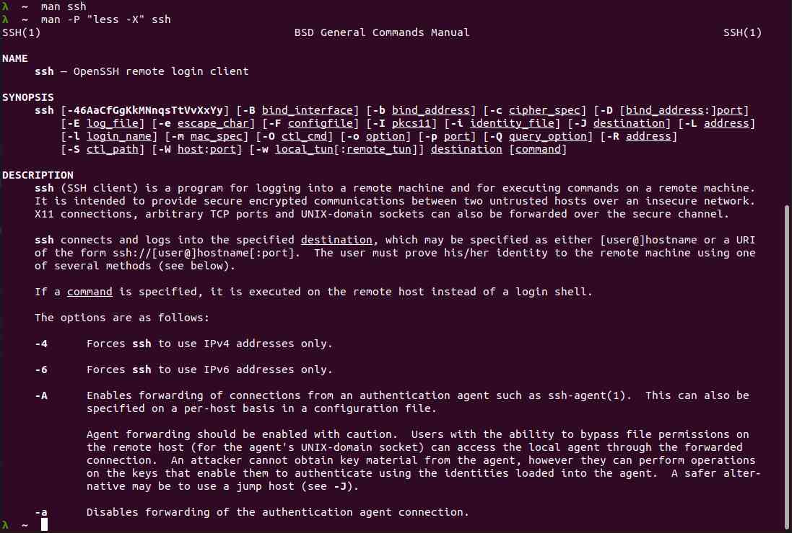

# Linux and Terminal Learnings and Reference Page

This page was created to store random notes, throughts, and snippets regarding:  

- Linux, its subsystems and behaviour, etc.  
- Bash and other linux-y shells, specifically commands that I forget about or haven't yet learned.  

The primary resource for these notes was through reading [Ryans Tutorials](https://ryanstutorials.net/linuxtutorial/).  

NOTE: I am no longer making any effort to verify any of these work in Windows PowerShell, as I have moved to a pure-Linux workstation.

## Table of Contents

- [relative and absolute paths](#about-relative-and-absolute-paths)
- [aliases](#aliases)
- [chaining commands](#chaining-commands-with-semicolons)
- [compression tools](#compress-zip-tar-files-for-archiving)
- [hidden files](#create-and-view-hidden-files)
- [cups printing system](#cups-printing-system)
- [display file contents](#display-file-contents-on-screen)
- [environment variables](#environment-variables)
- [everything is a file](#everything-is-a-file)
- [file operations](#file-operations-in-linux)
- [the find tool](#find)
- [getting all the things](#get-all-the-things)
- [grepping](#grepping)
- [image converter tool](#image-converter)
- [install software](#install-software)
- [disk and files](#interrogate-files-and-disk)
- [network interfaces](#interrogate-network-interfaces)
- [hardware](#interrogating-hardware)
- [linux version and details](#interrogating-linux)
- [escape characters](#linux-escape-characters)
- [facts and figures](#linux-facts-and-figures)
- [case sensitivity](#linux-is-case-sensitive)
- [file extensions](#linux-is-extensionless)
- [space sensitivity](#linux-is-space-sensitive-too)
- [manuals](#linux-manuals)
- [list files](#list-files)
- [managing processes](#manage-processes)
- [managing software packages](#manage-software-packages)
- [file manipulation](#manipulating-files)
- [manual tricks](#manual-tricks)
- [terminal options](#many-terminal-options)
- [more about finding files](#more-about-finding-files)
- [nano text editor](#nano-text-editor)
- [permissions](#permissions)
- [References](#references)
- [server services](#server-services)
- [specialized tools](#specialized-tools)
- [system stuff](#system-stuff)
- [text editing](#text-editing-in-linux)
- [updating apt repo](#updating-the-local-apt-repo)
- [using filters](#use-filters)
- [piping and redirection](#use-piping-and-redirection)
- [wildcards](#use-wildcards)
- [shells](#using-shells)
- [vi text editor](#vi-text-editor)
- [internal logs](#view-internal-logs)
- [yarn](#yarn)

## Linux Facts and Figures

Many of these concepts will also apply to Unix and other unix-based operating systems.  

### Many Terminal Options

The command line, or Shell, is the text-only I/O mechanism for humans telling Linux what to do, and for Linux to tell human operators what it is doing or has done (or nothing at all, just a prompt awaiting input).

On my system I am using Oh My ZSH! which is a bash knock-off with lots of interesting themes that make bashing-around a little easier (for example: using Git) and fun (colors, layouts, fonts, markers, etc).

Despite having an "add on shell" like ZSH, I can still "drop to a Bash" shell with the command `bash` (Bourne Again SHell).

I could also use `sh` but since ZSH is installed, it really just loads ZSH again.  
If I was in a remote terminal session I could force-load ZSH with `sh` or `zsh` at the prompt and it would work.

In Windows, I stick with *PowerShell* because it has much greater capability than 'cmd.exe', and can be well-integrated into the OS and to apps like Visual Studio.  

### Everything Is A File

- System will have read, write, or both permissions, based on what the file represents and the underlying capabilities.
- An audio card is repreented by System write-only file, for example (meaning System can only write to it).  
- Folders are actually files with different properties than the files they 'contain'.  

### Linux Is Extensionless

- Windows relies on file extensions to associate an applicable parent or executor program.  
  - Ex: `.txt` is usually associatd with `Notepad.exe` and is of FileTyle `text` or `plaintext`.  
- Linux 'looks inside' a file to determine its 'type'.

### Linux Is Case SENSITIVE  

- Windows is case INsensitive
- Terminal commands in a Linux shell will fail if CaSe rUlEs aRe nOt fOlLoWeD.  
  - This applies to filenames as well for ex: `file_name.txt` is not the same as `FileName.txt`.  

### Linux is Space-Sensitive Too

Quote Around Spaces or get frustrated (your choice).  

- Use single `'` or double `"` quotation marks to identify a file or folder name that contains a space.  
  - Ex: `ls spacey folder name` returns an error.  
  - Ex: `ls 'spacey folder name'` works.  

### Linux Escape Characters

Use a backslash `\` to escape (nullify) the special meaning of reserved characters like spaces e.g.:  

```bash
user@bash: pwd
/home/toor
user@bash: cd My\ Music
user@bash: pwd
/home/toor/My Music
```

## Linux MANuals

Invoke `man` command followed by the command name you want information about to get an on-screen instruction MANual.

Exit MAN pages by pressing `q` on the keyboard.

To search all MAN pages from Terminal: `man -k <search_term>`

To search terms WITHIN a MAN page display: `/ <search_term>` then press `n` for Next page.

### MANual Tricks

`man` clears the screen on exit. You can keep the output in the terminal scrollback using less. *[Bellingham Codes participant: Remington]*

For example, I want to see a section of MAN pages about SSH:

```bash
man -P "less -X" ssh
```

---



---

## Using SHELLS

To execute a script in a different directory: `sh> (cd /dir/where/script/is/ ; sh script-name.sh [args])`

Doing this will contain the script execution within the child SH process, and if the script forces closure at the end, you won't lose your existing SH session.

## File Operations in Linux

### List Files

Remember, EVERYTHING is a file so `<pathspec>` actually means `filename` or `foldername` or `foldername/filename` etc.

List files in current directory: `ls [options] <filespec>`

List files in a list with file details (long listing) within the '/etc/ directory: `ls -l /etc`

List hidden files: `ls -a`

There are MANY options, see the LS MAN pages for more.

### Create and View Hidden Files

Just prefix the file or folder name with a dot:

- Folder `my_configurations` can be made hidden by renaming to `.my_configurations`  
- File `config` can be made hidden by renaming to `.config`  

> Use `ls -a` to list hidden files in a directory.  

### Manipulating Files

Create a directory: `mkdir <name>`

Create a directory tree: `mkdir <parent_name>/<child_name>`

Remove files and empty directories: `rm [options] <filespec>`

Recursively remove files and directories: `rm -r <filespec>`

Remove an empty directory: `rmdir <name>`

- Can be used to remove multiple directories in one command.  
- Directories will not be removed unless they are empty of files and child directories.  

Create a new blank file: `touch <path>/<filename>[.ext]`

Copy a file or directory: `cp [options] <source_path> <dest_path>`

Recurse over directories: `cp -r <source_path> <dest_path>`

Move/Rename files or directories: `mv [options] <source_path> <dest_path>`

You can move directories without using recuse option.

Note: Moving directories will rename if paths are the same except:

- Directory rename: dest_path directory name is only difference.
- File rename: dest_path filename is only difference.

Bulk-copy files and rename them, but file extension: `basename -s .jpg -a *.jpg | xargs -n1 -i cp {}.jpg {}_original.jpg`  

### About Relative and Absolute Paths

PATHs can be absolute or relative.

Linux file strucuture is hierarchical.

Folders ARE files, but with a 'd' flag set, so folders *and* files are part of the path.

Absolute paths start with a forward slash `/` e.g.: `/etch`

Relative paths identify a location 'relative' to the pwd and will not begin with a forward slash i.e. `../project/code401` is one folder 'back' from pwd and one folder 'forward' from the 'project' folder.

Home path is `~` which is equivalent to `\home\$username`

### Use Wildcards

Zero or more characters: `*`

Single character: `?`

A range of characters: `[]`

List files in the pwd whose 1st character is a 'Q' or 'q', 2nd character is within the range 0-9, 3rd character is within the range 0-3, and any number of other character following: `ls [Qq][0-9][0-3]*`

Not: `^`

*Note about Not*: As the first character within a range wildcard causes the filter to eliminate files that match that first character range wildcard characters.

*Remember*: Wildcards affect the entire pathspec, which includes directories and filenames and file extensions.  

## Text Editing in Linux

### Nano Text Editor

My favorite when in Bash/ZSH.

Simple, to the point, plain-text editor.

Search exists but is limited.

### Vi Text Editor

A much more capable text editor.

Should be kept in mind for driving around text files in a native Linux viewer/editor.  
All CLI, no UI.


Two modes:  

1. Insert/Input Mode: Enter data into a file: Tap `i` to change to INSERT mode and `--INSERT--` will be displayed at bottom of screen.  
2. Edit Mode: Move around the file, add, delete, or copy data, search for data and replace data. Tap `[esc]` to change to EDIT mode.  

Launch VI: `vi <filename>`  

- Will create a new file if `<filename>` does not exist already.  
- Starts VI in EDIT mode.  

Command usage:

Commands starting with a colon require pressing `[Enter]` to execute them.

Save and Close (multple options):

- Save AND Exit: `ZZ`  
- Discard changes and exit: `:q!`  
- Save changes (no exit): `:w`  
- Save changes and exit: `:wq`  
- Sets 'line numbers' in file view: `:set nu`  

Advice:

- Use the man pages for more details on commands.  
- Also check out [Ryans Tutorials VI page](https://ryanstutorials.net/linuxtutorial/vi.php) for more.  

### Display File Contents On Screen

Display all contents of a file: `cat <filespec>` Displays file contents.

View portion of a file: `less <filespec>` Use arrow keys to scroll up and down, `b` to go "back a page", and `q` to quit.

Use `tail <filespec>` to get a quick 'end-of-the-file' view. `tail -n NUM` to show a specific number of lines at the end of the file.

Grep is used to filter data for viewing: `grep`

*Note*: See more grep usage in [Grepping](#grepping)

## Use Piping and Redirection

Redirect Standard Out (STDOUT) to a file: `>`

Append STDOUT to the end of a file: `>>`

Redirect Standard Error Out (STDERR) to a file: `2>`

Pass contents of a file to a program as Standard Input (STDIN): `<`

Feed STDOUT of the program on the left, as STDIN to the program on the right: `|`

When multiple piped commands all require 'sudo', add it to the commands at the start of each pipe (see example below).

```shell
# the following will fail due to lack of permissions
wget -O - https://packages.adoptium.net/artifactory/api/gpg/key/public | tee /usr/share/keyrings/adoptium.asc
# the following will succeed
sudo wget -O - https://packages.adoptium.net/artifactory/api/gpg/key/public | sudo tee /usr/share/keyrings/adoptium.asc
```

## Chaining Commands with Semicolons

Use semicolons to chain commands together.  
Essentially, it will run commands, in order, immediately after each previous command returns.

Does not conditionally manage any previous command's succees (or failure) code e.g. 0 (pass) or non-0 (fail).

See [this StackOverflow question and its responses for more](https://stackoverflow.com/questions/25669540/what-is-the-difference-between-double-ampersand-and-semicolon-in-linux)

## Get All The Things

### Grepping

Run grep with extended regex: `egrep` or `grep -E`

Ignore case: `-i`

Return NON MATCHING lines: `-v`

Select only whole-word matches: `-w`

Print count of matching lines: `-c`

Print name of each file containing the match: `-l` (normally used when grep is invoked with wildcards in file arg)

Print the number before each line that matches: `-n`

Recursive (all files in given pathspec): `-r`

BEFORE context and AFTER context: `-B 4 -A 4` prints 4 lines prior-to and following the match.

Regex: Follow standard regex rules, including Multipliers and Anchors.

*Note*: Check out [regularexpressions101](https://regex101.com/) for an easy tool to test RegEx before you 'buy' results. :-)  

### Use Filters

When displaying or searching file contents, it can be helpful to filter the results to minimize clutter.

Show the first n lines: `head -n number`

Show the last n lines: `tail -n number`

Sort lines in a given way:  `sort`

Word Count, including characters and lines: `wc`

Search for a given pattern: `grep`

## Server Services

### CUPS Printing System

Developed by Apple Inc. for macOS and *nix OSes.

Cannonical includes it with Ubuntu 18.x and above.

Check out the Web [GUI](http://localhost:631/) for administration.

Check version and architecture: `dpkg -l cups-browsed`

View device info: `lpstat -v`

*Note*: At midnight the CUPS Logging mechanism 'rolls over' and a CUPS reset is initiated, which causes a [popup notification every night at midnight](https://bugs.launchpad.net/ubuntu/+source/cups-filters/+bug/1869981). There is a way to work around this (basically stop forced CUPS daemon restart) but there is no harm in allowing the restart to be executed.

## System Stuff

### Permissions

Linux permissions place rules on what can be done with a file:

Read: `r`  
Write: `w`  
Exectute: `x`  

Linux defines three groups that permissions can be applied to:  

- Owner: Typically the username that created the file.
- Group: Every file must belong to a single group.
- Others: Any users not in Owner or Group.

Show permissions with `ls -l <pathspec>`

Result example: `-rwxr----x 1 pi owner 1.2K Jan 1 00:00 /home/pi/file.txt`

Dissected, from left to right:

- Character 1: File = `-`, Directory = `d`, so this is a FILE.
- Characters 2, 3 and 4: Owner permissions. Owner members can Read, Write, and Execute this file.
- Characters 5, 6, and 7: Group permissions. Group members can Read this file, but cannot Write nor Execute it.
- Characters 8, 9, and 10: Everyone Else permissions. Users that are not members of Owners or Group can NOT Read nor Write to the file, but they CAN Execute it.

Change Permissions on a file (meaning everything): `chmod [permissions] [filespec]`

### Interrogating Linux

Get version (long): `uname`

Get specific Linux kernel version and type: `uname -sr`

### Environment Variables

Environment variables like `PATH=` are stored in `/etc/environment`, as well as `.zshrc` and `.config` files, often in the user profile area (but there could be others).

Update Alternatives: `update-alternatives --list java` displays path to java JDK.

Display all environment variables in the current context: `printenv`

Display a specific environment variable: `printenv VAR_NAME`  e.g. `printenv JAVA_HOME`

Display the existing PATH environment variable: `echo $PATH`

Update $PATH with a new entry: `export PATH=$PATH:/opt/package/example/bin`

### Environment Variable Hierarchy

Loading variables in the current context becomes the 'parent context' set of variables.

If the parent (e.g. ZSH) launches another shell, its variables are then pushed to the child process.

To force specific variables into the child process, bash for example: `zsh> VAR_ONE="Foo" VAR_TWO="BAR" sh` would load child process 'sh' with those two additional enironemnt variables preceeding it.

### Aliases

Configure aliases to common commands, scripts, and executables to make your Linux SH (ZSH etc) life simpler.

To see a list of existing aliases in shell: `alias`

ZSH Aliasing:

- Option 1: Update .zshrc by adding a line somewhere near (but not at) the end using keyword alias name=path_to_script_or_binary.
- Option 2: Update ZSH_CUSTOM folder to include a list of custom Aliases for your profile.

Add an alias for IntelliJ IDEA:

1. Use find to locate file 'idea.sh' (or check JetBrains Toolbox for info on where it might be).
2. Add the following line to .zshrc before final 'export' declarations: `alias idea="~/.local/share/JetBrains/Toolbox/apps/IDEA-C/ch-0/nnn.mmmm.vv/bin/idea.sh`
3. Restart your shell.
4. Traverse to the Java project directory and type: `idea .` and your project will open.

Add an alias for AndroidStudio:

1. Locate file "studio.sh" probably off your home directory (or see JetBrains ToolBox if you installed Android Studio that way).
2. Add the path to an alias and name it something like: `androidstudio ` alias androidstudio=$STEP_1_PATH`
3. Restart your shell.
4. Traverse to the Android project directory and type: `androidstudio .` and your project will open.

### Interrogate Files and Disk

Beyond creating, copying, moving, and deleting files, use these commands to manage the file *system* and disks.  

Find the size of directories in pwd: `du -sh ./*`  
Disk space utilization report: `df -h`  
Find files modified within last 24 hours in a specified directory: `find $directory -mtime -1`  

#### More About Finding Files

Which: Finds where a command lives `which code`
WhereIs: Like 'which' but includes lib and man file locations: `whereis code`

##### Find

Search for files based on many properties: Modified, permissions, owners, symlinks, directory, filename, and rwx permissions.

```sh
find . -name 'my_file.txt' -type f # find 'my_file.txt' file starting from here
find /home/username/Downloads -name '*tar*' -type f # find files containing 'tar' in name starting in Downloads
find . -name "jdk" -type d # find jdk directory starting from here
```

### Interrogating Hardware

List PCI Hardware/Driver info: `lspci` or `lspci -k` or `lspci -nnk`  
Check LSB Module State: `lsb_release -a`  
Report on hardware driver info: `sudo lshw`  

### Interrogate Network Interfaces

Get IP info from an interface: `ip a`  
Get network driver info: `inxi -n`  

### View Internal Logs

Many system program logs are stored in `/var/log`  
Device Message Logs: `sudo dmesg`  
Messages in Logs related to network(s): `sudo dmesg | grep iwl`  
Network Manager Log: `sudo journalctl -b 0 -u NetworkManager`  

### Manage Processes

Cancel a running operation: `[CTRL] + C`  
Cancel a *process* by its ID: `kill $process_id`  
Force canceling a 'stubborn' process: `kill $process_id -9`  
Show list of running processes and IDs: `ps`  
Put currently running process onto a background (paused) thread: `[CTRL] + z`  
List current background processes: `jobs`  
Move background process to foreground: `fg $job_number`  
List ALL services, running AND not running: `service --status-all`  
Use grep to find specific not/running: `service --status-all | grep '\[+\]'`  
List services using systemctl: `systemctl list-units`  
Check a specific service state using ps: `ps -ef | grep postgres`  

## Install Software

Config files are generally stored in `/etc`  
Commonly used program binaries are stored in `/bin`  
Other program binaries, perhaps related to users (rather than system) are stored in `/usr/bin`  
Reinstall Ubuntu package 'linux-firmware': `sudo apt-get install --reinstall linux-firmware`  
Apt is the primary software manager utility: `apt get install $package`  
DPKG is the *underlying package management system*: `dpkg -i $deb_package`  
As stated at AskUbuntu.com: `dpkg => apt-get, aptitude => Synaptic, Software Center`  

### Updating The Local Apt Repo

The Local Apt Repo is usually stored in `/etc/apt/sources.list.d/pgdg.list`  
An example repo update will look something like this (for postgresQL):  

```sh
sudo sh -c 'echo "deb http://apt.postgresql.org/pub/repos/apt $(lsb_release -cs)-pgdg main" > /etc/apt/sources.list.d/pgdg.list'
```

Common steps to update Apt and Install from new sources:

1. Update local apt repo with latest info *from the source*
1. Optionally add an asc key
1. 'sudo apt-get update'
1. 'sudo apt-get -y install $package_name'

### Manage Software Packages

Installed packages will probably have an entry in $PATH that should be interrogated.  
Listing and Removing packages might leave behind $PATH entries.  
List existing packages: `dpkg -l $package_name_in_single_quotes`  
Remove a package: `dpkg -r $package_name`  
Purge remaining package artifacts: `dpkg -P $package_name`  

## Specialized Tools

### Yarn

Check out [yarnpkg.com](https://classic.yarnpkg.com/lang/en/docs/install/#debian-stable)

Also [Linuxize.com](https://linuxize.com/post/how-to-install-yarn-on-ubuntu-20-04/)

Ensure you are in the project root.

Install globally: `npm install --global yarn`

Check version: `yarn --version` (currently 1.22.19)

New Project: `yarn init [project-name]`

Add dependency:

> `yarn add [package]`
> `yarn add [package]@[version]`
> `yarn add [package]@[tag]`

Upgrade: `yarn upgrade [package]`

Remove dependency: `yarn remove [package]`

Install/upgrade all dependencies: `yarn install`

### Image Converter

Help file usage template: `convert [options ...] file [[options ...] file ...] [options ...] file`

More information can be found at [legacy.imagemagick.org/Usage/](https://legacy.imagemagick.org/Usage/).

Convert Quality: `convert $input_file_path.img -quality nn $output_file_path.img` changes compression level on jpeg/miff/png.

Resize: `convert -adaptive-resize 200x200` adjusts width and height using 'mesh interpolation' (limit to less than 50% larger or smaller otherwise use `-resize`).

Scale an image: `convert -scale ${percentage}%`. A simplified version of `-resize`.

Compress Image: `convert -compress type`

Add a Caption: Consider creating a label instead. See the *Usage* link above for details.

Vertical or horizontal flip: `convert -flip` or `convert -flop`, respectively.

### Compress, Zip, Tar Files for Archiving

*NOTE*: This Section Is Under Development

Tar

Tempate (from tar --usage): `tar [options] -C DIR -f ARCHIVE [--exclude=PATTERN]

Template: `tar -c [-f ARCHIVE] [OPTIONS] [File...]`

Example to create a tar from target directory to named directory: `tar -c directory.tar.gz -zvf file_list`

- c => Create
- z => gzip, gunzip, or unzip
- v => verbose file list
- f => file or device ARCHIVE (name)

EXCLUDE FILES while TARing: Insert `--exclude=PATTERN` before source directory.

RECURSION: Automatic. It is the default behavior of TAR. Use `--norecursion` to turn it off.

TAR References:

GZIP Manual at [Gnu.org](https://www.gnu.org/software/tar/manual/html_node/gzip.html)

[Ubuntu Tar Reference](https://manpages.ubuntu.com/manpages/xenial/en/man1/tar.1.html)

 *NOTE*: End of under dev section

## References

A great deal of the basics were gleened from [Ryan's Tutorials](https://ryanstutorials.net/linuxtutorial)  

Specific grep, filter, and some other commands were copied from Ryan's Tutorials' [Linux Cheatsheet](https://ryanstutorials.net/linuxtutorial/cheatsheet.php) and [Grep Cheatsheet](https://ryanstutorials.net/linuxtutorial/cheatsheetgrep.php) and whenever possible, variables were changed to protect the innocent.  

Apt and DPKG details were gleened from [this AskUbuntu.com article](https://askubuntu.com/questions/40779/how-do-i-install-a-deb-file-via-the-command-line)  

[TechRepublic](https://www.techrepublic.com/article/how-to-add-an-openpgp-repository-key-now-that-apt-key-is-deprecated/) discusses adding an openGPG key, now that apt-key is deprecated.  

[ChrisJean.com](https://chrisjean.com/4-great-tools-to-find-files-quickly-in-ubuntu/) for tips on 'which' and 'find' tools.

## Footer

Return to [Root readme](../README.html)  
